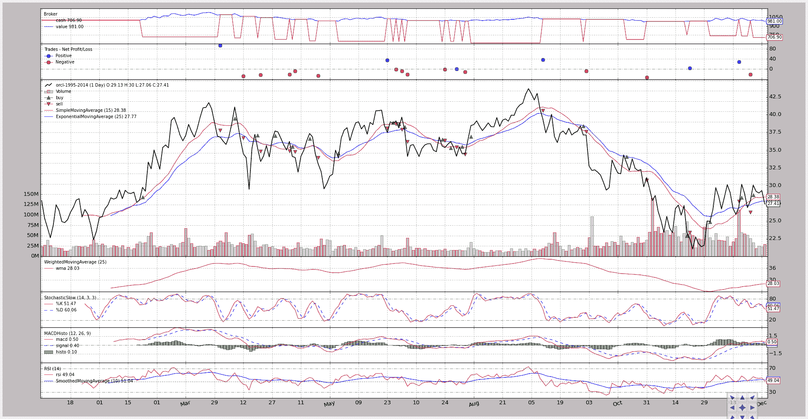

# 快速启动

> 原文： [https://www.backtrader.com/docu/quickstart/quickstart/](https://www.backtrader.com/docu/quickstart/quickstart/)

笔记

《快速入门指南》中使用的数据文件会不时更新，这意味着`adjusted close`会随之更改`close`（以及其他组件）。这意味着实际输出可能与编写本文时文档中的内容不同。

## 使用平台

让我们看一系列的例子（从一个几乎是空的例子到一个完全成熟的策略），但在使用**backtrader**之前，我们必须大致解释两个基本概念

1.  线

    数据源、指标和策略有*行*。

    直线是一系列点，当这些点连接在一起时形成这条直线。当谈到市场时，数据馈送通常每天有以下几组点：

    *   开盘、高位、低位、收盘、成交量、开盘利率

    随着时间的推移，一系列的“开放”是一条直线。因此，数据馈送通常有 6 行。

    如果我们还考虑“DATETIME”（这是一个点的实际引用），我们可以计算 7 行。

2.  指数 0 方法

    当访问一行中的值时，使用索引*0*访问当前值

    “最后”输出值通过*-1*访问。这与 iterables 的 Python 约定一致（一行可以迭代，因此是 iterable），其中索引*-1*用于访问 iterable/数组的“最后”项。

    在我们的例子中，访问的是最后一个**输出**值。

    因此，作为*-1*之后的索引*0*，用于获取线路中的当前力矩。

考虑到这一点，如果我们设想一种策略，其特点是在初始化期间创建一个简单的移动平均线：

```py
self.sma = SimpleMovingAverage(.....) 
```

获取移动平均线当前值的最简单方法：

```py
av = self.sma[0] 
```

不需要知道已经处理了多少条/分钟/天/月，因为“0”唯一标识当前瞬间。

按照 pythonic 传统，使用*-1*访问“最后”输出值：

```py
previous_value = self.sma[-1] 
```

当然，可以使用-2、-3、…

## 从 0 到 100：样本数

### 基本设置

让我们开始跑步吧。

```py
from __future__ import (absolute_import, division, print_function,
                        unicode_literals)

import backtrader as bt

if __name__ == '__main__':
    cerebro = bt.Cerebro()

    print('Starting Portfolio Value: %.2f' % cerebro.broker.getvalue())

    cerebro.run()

    print('Final Portfolio Value: %.2f' % cerebro.broker.getvalue()) 
```

执行后，输出为：

```py
Starting Portfolio Value: 10000.00
Final Portfolio Value: 10000.00 
```

在本例中：

*   反向交易者是进口的

*   大脑引擎被实例化了

*   生成的*大脑*实例被告知*运行*（循环数据）

*   结果被打印出来了

虽然看起来不多，但让我们指出一些明确显示的内容：

*   大脑引擎在后台创建了一个*代理*实例

*   该实例已经有一些现金可用

这种幕后代理实例化是平台中一个不变的特性，可以简化用户的生活。如果用户未设置任何代理，则会设置默认代理。

对于一些经纪商来说，1 万个货币单位是一个通常的价值。

### 设置现金

在金融界，当然只有“失败者”以 1 万开始。让我们换现金，然后再次运行该示例。

```py
from __future__ import (absolute_import, division, print_function,
                        unicode_literals)

import backtrader as bt

if __name__ == '__main__':
    cerebro = bt.Cerebro()
    cerebro.broker.setcash(100000.0)

    print('Starting Portfolio Value: %.2f' % cerebro.broker.getvalue())

    cerebro.run()

    print('Final Portfolio Value: %.2f' % cerebro.broker.getvalue()) 
```

执行后，输出为：

```py
Starting Portfolio Value: 1000000.00
Final Portfolio Value: 1000000.00 
```

任务完成了。让我们转到狂风暴雨的水域。

### 添加数据源

拥有现金是很有趣的，但这一切背后的目的是让一个自动化的策略通过操作一项我们视为*数据馈送*的资产，在不动手指的情况下让现金成倍增长

因此…没有*数据源*->**没有乐趣**。让我们在不断增长的示例中添加一个。

```py
from __future__ import (absolute_import, division, print_function,
                        unicode_literals)

import datetime  # For datetime objects
import os.path  # To manage paths
import sys  # To find out the script name (in argv[0])

# Import the backtrader platform
import backtrader as bt

if __name__ == '__main__':
    # Create a cerebro entity
    cerebro = bt.Cerebro()

    # Datas are in a subfolder of the samples. Need to find where the script is
    # because it could have been called from anywhere
    modpath = os.path.dirname(os.path.abspath(sys.argv[0]))
    datapath = os.path.join(modpath, '../../datas/orcl-1995-2014.txt')

    # Create a Data Feed
    data = bt.feeds.YahooFinanceCSVData(
        dataname=datapath,
        # Do not pass values before this date
        fromdate=datetime.datetime(2000, 1, 1),
        # Do not pass values after this date
        todate=datetime.datetime(2000, 12, 31),
        reverse=False)

    # Add the Data Feed to Cerebro
    cerebro.adddata(data)

    # Set our desired cash start
    cerebro.broker.setcash(100000.0)

    # Print out the starting conditions
    print('Starting Portfolio Value: %.2f' % cerebro.broker.getvalue())

    # Run over everything
    cerebro.run()

    # Print out the final result
    print('Final Portfolio Value: %.2f' % cerebro.broker.getvalue()) 
```

执行后，输出为：

```py
Starting Portfolio Value: 1000000.00
Final Portfolio Value: 1000000.00 
```

样板的数量略有增加，因为我们增加了：

*   找出我们的示例脚本能够定位样本*数据提要*文件的位置

*   有*datetime*对象来过滤*数据馈送*中的哪些数据将被我们操作

除此之外，还创建了*数据馈送*并将其添加到**大脑**。

产出没有变化，如果有，那将是一个奇迹。

笔记

Yahoo Online 以日期降序发送 CSV 数据，这不是标准约定。*reversed=True*参数考虑到文件中的 CSV 数据已经**reversed**并且具有标准的预期日期升序。

### 我们的第一战略

现金在*经纪人*中，*数据源*在那里。看来冒险的生意就要到了。

让我们在等式中加入一个策略，并打印每天的“收盘价”（bar）。

**DataSeries**（*数据源*中的底层类）对象具有别名，用于访问众所周知的 OHLC（开-高-低-关）日值。这将简化打印逻辑的创建。

```py
from __future__ import (absolute_import, division, print_function,
                        unicode_literals)

import datetime  # For datetime objects
import os.path  # To manage paths
import sys  # To find out the script name (in argv[0])

# Import the backtrader platform
import backtrader as bt

# Create a Stratey
class TestStrategy(bt.Strategy):

    def log(self, txt, dt=None):
        ''' Logging function for this strategy'''
        dt = dt or self.datas[0].datetime.date(0)
        print('%s, %s' % (dt.isoformat(), txt))

    def __init__(self):
        # Keep a reference to the "close" line in the data[0] dataseries
        self.dataclose = self.datas[0].close

    def next(self):
        # Simply log the closing price of the series from the reference
        self.log('Close, %.2f' % self.dataclose[0])

if __name__ == '__main__':
    # Create a cerebro entity
    cerebro = bt.Cerebro()

    # Add a strategy
    cerebro.addstrategy(TestStrategy)

    # Datas are in a subfolder of the samples. Need to find where the script is
    # because it could have been called from anywhere
    modpath = os.path.dirname(os.path.abspath(sys.argv[0]))
    datapath = os.path.join(modpath, '../../datas/orcl-1995-2014.txt')

    # Create a Data Feed
    data = bt.feeds.YahooFinanceCSVData(
        dataname=datapath,
        # Do not pass values before this date
        fromdate=datetime.datetime(2000, 1, 1),
        # Do not pass values before this date
        todate=datetime.datetime(2000, 12, 31),
        # Do not pass values after this date
        reverse=False)

    # Add the Data Feed to Cerebro
    cerebro.adddata(data)

    # Set our desired cash start
    cerebro.broker.setcash(100000.0)

    # Print out the starting conditions
    print('Starting Portfolio Value: %.2f' % cerebro.broker.getvalue())

    # Run over everything
    cerebro.run()

    # Print out the final result
    print('Final Portfolio Value: %.2f' % cerebro.broker.getvalue()) 
```

执行后，输出为：

```py
Starting Portfolio Value: 100000.00
2000-01-03T00:00:00, Close, 27.85
2000-01-04T00:00:00, Close, 25.39
2000-01-05T00:00:00, Close, 24.05
...
...
...
2000-12-26T00:00:00, Close, 29.17
2000-12-27T00:00:00, Close, 28.94
2000-12-28T00:00:00, Close, 29.29
2000-12-29T00:00:00, Close, 27.41
Final Portfolio Value: 100000.00 
```

有人说股票市场是有风险的行业，但事实似乎并非如此。

让我们来解释一下其中的一些神奇之处：

*   在调用**init**时，策略已经有了平台中存在的数据列表

    这是一个标准的 Python*列表*，可以按照插入顺序访问数据。

    列表中的第一个数据 self.data[0]是交易操作的默认数据，用于保持所有策略元素的同步（*是系统时钟*）

*   self.dataclose=self.datas[0]。close 保留对*关闭行*的引用。以后只需一级间接寻址即可访问关闭值。

*   将在系统时钟的每个条上调用 strategy next 方法（self.datas[0]）。这是真的，直到其他事情开始发挥作用，如*指示器*，需要一些条来开始产生输出。稍后再谈。

### 为策略添加一些逻辑

让我们通过看一些图表来尝试一些疯狂的想法

*   如果价格连续三个交易日下跌…买！！！

```py
from __future__ import (absolute_import, division, print_function,
                        unicode_literals)

import datetime  # For datetime objects
import os.path  # To manage paths
import sys  # To find out the script name (in argv[0])

# Import the backtrader platform
import backtrader as bt

# Create a Stratey
class TestStrategy(bt.Strategy):

    def log(self, txt, dt=None):
        ''' Logging function fot this strategy'''
        dt = dt or self.datas[0].datetime.date(0)
        print('%s, %s' % (dt.isoformat(), txt))

    def __init__(self):
        # Keep a reference to the "close" line in the data[0] dataseries
        self.dataclose = self.datas[0].close

    def next(self):
        # Simply log the closing price of the series from the reference
        self.log('Close, %.2f' % self.dataclose[0])

        if self.dataclose[0] < self.dataclose[-1]:
            # current close less than previous close

            if self.dataclose[-1] < self.dataclose[-2]:
                # previous close less than the previous close

                # BUY, BUY, BUY!!! (with all possible default parameters)
                self.log('BUY CREATE, %.2f' % self.dataclose[0])
                self.buy()

if __name__ == '__main__':
    # Create a cerebro entity
    cerebro = bt.Cerebro()

    # Add a strategy
    cerebro.addstrategy(TestStrategy)

    # Datas are in a subfolder of the samples. Need to find where the script is
    # because it could have been called from anywhere
    modpath = os.path.dirname(os.path.abspath(sys.argv[0]))
    datapath = os.path.join(modpath, '../../datas/orcl-1995-2014.txt')

    # Create a Data Feed
    data = bt.feeds.YahooFinanceCSVData(
        dataname=datapath,
        # Do not pass values before this date
        fromdate=datetime.datetime(2000, 1, 1),
        # Do not pass values before this date
        todate=datetime.datetime(2000, 12, 31),
        # Do not pass values after this date
        reverse=False)

    # Add the Data Feed to Cerebro
    cerebro.adddata(data)

    # Set our desired cash start
    cerebro.broker.setcash(100000.0)

    # Print out the starting conditions
    print('Starting Portfolio Value: %.2f' % cerebro.broker.getvalue())

    # Run over everything
    cerebro.run()

    # Print out the final result
    print('Final Portfolio Value: %.2f' % cerebro.broker.getvalue()) 
```

执行后，输出为：

```py
Starting Portfolio Value: 100000.00
2000-01-03, Close, 27.85
2000-01-04, Close, 25.39
2000-01-05, Close, 24.05
2000-01-05, BUY CREATE, 24.05
2000-01-06, Close, 22.63
2000-01-06, BUY CREATE, 22.63
2000-01-07, Close, 24.37
...
...
...
2000-12-20, BUY CREATE, 26.88
2000-12-21, Close, 27.82
2000-12-22, Close, 30.06
2000-12-26, Close, 29.17
2000-12-27, Close, 28.94
2000-12-27, BUY CREATE, 28.94
2000-12-28, Close, 29.29
2000-12-29, Close, 27.41
Final Portfolio Value: 99725.08 
```

几个“购买”的创作订单被发布，我们的 porftolio 价值被降低。有几件重要的事情显然没有提到。

*   订单已创建，但不知道是否执行，何时执行，价格如何。

    下一个示例将通过侦听订单状态通知来构建该示例。

好奇的读者可能会问，购买了多少股票，购买了什么资产，以及订单是如何执行的。在可能的情况下（在这种情况下是这样），平台将填充间隙：

*   如果未指定其他资源，则 self.datas[0]（主数据即系统时钟）是目标资源

*   该桩由*位置测径仪*在幕后提供，该测径仪使用固定桩，默认为“1”。将在后面的示例中对其进行修改

*   订单在“市场”执行。经纪人（在前面的例子中显示）使用下一个条的开盘价执行此操作，因为这是当前检查条后的 1<sup>st</sup>刻度。

*   到目前为止，该订单的执行没有任何佣金（稍后将详细介绍）

### 不仅要买……还要卖

在了解如何进入市场（长期）后，需要一个“退出概念”，并了解战略是否在市场中。

*   幸运的是，策略对象提供了对默认*数据馈送*的*位置*属性的访问

*   方法*买入*和*卖出*退回**创建的**（尚未执行）订单

*   订单状态的变化将通过*通知*方式通知策略

*“退出概念”*将是一个简单的概念：

*   在 5 巴（第 6<sup>次</sup>巴）结束后退出，无论是好是坏

    请注意，没有“时间”或“时间范围”的含义：条数。条形图可以表示 1 分钟、1 小时、1 天、1 周或任何其他时间段。

    虽然我们知道数据源是每日的，但该策略对此不作任何假设。

此外，为了简化：

*   如果市场上还没有订单，则只允许购买订单

笔记

*下一个*方法没有传递任何“条索引”，因此它似乎不清楚如何理解 5 条条条何时已经过去，但这是以 pythonic 方式建模的：在对象上调用*len*，它将告诉您其*行*的长度。只需写下（保存在变量中）操作发生的长度，看看当前长度是否为 5 巴。

```py
from __future__ import (absolute_import, division, print_function,
                        unicode_literals)

import datetime  # For datetime objects
import os.path  # To manage paths
import sys  # To find out the script name (in argv[0])

# Import the backtrader platform
import backtrader as bt

# Create a Stratey
class TestStrategy(bt.Strategy):

    def log(self, txt, dt=None):
        ''' Logging function fot this strategy'''
        dt = dt or self.datas[0].datetime.date(0)
        print('%s, %s' % (dt.isoformat(), txt))

    def __init__(self):
        # Keep a reference to the "close" line in the data[0] dataseries
        self.dataclose = self.datas[0].close

        # To keep track of pending orders
        self.order = None

    def notify_order(self, order):
        if order.status in [order.Submitted, order.Accepted]:
            # Buy/Sell order submitted/accepted to/by broker - Nothing to do
            return

        # Check if an order has been completed
        # Attention: broker could reject order if not enough cash
        if order.status in [order.Completed]:
            if order.isbuy():
                self.log('BUY EXECUTED, %.2f' % order.executed.price)
            elif order.issell():
                self.log('SELL EXECUTED, %.2f' % order.executed.price)

            self.bar_executed = len(self)

        elif order.status in [order.Canceled, order.Margin, order.Rejected]:
            self.log('Order Canceled/Margin/Rejected')

        # Write down: no pending order
        self.order = None

    def next(self):
        # Simply log the closing price of the series from the reference
        self.log('Close, %.2f' % self.dataclose[0])

        # Check if an order is pending ... if yes, we cannot send a 2nd one
        if self.order:
            return

        # Check if we are in the market
        if not self.position:

            # Not yet ... we MIGHT BUY if ...
            if self.dataclose[0] < self.dataclose[-1]:
                    # current close less than previous close

                    if self.dataclose[-1] < self.dataclose[-2]:
                        # previous close less than the previous close

                        # BUY, BUY, BUY!!! (with default parameters)
                        self.log('BUY CREATE, %.2f' % self.dataclose[0])

                        # Keep track of the created order to avoid a 2nd order
                        self.order = self.buy()

        else:

            # Already in the market ... we might sell
            if len(self) >= (self.bar_executed + 5):
                # SELL, SELL, SELL!!! (with all possible default parameters)
                self.log('SELL CREATE, %.2f' % self.dataclose[0])

                # Keep track of the created order to avoid a 2nd order
                self.order = self.sell()

if __name__ == '__main__':
    # Create a cerebro entity
    cerebro = bt.Cerebro()

    # Add a strategy
    cerebro.addstrategy(TestStrategy)

    # Datas are in a subfolder of the samples. Need to find where the script is
    # because it could have been called from anywhere
    modpath = os.path.dirname(os.path.abspath(sys.argv[0]))
    datapath = os.path.join(modpath, '../../datas/orcl-1995-2014.txt')

    # Create a Data Feed
    data = bt.feeds.YahooFinanceCSVData(
        dataname=datapath,
        # Do not pass values before this date
        fromdate=datetime.datetime(2000, 1, 1),
        # Do not pass values before this date
        todate=datetime.datetime(2000, 12, 31),
        # Do not pass values after this date
        reverse=False)

    # Add the Data Feed to Cerebro
    cerebro.adddata(data)

    # Set our desired cash start
    cerebro.broker.setcash(100000.0)

    # Print out the starting conditions
    print('Starting Portfolio Value: %.2f' % cerebro.broker.getvalue())

    # Run over everything
    cerebro.run()

    # Print out the final result
    print('Final Portfolio Value: %.2f' % cerebro.broker.getvalue()) 
```

执行后，输出为：

```py
Starting Portfolio Value: 100000.00
2000-01-03T00:00:00, Close, 27.85
2000-01-04T00:00:00, Close, 25.39
2000-01-05T00:00:00, Close, 24.05
2000-01-05T00:00:00, BUY CREATE, 24.05
2000-01-06T00:00:00, BUY EXECUTED, 23.61
2000-01-06T00:00:00, Close, 22.63
2000-01-07T00:00:00, Close, 24.37
2000-01-10T00:00:00, Close, 27.29
2000-01-11T00:00:00, Close, 26.49
2000-01-12T00:00:00, Close, 24.90
2000-01-13T00:00:00, Close, 24.77
2000-01-13T00:00:00, SELL CREATE, 24.77
2000-01-14T00:00:00, SELL EXECUTED, 25.70
2000-01-14T00:00:00, Close, 25.18
...
...
...
2000-12-15T00:00:00, SELL CREATE, 26.93
2000-12-18T00:00:00, SELL EXECUTED, 28.29
2000-12-18T00:00:00, Close, 30.18
2000-12-19T00:00:00, Close, 28.88
2000-12-20T00:00:00, Close, 26.88
2000-12-20T00:00:00, BUY CREATE, 26.88
2000-12-21T00:00:00, BUY EXECUTED, 26.23
2000-12-21T00:00:00, Close, 27.82
2000-12-22T00:00:00, Close, 30.06
2000-12-26T00:00:00, Close, 29.17
2000-12-27T00:00:00, Close, 28.94
2000-12-28T00:00:00, Close, 29.29
2000-12-29T00:00:00, Close, 27.41
2000-12-29T00:00:00, SELL CREATE, 27.41
Final Portfolio Value: 100018.53 
```

起泡的藤壶！！！系统赚钱了……一定是出了什么问题

### 经纪人说：让我看看钱！

这笔钱叫做“佣金”。

让我们为每笔交易增加合理的*0.1%*佣金率（买卖双方……是的，经纪人很热心……）

一行就足够了：

```py
# 0.1% ... divide by 100 to remove the %
cerebro.broker.setcommission(commission=0.001) 
```

有经验的平台，我们希望看到的利润或亏损后，买/卖周期，有没有佣金。

```py
from __future__ import (absolute_import, division, print_function,
                        unicode_literals)

import datetime  # For datetime objects
import os.path  # To manage paths
import sys  # To find out the script name (in argv[0])

# Import the backtrader platform
import backtrader as bt

# Create a Stratey
class TestStrategy(bt.Strategy):

    def log(self, txt, dt=None):
        ''' Logging function fot this strategy'''
        dt = dt or self.datas[0].datetime.date(0)
        print('%s, %s' % (dt.isoformat(), txt))

    def __init__(self):
        # Keep a reference to the "close" line in the data[0] dataseries
        self.dataclose = self.datas[0].close

        # To keep track of pending orders and buy price/commission
        self.order = None
        self.buyprice = None
        self.buycomm = None

    def notify_order(self, order):
        if order.status in [order.Submitted, order.Accepted]:
            # Buy/Sell order submitted/accepted to/by broker - Nothing to do
            return

        # Check if an order has been completed
        # Attention: broker could reject order if not enough cash
        if order.status in [order.Completed]:
            if order.isbuy():
                self.log(
                    'BUY EXECUTED, Price: %.2f, Cost: %.2f, Comm %.2f' %
                    (order.executed.price,
                     order.executed.value,
                     order.executed.comm))

                self.buyprice = order.executed.price
                self.buycomm = order.executed.comm
            else:  # Sell
                self.log('SELL EXECUTED, Price: %.2f, Cost: %.2f, Comm %.2f' %
                         (order.executed.price,
                          order.executed.value,
                          order.executed.comm))

            self.bar_executed = len(self)

        elif order.status in [order.Canceled, order.Margin, order.Rejected]:
            self.log('Order Canceled/Margin/Rejected')

        self.order = None

    def notify_trade(self, trade):
        if not trade.isclosed:
            return

        self.log('OPERATION PROFIT, GROSS %.2f, NET %.2f' %
                 (trade.pnl, trade.pnlcomm))

    def next(self):
        # Simply log the closing price of the series from the reference
        self.log('Close, %.2f' % self.dataclose[0])

        # Check if an order is pending ... if yes, we cannot send a 2nd one
        if self.order:
            return

        # Check if we are in the market
        if not self.position:

            # Not yet ... we MIGHT BUY if ...
            if self.dataclose[0] < self.dataclose[-1]:
                    # current close less than previous close

                    if self.dataclose[-1] < self.dataclose[-2]:
                        # previous close less than the previous close

                        # BUY, BUY, BUY!!! (with default parameters)
                        self.log('BUY CREATE, %.2f' % self.dataclose[0])

                        # Keep track of the created order to avoid a 2nd order
                        self.order = self.buy()

        else:

            # Already in the market ... we might sell
            if len(self) >= (self.bar_executed + 5):
                # SELL, SELL, SELL!!! (with all possible default parameters)
                self.log('SELL CREATE, %.2f' % self.dataclose[0])

                # Keep track of the created order to avoid a 2nd order
                self.order = self.sell()

if __name__ == '__main__':
    # Create a cerebro entity
    cerebro = bt.Cerebro()

    # Add a strategy
    cerebro.addstrategy(TestStrategy)

    # Datas are in a subfolder of the samples. Need to find where the script is
    # because it could have been called from anywhere
    modpath = os.path.dirname(os.path.abspath(sys.argv[0]))
    datapath = os.path.join(modpath, '../../datas/orcl-1995-2014.txt')

    # Create a Data Feed
    data = bt.feeds.YahooFinanceCSVData(
        dataname=datapath,
        # Do not pass values before this date
        fromdate=datetime.datetime(2000, 1, 1),
        # Do not pass values before this date
        todate=datetime.datetime(2000, 12, 31),
        # Do not pass values after this date
        reverse=False)

    # Add the Data Feed to Cerebro
    cerebro.adddata(data)

    # Set our desired cash start
    cerebro.broker.setcash(100000.0)

    # Set the commission - 0.1% ... divide by 100 to remove the %
    cerebro.broker.setcommission(commission=0.001)

    # Print out the starting conditions
    print('Starting Portfolio Value: %.2f' % cerebro.broker.getvalue())

    # Run over everything
    cerebro.run()

    # Print out the final result
    print('Final Portfolio Value: %.2f' % cerebro.broker.getvalue()) 
```

执行后，输出为：

```py
Starting Portfolio Value: 100000.00
2000-01-03T00:00:00, Close, 27.85
2000-01-04T00:00:00, Close, 25.39
2000-01-05T00:00:00, Close, 24.05
2000-01-05T00:00:00, BUY CREATE, 24.05
2000-01-06T00:00:00, BUY EXECUTED, Price: 23.61, Cost: 23.61, Commission 0.02
2000-01-06T00:00:00, Close, 22.63
2000-01-07T00:00:00, Close, 24.37
2000-01-10T00:00:00, Close, 27.29
2000-01-11T00:00:00, Close, 26.49
2000-01-12T00:00:00, Close, 24.90
2000-01-13T00:00:00, Close, 24.77
2000-01-13T00:00:00, SELL CREATE, 24.77
2000-01-14T00:00:00, SELL EXECUTED, Price: 25.70, Cost: 25.70, Commission 0.03
2000-01-14T00:00:00, OPERATION PROFIT, GROSS 2.09, NET 2.04
2000-01-14T00:00:00, Close, 25.18
...
...
...
2000-12-15T00:00:00, SELL CREATE, 26.93
2000-12-18T00:00:00, SELL EXECUTED, Price: 28.29, Cost: 28.29, Commission 0.03
2000-12-18T00:00:00, OPERATION PROFIT, GROSS -0.06, NET -0.12
2000-12-18T00:00:00, Close, 30.18
2000-12-19T00:00:00, Close, 28.88
2000-12-20T00:00:00, Close, 26.88
2000-12-20T00:00:00, BUY CREATE, 26.88
2000-12-21T00:00:00, BUY EXECUTED, Price: 26.23, Cost: 26.23, Commission 0.03
2000-12-21T00:00:00, Close, 27.82
2000-12-22T00:00:00, Close, 30.06
2000-12-26T00:00:00, Close, 29.17
2000-12-27T00:00:00, Close, 28.94
2000-12-28T00:00:00, Close, 29.29
2000-12-29T00:00:00, Close, 27.41
2000-12-29T00:00:00, SELL CREATE, 27.41
Final Portfolio Value: 100016.98 
```

上帝保佑女王！！！这个系统仍然赚钱。

在继续之前，让我们通过过滤“运营利润”行来注意一些事情：

```py
2000-01-14T00:00:00, OPERATION PROFIT, GROSS 2.09, NET 2.04
2000-02-07T00:00:00, OPERATION PROFIT, GROSS 3.68, NET 3.63
2000-02-28T00:00:00, OPERATION PROFIT, GROSS 4.48, NET 4.42
2000-03-13T00:00:00, OPERATION PROFIT, GROSS 3.48, NET 3.41
2000-03-22T00:00:00, OPERATION PROFIT, GROSS -0.41, NET -0.49
2000-04-07T00:00:00, OPERATION PROFIT, GROSS 2.45, NET 2.37
2000-04-20T00:00:00, OPERATION PROFIT, GROSS -1.95, NET -2.02
2000-05-02T00:00:00, OPERATION PROFIT, GROSS 5.46, NET 5.39
2000-05-11T00:00:00, OPERATION PROFIT, GROSS -3.74, NET -3.81
2000-05-30T00:00:00, OPERATION PROFIT, GROSS -1.46, NET -1.53
2000-07-05T00:00:00, OPERATION PROFIT, GROSS -1.62, NET -1.69
2000-07-14T00:00:00, OPERATION PROFIT, GROSS 2.08, NET 2.01
2000-07-28T00:00:00, OPERATION PROFIT, GROSS 0.14, NET 0.07
2000-08-08T00:00:00, OPERATION PROFIT, GROSS 4.36, NET 4.29
2000-08-21T00:00:00, OPERATION PROFIT, GROSS 1.03, NET 0.95
2000-09-15T00:00:00, OPERATION PROFIT, GROSS -4.26, NET -4.34
2000-09-27T00:00:00, OPERATION PROFIT, GROSS 1.29, NET 1.22
2000-10-13T00:00:00, OPERATION PROFIT, GROSS -2.98, NET -3.04
2000-10-26T00:00:00, OPERATION PROFIT, GROSS 3.01, NET 2.95
2000-11-06T00:00:00, OPERATION PROFIT, GROSS -3.59, NET -3.65
2000-11-16T00:00:00, OPERATION PROFIT, GROSS 1.28, NET 1.23
2000-12-01T00:00:00, OPERATION PROFIT, GROSS 2.59, NET 2.54
2000-12-18T00:00:00, OPERATION PROFIT, GROSS -0.06, NET -0.12 
```

把“净”利润加起来，最后的数字是：

```py
15.83 
```

但系统最后说了以下几点：

```py
2000-12-29T00:00:00, SELL CREATE, 27.41
Final Portfolio Value: 100016.98 
```

显然*15.83*不是*16.98*。没有任何错误。*15.83*的“净”利润已经是囊中之现金。

不幸的是（或者幸运的是，为了更好地理解平台），在*数据馈送*的最后一天有一个开放的位置。即使已发送销售操作…它也尚未执行。

经纪人计算的“最终投资组合价值”考虑了 2000 年 12 月 29 日的“收盘价”。实际执行价格将在下一个交易日设定，该交易日恰好是 2001-01-02。扩展*数据馈送*以考虑当天的输出：

```py
2001-01-02T00:00:00, SELL EXECUTED, Price: 27.87, Cost: 27.87, Commission 0.03
2001-01-02T00:00:00, OPERATION PROFIT, GROSS 1.64, NET 1.59
2001-01-02T00:00:00, Close, 24.87
2001-01-02T00:00:00, BUY CREATE, 24.87
Final Portfolio Value: 100017.41 
```

现在，将之前的净利润添加到已完成运营的净利润中：

```py
15.83 + 1.59 = 17.42 
```

其中（剔除“打印”报表中的舍入误差）是策略开始时超过最初 100000 个货币单位的额外投资组合。

### 自定义策略：参数

在策略中硬编码一些值，并且没有机会轻易更改它们，这有点不切实际。*参数*有帮助。

参数的定义很简单，如下所示：

```py
params = (('myparam', 27), ('exitbars', 5),) 
```

由于这是一个标准的 Python 元组，其中包含一些元组，以下内容可能更适合某些人：

```py
params = (
    ('myparam', 27),
    ('exitbars', 5),
) 
```

在将策略添加到大脑引擎时，允许使用以下任一格式对策略进行参数化：

```py
# Add a strategy
cerebro.addstrategy(TestStrategy, myparam=20, exitbars=7) 
```

笔记

下面的`setsizing`方法已被弃用。此内容保存在这里，供任何查看原始资料样本的人使用。已更新源以使用：

```py
cerebro.addsizer(bt.sizers.FixedSize, stake=10)`` 
```

请阅读*施胶器*部分

在策略中使用参数很容易，因为它们存储在“params”属性中。例如，如果我们想要设置桩固定，我们可以将桩参数传递给*位置尺寸测量仪*，如下所示 durint**init**：

```py
# Set the sizer stake from the params
self.sizer.setsizing(self.params.stake) 
```

我们也可以使用*stack*参数和*self.params.stack*作为值来调用*买入*和*卖出*。

要退出的逻辑将被修改：

```py
# Already in the market ... we might sell
if len(self) >= (self.bar_executed + self.params.exitbars): 
```

考虑到所有这些，该示例演变为：

```py
from __future__ import (absolute_import, division, print_function,
                        unicode_literals)

import datetime  # For datetime objects
import os.path  # To manage paths
import sys  # To find out the script name (in argv[0])

# Import the backtrader platform
import backtrader as bt

# Create a Stratey
class TestStrategy(bt.Strategy):
    params = (
        ('exitbars', 5),
    )

    def log(self, txt, dt=None):
        ''' Logging function fot this strategy'''
        dt = dt or self.datas[0].datetime.date(0)
        print('%s, %s' % (dt.isoformat(), txt))

    def __init__(self):
        # Keep a reference to the "close" line in the data[0] dataseries
        self.dataclose = self.datas[0].close

        # To keep track of pending orders and buy price/commission
        self.order = None
        self.buyprice = None
        self.buycomm = None

    def notify_order(self, order):
        if order.status in [order.Submitted, order.Accepted]:
            # Buy/Sell order submitted/accepted to/by broker - Nothing to do
            return

        # Check if an order has been completed
        # Attention: broker could reject order if not enough cash
        if order.status in [order.Completed]:
            if order.isbuy():
                self.log(
                    'BUY EXECUTED, Price: %.2f, Cost: %.2f, Comm %.2f' %
                    (order.executed.price,
                     order.executed.value,
                     order.executed.comm))

                self.buyprice = order.executed.price
                self.buycomm = order.executed.comm
            else:  # Sell
                self.log('SELL EXECUTED, Price: %.2f, Cost: %.2f, Comm %.2f' %
                         (order.executed.price,
                          order.executed.value,
                          order.executed.comm))

            self.bar_executed = len(self)

        elif order.status in [order.Canceled, order.Margin, order.Rejected]:
            self.log('Order Canceled/Margin/Rejected')

        self.order = None

    def notify_trade(self, trade):
        if not trade.isclosed:
            return

        self.log('OPERATION PROFIT, GROSS %.2f, NET %.2f' %
                 (trade.pnl, trade.pnlcomm))

    def next(self):
        # Simply log the closing price of the series from the reference
        self.log('Close, %.2f' % self.dataclose[0])

        # Check if an order is pending ... if yes, we cannot send a 2nd one
        if self.order:
            return

        # Check if we are in the market
        if not self.position:

            # Not yet ... we MIGHT BUY if ...
            if self.dataclose[0] < self.dataclose[-1]:
                    # current close less than previous close

                    if self.dataclose[-1] < self.dataclose[-2]:
                        # previous close less than the previous close

                        # BUY, BUY, BUY!!! (with default parameters)
                        self.log('BUY CREATE, %.2f' % self.dataclose[0])

                        # Keep track of the created order to avoid a 2nd order
                        self.order = self.buy()

        else:

            # Already in the market ... we might sell
            if len(self) >= (self.bar_executed + self.params.exitbars):
                # SELL, SELL, SELL!!! (with all possible default parameters)
                self.log('SELL CREATE, %.2f' % self.dataclose[0])

                # Keep track of the created order to avoid a 2nd order
                self.order = self.sell()

if __name__ == '__main__':
    # Create a cerebro entity
    cerebro = bt.Cerebro()

    # Add a strategy
    cerebro.addstrategy(TestStrategy)

    # Datas are in a subfolder of the samples. Need to find where the script is
    # because it could have been called from anywhere
    modpath = os.path.dirname(os.path.abspath(sys.argv[0]))
    datapath = os.path.join(modpath, '../../datas/orcl-1995-2014.txt')

    # Create a Data Feed
    data = bt.feeds.YahooFinanceCSVData(
        dataname=datapath,
        # Do not pass values before this date
        fromdate=datetime.datetime(2000, 1, 1),
        # Do not pass values before this date
        todate=datetime.datetime(2000, 12, 31),
        # Do not pass values after this date
        reverse=False)

    # Add the Data Feed to Cerebro
    cerebro.adddata(data)

    # Set our desired cash start
    cerebro.broker.setcash(100000.0)

    # Add a FixedSize sizer according to the stake
    cerebro.addsizer(bt.sizers.FixedSize, stake=10)

    # Set the commission - 0.1% ... divide by 100 to remove the %
    cerebro.broker.setcommission(commission=0.001)

    # Print out the starting conditions
    print('Starting Portfolio Value: %.2f' % cerebro.broker.getvalue())

    # Run over everything
    cerebro.run()

    # Print out the final result
    print('Final Portfolio Value: %.2f' % cerebro.broker.getvalue()) 
```

执行后，输出为：

```py
Starting Portfolio Value: 100000.00
2000-01-03T00:00:00, Close, 27.85
2000-01-04T00:00:00, Close, 25.39
2000-01-05T00:00:00, Close, 24.05
2000-01-05T00:00:00, BUY CREATE, 24.05
2000-01-06T00:00:00, BUY EXECUTED, Size 10, Price: 23.61, Cost: 236.10, Commission 0.24
2000-01-06T00:00:00, Close, 22.63
...
...
...
2000-12-20T00:00:00, BUY CREATE, 26.88
2000-12-21T00:00:00, BUY EXECUTED, Size 10, Price: 26.23, Cost: 262.30, Commission 0.26
2000-12-21T00:00:00, Close, 27.82
2000-12-22T00:00:00, Close, 30.06
2000-12-26T00:00:00, Close, 29.17
2000-12-27T00:00:00, Close, 28.94
2000-12-28T00:00:00, Close, 29.29
2000-12-29T00:00:00, Close, 27.41
2000-12-29T00:00:00, SELL CREATE, 27.41
Final Portfolio Value: 100169.80 
```

为了查看差异，还扩展了打印输出以显示执行大小。

把股份乘以 10，显而易见的事情发生了：利润和损失都乘以了 10。现在的盈余不是*16.98*，而是*169.80*

### 添加指标

听说过*指标*之后，任何人都会在战略中添加的下一个指标就是其中之一。当然，它们肯定比简单的*【3 次下盘】*策略要好得多。

灵感来源于 PyAlgoTrade 的一个例子，一个使用简单移动平均线的策略。

*   如果收盘价高于平均水平，则买入“AtMarket”

*   如果在市场上，如果收盘价低于平均值，则卖出

*   市场上只允许 1 个主动操作

大多数现有代码都可以保留在适当的位置。让我们在**初始**期间添加平均值，并保留对其的引用：

```py
self.sma = bt.indicators.MovingAverageSimple(self.datas[0], period=self.params.maperiod) 
```

当然，进入和退出市场的逻辑将取决于平均值。在代码中查找逻辑。

笔记

起始现金为 1000 个货币单位，与 PyAlgoTrade 示例一致，不收取佣金

```py
from __future__ import (absolute_import, division, print_function,
                        unicode_literals)

import datetime  # For datetime objects
import os.path  # To manage paths
import sys  # To find out the script name (in argv[0])

# Import the backtrader platform
import backtrader as bt

# Create a Stratey
class TestStrategy(bt.Strategy):
    params = (
        ('maperiod', 15),
    )

    def log(self, txt, dt=None):
        ''' Logging function fot this strategy'''
        dt = dt or self.datas[0].datetime.date(0)
        print('%s, %s' % (dt.isoformat(), txt))

    def __init__(self):
        # Keep a reference to the "close" line in the data[0] dataseries
        self.dataclose = self.datas[0].close

        # To keep track of pending orders and buy price/commission
        self.order = None
        self.buyprice = None
        self.buycomm = None

        # Add a MovingAverageSimple indicator
        self.sma = bt.indicators.SimpleMovingAverage(
            self.datas[0], period=self.params.maperiod)

    def notify_order(self, order):
        if order.status in [order.Submitted, order.Accepted]:
            # Buy/Sell order submitted/accepted to/by broker - Nothing to do
            return

        # Check if an order has been completed
        # Attention: broker could reject order if not enough cash
        if order.status in [order.Completed]:
            if order.isbuy():
                self.log(
                    'BUY EXECUTED, Price: %.2f, Cost: %.2f, Comm %.2f' %
                    (order.executed.price,
                     order.executed.value,
                     order.executed.comm))

                self.buyprice = order.executed.price
                self.buycomm = order.executed.comm
            else:  # Sell
                self.log('SELL EXECUTED, Price: %.2f, Cost: %.2f, Comm %.2f' %
                         (order.executed.price,
                          order.executed.value,
                          order.executed.comm))

            self.bar_executed = len(self)

        elif order.status in [order.Canceled, order.Margin, order.Rejected]:
            self.log('Order Canceled/Margin/Rejected')

        self.order = None

    def notify_trade(self, trade):
        if not trade.isclosed:
            return

        self.log('OPERATION PROFIT, GROSS %.2f, NET %.2f' %
                 (trade.pnl, trade.pnlcomm))

    def next(self):
        # Simply log the closing price of the series from the reference
        self.log('Close, %.2f' % self.dataclose[0])

        # Check if an order is pending ... if yes, we cannot send a 2nd one
        if self.order:
            return

        # Check if we are in the market
        if not self.position:

            # Not yet ... we MIGHT BUY if ...
            if self.dataclose[0] > self.sma[0]:

                # BUY, BUY, BUY!!! (with all possible default parameters)
                self.log('BUY CREATE, %.2f' % self.dataclose[0])

                # Keep track of the created order to avoid a 2nd order
                self.order = self.buy()

        else:

            if self.dataclose[0] < self.sma[0]:
                # SELL, SELL, SELL!!! (with all possible default parameters)
                self.log('SELL CREATE, %.2f' % self.dataclose[0])

                # Keep track of the created order to avoid a 2nd order
                self.order = self.sell()

if __name__ == '__main__':
    # Create a cerebro entity
    cerebro = bt.Cerebro()

    # Add a strategy
    cerebro.addstrategy(TestStrategy)

    # Datas are in a subfolder of the samples. Need to find where the script is
    # because it could have been called from anywhere
    modpath = os.path.dirname(os.path.abspath(sys.argv[0]))
    datapath = os.path.join(modpath, '../../datas/orcl-1995-2014.txt')

    # Create a Data Feed
    data = bt.feeds.YahooFinanceCSVData(
        dataname=datapath,
        # Do not pass values before this date
        fromdate=datetime.datetime(2000, 1, 1),
        # Do not pass values before this date
        todate=datetime.datetime(2000, 12, 31),
        # Do not pass values after this date
        reverse=False)

    # Add the Data Feed to Cerebro
    cerebro.adddata(data)

    # Set our desired cash start
    cerebro.broker.setcash(1000.0)

    # Add a FixedSize sizer according to the stake
    cerebro.addsizer(bt.sizers.FixedSize, stake=10)

    # Set the commission
    cerebro.broker.setcommission(commission=0.0)

    # Print out the starting conditions
    print('Starting Portfolio Value: %.2f' % cerebro.broker.getvalue())

    # Run over everything
    cerebro.run()

    # Print out the final result
    print('Final Portfolio Value: %.2f' % cerebro.broker.getvalue()) 
```

现在，在跳到下一节**之前，请仔细查看**日志中显示的第一个日期：

*   它不再是*2000-01-03*，2K 年的第一个交易日。

    是 2000-01-24…*谁偷了我的奶酪？*

失去的日子不会消失。平台已经适应了新的环境：

*   策略中添加了一个指标（SimpleMovingAverage）。

*   此指示器需要 X 条来生成输出：在示例中为：15

*   2000-01-24 是第 15<sup>个</sup>条出现的日期

*反向交易者*平台假设该策略有一个很好的理由，即**将其用于决策过程**。如果指标还没有准备好并产生价值，那么试图做出决定是没有意义的。

*   *下一个*将在所有指标都已达到生成值所需的最小周期时调用 1<sup>st</sup>

*   在本例中，只有一个指标，但该战略可以有任意数量的指标。

执行后，输出为：

```py
Starting Portfolio Value: 1000.00
2000-01-24T00:00:00, Close, 25.55
2000-01-25T00:00:00, Close, 26.61
2000-01-25T00:00:00, BUY CREATE, 26.61
2000-01-26T00:00:00, BUY EXECUTED, Size 10, Price: 26.76, Cost: 267.60, Commission 0.00
2000-01-26T00:00:00, Close, 25.96
2000-01-27T00:00:00, Close, 24.43
2000-01-27T00:00:00, SELL CREATE, 24.43
2000-01-28T00:00:00, SELL EXECUTED, Size 10, Price: 24.28, Cost: 242.80, Commission 0.00
2000-01-28T00:00:00, OPERATION PROFIT, GROSS -24.80, NET -24.80
2000-01-28T00:00:00, Close, 22.34
2000-01-31T00:00:00, Close, 23.55
2000-02-01T00:00:00, Close, 25.46
2000-02-02T00:00:00, Close, 25.61
2000-02-02T00:00:00, BUY CREATE, 25.61
2000-02-03T00:00:00, BUY EXECUTED, Size 10, Price: 26.11, Cost: 261.10, Commission 0.00
...
...
...
2000-12-20T00:00:00, SELL CREATE, 26.88
2000-12-21T00:00:00, SELL EXECUTED, Size 10, Price: 26.23, Cost: 262.30, Commission 0.00
2000-12-21T00:00:00, OPERATION PROFIT, GROSS -20.60, NET -20.60
2000-12-21T00:00:00, Close, 27.82
2000-12-21T00:00:00, BUY CREATE, 27.82
2000-12-22T00:00:00, BUY EXECUTED, Size 10, Price: 28.65, Cost: 286.50, Commission 0.00
2000-12-22T00:00:00, Close, 30.06
2000-12-26T00:00:00, Close, 29.17
2000-12-27T00:00:00, Close, 28.94
2000-12-28T00:00:00, Close, 29.29
2000-12-29T00:00:00, Close, 27.41
2000-12-29T00:00:00, SELL CREATE, 27.41
Final Portfolio Value: 973.90 
```

以国王的名义！！！一个成功的系统变成了一个失败的系统…而且没有佣金。很可能**只是**加上*指标*并不是万能的灵丹妙药。

笔记

PyAlgoTrade 的相同逻辑和数据产生的结果稍有不同（稍有偏差）。查看整个打印输出可以发现有些操作并不完全相同。再次成为罪犯通常的嫌疑犯：*取整*。

PyAlgoTrade 在对数据馈送值应用分割的“调整接近”时，不会对数据馈送值进行四舍五入。

*backtrader*提供的 Yahoo 数据源在应用调整后的收盘价后，将数值舍入到 2 位小数。在打印这些值时，一切看起来都是一样的，但很明显，有时小数点后 5 位起作用。

四舍五入到 2 位小数似乎更为现实，因为市场交易只允许每个资产使用一定数量的小数（股票通常使用 2 位小数）

笔记

Yahoo 数据提要（从版本`1.8.11.99`开始允许指定是否必须进行舍入以及小数位数）

### 目视检查：绘图

打印输出或记录每个条形图瞬间系统的实际位置是好的，但人类倾向于*视觉*，因此，提供与图表相同位置的视图似乎是正确的。

笔记

要进行绘图，需要安装*matplotlib*

同样，打印的默认设置用于帮助平台用户。打印是一种单行操作：

```py
cerebro.plot() 
```

是调用 cerebro.run（）后确定的位置。

为了显示自动打印功能和几个简单的自定义设置，将执行以下操作：

*   将添加 2<sup>和</sup>移动平均值（指数）。默认值将用数据绘制它（就像 1<sup>st</sup>）。

*   将添加 3<sup>rd</sup>移动平均值（加权）。自定义以在自己的绘图中绘图（即使不合理）

*   将添加一个随机（慢速）选项。默认值不变。

*   将添加 MACD。默认值不变。

*   将添加 RSI。默认值不变。

*   移动平均值（简单）将应用于 RSI。默认值不变（将与 RSI 一起绘制）

*   将添加 AverageTrueRange。更改默认值以避免打印。

该策略的**初始**方法的整套新增内容：

```py
# Indicators for the plotting show
bt.indicators.ExponentialMovingAverage(self.datas[0], period=25)
bt.indicators.WeightedMovingAverage(self.datas[0], period=25).subplot = True
bt.indicators.StochasticSlow(self.datas[0])
bt.indicators.MACDHisto(self.datas[0])
rsi = bt.indicators.RSI(self.datas[0])
bt.indicators.SmoothedMovingAverage(rsi, period=10)
bt.indicators.ATR(self.datas[0]).plot = False 
```

笔记

即使*指标*未明确添加到策略的成员变量中（如 self.sma=MovingAverageSimple…），它们也将自动注册策略，并将影响下一个的*最短周期，并将成为绘图的一部分。*

在本例中，仅将*RSI*添加到临时变量*RSI*，其唯一目的是在其上创建移动平均值。

现在的例子是：

```py
from __future__ import (absolute_import, division, print_function,
                        unicode_literals)

import datetime  # For datetime objects
import os.path  # To manage paths
import sys  # To find out the script name (in argv[0])

# Import the backtrader platform
import backtrader as bt

# Create a Stratey
class TestStrategy(bt.Strategy):
    params = (
        ('maperiod', 15),
    )

    def log(self, txt, dt=None):
        ''' Logging function fot this strategy'''
        dt = dt or self.datas[0].datetime.date(0)
        print('%s, %s' % (dt.isoformat(), txt))

    def __init__(self):
        # Keep a reference to the "close" line in the data[0] dataseries
        self.dataclose = self.datas[0].close

        # To keep track of pending orders and buy price/commission
        self.order = None
        self.buyprice = None
        self.buycomm = None

        # Add a MovingAverageSimple indicator
        self.sma = bt.indicators.SimpleMovingAverage(
            self.datas[0], period=self.params.maperiod)

        # Indicators for the plotting show
        bt.indicators.ExponentialMovingAverage(self.datas[0], period=25)
        bt.indicators.WeightedMovingAverage(self.datas[0], period=25,
                                            subplot=True)
        bt.indicators.StochasticSlow(self.datas[0])
        bt.indicators.MACDHisto(self.datas[0])
        rsi = bt.indicators.RSI(self.datas[0])
        bt.indicators.SmoothedMovingAverage(rsi, period=10)
        bt.indicators.ATR(self.datas[0], plot=False)

    def notify_order(self, order):
        if order.status in [order.Submitted, order.Accepted]:
            # Buy/Sell order submitted/accepted to/by broker - Nothing to do
            return

        # Check if an order has been completed
        # Attention: broker could reject order if not enough cash
        if order.status in [order.Completed]:
            if order.isbuy():
                self.log(
                    'BUY EXECUTED, Price: %.2f, Cost: %.2f, Comm %.2f' %
                    (order.executed.price,
                     order.executed.value,
                     order.executed.comm))

                self.buyprice = order.executed.price
                self.buycomm = order.executed.comm
            else:  # Sell
                self.log('SELL EXECUTED, Price: %.2f, Cost: %.2f, Comm %.2f' %
                         (order.executed.price,
                          order.executed.value,
                          order.executed.comm))

            self.bar_executed = len(self)

        elif order.status in [order.Canceled, order.Margin, order.Rejected]:
            self.log('Order Canceled/Margin/Rejected')

        # Write down: no pending order
        self.order = None

    def notify_trade(self, trade):
        if not trade.isclosed:
            return

        self.log('OPERATION PROFIT, GROSS %.2f, NET %.2f' %
                 (trade.pnl, trade.pnlcomm))

    def next(self):
        # Simply log the closing price of the series from the reference
        self.log('Close, %.2f' % self.dataclose[0])

        # Check if an order is pending ... if yes, we cannot send a 2nd one
        if self.order:
            return

        # Check if we are in the market
        if not self.position:

            # Not yet ... we MIGHT BUY if ...
            if self.dataclose[0] > self.sma[0]:

                # BUY, BUY, BUY!!! (with all possible default parameters)
                self.log('BUY CREATE, %.2f' % self.dataclose[0])

                # Keep track of the created order to avoid a 2nd order
                self.order = self.buy()

        else:

            if self.dataclose[0] < self.sma[0]:
                # SELL, SELL, SELL!!! (with all possible default parameters)
                self.log('SELL CREATE, %.2f' % self.dataclose[0])

                # Keep track of the created order to avoid a 2nd order
                self.order = self.sell()

if __name__ == '__main__':
    # Create a cerebro entity
    cerebro = bt.Cerebro()

    # Add a strategy
    cerebro.addstrategy(TestStrategy)

    # Datas are in a subfolder of the samples. Need to find where the script is
    # because it could have been called from anywhere
    modpath = os.path.dirname(os.path.abspath(sys.argv[0]))
    datapath = os.path.join(modpath, '../../datas/orcl-1995-2014.txt')

    # Create a Data Feed
    data = bt.feeds.YahooFinanceCSVData(
        dataname=datapath,
        # Do not pass values before this date
        fromdate=datetime.datetime(2000, 1, 1),
        # Do not pass values before this date
        todate=datetime.datetime(2000, 12, 31),
        # Do not pass values after this date
        reverse=False)

    # Add the Data Feed to Cerebro
    cerebro.adddata(data)

    # Set our desired cash start
    cerebro.broker.setcash(1000.0)

    # Add a FixedSize sizer according to the stake
    cerebro.addsizer(bt.sizers.FixedSize, stake=10)

    # Set the commission
    cerebro.broker.setcommission(commission=0.0)

    # Print out the starting conditions
    print('Starting Portfolio Value: %.2f' % cerebro.broker.getvalue())

    # Run over everything
    cerebro.run()

    # Print out the final result
    print('Final Portfolio Value: %.2f' % cerebro.broker.getvalue())

    # Plot the result
    cerebro.plot() 
```

执行后，输出为：

```py
Starting Portfolio Value: 1000.00
2000-02-18T00:00:00, Close, 27.61
2000-02-22T00:00:00, Close, 27.97
2000-02-22T00:00:00, BUY CREATE, 27.97
2000-02-23T00:00:00, BUY EXECUTED, Size 10, Price: 28.38, Cost: 283.80, Commission 0.00
2000-02-23T00:00:00, Close, 29.73
...
...
...
2000-12-21T00:00:00, BUY CREATE, 27.82
2000-12-22T00:00:00, BUY EXECUTED, Size 10, Price: 28.65, Cost: 286.50, Commission 0.00
2000-12-22T00:00:00, Close, 30.06
2000-12-26T00:00:00, Close, 29.17
2000-12-27T00:00:00, Close, 28.94
2000-12-28T00:00:00, Close, 29.29
2000-12-29T00:00:00, Close, 27.41
2000-12-29T00:00:00, SELL CREATE, 27.41
Final Portfolio Value: 981.00 
```

**即使逻辑没有**也改变了最终结果。这是正确的，但逻辑尚未应用于相同数量的条。

笔记

如前所述，当所有指标都准备好生成值时，平台将首先调用 next。在这个绘图示例中（在图表中非常清楚），MACD 是最后一个完全准备就绪的指示器（所有 3 行都产生一个输出）。1<sup>st</sup>购买订单不再安排在 2000 年 1 月，而是接近 2000 年 2 月底。

图表：

[](../quickstart10.png)

### 让我们优化一下

许多交易书籍说，每个市场和每个交易的股票（或商品或…）都有不同的规则。没有“一刀切”的东西。

在打印样本之前，当策略开始使用指示器时，周期默认值为 15 条。这是一个策略参数，可以在优化中使用它来更改参数的值，并查看哪个参数更适合市场。

笔记

有大量关于优化和相关利弊的文献。但建议总是指向同一个方向：不要过度优化。如果交易想法不合理，优化可能会最终产生一个积极的结果，该结果仅对回溯测试数据集有效。

修改样本以优化简单移动平均线的周期。为清晰起见，已删除与买卖订单相关的任何输出

现在的例子是：

```py
from __future__ import (absolute_import, division, print_function,
                        unicode_literals)

import datetime  # For datetime objects
import os.path  # To manage paths
import sys  # To find out the script name (in argv[0])

# Import the backtrader platform
import backtrader as bt

# Create a Stratey
class TestStrategy(bt.Strategy):
    params = (
        ('maperiod', 15),
        ('printlog', False),
    )

    def log(self, txt, dt=None, doprint=False):
        ''' Logging function fot this strategy'''
        if self.params.printlog or doprint:
            dt = dt or self.datas[0].datetime.date(0)
            print('%s, %s' % (dt.isoformat(), txt))

    def __init__(self):
        # Keep a reference to the "close" line in the data[0] dataseries
        self.dataclose = self.datas[0].close

        # To keep track of pending orders and buy price/commission
        self.order = None
        self.buyprice = None
        self.buycomm = None

        # Add a MovingAverageSimple indicator
        self.sma = bt.indicators.SimpleMovingAverage(
            self.datas[0], period=self.params.maperiod)

    def notify_order(self, order):
        if order.status in [order.Submitted, order.Accepted]:
            # Buy/Sell order submitted/accepted to/by broker - Nothing to do
            return

        # Check if an order has been completed
        # Attention: broker could reject order if not enough cash
        if order.status in [order.Completed]:
            if order.isbuy():
                self.log(
                    'BUY EXECUTED, Price: %.2f, Cost: %.2f, Comm %.2f' %
                    (order.executed.price,
                     order.executed.value,
                     order.executed.comm))

                self.buyprice = order.executed.price
                self.buycomm = order.executed.comm
            else:  # Sell
                self.log('SELL EXECUTED, Price: %.2f, Cost: %.2f, Comm %.2f' %
                         (order.executed.price,
                          order.executed.value,
                          order.executed.comm))

            self.bar_executed = len(self)

        elif order.status in [order.Canceled, order.Margin, order.Rejected]:
            self.log('Order Canceled/Margin/Rejected')

        # Write down: no pending order
        self.order = None

    def notify_trade(self, trade):
        if not trade.isclosed:
            return

        self.log('OPERATION PROFIT, GROSS %.2f, NET %.2f' %
                 (trade.pnl, trade.pnlcomm))

    def next(self):
        # Simply log the closing price of the series from the reference
        self.log('Close, %.2f' % self.dataclose[0])

        # Check if an order is pending ... if yes, we cannot send a 2nd one
        if self.order:
            return

        # Check if we are in the market
        if not self.position:

            # Not yet ... we MIGHT BUY if ...
            if self.dataclose[0] > self.sma[0]:

                # BUY, BUY, BUY!!! (with all possible default parameters)
                self.log('BUY CREATE, %.2f' % self.dataclose[0])

                # Keep track of the created order to avoid a 2nd order
                self.order = self.buy()

        else:

            if self.dataclose[0] < self.sma[0]:
                # SELL, SELL, SELL!!! (with all possible default parameters)
                self.log('SELL CREATE, %.2f' % self.dataclose[0])

                # Keep track of the created order to avoid a 2nd order
                self.order = self.sell()

    def stop(self):
        self.log('(MA Period %2d) Ending Value %.2f' %
                 (self.params.maperiod, self.broker.getvalue()), doprint=True)

if __name__ == '__main__':
    # Create a cerebro entity
    cerebro = bt.Cerebro()

    # Add a strategy
    strats = cerebro.optstrategy(
        TestStrategy,
        maperiod=range(10, 31))

    # Datas are in a subfolder of the samples. Need to find where the script is
    # because it could have been called from anywhere
    modpath = os.path.dirname(os.path.abspath(sys.argv[0]))
    datapath = os.path.join(modpath, '../../datas/orcl-1995-2014.txt')

    # Create a Data Feed
    data = bt.feeds.YahooFinanceCSVData(
        dataname=datapath,
        # Do not pass values before this date
        fromdate=datetime.datetime(2000, 1, 1),
        # Do not pass values before this date
        todate=datetime.datetime(2000, 12, 31),
        # Do not pass values after this date
        reverse=False)

    # Add the Data Feed to Cerebro
    cerebro.adddata(data)

    # Set our desired cash start
    cerebro.broker.setcash(1000.0)

    # Add a FixedSize sizer according to the stake
    cerebro.addsizer(bt.sizers.FixedSize, stake=10)

    # Set the commission
    cerebro.broker.setcommission(commission=0.0)

    # Run over everything
    cerebro.run(maxcpus=1) 
```

调用*optstrategy*，而不是调用*addstrategy*向 Cerbero 添加策略类。而不是传递一个值，而是传递一系列值。

添加了一个“策略”挂钩，即*停止*方法，当数据耗尽且回溯测试结束时将调用该方法。它用于在经纪人中打印投资组合的最终净值（以前是在 Cerbero 中完成的）

系统将针对范围的每个值执行策略。将输出以下内容：

```py
2000-12-29, (MA Period 10) Ending Value 880.30
2000-12-29, (MA Period 11) Ending Value 880.00
2000-12-29, (MA Period 12) Ending Value 830.30
2000-12-29, (MA Period 13) Ending Value 893.90
2000-12-29, (MA Period 14) Ending Value 896.90
2000-12-29, (MA Period 15) Ending Value 973.90
2000-12-29, (MA Period 16) Ending Value 959.40
2000-12-29, (MA Period 17) Ending Value 949.80
2000-12-29, (MA Period 18) Ending Value 1011.90
2000-12-29, (MA Period 19) Ending Value 1041.90
2000-12-29, (MA Period 20) Ending Value 1078.00
2000-12-29, (MA Period 21) Ending Value 1058.80
2000-12-29, (MA Period 22) Ending Value 1061.50
2000-12-29, (MA Period 23) Ending Value 1023.00
2000-12-29, (MA Period 24) Ending Value 1020.10
2000-12-29, (MA Period 25) Ending Value 1013.30
2000-12-29, (MA Period 26) Ending Value 998.30
2000-12-29, (MA Period 27) Ending Value 982.20
2000-12-29, (MA Period 28) Ending Value 975.70
2000-12-29, (MA Period 29) Ending Value 983.30
2000-12-29, (MA Period 30) Ending Value 979.80 
```

结果：

*   在 18 岁以下的时期，该战略（无佣金）亏损。

*   在 18 岁到 26 岁之间（包括 18 岁和 26 岁）的时间段，该策略会赚钱。

*   26 以上的钱又丢了。

该策略和给定数据集的获胜期为：

*   20 条，赢得 78.00 个单位，超过 1000 美元/欧元（7.8%）

笔记

绘图示例中的额外指标已删除，操作的开始仅受正在优化的简单移动平均线的影响。因此，第 15 期的结果略有不同

### 结论

增量示例展示了如何从一个简单的脚本过渡到一个完全工作的交易系统，该系统甚至可以绘制结果并进行优化。

为了提高获胜的机会，我们可以做更多的工作：

*   自定义指标

    创建指示器很容易（甚至绘制指示器也很容易）

*   浆纱机

    对许多人来说，资金管理是成功的关键

*   订单类型（限制、停止、停止限制）

*   其他一些

为了确保上述所有项目都能得到充分利用，文档提供了对这些项目（以及其他主题）的深入了解

查看目录，继续阅读……并不断发展。

祝你好运