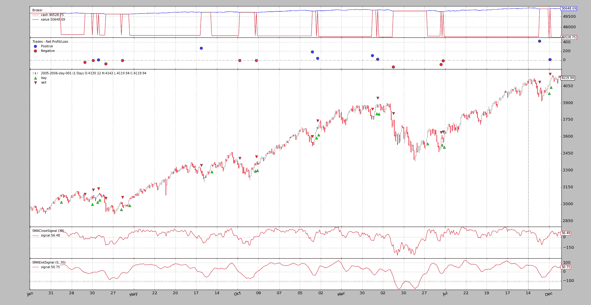

# 有信号的战略

> 原文： [https://www.backtrader.com/docu/signal_strategy/signal_strategy/](https://www.backtrader.com/docu/signal_strategy/signal_strategy/)

无需编写*策略*即可操作*反向交易者*。尽管这是首选方式，但由于构成机器的对象层次结构，使用*信号*也是可能的。

快速总结：

*   而不是编写一个*策略*类，实例化*指标*，编写*买入/卖出*逻辑…

*   最终用户添加*信号*（无论如何都是指示器），其余在后台完成

快速示例：

```py
import backtrader as bt

data = bt.feeds.OneOfTheFeeds(dataname='mydataname')
cerebro.adddata(data)

cerebro.add_signal(bt.SIGNAL_LONGSHORT, MySignal)
cerebro.run() 
```

瞧！。

当然，*信号*本身缺失。让我们定义一个非常愚蠢的*信号*，它产生：

*   `Long`表示`close`价格是否高于*简单移动平均线*

*   `Short`表示`close`价格是否低于*简单移动平均线*

定义：

```py
class MySignal(bt.Indicator):
    lines = ('signal',)
    params = (('period', 30),)

    def __init__(self):
        self.lines.signal = self.data - bt.indicators.SMA(period=self.p.period) 
```

现在它真的完成了。当执行`run`时*大脑*将负责实例化一个特殊的*策略*实例，该实例知道如何处理*信号*。

## 首字母*常见问题*

*   如何确定*买入*/*卖出*操作的数量？

    一个*大脑*实例自动向策略添加一个`FixedSize`sizer。最终用户可以通过`cerebro.addsizer`更改 sizer 以更改策略

*   如何执行命令？

    执行类型为`Market`，有效期为*良好，直至取消*

## *信号*技术细节

从技术和理论的角度来看，可以如下所述：

*   调用时返回另一个*对象*的可调用对象（仅一次）

    在大多数情况下，这是类的实例化，但不能是

*   支持`__getitem__`接口。唯一请求的*键*/*索引*将是`0`

从实用的角度来看，看上面的例子，*信号*是：

*   来自*反向交易者*生态系统的*行*对象，主要是*指标*

    这有助于使用其他*指标*，如示例中使用*简单移动平均线*时。

## *信号*指示

用`signal[0]`查询时*信号*发出指示，含义为：

*   `> 0`->`long indication`

*   `< 0`->`short indication`

*   `== 0`->*无显示*

该示例使用`self.data - SMA`和进行简单运算：

*   当`data`高于`SMA`时发出`long indication`

*   当`data`低于`SMA`时发出`short indication`

笔记

当`data`没有指定具体价格字段时，`close`价格为参考价格。

## *信号*类型

如上例所示，下面所示的*常数*可直接从主*backtrader*模块获得，如所示：

```py
import backtrader as bt

bt.SIGNAL_LONG 
```

有 5 种类型的*信号*，分为 2 组。

**主要组别**：

*   `LONGSHORT`：此信号的`long`和`short`指示均已获取

*   `LONG`：

    *   `long`迹象被认为是长期的

    *   `short`指示*关闭*多头位置。但是：

    *   如果系统中存在`LONGEXIT`（见下文）信号，则该信号将用于退出长时间运行

    *   如果有`SHORT`信号，但没有`LONGEXIT`信号，则在打开 a`short`之前先关闭 a`long`

*   `SHORT`：

    *   `short`迹象被认为是做空

    *   `long`指示*关闭*空头仓位。但是：

    *   如果系统中存在`SHORTEXIT`（见下文）信号，则该信号将用于退出短路

    *   如果有`LONG`信号，但没有`SHORTEXIT`信号，则在打开 a`long`之前先关闭 a`short`

**退出组**：

这两个信号旨在覆盖其他信号，并为存在的 a`long`/`short`位置提供标准

*   `LONGEXIT`：`short`显示退出`long`位置

*   `SHORTEXIT`：`long`显示退出`short`位置

## 累加与顺序并发

上面显示的样本*信号*将以恒定的基础发出*长*和*短*指示，因为它只是从`close`价格中减去`SMA`值，而这将始终是`> 0`和`< 0`（`0`在数学上是可能的，但不太可能真正发生）

这将导致连续生成*订单*，这将产生两种情况：

*   `Accumulation`：即使已经进入市场，*信号*也会产生新的订单，从而增加市场占有量

*   `Concurrency`：在不等待其他订单执行的情况下生成新订单

要避免这种情况，默认行为是：

*   *不累计*

*   *不允许并发*

如果希望这两种行为中的任何一种，可通过`cerebro`控制：

*   `cerebro.signal_accumulate(True)`（或`False`重新禁用）

*   `cerebro.signal_concurrency(True)`（或`False`重新禁用）

## 样本

*backtrader*源包含一个测试功能的示例。

要使用的主信号。

```py
class SMACloseSignal(bt.Indicator):
    lines = ('signal',)
    params = (('period', 30),)

    def __init__(self):
        self.lines.signal = self.data - bt.indicators.SMA(period=self.p.period) 
```

如果指定了选项，*退出信号*。

```py
class SMAExitSignal(bt.Indicator):
    lines = ('signal',)
    params = (('p1', 5), ('p2', 30),)

    def __init__(self):
        sma1 = bt.indicators.SMA(period=self.p.p1)
        sma2 = bt.indicators.SMA(period=self.p.p2)
        self.lines.signal = sma1 - sma2 
```

### 第一轮：长和短

```py
$ ./signals-strategy.py --plot --signal longshort 
```

输出

[](../signal-longshort.png)

注意：

*   绘制了*信号*。这是正常的，因为它只是一个指示器，并且适用于它的绘图规则

*   策略实际上是`long`和`short`。这是因为*现金*水平再也不会回到*价值*水平

*   旁注：即使是一个愚蠢的想法……（而且没有佣金），该战略也没有赔钱…

### 第二轮：仅限长期

```py
$ ./signals-strategy.py --plot --signal longonly 
```

输出

[](../signal-longonly.png)

注意：

*   在这里，每次*卖出*后，现金水平回到*价值*水平，这意味着该策略已退出市场

*   旁注：再一次没有钱丢了…

### 第三轮：仅限短期

```py
$ ./signals-strategy.py --plot --signal shortonly 
```

输出

[](../signal-shortonly.png)

注意：

*   1<sup>st</sup>操作是预期的*卖出*操作，发生时间晚于上述两个示例中的 1<sup>st</sup>操作。直到`close`低于`SMA`并且简单的减法产生负数

*   在这里，每次*买入*后，现金水平回到*价值*水平，这意味着该策略已退出市场

*   旁注：最后系统会赔钱

### 第四轮：长+长退出

```py
$ ./signals-strategy.py --plot --signal longonly --exitsignal longexit 
```

输出

[](../signal-long-longexit.png)

注意：

*   许多交易都是相同的，但一些交易被提前中断，因为*退出*信号中的快速移动平均线穿过慢速移动平均线向下移动

*   系统显示其*longonly*属性，现金在每次交易结束时成为价值

*   旁注：再次赚钱…即使有一些修改的交易

### 用法

```py
$ ./signals-strategy.py --help
usage: signals-strategy.py [-h] [--data DATA] [--fromdate FROMDATE]
                           [--todate TODATE] [--cash CASH]
                           [--smaperiod SMAPERIOD] [--exitperiod EXITPERIOD]
                           [--signal {longshort,longonly,shortonly}]
                           [--exitsignal {longexit,shortexit}]
                           [--plot [kwargs]]

Sample for Signal concepts

optional arguments:
  -h, --help            show this help message and exit
  --data DATA           Specific data to be read in (default:
                        ../../datas/2005-2006-day-001.txt)
  --fromdate FROMDATE   Starting date in YYYY-MM-DD format (default: None)
  --todate TODATE       Ending date in YYYY-MM-DD format (default: None)
  --cash CASH           Cash to start with (default: 50000)
  --smaperiod SMAPERIOD
                        Period for the moving average (default: 30)
  --exitperiod EXITPERIOD
                        Period for the exit control SMA (default: 5)
  --signal {longshort,longonly,shortonly}
                        Signal type to use for the main signal (default:
                        longshort)
  --exitsignal {longexit,shortexit}
                        Signal type to use for the exit signal (default: None)
  --plot [kwargs], -p [kwargs]
                        Plot the read data applying any kwargs passed For
                        example: --plot style="candle" (to plot candles)
                        (default: None) 
```

### 代码

```py
from __future__ import (absolute_import, division, print_function,
                        unicode_literals)

import argparse
import collections
import datetime

import backtrader as bt

MAINSIGNALS = collections.OrderedDict(
    (('longshort', bt.SIGNAL_LONGSHORT),
     ('longonly', bt.SIGNAL_LONG),
     ('shortonly', bt.SIGNAL_SHORT),)
)

EXITSIGNALS = {
    'longexit': bt.SIGNAL_LONGEXIT,
    'shortexit': bt.SIGNAL_LONGEXIT,
}

class SMACloseSignal(bt.Indicator):
    lines = ('signal',)
    params = (('period', 30),)

    def __init__(self):
        self.lines.signal = self.data - bt.indicators.SMA(period=self.p.period)

class SMAExitSignal(bt.Indicator):
    lines = ('signal',)
    params = (('p1', 5), ('p2', 30),)

    def __init__(self):
        sma1 = bt.indicators.SMA(period=self.p.p1)
        sma2 = bt.indicators.SMA(period=self.p.p2)
        self.lines.signal = sma1 - sma2

def runstrat(args=None):
    args = parse_args(args)

    cerebro = bt.Cerebro()
    cerebro.broker.set_cash(args.cash)

    dkwargs = dict()
    if args.fromdate is not None:
        fromdate = datetime.datetime.strptime(args.fromdate, '%Y-%m-%d')
        dkwargs['fromdate'] = fromdate

    if args.todate is not None:
        todate = datetime.datetime.strptime(args.todate, '%Y-%m-%d')
        dkwargs['todate'] = todate

    # if dataset is None, args.data has been given
    data = bt.feeds.BacktraderCSVData(dataname=args.data, **dkwargs)
    cerebro.adddata(data)

    cerebro.add_signal(MAINSIGNALS[args.signal],
                       SMACloseSignal, period=args.smaperiod)

    if args.exitsignal is not None:
        cerebro.add_signal(EXITSIGNALS[args.exitsignal],
                           SMAExitSignal,
                           p1=args.exitperiod,
                           p2=args.smaperiod)

    cerebro.run()
    if args.plot:
        pkwargs = dict(style='bar')
        if args.plot is not True:  # evals to True but is not True
            npkwargs = eval('dict(' + args.plot + ')')  # args were passed
            pkwargs.update(npkwargs)

        cerebro.plot(**pkwargs)

def parse_args(pargs=None):

    parser = argparse.ArgumentParser(
        formatter_class=argparse.ArgumentDefaultsHelpFormatter,
        description='Sample for Signal concepts')

    parser.add_argument('--data', required=False,
                        default='../../datas/2005-2006-day-001.txt',
                        help='Specific data to be read in')

    parser.add_argument('--fromdate', required=False, default=None,
                        help='Starting date in YYYY-MM-DD format')

    parser.add_argument('--todate', required=False, default=None,
                        help='Ending date in YYYY-MM-DD format')

    parser.add_argument('--cash', required=False, action='store',
                        type=float, default=50000,
                        help=('Cash to start with'))

    parser.add_argument('--smaperiod', required=False, action='store',
                        type=int, default=30,
                        help=('Period for the moving average'))

    parser.add_argument('--exitperiod', required=False, action='store',
                        type=int, default=5,
                        help=('Period for the exit control SMA'))

    parser.add_argument('--signal', required=False, action='store',
                        default=MAINSIGNALS.keys()[0], choices=MAINSIGNALS,
                        help=('Signal type to use for the main signal'))

    parser.add_argument('--exitsignal', required=False, action='store',
                        default=None, choices=EXITSIGNALS,
                        help=('Signal type to use for the exit signal'))

    # Plot options
    parser.add_argument('--plot', '-p', nargs='?', required=False,
                        metavar='kwargs', const=True,
                        help=('Plot the read data applying any kwargs passed\n'
                              '\n'
                              'For example:\n'
                              '\n'
                              '  --plot style="candle" (to plot candles)\n'))

    if pargs is not None:
        return parser.parse_args(pargs)

    return parser.parse_args()

if __name__ == '__main__':
    runstrat() 
```