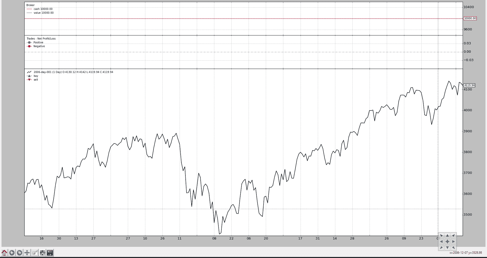
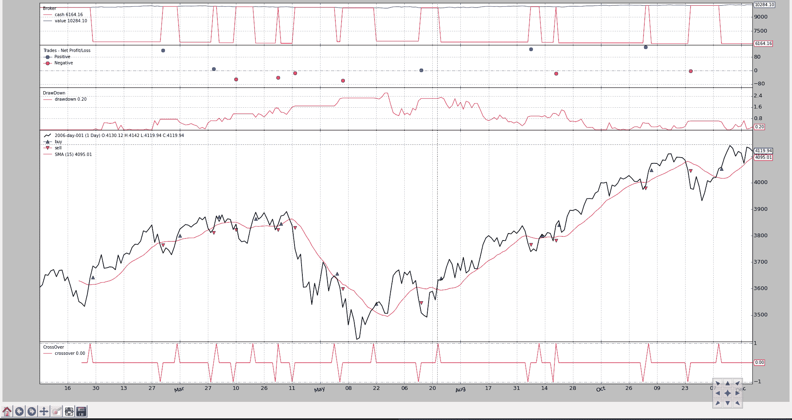
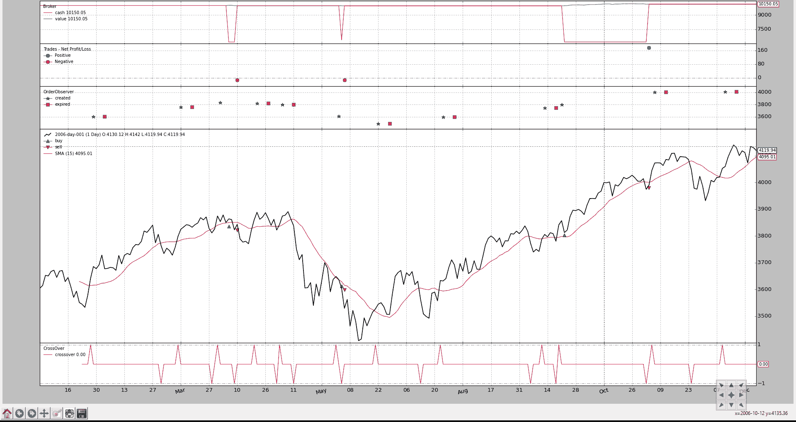

# 观察员和统计数字

> 原文： [https://www.backtrader.com/docu/observers-and-statistics/observers-and-statistics/](https://www.backtrader.com/docu/observers-and-statistics/observers-and-statistics/)

`backtrader`内部运行的策略主要处理**数据源**和**指标**。

数据源被添加到**大脑**实例，并最终成为策略输入的一部分（解析并作为实例的属性），而指标则由策略本身声明和管理。

到目前为止，所有`backtrader`样本图表都绘制了 3 件事情，这些事情似乎被认为是理所当然的，因为它们没有在任何地方声明：

*   现金和价值（经纪人的钱怎么了）

*   贸易（又名经营）

*   买卖订单

它们是`Observers`并且存在于子模块`backtrader.observers`中。它们之所以存在，是因为**大脑**支持一个参数自动将它们添加（或不添加）到策略中：

*   `stdstats`（默认为`True`）

如果遵守默认值，则**大脑**执行以下等效用户代码：

```py
import backtrader as bt

...

cerebro = bt.Cerebro()  # default kwarg: stdstats=True

cerebro.addobserver(bt.observers.Broker)
cerebro.addobserver(bt.observers.Trades)
cerebro.addobserver(bt.observers.BuySell) 
```

让我们看看这 3 位违约观察者的常用图表（即使没有发出订单，因此没有交易发生，现金和投资组合价值也没有变化）

```py
from __future__ import (absolute_import, division, print_function,
                        unicode_literals)

import backtrader as bt
import backtrader.feeds as btfeeds

if __name__ == '__main__':
    cerebro = bt.Cerebro(stdstats=False)
    cerebro.addstrategy(bt.Strategy)

    data = bt.feeds.BacktraderCSVData(dataname='../../datas/2006-day-001.txt')
    cerebro.adddata(data)

    cerebro.run()
    cerebro.plot() 
```

[](../observers-default.png)

现在我们在创建**大脑**实例时将`stdstats`的值改为`False`（调用`run`时也可以这样做）：

```py
cerebro = bt.Cerebro(stdstats=False) 
```

现在的图表不同了。

[](../observers-default-false.png)

## 接纳观察员

在默认情况下，如上所示的观察者已经存在，并收集可用于统计目的的信息，这就是为什么可以通过策略的一个属性访问观察者，该属性名为：

*   `stats`

它只是一个占位符。如果我们回顾一下，如上文所述，增加了一名默认**观察员**：

```py
...
cerebro.addobserver(backtrader.observers.Broker)
... 
```

显而易见的问题是如何访问`Broker`观察者。这里举例说明如何通过策略的`next`方法实现：

```py
class MyStrategy(bt.Strategy):

    def next(self):

        if self.stats.broker.value[0] < 1000.0:
           print('WHITE FLAG ... I LOST TOO MUCH')
        elif self.stats.broker.value[0] > 10000000.0:
           print('TIME FOR THE VIRGIN ISLANDS ....!!!') 
```

`Broker`观察者就像一个数据、一个指标，策略本身也是一个`Lines`对象。在这种情况下，`Broker`有两行：

*   `cash`

*   `value`

## 观察员执行

执行情况与指标非常相似：

```py
class Broker(Observer):
    alias = ('CashValue',)
    lines = ('cash', 'value')

    plotinfo = dict(plot=True, subplot=True)

    def next(self):
        self.lines.cash[0] = self._owner.broker.getcash()
        self.lines.value[0] = value = self._owner.broker.getvalue() 
```

步骤：

*   源自`Observer`（而非源自`Indicator`）

*   根据需要声明行和参数（`Broker`有 2 行但没有参数）

*   将有一个自动属性`_owner`，它是持有观察者的策略

观察员开始行动：

*   所有指标计算完毕后

*   策略`next`方法执行后

*   这意味着：在周期结束时，他们**观察**发生了什么

在`Broker`案例中，它只是盲目地记录每个时间点的经纪人现金和投资组合价值。

## 为战略增加观察员

如上所述，**大脑**正在使用`stdstats`参数来决定是否添加 3 个默认**观察者**，从而减轻最终用户的工作。

可以在混合中添加其他观察者，无论是沿着`stdstats`还是移除这些观察者。

让我们采用通常的策略，当`close`价格高于`SimpleMovingAverage`时买入，如果相反情况成立，则卖出。

加上一个“加法”：

*   **下降**是`backtrader`生态系统中已经存在的观察者

```py
from __future__ import (absolute_import, division, print_function,
                        unicode_literals)

import argparse
import datetime
import os.path
import time
import sys

import backtrader as bt
import backtrader.feeds as btfeeds
import backtrader.indicators as btind

class MyStrategy(bt.Strategy):
    params = (('smaperiod', 15),)

    def log(self, txt, dt=None):
        ''' Logging function fot this strategy'''
        dt = dt or self.data.datetime[0]
        if isinstance(dt, float):
            dt = bt.num2date(dt)
        print('%s, %s' % (dt.isoformat(), txt))

    def __init__(self):
        # SimpleMovingAverage on main data
        # Equivalent to -> sma = btind.SMA(self.data, period=self.p.smaperiod)
        sma = btind.SMA(period=self.p.smaperiod)

        # CrossOver (1: up, -1: down) close / sma
        self.buysell = btind.CrossOver(self.data.close, sma, plot=True)

        # Sentinel to None: new ordersa allowed
        self.order = None

    def next(self):
        # Access -1, because drawdown[0] will be calculated after "next"
        self.log('DrawDown: %.2f' % self.stats.drawdown.drawdown[-1])
        self.log('MaxDrawDown: %.2f' % self.stats.drawdown.maxdrawdown[-1])

        # Check if we are in the market
        if self.position:
            if self.buysell < 0:
                self.log('SELL CREATE, %.2f' % self.data.close[0])
                self.sell()

        elif self.buysell > 0:
            self.log('BUY CREATE, %.2f' % self.data.close[0])
            self.buy()

def runstrat():
    cerebro = bt.Cerebro()

    data = bt.feeds.BacktraderCSVData(dataname='../../datas/2006-day-001.txt')
    cerebro.adddata(data)

    cerebro.addobserver(bt.observers.DrawDown)

    cerebro.addstrategy(MyStrategy)
    cerebro.run()

    cerebro.plot()

if __name__ == '__main__':
    runstrat() 
```

可视化输出显示了缩编的演变

[](../observers-default-drawdown.png)

和部分文本输出：

```py
...
2006-12-14T23:59:59+00:00, MaxDrawDown: 2.62
2006-12-15T23:59:59+00:00, DrawDown: 0.22
2006-12-15T23:59:59+00:00, MaxDrawDown: 2.62
2006-12-18T23:59:59+00:00, DrawDown: 0.00
2006-12-18T23:59:59+00:00, MaxDrawDown: 2.62
2006-12-19T23:59:59+00:00, DrawDown: 0.00
2006-12-19T23:59:59+00:00, MaxDrawDown: 2.62
2006-12-20T23:59:59+00:00, DrawDown: 0.10
2006-12-20T23:59:59+00:00, MaxDrawDown: 2.62
2006-12-21T23:59:59+00:00, DrawDown: 0.39
2006-12-21T23:59:59+00:00, MaxDrawDown: 2.62
2006-12-22T23:59:59+00:00, DrawDown: 0.21
2006-12-22T23:59:59+00:00, MaxDrawDown: 2.62
2006-12-27T23:59:59+00:00, DrawDown: 0.28
2006-12-27T23:59:59+00:00, MaxDrawDown: 2.62
2006-12-28T23:59:59+00:00, DrawDown: 0.65
2006-12-28T23:59:59+00:00, MaxDrawDown: 2.62
2006-12-29T23:59:59+00:00, DrawDown: 0.06
2006-12-29T23:59:59+00:00, MaxDrawDown: 2.62 
```

笔记

从文本输出和代码中可以看出，`DrawDown`观察者实际上有两行：

*   `drawdown`

*   `maxdrawdown`

选择不是绘制`maxdrawdown`线，而是使其仍然可供用户使用。

实际上，`maxdrawdown`的最后一个值在名为`maxdd`的直接属性（非行）中也可用

## 发展中的观察员

`Broker`观察器的实现如上图所示。为了产生有意义的观察者，实现可以使用以下信息：

*   `self._owner`当前是否正在执行策略

    因此，观察者可以使用策略中的任何内容

*   策略中可用的默认内部内容可能有用：

    *   `broker`->属性，用于访问策略创建订单的代理实例

    如`Broker`所示，通过调用`getcash`和`getvalue`方法收集现金和投资组合价值

    *   `_orderspending`->列出策略创建的订单，并且经纪人已向策略通知了该订单的事件。

    `BuySell`观察者遍历列表，寻找已执行（全部或部分）的订单，以创建给定时间点（索引 0）的平均执行价格

    *   `_tradespending`->根据买入/卖出订单编制的交易清单（一套完整的买入/卖出或卖出/买入对）

**观察者**显然可以通过`self._owner.stats`路径访问其他观察者。

### 定制*订单观察者*

标准的`BuySell`观察者只关心已经执行的操作。我们可以创建一个观察者，它可以显示订单创建的时间和地点，以及订单是否过期。

为了*可见性*的缘故，显示屏不会沿价格标绘，而是在单独的轴上标绘。

```py
from __future__ import (absolute_import, division, print_function,
                        unicode_literals)

import math

import backtrader as bt

class OrderObserver(bt.observer.Observer):
    lines = ('created', 'expired',)

    plotinfo = dict(plot=True, subplot=True, plotlinelabels=True)

    plotlines = dict(
        created=dict(marker='*', markersize=8.0, color='lime', fillstyle='full'),
        expired=dict(marker='s', markersize=8.0, color='red', fillstyle='full')
    )

    def next(self):
        for order in self._owner._orderspending:
            if order.data is not self.data:
                continue

            if not order.isbuy():
                continue

            # Only interested in "buy" orders, because the sell orders
            # in the strategy are Market orders and will be immediately
            # executed

            if order.status in [bt.Order.Accepted, bt.Order.Submitted]:
                self.lines.created[0] = order.created.price

            elif order.status in [bt.Order.Expired]:
                self.lines.expired[0] = order.created.price 
```

定制观察者只关心**购买**订单，因为这是一种只为盈利而购买的策略。销售订单是市场订单，将立即执行。

关闭 SMA 交叉策略更改为：

*   创建限价订单，价格低于信号发出时收盘价的 1.0%

*   有效期为 7（日历）天

生成的图表。

[](../observers-orderobserver.png)

从新的分图表（红色方块）中可以看出，有几份订单已经过期，我们还可以理解，在“创建”和“执行”之间有几天的时间。

最后是应用新的**观察者**的该策略代码

```py
from __future__ import (absolute_import, division, print_function,
                        unicode_literals)

import datetime

import backtrader as bt
import backtrader.feeds as btfeeds
import backtrader.indicators as btind

from orderobserver import OrderObserver

class MyStrategy(bt.Strategy):
    params = (
        ('smaperiod', 15),
        ('limitperc', 1.0),
        ('valid', 7),
    )

    def log(self, txt, dt=None):
        ''' Logging function fot this strategy'''
        dt = dt or self.data.datetime[0]
        if isinstance(dt, float):
            dt = bt.num2date(dt)
        print('%s, %s' % (dt.isoformat(), txt))

    def notify_order(self, order):
        if order.status in [order.Submitted, order.Accepted]:
            # Buy/Sell order submitted/accepted to/by broker - Nothing to do
            self.log('ORDER ACCEPTED/SUBMITTED', dt=order.created.dt)
            self.order = order
            return

        if order.status in [order.Expired]:
            self.log('BUY EXPIRED')

        elif order.status in [order.Completed]:
            if order.isbuy():
                self.log(
                    'BUY EXECUTED, Price: %.2f, Cost: %.2f, Comm %.2f' %
                    (order.executed.price,
                     order.executed.value,
                     order.executed.comm))

            else:  # Sell
                self.log('SELL EXECUTED, Price: %.2f, Cost: %.2f, Comm %.2f' %
                         (order.executed.price,
                          order.executed.value,
                          order.executed.comm))

        # Sentinel to None: new orders allowed
        self.order = None

    def __init__(self):
        # SimpleMovingAverage on main data
        # Equivalent to -> sma = btind.SMA(self.data, period=self.p.smaperiod)
        sma = btind.SMA(period=self.p.smaperiod)

        # CrossOver (1: up, -1: down) close / sma
        self.buysell = btind.CrossOver(self.data.close, sma, plot=True)

        # Sentinel to None: new ordersa allowed
        self.order = None

    def next(self):
        if self.order:
            # pending order ... do nothing
            return

        # Check if we are in the market
        if self.position:
            if self.buysell < 0:
                self.log('SELL CREATE, %.2f' % self.data.close[0])
                self.sell()

        elif self.buysell > 0:
            plimit = self.data.close[0] * (1.0 - self.p.limitperc / 100.0)
            valid = self.data.datetime.date(0) + \
                datetime.timedelta(days=self.p.valid)
            self.log('BUY CREATE, %.2f' % plimit)
            self.buy(exectype=bt.Order.Limit, price=plimit, valid=valid)

def runstrat():
    cerebro = bt.Cerebro()

    data = bt.feeds.BacktraderCSVData(dataname='../../datas/2006-day-001.txt')
    cerebro.adddata(data)

    cerebro.addobserver(OrderObserver)

    cerebro.addstrategy(MyStrategy)
    cerebro.run()

    cerebro.plot()

if __name__ == '__main__':
    runstrat() 
```

## 保存/保存统计数据

到目前为止`backtrader`还没有实现任何机制来跟踪将其存储到文件中的观察者的值。最好的方法是：

*   按策略的`start`方法打开一个文件

*   在策略的`next`方法中写下值

考虑到`DrawDown`观察者，可以这样做

```py
class MyStrategy(bt.Strategy):

    def start(self):

        self.mystats = open('mystats.csv', 'wb')
        self.mystats.write('datetime,drawdown, maxdrawdown\n')

    def next(self):
        self.mystats.write(self.data.datetime.date(0).strftime('%Y-%m-%d'))
        self.mystats.write(',%.2f' % self.stats.drawdown.drawdown[-1])
        self.mystats.write(',%.2f' % self.stats.drawdown.maxdrawdown-1])
        self.mystats.write('\n') 
```

要保存索引 0 的值，处理完所有观察者后，可以将写入文件的自定义观察者添加为系统的最后一个观察者，以将值保存到 csv 文件。

笔记

Writer 功能可以自动执行此任务。