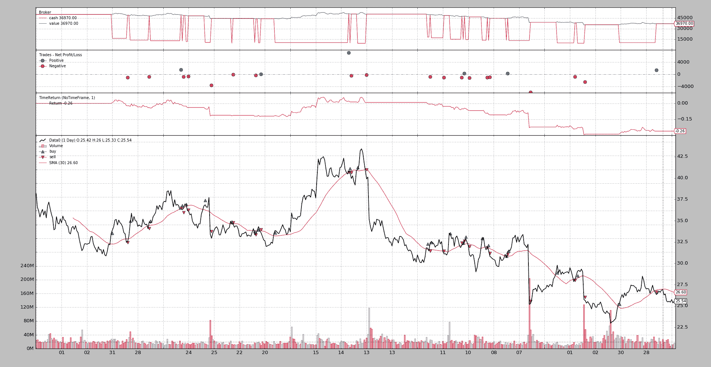
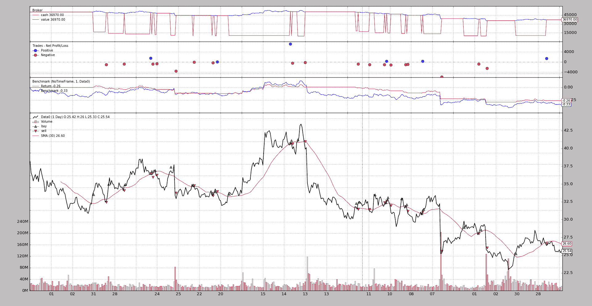

# 标杆管理

> 原文： [https://www.backtrader.com/docu/observer-benchmark/benchmarking/](https://www.backtrader.com/docu/observer-benchmark/benchmarking/)

[票据](https://github.com/mementum/backtrader/issues/89)是关于增加资产的基准测试。明智的做法是，一个人实际上可能有一种策略，即使积极的策略低于简单跟踪资产所能带来的效果。

*backtrader*包括两种不同类型的对象，可以帮助跟踪：

*   *观察员*

*   *分析仪*

在*分析器*领域中，已经有一个`TimeReturn`对象跟踪整个投资组合价值（即：包括现金）回报的演变

很明显，这也可能是一个*观察者*，因此，在添加一些*基准*的同时，一些工作也进入了能够将*观察者*和*分析仪*插在一起的阶段，这意味着要跟踪同一事物。

笔记

*观察者*和*分析仪*之间的主要区别在于*观察者*的*行*性质，它们记录每一个值，这使它们更合适

用于打印和实时查询的。这当然会消耗内存。

另一方面，*分析器*通过`get_analysis`返回一组结果，在*运行*结束之前，实现可能不会传递任何结果。

## 分析仪-基准测试

标准`TimeReturn`分析仪已扩展，支持跟踪*数据馈送*。涉及的两个主要参数：

*   `timeframe`（默认值：`None`）如果`None`，则将报告整个回溯测试期间的完整回报

    通过 PoT T0 来考虑没有时间约束的整个数据集

*   `data`（默认为`None`）

    要跟踪的参考资产，而不是投资组合价值。

    笔记

    此数据必须已添加到具有`addata`、`resampledata`或`replaydata`的`cerebro`实例中

有关更多详细信息和参数：分析器参考

因此，波尔夫托利奥每年的收益可以这样追踪

```py
import backtrader as bt

cerebro = bt.Cerebro()
cerebro.addanalyzer(bt.analyzers.TimeReturn, timeframe=bt.TimeFrame.Years)

...  # add datas, strategies ...

results = cerebro.run()
strat0 = results[0]

# If no name has been specified, the name is the class name lowercased
tret_analyzer = strat0.analyzers.getbyname('timereturn')
print(tret_analyzer.get_analysis()) 
```

如果我们想要跟踪*数据*的返回

```py
import backtrader as bt

cerebro = bt.Cerebro()

data = bt.feeds.OneOfTheFeeds(dataname='abcde', ...)
cerebro.adddata(data)

cerebro.addanalyzer(bt.analyzers.TimeReturn, timeframe=bt.TimeFrame.Years,
                    data=data)

...  # add strategies ...

results = cerebro.run()
strat0 = results[0]

# If no name has been specified, the name is the class name lowercased
tret_analyzer = strat0.analyzers.getbyname('timereturn')
print(tret_analyzer.get_analysis()) 
```

如果两者都要跟踪，最好是为*分析仪*指定名称

```py
import backtrader as bt

cerebro = bt.Cerebro()

data = bt.feeds.OneOfTheFeeds(dataname='abcde', ...)
cerebro.adddata(data)

cerebro.addanalyzer(bt.analyzers.TimeReturn, timeframe=bt.TimeFrame.Years,
                    data=data, _name='datareturns')

cerebro.addanalyzer(bt.analyzers.TimeReturn, timeframe=bt.TimeFrame.Years)
                    _name='timereturns')

...  # add strategies ...

results = cerebro.run()
strat0 = results[0]

# If no name has been specified, the name is the class name lowercased
tret_analyzer = strat0.analyzers.getbyname('timereturns')
print(tret_analyzer.get_analysis())
tdata_analyzer = strat0.analyzers.getbyname('datareturns')
print(tdata_analyzer.get_analysis()) 
```

## 观察员-基准

由于后台机器允许在*观察者*内部使用*分析仪*，因此增加了 2 个新观察者：

*   `TimeReturn`

*   `Benchmark`

两者都使用`bt.analyzers.TimeReturn`分析仪收集结果。

与上面的代码片段不同，我们提供了一个完整的示例，其中包含一些运行，以显示它们的功能。

### 观测时间返回

执行：

```py
$ ./observer-benchmark.py --plot --timereturn --timeframe notimeframe 
```

[](../01-benchmarking-timereturn-no-timeframe.png)

请注意执行选项：

*   `--timereturn`告诉样本就这么做

*   【谚】告诉分析者考虑整个数据集，不考虑时限边界。

最后绘制的值为`-0.26`。

*   起始现金（从图表中可以明显看出）是`50K`货币单位，策略以`36,970`货币单位结束，因此`-26%`价值递减。

### 观察基准

因为*对标*也会显示*timereturn*结果，所以我们在*对标*激活的情况下运行相同的操作：

```py
$ ./observer-benchmark.py --plot --timeframe notimeframe 
```

[](../02-benchmarking-no-timeframe.png)

嘿，嘿，嘿！！！

*   策略优于资产：`-0.26`vs`-0.33`

    这不应该是一件值得庆祝的事情，但至少很明显，这项战略甚至没有资产那么糟糕。

在*年*的基础上向下跟踪事件：

```py
$ ./observer-benchmark.py --plot --timeframe years 
```

[](../03-benchmarking-years.png)

小心

*   策略最后一个值从`-0.26`到`-0.27`变化非常小

*   另一方面，资产的最后价值为`-0.35`（与上述`-0.33`相比）

价值如此接近的原因是，从 2005 年到 2006 年，战略和基准资产几乎都处于 2005 年初的起始水平。

切换到较低的时间段，如*周*，整个画面发生变化：

```py
$ ./observer-benchmark.py --plot --timeframe weeks

.. image:: 04-benchmarking-weeks.png 
```

现在：

*   `Benchmark`观察者表现出更加紧张的一面。事情上下波动，因为现在投资组合和数据的回报都被跟踪

*   并且由于本年度最后一周没有交易活跃且资产几乎没有移动，最后显示的值为 0.00（上周之前的最后收盘值为`25.54`，样本数据在`25.55`收盘，差异首先在小数点后 4<sup>第</sup>位感受到）

### 观察基准-另一个数据

该示例允许针对不同的数据进行基准测试。默认为在使用`--benchdata1`时以*Oracle*为基准。考虑到具有`--timeframe notimeframe`的整个数据集：

```py
$ ./observer-benchmark.py --plot --timeframe notimeframe --benchdata1 
```

[](../05-benchmarking-data1-no-timeframe.png)

现在很清楚为什么上面没有庆祝的理由：

*   策略的结果在`notimeframe`没有改变，保持在`-26%`（`-0.26`）

*   但当与另一个数据进行基准测试时，该数据在同一时期内有一个`+23%`（`0.23`）

要么战略需要改变，要么另一项资产最好交易。

## 总结

现在有两种方法，使用相同的底层代码/计算来跟踪*时间返回*和*基准*

*   *观察员*（`TimeReturn`和`Benchmark`）

和

*   *分析仪*（`TimeReturn`和`TimeReturn`带`data`参数）

当然*标杆*不能保证利润，只是*比较*。

样本的使用：

```py
$ ./observer-benchmark.py --help
usage: observer-benchmark.py [-h] [--data0 DATA0] [--data1 DATA1]
                             [--benchdata1] [--fromdate FROMDATE]
                             [--todate TODATE] [--printout] [--cash CASH]
                             [--period PERIOD] [--stake STAKE] [--timereturn]
                             [--timeframe {months,days,notimeframe,years,None,weeks}]
                             [--plot [kwargs]]

Benchmark/TimeReturn Observers Sample

optional arguments:
  -h, --help            show this help message and exit
  --data0 DATA0         Data0 to be read in (default:
                        ../../datas/yhoo-1996-2015.txt)
  --data1 DATA1         Data1 to be read in (default:
                        ../../datas/orcl-1995-2014.txt)
  --benchdata1          Benchmark against data1 (default: False)
  --fromdate FROMDATE   Starting date in YYYY-MM-DD format (default:
                        2005-01-01)
  --todate TODATE       Ending date in YYYY-MM-DD format (default: 2006-12-31)
  --printout            Print data lines (default: False)
  --cash CASH           Cash to start with (default: 50000)
  --period PERIOD       Period for the crossover moving average (default: 30)
  --stake STAKE         Stake to apply for the buy operations (default: 1000)
  --timereturn          Use TimeReturn observer instead of Benchmark (default:
                        None)
  --timeframe {months,days,notimeframe,years,None,weeks}
                        TimeFrame to apply to the Observer (default: None)
  --plot [kwargs], -p [kwargs]
                        Plot the read data applying any kwargs passed For
                        example: --plot style="candle" (to plot candles)
                        (default: None) 
```

### 代码

```py
from __future__ import (absolute_import, division, print_function,
                        unicode_literals)

import argparse
import datetime
import random

import backtrader as bt

class St(bt.Strategy):
    params = (
        ('period', 10),
        ('printout', False),
        ('stake', 1000),
    )

    def __init__(self):
        sma = bt.indicators.SMA(self.data, period=self.p.period)
        self.crossover = bt.indicators.CrossOver(self.data, sma)

    def start(self):
        if self.p.printout:
            txtfields = list()
            txtfields.append('Len')
            txtfields.append('Datetime')
            txtfields.append('Open')
            txtfields.append('High')
            txtfields.append('Low')
            txtfields.append('Close')
            txtfields.append('Volume')
            txtfields.append('OpenInterest')
            print(','.join(txtfields))

    def next(self):
        if self.p.printout:
            # Print only 1st data ... is just a check that things are running
            txtfields = list()
            txtfields.append('%04d' % len(self))
            txtfields.append(self.data.datetime.datetime(0).isoformat())
            txtfields.append('%.2f' % self.data0.open[0])
            txtfields.append('%.2f' % self.data0.high[0])
            txtfields.append('%.2f' % self.data0.low[0])
            txtfields.append('%.2f' % self.data0.close[0])
            txtfields.append('%.2f' % self.data0.volume[0])
            txtfields.append('%.2f' % self.data0.openinterest[0])
            print(','.join(txtfields))

        if self.position:
            if self.crossover < 0.0:
                if self.p.printout:
                    print('CLOSE {} @%{}'.format(size,
                                                 self.data.close[0]))
                self.close()

        else:
            if self.crossover > 0.0:
                self.buy(size=self.p.stake)
                if self.p.printout:
                    print('BUY   {} @%{}'.format(self.p.stake,
                                                self.data.close[0]))

TIMEFRAMES = {
    None: None,
    'days': bt.TimeFrame.Days,
    'weeks': bt.TimeFrame.Weeks,
    'months': bt.TimeFrame.Months,
    'years': bt.TimeFrame.Years,
    'notimeframe': bt.TimeFrame.NoTimeFrame,
}

def runstrat(args=None):
    args = parse_args(args)

    cerebro = bt.Cerebro()
    cerebro.broker.set_cash(args.cash)

    dkwargs = dict()
    if args.fromdate:
        fromdate = datetime.datetime.strptime(args.fromdate, '%Y-%m-%d')
        dkwargs['fromdate'] = fromdate

    if args.todate:
        todate = datetime.datetime.strptime(args.todate, '%Y-%m-%d')
        dkwargs['todate'] = todate

    data0 = bt.feeds.YahooFinanceCSVData(dataname=args.data0, **dkwargs)
    cerebro.adddata(data0, name='Data0')

    cerebro.addstrategy(St,
                        period=args.period,
                        stake=args.stake,
                        printout=args.printout)

    if args.timereturn:
        cerebro.addobserver(bt.observers.TimeReturn,
                            timeframe=TIMEFRAMES[args.timeframe])
    else:
        benchdata = data0
        if args.benchdata1:
            data1 = bt.feeds.YahooFinanceCSVData(dataname=args.data1, **dkwargs)
            cerebro.adddata(data1, name='Data1')
            benchdata = data1

        cerebro.addobserver(bt.observers.Benchmark,
                            data=benchdata,
                            timeframe=TIMEFRAMES[args.timeframe])

    cerebro.run()

    if args.plot:
        pkwargs = dict()
        if args.plot is not True:  # evals to True but is not True
            pkwargs = eval('dict(' + args.plot + ')')  # args were passed

        cerebro.plot(**pkwargs)

def parse_args(pargs=None):

    parser = argparse.ArgumentParser(
        formatter_class=argparse.ArgumentDefaultsHelpFormatter,
        description='Benchmark/TimeReturn Observers Sample')

    parser.add_argument('--data0', required=False,
                        default='../../datas/yhoo-1996-2015.txt',
                        help='Data0 to be read in')

    parser.add_argument('--data1', required=False,
                        default='../../datas/orcl-1995-2014.txt',
                        help='Data1 to be read in')

    parser.add_argument('--benchdata1', required=False, action='store_true',
                        help=('Benchmark against data1'))

    parser.add_argument('--fromdate', required=False,
                        default='2005-01-01',
                        help='Starting date in YYYY-MM-DD format')

    parser.add_argument('--todate', required=False,
                        default='2006-12-31',
                        help='Ending date in YYYY-MM-DD format')

    parser.add_argument('--printout', required=False, action='store_true',
                        help=('Print data lines'))

    parser.add_argument('--cash', required=False, action='store',
                        type=float, default=50000,
                        help=('Cash to start with'))

    parser.add_argument('--period', required=False, action='store',
                        type=int, default=30,
                        help=('Period for the crossover moving average'))

    parser.add_argument('--stake', required=False, action='store',
                        type=int, default=1000,
                        help=('Stake to apply for the buy operations'))

    parser.add_argument('--timereturn', required=False, action='store_true',
                        default=None,
                        help=('Use TimeReturn observer instead of Benchmark'))

    parser.add_argument('--timeframe', required=False, action='store',
                        default=None, choices=TIMEFRAMES.keys(),
                        help=('TimeFrame to apply to the Observer'))

    # Plot options
    parser.add_argument('--plot', '-p', nargs='?', required=False,
                        metavar='kwargs', const=True,
                        help=('Plot the read data applying any kwargs passed\n'
                              '\n'
                              'For example:\n'
                              '\n'
                              '  --plot style="candle" (to plot candles)\n'))

    if pargs:
        return parser.parse_args(pargs)

    return parser.parse_args()

if __name__ == '__main__':
    runstrat() 
```