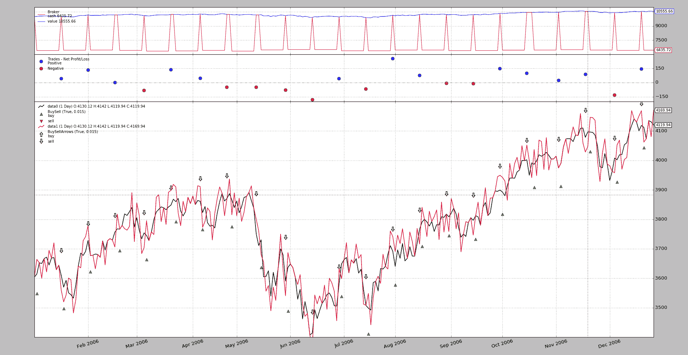

# 在同一轴上绘图

> 原文： [https://www.backtrader.com/docu/plotting/sameaxis/plot-sameaxis/](https://www.backtrader.com/docu/plotting/sameaxis/plot-sameaxis/)

上一个 post future spot 在同一空间绘制原始数据和略微（随机）修改的数据，但不在同一轴上。

正在从该帖子中恢复 1<sup>st</sup>图片。

[](../future-spot.png)

我们可以看到：

*   图表的左右两侧有不同的刻度

*   这一点在观察围绕原始数据摆动`+- 50`点的摆动红线（随机数据）时最为明显。

    在图表上，直观的印象是这些随机数据通常高于原始数据。由于尺度不同，这只是一种视觉印象。

尽管版本`1.9.32.116`已经有了一些初始支持，可以在同一个轴上完全绘图，但图例标签将被复制（只有标签，而不是数据），这确实令人困惑。

释放`1.9.33.116`会消除该效果，并允许在同一轴上进行完整绘图。使用模式类似于决定使用哪些其他数据进行绘图的模式。从上一篇文章。

```py
import backtrader as bt

cerebro = bt.Cerebro()

data0 = bt.feeds.MyFavouriteDataFeed(dataname='futurename')
cerebro.adddata(data0)

data1 = bt.feeds.MyFavouriteDataFeed(dataname='spotname')
data1.compensate(data0)  # let the system know ops on data1 affect data0
data1.plotinfo.plotmaster = data0
data1.plotinfo.sameaxis = True
cerebro.adddata(data1)

...

cerebro.run() 
```

`data1`获取一些`plotinfo`值以：

*   在与`plotmaster`相同的空间上绘图，即`data0`

*   获取使用`sameaxis`的指示

    此指示的原因是平台无法提前知道每个数据的刻度是否兼容。这就是为什么它会在独立的尺度上绘制它们

上一个示例获得了一个附加选项，可以在`sameaxis`上绘图。执行示例：

```py
$ ./future-spot.py --sameaxis 
```

以及由此产生的图表

[](../future-spot-sameaxis.png)

注意：

*   右手边只有一个刻度

*   现在随机数据似乎明显地围绕着原始数据振荡，原始数据是预期的视觉行为

## 样本使用

```py
$ ./future-spot.py --help
usage: future-spot.py [-h] [--no-comp] [--sameaxis]

Compensation example

optional arguments:
  -h, --help  show this help message and exit
  --no-comp
  --sameaxis 
```

## 示例代码

```py
from __future__ import (absolute_import, division, print_function,
                        unicode_literals)

import argparse
import random
import backtrader as bt

# The filter which changes the close price
def close_changer(data, *args, **kwargs):
    data.close[0] += 50.0 * random.randint(-1, 1)
    return False  # length of stream is unchanged

# override the standard markers
class BuySellArrows(bt.observers.BuySell):
    plotlines = dict(buy=dict(marker='$\u21E7$', markersize=12.0),
                     sell=dict(marker='$\u21E9$', markersize=12.0))

class St(bt.Strategy):
    def __init__(self):
        bt.obs.BuySell(self.data0, barplot=True)  # done here for
        BuySellArrows(self.data1, barplot=True)  # different markers per data

    def next(self):
        if not self.position:
            if random.randint(0, 1):
                self.buy(data=self.data0)
                self.entered = len(self)

        else:  # in the market
            if (len(self) - self.entered) >= 10:
                self.sell(data=self.data1)

def runstrat(args=None):
    args = parse_args(args)
    cerebro = bt.Cerebro()

    dataname = '../../datas/2006-day-001.txt'  # data feed

    data0 = bt.feeds.BacktraderCSVData(dataname=dataname, name='data0')
    cerebro.adddata(data0)

    data1 = bt.feeds.BacktraderCSVData(dataname=dataname, name='data1')
    data1.addfilter(close_changer)
    if not args.no_comp:
        data1.compensate(data0)
    data1.plotinfo.plotmaster = data0
    if args.sameaxis:
        data1.plotinfo.sameaxis = True
    cerebro.adddata(data1)

    cerebro.addstrategy(St)  # sample strategy

    cerebro.addobserver(bt.obs.Broker)  # removed below with stdstats=False
    cerebro.addobserver(bt.obs.Trades)  # removed below with stdstats=False

    cerebro.broker.set_coc(True)
    cerebro.run(stdstats=False)  # execute
    cerebro.plot(volume=False)  # and plot

def parse_args(pargs=None):
    parser = argparse.ArgumentParser(
        formatter_class=argparse.ArgumentDefaultsHelpFormatter,
        description=('Compensation example'))

    parser.add_argument('--no-comp', required=False, action='store_true')
    parser.add_argument('--sameaxis', required=False, action='store_true')
    return parser.parse_args(pargs)

if __name__ == '__main__':
    runstrat() 
```