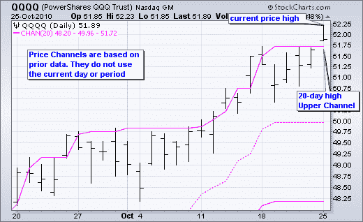

# 交叉回溯测试陷阱

> 原文： [https://www.backtrader.com/blog/posts/2019-09-04-donchian-across-platforms/donchian-across-platforms/](https://www.backtrader.com/blog/posts/2019-09-04-donchian-across-platforms/donchian-across-platforms/)

在[反向交易者社区](https://community.backtrader.com)*中，有一些事情往往会重复，用户解释了复制在[TradingView](https://www.tradingview.com/)*中获得的反向测试结果的意愿，例如，现在非常流行的[TradingView](https://www.tradingview.com/)*或其他一些反向测试平台。***

 ***没有真正了解名为`Pinescript`的*TradingView*中使用的语言，也没有对回溯测试引擎的内部进行空暴露，仍然有一种方法可以让用户知道，跨平台编码必须谨慎。

## 指标：并非总是忠实于来源

当为*backtrader*实施新指标时，无论是直接为发行版还是作为网站的一个片段，都非常强调尊重原始定义。`RSI`就是一个很好的例子。

*   威尔斯·怀尔德使用`Modified Moving Average`设计`RSI`（又名`Smoothed Moving Average`，参见[维基百科——修正移动平均线](https://en.wikipedia.org/wiki/Moving_average#Modified_moving_average)*）*

**   尽管如此，许多平台还是为用户提供了一种称为`RSI`的东西，但使用的是经典`Exponential Moving Average`，而不是书中所说的。

    *   考虑到这两个平均值都是指数型的，差异并不大，但这不是威尔斯·怀尔德所定义的。它可能仍然有用，甚至更好，但它不是的`RSI`。文件（如果有）没有提到这一点。* 

 **backtrader*中`RSI`的默认配置是使用`MMA`来忠实于来源，但使用哪个移动平均线是一个参数，可以通过子类化或在运行时实例化过程中更改为使用`EMA`甚至*简单移动平均线*。

## 一个例子：唐钦海峡

维基百科的定义：[维基百科-东芝频道](https://en.wikipedia.org/wiki/Donchian_channel)*。它只是一个文本，并没有提到使用通道突破作为交易信号。*

 *另外两个定义：

*   [股票图表-学校-价格渠道](https://school.stockcharts.com/doku.php?id=technical_indicators:price_channels)*。*

**   [不可置信的莱查特-唐奇安通道](https://www.incrediblecharts.com/indicators/donchian_channels.php)* 

 **这两个引用明确指出，用于计算通道的数据不包括当前条，因为如果它包括。。。突破不会得到反映。这是一张来自*股票图表*的样本图表

[](../stockcharts-donchian-breakouts.png)

现在转到*TradingView*。首先是链接

*   [TradingView-Wiki-Donchian 频道](https://www.tradingview.com/wiki/Donchian_Channels_(DC))

 *还有那页的图表。

[](../tradingview-donchian-no-breakouts.png)

即使是*Investopedia*也使用了*TradingView*的图表，显示**没有突破**。此处：[投资区-顿钦海峡-https://www.investopedia.com/terms/d/donchianchannels.asp](https://www.investopedia.com/terms/d/donchianchannels.asp)

 *正如一些人所说。。。**起泡的藤壶！！！！**。因为在*TradingView*图表中没有突破。这意味着该指标的实现是使用**当前**价格条来计算渠道。

## *反向交易者*中的顿钦渠道

标准*backtrader*发行版中没有`DonchianChannels`实现，但可以快速制作。参数将是当前条是否用于通道计算的决定因素。

```py
class DonchianChannels(bt.Indicator):
    '''
 Params Note:
 - ``lookback`` (default: -1)

 If `-1`, the bars to consider will start 1 bar in the past and the
 current high/low may break through the channel.

 If `0`, the current prices will be considered for the Donchian
 Channel. This means that the price will **NEVER** break through the
 upper/lower channel bands.
 '''

    alias = ('DCH', 'DonchianChannel',)

    lines = ('dcm', 'dch', 'dcl',)  # dc middle, dc high, dc low
    params = dict(
        period=20,
        lookback=-1,  # consider current bar or not
    )

    plotinfo = dict(subplot=False)  # plot along with data
    plotlines = dict(
        dcm=dict(ls='--'),  # dashed line
        dch=dict(_samecolor=True),  # use same color as prev line (dcm)
        dcl=dict(_samecolor=True),  # use same color as prev line (dch)
    )

    def __init__(self):
        hi, lo = self.data.high, self.data.low
        if self.p.lookback:  # move backwards as needed
            hi, lo = hi(self.p.lookback), lo(self.p.lookback)

        self.l.dch = bt.ind.Highest(hi, period=self.p.period)
        self.l.dcl = bt.ind.Lowest(lo, period=self.p.period)
        self.l.dcm = (self.l.dch + self.l.dcl) / 2.0  # avg of the above 
```

将其与`lookback=-1`示例图表一起使用，如下所示（放大）

[](../bt-donchian-lookback-1-breakouts.png)

你可以清楚地看到突破，而在`lookback=0`版本中没有突破。

[](../bt-donchian-lookback-0-no-breakouts.png)

## 编码含义

程序员首先进入商业平台，并使用*Donchian 频道*实施策略。由于图表未显示突破，因此必须将当前价格值与之前的通道值进行比较。像

```py
if price0 > channel_high_1:
    sell()
elif price0 < channel_low_1:
    buy() 
```

当前价格，即：`price0`正在与`1`期前的高/低通道值进行比较（因此有`_1`后缀）

作为一个谨慎的程序员，不知道*backtrader*中*Donchian Channel*的实现默认为突破，代码被移植，如下所示

```py
 def __init__(self):
        self.donchian = DonchianChannels()

    def next(self):
        if self.data[0] > self.donchian.dch[-1]:
            self.sell()
        elif self.data[0] < self.donchian.dcl[-1]:
            self.buy() 
```

这是错误的！！！因为突破发生在比较的同一时刻。正确的代码：

```py
 def __init__(self):
        self.donchian = DonchianChannels()

    def next(self):
        if self.data[0] > self.donchian.dch[0]:
            self.sell()
        elif self.data[0] < self.donchian.dcl[0]:
            self.buy() 
```

虽然这只是一个小例子，但它显示了回溯测试结果可能会有多大的差异，因为指示器已使用`1`条差异编码。这看起来可能不多，但当错误的交易开始时，它肯定会产生影响。*********