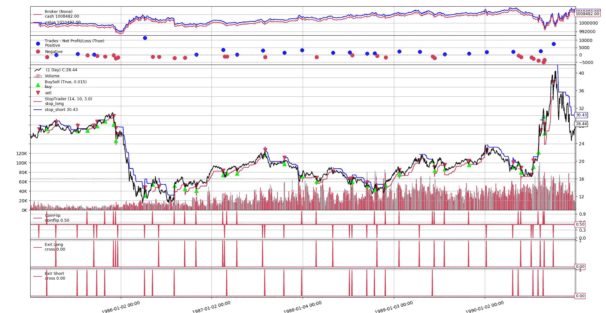
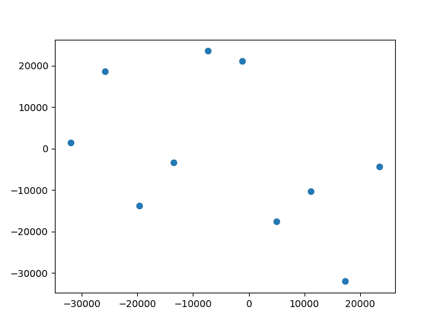

# 击败随机进入

> 原文： [https://www.backtrader.com/blog/2019-08-22-practical-backtesting-replication/practical-replication/](https://www.backtrader.com/blog/2019-08-22-practical-backtesting-replication/practical-replication/)

最近在[reddit/r/algotrading](https://www.reddit.com/r/algotrading/)*上有一些关于复制已发布的 algotrading 策略成功的帖子。第一*

 **   [我复制了 130 多篇关于“预测股市”的研究论文，从头开始对它们进行编码并记录结果。以下是我学到的](https://www.reddit.com/r/algotrading/comments/cr7jey/ive_reproduced_130_research_papers_about/)

     *由于已在此处删除，因此快速摘要：

    *   这些策略不起作用

    *   如果作者声称某个给定的策略由于阿尔法衰变而停止工作，那么测试是针对过去的数据进行的，但仍然不起作用

    *   底线：这一切都是矫揉造作，p-hacking 或者一个微小的 alpha，它不需要衰变，因为委员会已经破坏了 alpha。* 

 **Artem Kaznatcheev*在以下内容中编写了复制问题的副本：

*   [算法交易复制危机寓言](https://egtheory.wordpress.com/2019/08/17/algotrading-replication/)

 *然后：

*   [过盈](https://www.reddit.com/r/algotrading/comments/cv83yh/overfitting/)

 *前两个是理论性的（即使第一个提到已经实现了 130 个策略），其中*“过度拟合”*提供了实际代码。

有这么多的事情在进行，我们如何尝试用实际的方法复制一些已经发表但不是作为论文的东西，比如在*“过度拟合”*案例中。在一本著名的书中发表的东西。

目标：*“试图击败随机条目”*。这是本书第 8 章第 3 部分的一节：

*   [亚马逊-交易自由之路](https://www.amazon.com/Trade-Your-Way-Financial-Freedom/dp/007147871X)

**   [Van Tharp Institute-贸易自由之路](https://www.vantharp.com/trade-your-way-to-financial-freedom)* 

 **本书中介绍了一种参与交易的结构化方法，特别强调：**头寸规模**和头寸管理（即：何时实际退出交易）。这比很多人认为主要驱动程序的条目设置要重要得多。

在第 8 章中，Van K.Tharp 与*Tom Basso*交谈，并说：*“从你所说的话来看，只要你有良好的退出机会，并且明智地判断自己的仓位，你就可以通过随机进入持续赚钱。”*答案是*他可能*。

**规则**：

*   投币式入门
*   始终在市场中-多头或空头
*   发出退出信号后立即返回
*   市场的波动性由`Average True Range`的 10 天`Exponential Moving Average`决定
*   距收盘点 3 倍波动率的距离处的尾随止损
*   止损点只能向交易方向移动
*   固定股权（1 份合同）或 1%风险模型（本书第 12 章）

**结果**

*   针对 10 个市场进行测试
*   固定股权：80%的时间赚钱
*   1%风险模型：100%的时间都能赚钱
*   可靠性水平：38%（成功交易的百分比）

**缺失位**：

*   测试市场
*   测试周期

*   如果“始终在市场”意味着“今天”结束交易，然后“明天”重新进入，或者如果它意味着同时发出两个 a 和收盘/复盘指令。

    这实际上是最容易克服的。

对于最后两个项目，书中说，对话发生在 1991 年，使用了期货。公平地说，将使用 1991 年以前的期货数据。考虑到*10 天指数移动平均线*，还假设了 1 天价格条

最明显的问题似乎是正确的算法，但在这种情况下，这本书在描述简单算法和结果方面做得很好。为了完成它，让我们总结一下*第 12 章*中的*“百分比风险模型”*（本书中称为“模型 3”）。

*   `Maximal Loss`：限于账户价值的`x%`（即：风险百分比）

*   `Risk per Contract`：使用给定的算法，它将是初始停止距离（波动率的 3 倍）乘以未来的乘数

*   合同金额：`Maximal Loss / Risk Per Contract`

## 复制详细信息

**数据**

将使用 1985 年至 1990 年（即：6 整年）的`CL`（原油）期货数据。合同规范包含以下内容：

*   刻度大小：`0.01`（即：每点 100 个刻度）
*   每勾选成本：`$10`

考虑到这一点，我们将使用每`1 point`的`1000`乘数（100 个刻度/点 x 10 美元/刻度=1000 美元）

**佣金**

A`2.00`每次行程将使用每份合同的货币单位（类似 IB）

**部分实施细则**

抛硬币被建模为一个指示器，以便于可视化抛硬币发生的位置（例如，如果有多个条目朝着同一方向，这是随机性所期望的）

为了更好地可视化止损点及其移动方式，止损价格计算和逻辑也嵌入到指示器中。请注意，停止计算逻辑有两个不同的阶段

*   当交易开始时，止损价格必须设置在离收盘点的给定距离，与之前的止损价格无关

*   当交易运行时，如果可能，调整止损价格以跟随趋势。

**制图**

代码生成两种类型的图表

1.  包含单个测试运行（`--plot`选项）详细信息的图表。在运行单个迭代（`--iterations 1`时使用它最有意义

2.  显示运行损益的散点图。

#1 的样本

[](../test-run-chart.png)

10 次运行的#2 样本

[](../scatter-chart.png)

## 脚本的示例调用

**固定尺寸桩 1 的单次运行，并绘制**

```py
./vanktharp-coinflip.py --years 1985-1990 --fixedsize --sizer stake=1 --iterations 1 --plot

**** Iteration:    1
-- PNL: 10482.00
--   Trades 49 - Won 22 - %_Won: 0.45
**** Summary of Runs
-- Total       :        1
-- Won         :        1
-- % Won       : 1.00
**** Summary of Trades
-- Total       :       49
-- Total Won   :       22
-- % Total Won : 0.45 
```

**100 次运行，1%风险模型，10 次迭代和散点图**

（出于实用目的，缩短了输出）

```py
$ ./vanktharp-coinflip.py --years 1985-1990 --percrisk --sizer percrisk=0.01 --iterations 100 --scatter
**** Iteration:    1
-- PNL: -18218.00
--   Trades 60 - Won 24 - %_Won: 0.40
**** Iteration:    2
...
...
**** Iteration:  100
-- PNL: 111366.00
--   Trades 50 - Won 26 - %_Won: 0.52
**** Summary of Runs
-- Total       :      100
-- Won         :       50
-- % Won       : 0.50
**** Summary of Trades
-- Total       :     5504
-- Total Won   :     2284
-- % Total Won : 0.41 
```

## 试运行混合

进行了 10 次 100 次迭代的测试运行，混合了以下变量：

*   1%的固定规模股权或 1%的百分比风险模型

*   在同一条或连续条中执行进入/退出

# 结果摘要

*   平均而言，49%的跑步项目盈利。在测试运行中，固定规模保持在接近 50%的水平，百分比风险模型变化更大，测试运行得分最低为 39%的盈利运行，另一个得分最高为 65%的盈利运行（共 10 次）

*   平均而言，39%的交易是盈利的（小偏差）

回顾书中所说的：

*   当使用固定规模的 1%股权时，80%的盈利运行

*   采用 1%百分比风险模型的 100%盈利运行

*   38%的盈利交易

因此，似乎：

*   仅复制了最后一个项目。

## 结论

正如*Artem Kaznatcheev*所指出的，复制危机可能是由于：

*   使用错误的数据集

*   未能正确实现该算法

或者很可能是最初的实现没有遵循自己的规则，或者没有公布所有细节。

笔记

无论如何，我个人还是建议你读这本书。未能复制这一具体案例并不意味着这本书不是一本好的读物，也不意味着它展示了一种实用的交易方法。

## 全集

享受

**代码也可在**上找到：

*   [https://gist.github.com/mementum/364173371634b226120dc39708cd9610](https://gist.github.com/mementum/364173371634b226120dc39708cd9610)

```py
#!/usr/bin/env python
# -*- coding: utf-8; py-indent-offset:4 -*-
###############################################################################
# Copyright (C) 2019 Daniel Rodriguez - MIT License
#  - https://opensource.org/licenses/MIT
#  - https://en.wikipedia.org/wiki/MIT_License
###############################################################################
import argparse
import random

import pandas as pd

import backtrader as bt

def read_dataframe(filename, years):
    colnames = ['ticker', 'period', 'date', 'time',
                'open', 'high', 'low', 'close', 'volume', 'openinterest']

    colsused = ['date',
                'open', 'high', 'low', 'close', 'volume', 'openinterest']

    df = pd.read_csv(filename,
                     skiprows=1,  # using own column names, skip header
                     names=colnames,
                     usecols=colsused,
                     parse_dates=['date'],
                     index_col='date')

    if years:  # year or year range specified
        ysplit = years.split('-')

        # left side limit
        mask = df.index >= ((ysplit[0] or '0001') + '-01-01')  # support -YYYY

        # right side liit
        if len(ysplit) > 1:  # multiple or open ended (YYYY-ZZZZ or YYYY-)
            if ysplit[1]:  # open ended if not years[1] (YYYY- format)
                mask &= df.index <= (ysplit[1] + '-12-31')
        else:  # single year specified YYYY
            mask &= df.index <= (ysplit[0] + '-12-31')

        df = df.loc[mask]  # select the given date range

    return df

# DEFAULTS - CAN BE CHANGED VIA COMMAND LINE OPTIONS
COMMINFO_DEFAULT = dict(
    stocklike=False,  # Futures-like
    commtype=bt.CommissionInfo.COMM_FIXED,  # fixed price per asset
    commission=2.0,  # Standard IB Price for futures
    mult=1000.0,  # multiplier
    margin=2000.0,  # $50 x 50 => $2500
)

class PercentRiskSizer(bt.Sizer):
    '''Sizer modeling the Percentage Risk sizing model of Van K. Tharp'''
    params = dict(percrisk=0.01)  # 1% percentage risk

    def _getsizing(self, comminfo, cash, data, isbuy):
        # Risk per 1 contract
        risk = comminfo.p.mult * self.strategy.stoptrailer.stop_dist[0]
        # % of account value to risk
        torisk = self.broker.get_value() * self.p.percrisk
        return torisk // risk  # size to risk

class CoinFlip(bt.Indicator):
    lines = ('coinflip',)
    HEAD, TAIL = 1, 0

    def next(self):
        self.l.coinflip[0] = 0.5  # midway
        pass

    def flip(self):
        # self.l.coinflip[0] = cf = random.randrage(-1, 2, 2)  # -1 or 1
        self.l.coinflip[0] = cf = random.randint(0, 1)
        return cf

    def head(self, val=None):
        if val is None:
            return self.lines[0] == self.HEAD

        return val == self.HEAD

class StopTrailer(bt.Indicator):
    _nextforce = True  # force system into step by step calcs

    lines = ('stop_long', 'stop_short',)
    plotinfo = dict(subplot=False, plotlinelabels=True)

    params = dict(
        atrperiod=14,
        emaperiod=10,
        stopfactor=3.0,
    )

    def __init__(self):
        self.strat = self._owner  # alias for clarity

        # Volatility which determines stop distance
        atr = bt.ind.ATR(self.data, period=self.p.atrperiod)
        emaatr = bt.ind.EMA(atr, period=self.p.emaperiod)
        self.stop_dist = emaatr * self.p.stopfactor

        # Running stop price calc, applied in next according to market pos
        self.s_l = self.data - self.stop_dist
        self.s_s = self.data + self.stop_dist

    def next(self):
        # When entering the market, the stop has to be set
        if self.strat.entering > 0:  # entering long
            self.l.stop_long[0] = self.s_l[0]
        elif self.strat.entering < 0:  # entering short
            self.l.stop_short[0] = self.s_s[0]

        else:  # In the market, adjust stop only in the direction of the trade
            if self.strat.position.size > 0:
                self.l.stop_long[0] = max(self.s_l[0], self.l.stop_long[-1])
            elif self.strat.position.size < 0:
                self.l.stop_short[0] = min(self.s_s[0], self.l.stop_short[-1])

class St1(bt.Strategy):
    SHORT, NONE, LONG = -1, 0, 1

    params = dict(
        atrperiod=14,  # measure volatility over x days
        emaperiod=10,  # smooth out period for atr volatility
        stopfactor=3.0,  # actual stop distance for smoothed atr
        verbose=False,  # print out debug info
        samebar=True,  # close and re-open on samebar
    )

    def __init__(self):
        self.coinflip = CoinFlip()

        # Trailing Stop Indicator
        self.stoptrailer = st = StopTrailer(atrperiod=self.p.atrperiod,
                                            emaperiod=self.p.emaperiod,
                                            stopfactor=self.p.stopfactor)

        # Exit Criteria (Stop Trail) for long / short positions
        self.exit_long = bt.ind.CrossDown(self.data,
                                          st.stop_long, plotname='Exit Long')
        self.exit_short = bt.ind.CrossUp(self.data,
                                         st.stop_short, plotname='Exit Short')

    def start(self):
        self.entering = 0
        self.start_val = self.broker.get_value()

    def stop(self):
        self.stop_val = self.broker.get_value()
        self.pnl_val = self.stop_val - self.start_val
        self.log('Start Value: {:.2f}', self.start_val)
        self.log('Final Value: {:.2f}', self.stop_val)
        self.log('PNL   Value: {:.2f}', self.pnl_val)

    def notify_trade(self, trade):
        if trade.size > 0:
            self.log('Long  Entry at: {:.2f}', trade.price)
        elif trade.size < 0:
            self.log('Short Entry at: {:.2f}', trade.price)
        else:  # not trade.size - trade is over
            self.log('Trade PNL: {:.2f}', trade.pnlcomm)

    def next(self):
        self.logdata()

        # logic
        closing = None
        if self.position.size > 0:  # In the market - Long
            self.log('Long Stop Price: {:.2f}', self.stoptrailer.stop_long[0])
            if self.exit_long:
                closing = self.close()

        elif self.position.size < 0:  # In the market - Short
            self.log('Short Stop Price {:.2f}', self.stoptrailer.stop_short[0])
            if self.exit_short:
                closing = self.close()

        self.entering = self.NONE
        if not self.position or (closing and self.p.samebar):
            # Not in the market or closing pos and reenter in samebar
            if self.coinflip.flip():
                self.entering = self.LONG if self.buy() else self.NONE
            else:
                self.entering = self.SHORT if self.sell() else self.NONE

    def logdata(self):
        if self.p.verbose:  # logging
            txt = []
            txt += ['{:.2f}'.format(self.position.size)]
            txt += ['{:.2f}'.format(self.data.open[0])]
            txt += ['{:.2f}'.format(self.data.high[0])]
            txt += ['{:.2f}'.format(self.data.low[0])]
            txt += ['{:.2f}'.format(self.data.close[0])]
            self.log(','.join(txt))

    def log(self, txt, *args):
        if self.p.verbose:
            out = [self.datetime.date().isoformat(), txt.format(*args)]
            print(','.join(out))

def runstrat(args):
    cerebro = bt.Cerebro()

    # Data feed kwargs
    dataargs = dict(dataname=read_dataframe(args.data, args.years))
    dataargs.update(eval('dict(' + args.dargs + ')'))
    cerebro.adddata(bt.feeds.PandasData(**dataargs))

    # Strategy
    cerebro.addstrategy(St1, **eval('dict(' + args.strat + ')'))

    # Broker
    brokerargs = dict(cash=args.cash)
    brokerargs.update(eval('dict(' + args.broker + ')'))
    cerebro.broker = bt.brokers.BackBroker(**brokerargs)

    # Commission
    commargs = COMMINFO_DEFAULT
    commargs.update(eval('dict(' + args.commission + ')'))
    cerebro.broker.setcommission(**commargs)

    # Sizer
    szcls = PercentRiskSizer if args.percrisk else bt.sizers.FixedSize
    cerebro.addsizer(szcls, **(eval('dict(' + args.sizer + ')')))

    # Analyze the trades
    cerebro.addanalyzer(bt.analyzers.TradeAnalyzer, _name='trades')

    # Execute
    strats = cerebro.run(**eval('dict(' + args.cerebro + ')'))

    if args.plot:  # Plot if requested to
        cerebro.plot(**eval('dict(' + args.plot + ')'))

    return strats[0]

def run(args=None):
    args = parse_args(args)

    results = []
    sum_won_trades = 0
    sum_total_trades = 0

    for i in range(0, args.iterations):
        strat = runstrat(args)
        pnl = strat.pnl_val
        results.append(pnl)
        trades = strat.analyzers.trades.get_analysis()

        print('**** Iteration: {:4d}'.format(i + 1))
        print('-- PNL: {:.2f}'.format(pnl))
        total_trades = trades.total.closed
        total_won = trades.won.total
        perc_won = total_won / total_trades
        print('--   Trades {} - Won {} - %_Won: {:.2f}'.format(
            total_trades, total_won, perc_won))

        sum_won_trades += total_won
        sum_total_trades += total_trades

    total = len(results)
    won = sum(1 for x in results if x > 0)
    print('**** Summary of Runs')
    print('-- Total       : {:8d}'.format(total))
    print('-- Won         : {:8d}'.format(won))
    print('-- % Won       : {:.2f}'.format(won / total))

    perc_won = sum_won_trades / sum_total_trades
    print('**** Summary of Trades')
    print('-- Total       : {:8d}'.format(sum_total_trades))
    print('-- Total Won   : {:8d}'.format(sum_won_trades))
    print('-- % Total Won : {:.2f}'.format(perc_won))

    if args.scatter:
        import numpy as np
        import matplotlib.pyplot as plt
        x = np.linspace(min(results), max(results), num=len(results))
        y = np.asarray(results)
        plt.scatter(x, y)
        plt.show()

def parse_args(pargs=None):
    parser = argparse.ArgumentParser(
        formatter_class=argparse.ArgumentDefaultsHelpFormatter,
        description='Van K. Tharp/Basso Random Entry Scenario',
    )

    parser.add_argument('--iterations', default=1, type=int,
                        help='Number of iterations to run the system')

    pgroup = parser.add_argument_group(title='Data Options')
    pgroup.add_argument('--data', default='cl-day-001.txt',
                        help='Data to read in')

    pgroup.add_argument('--years', default='',
                        help='Formats: YYYY-ZZZZ / YYYY / YYYY- / -ZZZZ')

    parser.add_argument('--dargs', required=False, default='',
                        metavar='kwargs', help='kwargs in key=value format')

    pgroup = parser.add_argument_group(title='Cerebro Arguments')
    pgroup.add_argument('--cerebro', default='', metavar='kwargs',
                        help='Cerebro kwargs in key=value format')

    pgroup = parser.add_argument_group(title='Commission Arguments')
    pgroup.add_argument('--commission', default=str(COMMINFO_DEFAULT),
                        metavar='kwargs',
                        help='CommInfo kwargs in key=value format')

    pgroup = parser.add_argument_group(title='Broker Arguments')
    pgroup.add_argument('--broker', default='', metavar='kwargs',
                        help='Broker kwargs in key=value format')

    pgroup.add_argument('--cash', default=1000000.0, type=float,
                        help='Default cash')

    pgroup = parser.add_argument_group(title='Strategy Arguments')
    pgroup.add_argument('--strat', default='', metavar='kwargs',
                        help='Strategy kwargs in key=value format')

    pgroup = parser.add_argument_group(title='Sizer Options')
    pgroup.add_argument('--sizer', default='', metavar='kwargs',
                        help='Sizer kwargs in key=value format')

    pgroup = pgroup.add_mutually_exclusive_group()
    pgroup.add_argument('--percrisk', action='store_true',
                        help='Use Percrisk Sizer')

    pgroup.add_argument('--fixedsize', action='store_true',
                        help='Use Fixed Statke Sizer')

    pgroup = parser.add_argument_group(title='Plotting Options')
    pgroup.add_argument('--plot', default='', nargs='?', const='{}',
                        metavar='kwargs', help='kwargs in key=value format')

    pgroup.add_argument('--scatter', action='store_true',
                        help='Plot a scatter diagram of PNL results')

    return parser.parse_args(pargs)

if __name__ == '__main__':
    run() 
```******