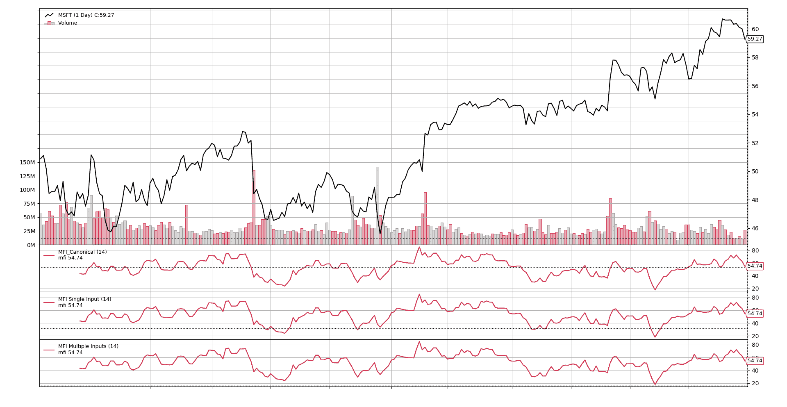
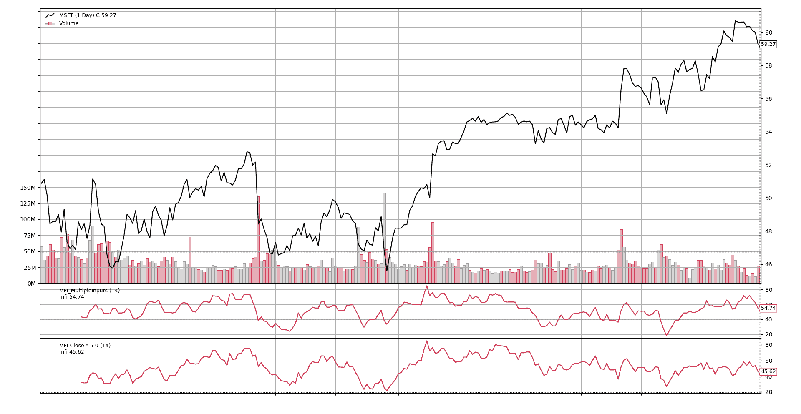

# MFI 通用

> 原文： [https://www.backtrader.com/blog/2019-07-17-mfi-generic/mfi-generic/](https://www.backtrader.com/blog/2019-07-17-mfi-generic/mfi-generic/)

在最近的[规范与非规范](../../2019-07-08-canonical-or-not/canonical-or-not/)帖子中，开发了`MFI`（又名`MoneyFlowIndicator`）。

虽然它是以*规范*的方式开发的，但它仍然提供了一些改进和通用化的空间。

让我们关注实现的 1<sup>st</sup>行，这些行创建了典型的价格

<input name="__tabs_1" type="radio" id="__tab_1_0" checked="checked"> <label for="__tab_1_0">Canonical MFI - Typical Price and Raw Money Flow</label>

```py
class MFI_Canonical(bt.Indicator):
    lines = ('mfi',)
    params = dict(period=14)

    def __init__(self):
        tprice = (self.data.close + self.data.low + self.data.high) / 3.0
        mfraw = tprice * self.data.volume
        ... 
```

典型的实例化如下所示

<input name="__tabs_2" type="radio" id="__tab_2_0" checked="checked"> <label for="__tab_2_0">MFI Typical Instantiation</label>

```py
class MyMFIStrategy(bt.Strategy):

    def __init__(self):
        mfi = bt.MFI_Canonical(self.data) 
```

这里的问题应该是显而易见的：*“需要为具有`close`、`low`、`high`和`volume`组件（即*反向交易者*生态系统中的 aka*行*）的指标输入。”*

当然，在这种情况下，人们可能希望使用来自不同数据源的组件（来自数据提要的行或来自其他指标的行）创建一个`MoneyFlowIndicator`，就像希望赋予`close`更多的权重一样简单，而无需开发特定指标。考虑到行业标准`OHLCV`字段排序、`close`的多个输入、额外重量，实例化可能如下所示

<input name="__tabs_3" type="radio" id="__tab_3_0" checked="checked"> <label for="__tab_3_0">MFI Multiple Inputs Instantiation</label>

```py
class MyMFIStrategy2(bt.Strategy):

    def __init__(self):
        wclose = self.data.close * 5.0
        mfi = bt.MFI_Canonical(self.data.high, self.data.low,
                               wclose, self.data.volume) 
```

或者是因为用户以前使用过`ta-lib`并且喜欢多输入风格。

## 支持多输入

*backtrader*试图尽可能成为*pythonic*，可以查询包含系统中数据馈送列表的`self.datas`数组（该数组自动神奇地提供给您的策略）的长度。让我们用这个来区分调用方想要什么，并正确计算`tprice`和`mfraw`

<input name="__tabs_4" type="radio" id="__tab_4_0" checked="checked"> <label for="__tab_4_0">MFI - Multiple Inputs using len</label>

```py
class MFI_MultipleInputs(bt.Indicator):
    lines = ('mfi',)
    params = dict(period=14)

    def __init__(self):
        if len(self.datas) == 1:
            # 1 data feed passed, must have components
            tprice = (self.data.close + self.data.low + self.data.high) / 3.0
            mfraw = tprice * self.data.volume
        else:
            # if more than 1 data feed, individual components in OHLCV order
            tprice = (self.data0 + self.data1 + self.data2) / 3.0
            mfraw = tprice * self.data3

        # No changes with regards to previous implementation
        flowpos = bt.ind.SumN(mfraw * (tprice > tprice(-1)), period=self.p.period)
        flowneg = bt.ind.SumN(mfraw * (tprice < tprice(-1)), period=self.p.period)

        mfiratio = bt.ind.DivByZero(flowpos, flowneg, zero=100.0)
        self.l.mfi = 100.0 - 100.0 / (1.0 + mfiratio) 
```

* * *

**注**

注意单个组件是如何被引用为`self.dataX`（例如`self.data0`、`self.data1`）

这与在`self.datas[0]`中使用`self.datas[x]`相同。。。

* * *

让我们以图形的方式来看，该指示器产生的结果与*规范*指示器相同，并且当多个输入对应于数据馈送的原始组件时，产生的结果相同。要做到这一点，它将在这样一种策略中运行

<input name="__tabs_5" type="radio" id="__tab_5_0" checked="checked"> <label for="__tab_5_0">MFI - Results Check</label>

```py
class MyMFIStrategy2(bt.Strategy):

    def __init__(self):
        MFI_Canonical(self.data)
        MFI_MultipleInputs(self.data, plotname='MFI Single Input')
        MFI_MultipleInputs(self.data.high,
                           self.data.low,
                           self.data.close,
                           self.data.volume,
                           plotname='MFI Multiple Inputs') 
```

[](../mfi-results-check.png)

在不必检查每个值的情况下，从图中可以明显看出，这三个值的结果是相同的。

最后让我们看看如果在`close`上施加更多的重量会发生什么。我们就这样跑吧。

<input name="__tabs_6" type="radio" id="__tab_6_0" checked="checked"> <label for="__tab_6_0">MFI - 5 x Close</label>

```py
class MyMFIStrategy2(bt.Strategy):
    def __init__(self):

        MFI_MultipleInputs(self.data)
        MFI_MultipleInputs(self.data.high,
                           self.data.low,
                           self.data.close * 5.0,
                           self.data.volume,
                           plotname='MFI Close * 5.0') 
```

[](../mfi-5xclose.png)

这是否有意义取决于读者，但我们可以清楚地看到，增加`close`的权重改变了模式。

## 结论

通过简单地使用 pythonic`len`，可以将使用多个组件（和固定名称）的数据馈送的指示器转换为接受多个通用输入的指示器。