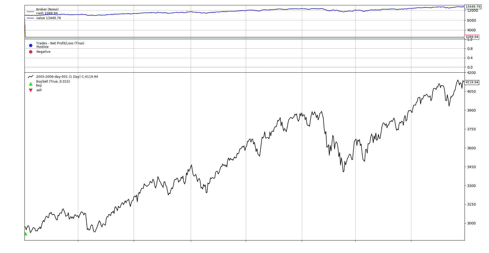
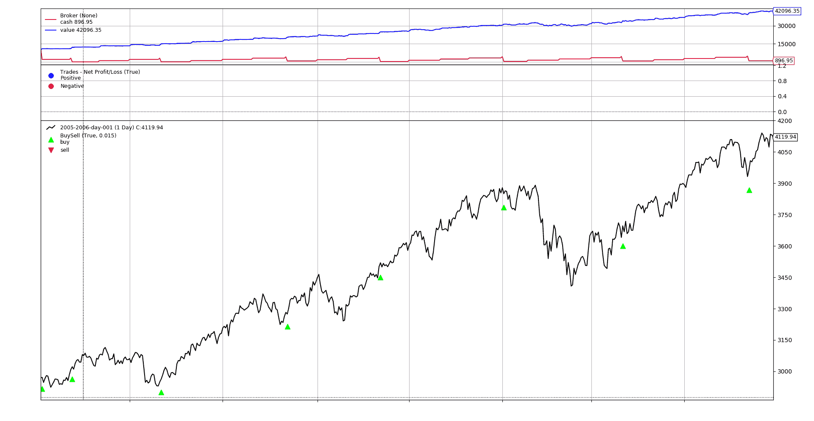
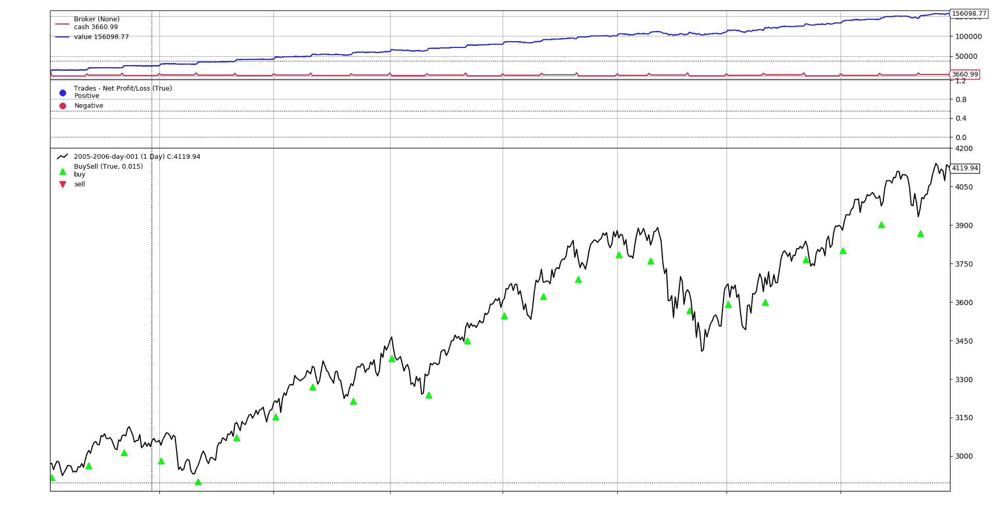

# 用反向交易者买入并持有

> 原文： [https://www.backtrader.com/blog/2019-06-13-buy-and-hold/buy-and-hold/](https://www.backtrader.com/blog/2019-06-13-buy-and-hold/buy-and-hold/)

这有时是用于测试给定策略性能的基线之一，即：*“如果精心编制的逻辑无法击败简单的买入和持有方法，则该策略可能一文不值”*

一个简单的*“买入并持有”*策略，只需使用第一个输入数据点买入，并查看最后一个数据点的投资组合价值。

提示

下面的代码片段放弃了导入和设置样板。最后提供了完整的脚本。

## 近距离欺骗

在许多情况下，像*买入并持有*这样的方法并不意味着产生订单执行和价格匹配的精确复制。它是关于评估大量数据的。这就是为什么*反向交易者*中的违约经纪人`cheat-on-close`模式将被激活。这意味着

*   由于只会发出`Market`订单，因此将按照当前`close`价格执行。

*   考虑到当交易逻辑（在本例中为`close`提供价格时，该价格**已**消失。它可能在一段时间内可用，也可能在一段时间内不可用，实际上无法保证针对它执行。

## 买了就忘了

<input name="__tabs_1" type="radio" id="__tab_1_0" checked="checked"> <label for="__tab_1_0">buy method</label>

```py
class BuyAndHold_1(bt.Strategy):
    def start(self):
        self.val_start = self.broker.get_cash()  # keep the starting cash

    def nextstart(self):
        # Buy all the available cash
        size = int(self.broker.get_cash() / self.data)
        self.buy(size=size)

    def stop(self):
        # calculate the actual returns
        self.roi = (self.broker.get_value() / self.val_start) - 1.0
        print('ROI:        {:.2f}%'.format(100.0 * self.roi)) 
```

<input name="__tabs_1" type="radio" id="__tab_1_1"> <label for="__tab_1_1">order_target method</label>

```py
class BuyAndHold_1(bt.Strategy):
    def start(self):
        self.val_start = self.broker.get_cash()  # keep the starting cash

    def nextstart(self):
        # Buy all the available cash
        self.order_target_value(target=self.broker.get_cash())

    def stop(self):
        # calculate the actual returns
        self.roi = (self.broker.get_value() / self.val_start) - 1.0
        print('ROI:        {:.2f}%'.format(100.0 * self.roi)) 
```

这里发生了以下情况：

*   一项进入市场的单一长期操作正在发布。或者

    *   `buy`和`size`的手动计算

        所有可用的`cash`用于购买固定数量的资产单位。请注意，它被截断为一个`int`。这适用于*股票*、*期货*等。

    或

    *   `order_target_value`并让系统知道我们想要使用所有的现金。该方法将负责自动计算大小。
*   在`start`方法中，初始金额的现金被保存

*   在`stop`方法中，使用投资组合的现值和初始现金金额计算收益

笔记

在*反向交易者*中，当数据/指标缓冲区可以传递时，`nextstart`方法被精确地调用一次**。默认行为是将工作委托给`next`。但因为我们想购买一次**并使用**第一个**可用数据，所以这是正确的购买点。

提示

由于只考虑了**1**数据馈送，因此无需指定目标数据馈送。系统中的第一个（也是唯一一个）数据馈送将用作目标。

如果存在多个数据馈送，则可以使用命名参数`data`选择目标，如中所示

```py
 self.buy(data=the_desired_data, size=calculated_size) 
```

下面的示例脚本可以按如下方式执行

<input name="__tabs_2" type="radio" id="__tab_2_0" checked="checked"> <label for="__tab_2_0">buy</label>

```py
$ ./buy-and-hold.py --bh-buy --plot
ROI:        34.50% 
```

<input name="__tabs_2" type="radio" id="__tab_2_1"> <label for="__tab_2_1">order_target</label>

```py
$ ./buy-and-hold.py --bh-target --plot
ROI:        34.50% 
```

两者的图形输出相同

[](../buyandhold.png)

## 再买再买

但是一个真正的普通人通常有一份*天的工作*，并且每个月都可以向股市投入大量资金。这个人不受趋势、技术分析等的困扰。唯一真正关心的是在每月的 1<sup>st</sup>日将资金投入市场。

罗马人给我们留下了一个日历，日历上的月份在天数上有所不同（`28`、`29`、`30`、`31`），考虑到非交易日，我们不能确定使用以下简单方法：

*   购买每个**X**天

需要使用一种方法来识别当月的**第一个交易日**。这可以通过*反向交易者*中的**计时器**完成

笔记

下面的示例中仅使用`order_target_value`方法。

<input name="__tabs_3" type="radio" id="__tab_3_0" checked="checked"> <label for="__tab_3_0">Buy and Buy More - order_target method</label>

```py
class BuyAndHold_More(bt.Strategy):
    params = dict(
        monthly_cash=1000.0,  # amount of cash to buy every month
    )

    def start(self):
        self.cash_start = self.broker.get_cash()
        self.val_start = 100.0

        # Add a timer which will be called on the 1st trading day of the month
        self.add_timer(
            bt.timer.SESSION_END,  # when it will be called
            monthdays=[1],  # called on the 1st day of the month
            monthcarry=True,  # called on the 2nd day if the 1st is holiday
        )

    def notify_timer(self, timer, when, *args, **kwargs):
        # Add the influx of monthly cash to the broker
        self.broker.add_cash(self.p.monthly_cash)

        # buy available cash
        target_value = self.broker.get_value() + self.p.monthly_cash
        self.order_target_value(target=target_value)

    def stop(self):
        # calculate the actual returns
        self.roi = (self.broker.get_value() / self.cash_start) - 1.0
        print('ROI:        {:.2f}%'.format(self.roi)) 
```

在`start`阶段，添加了一个计时器

```py
 # Add a timer which will be called on the 1st trading day of the month
        self.add_timer(
            bt.timer.SESSION_END,  # when it will be called
            monthdays=[1],  # called on the 1st day of the month
            monthcarry=True,  # called on the 2nd day if the 1st is holiday
        ) 
```

*   将在会话结束时调用的计时器（`bt.timer.SESSION_END`

    笔记

    对于日常酒吧来说，这显然是不相关的，因为整个酒吧都是一次性交付的。

*   计时器只列出一个月中必须调用计时器的日期`1`

*   如果`1`日恰好是非交易日，`monthcarry=True`确保计时器仍将在当月的第一个交易日调用。

在`notify_timer`方法期间接收到的计时器，被覆盖以执行市场操作。

```py
 def notify_timer(self, timer, when, *args, **kwargs):
        # Add the influx of monthly cash to the broker
        self.broker.add_cash(self.p.monthly_cash)

        # buy available cash
        target_value = self.broker.get_value() + self.p.monthly_cash
        self.order_target_value(target=target_value) 
```

提示

请注意，购买的不是**月现金**流入，而是**账户**的总价值，包括当前投资组合，再加上我们增加的资金。原因

*   可能需要消耗一些初始现金

*   每月的运营可能不会消耗所有的现金，因为一个月可能不足以购买股票，而且收购股票后会有一段时间休息

    在我们的示例中，实际上是这样的，因为默认的每月现金流入量为`1000`，并且资产的价值超过`3000`

*   如果目标是可用现金，这可能小于实际价值

处决

<input name="__tabs_4" type="radio" id="__tab_4_0" checked="checked"> <label for="__tab_4_0">Execution with default 1000 money units</label>

```py
$ ./buy-and-hold.py --bh-more --plot
ROI:        320.96% 
```

<input name="__tabs_4" type="radio" id="__tab_4_1"> <label for="__tab_4_1">Execution with default 5000 money units</label>

```py
$ ./buy-and-hold.py --bh-more --strat monthly_cash=5000.0
ROI:        1460.99% 
```

**起泡的藤壶！！！**默认`1000`货币单位的`ROI`为`320.96%`，而`5000`货币单位的`ROI`更高`1460.99%`。我们可能发现了一台印钞机。。。

*   *我们每个月增加的钱越多。。。我们赢的越多。。。不管市场做什么。*

当然不是。。。

*   `stop`期间`self.roi`中存储的计算**不再有效。只需向经纪人简单地增加现金，就可以改变规模（即使这笔钱没有用于任何用途，也可以算作增量）**

1000 货币单位的图形输出

[](../buyandholdmore-1000.png)

请注意市场中实际操作之间的间隔，因为`1000`货币单位不足以购买`1`单位的资产，必须累积货币，直到操作成功。

5000 货币单位的图形输出

[](../buyandholdmore-5000.png)

在这种情况下，`5000`货币单位始终可以购买`1`单位的资产，并且每个月都会进行市场操作。

## *购买和购买更多*的绩效跟踪

如上所述，当系统中增加（有时从中取出）资金时，必须以不同的方式衡量性能。没有必要发明任何东西，因为它是很久以前发明的，它是为*基金管理*所做的。

*   设置`perf_value`作为跟踪绩效的参考。通常情况下，这将`100`

*   使用该绩效值和现金初始金额，计算出一个数字`shares`，即：`shares = cash / perf_value`

*   无论何时向系统中添加或从系统中删除现金，`shares`的数量都会发生变化，但`perf_value`保持不变。

*   现金有时会进行投资，每日的`value`会更新为`perf_value = portfolio_value / shares`中的内容

通过这种方法，可以计算实际性能，并且与系统中的现金添加/提取无关。

幸运的是，*反向交易者*已经可以自动完成所有这些。

<input name="__tabs_5" type="radio" id="__tab_5_0" checked="checked"> <label for="__tab_5_0">Buy and Buy More - order_target method</label>

```py
class BuyAndHold_More_Fund(bt.Strategy):
    params = dict(
        monthly_cash=1000.0,  # amount of cash to buy every month
    )

    def start(self):
        # Activate the fund mode and set the default value at 100
        self.broker.set_fundmode(fundmode=True, fundstartval=100.00)

        self.cash_start = self.broker.get_cash()
        self.val_start = 100.0

        # Add a timer which will be called on the 1st trading day of the month
        self.add_timer(
            bt.timer.SESSION_END,  # when it will be called
            monthdays=[1],  # called on the 1st day of the month
            monthcarry=True,  # called on the 2nd day if the 1st is holiday
        )

    def notify_timer(self, timer, when, *args, **kwargs):
        # Add the influx of monthly cash to the broker
        self.broker.add_cash(self.p.monthly_cash)

        # buy available cash
        target_value = self.broker.get_value() + self.p.monthly_cash
        self.order_target_value(target=target_value)

    def stop(self):
        # calculate the actual returns
        self.roi = (self.broker.get_value() - self.cash_start) - 1.0
        self.froi = self.broker.get_fundvalue() - self.val_start
        print('ROI:        {:.2f}%'.format(self.roi))
        print('Fund Value: {:.2f}%'.format(self.froi)) 
```

在`start`期间

*   资金模式被激活，默认启动值为`100.0`

    ```py
     def start(self):
            # Activate the fund mode and set the default value at 100
            self.broker.set_fundmode(fundmode=True, fundstartval=100.00) 
    ```

在`stop`期间

*   资金`ROI`已计算。因为起始值为`100.0`，所以操作比较简单

    ```py
     def stop(self):
            # calculate the actual returns
            ...
            self.froi = self.broker.get_fundvalue() - self.val_start 
    ```

行刑

```py
$ ./buy-and-hold.py --bh-more-fund --strat monthly_cash=5000 --plot
ROI:        1460.99%
Fund Value: 37.31% 
```

在这种情况下：

*   同样令人难以置信的平原`ROI`已经实现，即`1460.99%`

*   考虑到样本数据，将其视为*基金*时的实际`ROI`更为温和和现实`37.31%`。

笔记

输出图表与上一次执行相同，使用`5000`货币单位。

## 示例脚本

<input name="__tabs_6" type="radio" id="__tab_6_0" checked="checked"> <label for="__tab_6_0">Source Code</label>

```py
import argparse
import datetime

import backtrader as bt

class BuyAndHold_Buy(bt.Strategy):
    def start(self):
        self.val_start = self.broker.get_cash()  # keep the starting cash

    def nextstart(self):
        # Buy all the available cash
        size = int(self.broker.get_cash() / self.data)
        self.buy(size=size)

    def stop(self):
        # calculate the actual returns
        self.roi = (self.broker.get_value() / self.val_start) - 1.0
        print('ROI:        {:.2f}%'.format(100.0 * self.roi))

class BuyAndHold_Target(bt.Strategy):
    def start(self):
        self.val_start = self.broker.get_cash()  # keep the starting cash

    def nextstart(self):
        # Buy all the available cash
        size = int(self.broker.get_cash() / self.data)
        self.buy(size=size)

    def stop(self):
        # calculate the actual returns
        self.roi = (self.broker.get_value() / self.val_start) - 1.0
        print('ROI:        {:.2f}%'.format(100.0 * self.roi))

class BuyAndHold_More(bt.Strategy):
    params = dict(
        monthly_cash=1000.0,  # amount of cash to buy every month
    )

    def start(self):
        self.cash_start = self.broker.get_cash()
        self.val_start = 100.0

        # Add a timer which will be called on the 1st trading day of the month
        self.add_timer(
            bt.timer.SESSION_END,  # when it will be called
            monthdays=[1],  # called on the 1st day of the month
            monthcarry=True,  # called on the 2nd day if the 1st is holiday
        )

    def notify_timer(self, timer, when, *args, **kwargs):
        # Add the influx of monthly cash to the broker
        self.broker.add_cash(self.p.monthly_cash)

        # buy available cash
        target_value = self.broker.get_value() + self.p.monthly_cash
        self.order_target_value(target=target_value)

    def stop(self):
        # calculate the actual returns
        self.roi = (self.broker.get_value() / self.cash_start) - 1.0
        print('ROI:        {:.2f}%'.format(100.0 * self.roi))

class BuyAndHold_More_Fund(bt.Strategy):
    params = dict(
        monthly_cash=1000.0,  # amount of cash to buy every month
    )

    def start(self):
        # Activate the fund mode and set the default value at 100
        self.broker.set_fundmode(fundmode=True, fundstartval=100.00)

        self.cash_start = self.broker.get_cash()
        self.val_start = 100.0

        # Add a timer which will be called on the 1st trading day of the month
        self.add_timer(
            bt.timer.SESSION_END,  # when it will be called
            monthdays=[1],  # called on the 1st day of the month
            monthcarry=True,  # called on the 2nd day if the 1st is holiday
        )

    def notify_timer(self, timer, when, *args, **kwargs):
        # Add the influx of monthly cash to the broker
        self.broker.add_cash(self.p.monthly_cash)

        # buy available cash
        target_value = self.broker.get_value() + self.p.monthly_cash
        self.order_target_value(target=target_value)

    def stop(self):
        # calculate the actual returns
        self.roi = (self.broker.get_value() / self.cash_start) - 1.0
        self.froi = self.broker.get_fundvalue() - self.val_start
        print('ROI:        {:.2f}%'.format(100.0 * self.roi))
        print('Fund Value: {:.2f}%'.format(self.froi))

def run(args=None):
    args = parse_args(args)

    cerebro = bt.Cerebro()

    # Data feed kwargs
    kwargs = dict(**eval('dict(' + args.dargs + ')'))

    # Parse from/to-date
    dtfmt, tmfmt = '%Y-%m-%d', 'T%H:%M:%S'
    for a, d in ((getattr(args, x), x) for x in ['fromdate', 'todate']):
        if a:
            strpfmt = dtfmt + tmfmt * ('T' in a)
            kwargs[d] = datetime.datetime.strptime(a, strpfmt)

    data = bt.feeds.BacktraderCSVData(dataname=args.data, **kwargs)
    cerebro.adddata(data)

    # Strategy
    if args.bh_buy:
        stclass = BuyAndHold_Buy
    elif args.bh_target:
        stclass = BuyAndHold_Target
    elif args.bh_more:
        stclass = BuyAndHold_More
    elif args.bh_more_fund:
        stclass = BuyAndHold_More_Fund

    cerebro.addstrategy(stclass, **eval('dict(' + args.strat + ')'))

    # Broker
    broker_kwargs = dict(coc=True)  # default is cheat-on-close active
    broker_kwargs.update(eval('dict(' + args.broker + ')'))
    cerebro.broker = bt.brokers.BackBroker(**broker_kwargs)

    # Sizer
    cerebro.addsizer(bt.sizers.FixedSize, **eval('dict(' + args.sizer + ')'))

    # Execute
    cerebro.run(**eval('dict(' + args.cerebro + ')'))

    if args.plot:  # Plot if requested to
        cerebro.plot(**eval('dict(' + args.plot + ')'))

def parse_args(pargs=None):
    parser = argparse.ArgumentParser(
        formatter_class=argparse.ArgumentDefaultsHelpFormatter,
        description=(
            'Backtrader Basic Script'
        )
    )

    parser.add_argument('--data', default='../../datas/2005-2006-day-001.txt',
                        required=False, help='Data to read in')

    parser.add_argument('--dargs', required=False, default='',
                        metavar='kwargs', help='kwargs in key=value format')

    # Defaults for dates
    parser.add_argument('--fromdate', required=False, default='',
                        help='Date[time] in YYYY-MM-DD[THH:MM:SS] format')

    parser.add_argument('--todate', required=False, default='',
                        help='Date[time] in YYYY-MM-DD[THH:MM:SS] format')

    parser.add_argument('--cerebro', required=False, default='',
                        metavar='kwargs', help='kwargs in key=value format')

    parser.add_argument('--broker', required=False, default='',
                        metavar='kwargs', help='kwargs in key=value format')

    parser.add_argument('--sizer', required=False, default='',
                        metavar='kwargs', help='kwargs in key=value format')

    parser.add_argument('--strat', '--strategy', required=False, default='',
                        metavar='kwargs', help='kwargs in key=value format')

    parser.add_argument('--plot', required=False, default='',
                        nargs='?', const='{}',
                        metavar='kwargs', help='kwargs in key=value format')

    pgroup = parser.add_mutually_exclusive_group(required=True)
    pgroup.add_argument('--bh-buy', required=False, action='store_true',
                        help='Buy and Hold with buy method')

    pgroup.add_argument('--bh-target', required=False, action='store_true',
                        help='Buy and Hold with order_target method')

    pgroup.add_argument('--bh-more', required=False, action='store_true',
                        help='Buy and Hold More')

    pgroup.add_argument('--bh-more-fund', required=False, action='store_true',
                        help='Buy and Hold More with Fund ROI')

    return parser.parse_args(pargs)

if __name__ == '__main__':
    run() 
```

<input name="__tabs_6" type="radio" id="__tab_6_1"> <label for="__tab_6_1">Usage Help</label>

```py
$ ./buy-and-hold.py --help
usage: buy-and-hold.py [-h] [--data DATA] [--dargs kwargs]
                       [--fromdate FROMDATE] [--todate TODATE]
                       [--cerebro kwargs] [--broker kwargs] [--sizer kwargs]
                       [--strat kwargs] [--plot [kwargs]]
                       (--bh-buy | --bh-target | --bh-more | --bh-more-fund)

Backtrader Basic Script

optional arguments:
  -h, --help            show this help message and exit
  --data DATA           Data to read in (default:
                        ../../datas/2005-2006-day-001.txt)
  --dargs kwargs        kwargs in key=value format (default: )
  --fromdate FROMDATE   Date[time] in YYYY-MM-DD[THH:MM:SS] format (default: )
  --todate TODATE       Date[time] in YYYY-MM-DD[THH:MM:SS] format (default: )
  --cerebro kwargs      kwargs in key=value format (default: )
  --broker kwargs       kwargs in key=value format (default: )
  --sizer kwargs        kwargs in key=value format (default: )
  --strat kwargs, --strategy kwargs
                        kwargs in key=value format (default: )
  --plot [kwargs]       kwargs in key=value format (default: )
  --bh-buy              Buy and Hold with buy method (default: False)
  --bh-target           Buy and Hold with order_target method (default: False)
  --bh-more             Buy and Hold More (default: False)
  --bh-more-fund        Buy and Hold More with Fund ROI (default: False) 
```