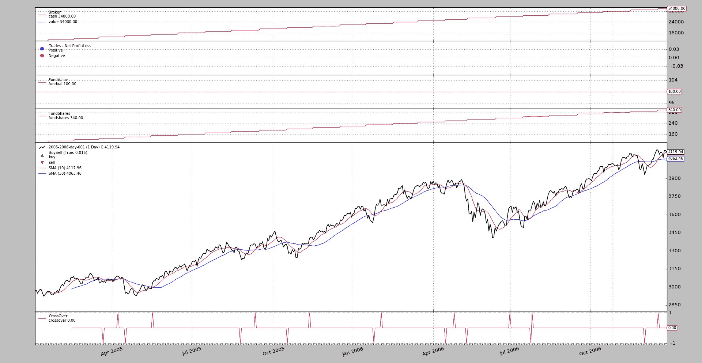
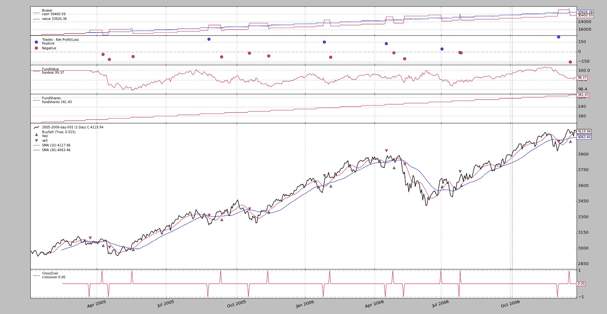

# 反向交易者：基金

> 原文： [https://www.backtrader.com/blog/posts/2017-06-19-fund-tracking/fund-tracking/](https://www.backtrader.com/blog/posts/2017-06-19-fund-tracking/fund-tracking/)

*反向交易者*已经使用了一段时间，也就是说*专业*，除了*反向交易者*一些银行和交易行已知的用法外，还用于*反向交易者基金*。

## 历史

一群志同道合、相识久远的个人决定走一条开路（对冲基金）的道路，用“交易逆境”作为交易理念的基石。有一件事是不能放弃的：它必须受到 100%的监管（但不是在*开曼群岛*或类似的地方）

地理位置、传统和网络首先在欧盟，然后在西班牙，那里（与其他一些地方一样）的立法允许*伞式基金*托管*子基金*，这使得创建一个资金和参与者数量较少的完全受监管的基金成为可能。

而且……该基金获得西班牙监管机构*ISIN*`ES0131444038`的*CNMV*批准。链接：

*   [伞式基金](https://www.cnmv.es/portal/ANCV/ISIN.aspx?nif=V04856381)

*   [子基金](https://www.cnmv.es/portal/Consultas/IIC/Fondo.aspx?isin=ES0131444038)

对于那些能够阅读西班牙语的人，*反向交易者*的用法记录在官方基金传单中。

对于那些可能在某个时候决定走这条路的人来说，最重要的事情是：

*   官僚主义是缓慢的，沿途会有很多问题

*   跟踪一切（执行的运营、现金/资产净值水平、头寸、杠杆率）

*   必须向监管机构报告（因此需要收集并妥善组织上述信息）

*   保持在规定的风险/波动性水平内不仅仅是一个指南

*   管理 OPM（别人的钱）是一个真正的心理负担。会有损失，也会有问题。不管这些问题的意图多么好，多么幼稚：它们都会产生影响。

交易交易者是交易思想的基础，它发现了一个新的应用领域：用于控制风险/波动性的定制*分析仪*和*指标*减轻了管理负担。

可能是因为我们已经过时了，我们仍然更喜欢手动执行（自动化执行将在将来的某个时候接管）

下面描述的功能是为了帮助管理基金和回溯测试场景而开发的，在这些场景中，资金流入和流出，绩效不再是跟踪资产净值的问题。

# 资金追踪

在版本为`1.9.52.121`的情况下，*backtrader*中的经纪人不仅以*现金*/*价值*的方式进行会计记录，还可以像在*基金*中一样进行会计记录，即：

*   基金价值（实际持有的基金份额）

*   股份数额

有了这一点，人们可以实际模拟现金存款和现金提取，同时仍然跟踪实际绩效，而常规会计会被现金流入/流出流量扭曲。

除了经纪人的变化外，*分析工具*和*观察者*已经被调整（那些对净资产价值做一些事情的人）来支持`fund`参数，以决定实际应该跟踪什么。例如`TimeReturn`：

```py
...
cerebro.addanalyzer(bt.analyzers.TimeReturn)  # auto-detect broker mode
cerebro.addanalyzer(bt.analyzers.TimeReturn, fund=True)  # track fund value
cerebro.addanalyzer(bt.analyzers.TimeReturn, fund=False)  # track net asset value
... 
```

## 这*资金追踪*是什么？

想象一个用例（样本后面部分），一个人从`1000`货币单位开始，在每个月的<sup>日</sup>增加`100`货币单位。12 个月后，账户中的总额为`2200`。根据最初采取的立场计算的回报

以通常的方式计算回报，这意味着在没有执行单一操作的情况下，年度回报的表现为：`120%`。当然，这是不对的。

为了缓解这个问题，无论账户的初始价值如何，基金份额的价值（*fundvalue*被设置为`100.0`。再加上起始资产净值（即`1000`货币单位），我们计算出基金份额的数量如下：

*   `fundshares = net-asset-value / fundvalue`

在本例中，哪个是`1000 / 100.0 = 10 shares`

每增加一笔现金，我们都会通过以下方式增加股份数量：

*   `new_fund_shares = cash_addition / fundvalue`

由于我们正在添加`100.0`货币单位，且未执行任何操作：

```py
- ``100.0 / 100.0 = 1 share`` 
```

请注意，*fundvalue*保持不变。快速转发至年底，我们有以下信息：

*   起始资产净值：`1000`

*   最终资产净值：`2200`

*   起始资金值=`100`

*   最终资金价值=`100`

*   起始股数：`10`

*   最终股份数：`22`

现在，如果我们使用开始和结束的*基金值*来计算回报，因为它们是相同的，所以我们有一个：`0%`与现实相符。因为增加的现金没有改变

## 在 backtrader 中使用*资金跟踪*

### 增加现金

首先，经纪人获得了一种向系统中正常添加现金的方法：

```py
add_cash(cash) 
```

在策略中使用它，例如：

```py
def next(self):

    if whatever:
        self.broker.add_cash(1000.0) 
```

此方法**必须**用于跟踪现金进入和退出系统，并正确跟踪资金价值。

### 自动的

在*经纪人*中激活：

```py
...
cerebro.broker.set_fundmode(True)
... 
```

同时更改默认的基金起始值：

```py
...
cerebro.broker.set_fundmode(True, 10.0)  # the default is 100
... 
```

或在独立通话中：

```py
...
cerebro.broker.set_fundmode(True)
cerebro.broker.set_fundstartval(10.0)  # the default is 100
... 
```

激活默认模式后，从上面返回`TimeReturn`分析仪示例：

```py
...
# 1
cerebro.addanalyzer(bt.analyzers.TimeReturn)  # auto-detect broker mode
# 2
cerebro.addanalyzer(bt.analyzers.TimeReturn, fund=True)  # track fund value
# 3
cerebro.addanalyzer(bt.analyzers.TimeReturn, fund=False)  # track net asset value
... 
```

`1`和`2`是等效的。但我们应该选择`1`。如果想要比较，可以强制`TimeReturn`分析工具不使用*基金价值*，而是跟踪*资产净值*

一个例子胜过千言万语。在示例中，我们将使用如上所述的 DO，但需要一些额外的现金（该资产的每股价值超过`3000`。初始现金水平将为`10000`，*反向交易者*中的默认值，并且在每月*15<sup>日</sup>*增加`1000`额外的货币单位（使用循环`Timer`。24 个月（即*反向交易者*中使用的标准数据样本的大小）

#### 没有任何手术

```py
$ ./fund-tracker.py --broker fundmode=True --strat cash2add=1000 --cerebro writer=True --plot 
```

图形视图

[](../auto-on-cashadd-nop.png)

以及文本输出（为可读性设置上限）：

```py
- timereturn:
  ~~~~~~~~~~~~~~~~~~~~~~~~~~~~~~~~~~~~~~~~~~~~~~~~~~~~~~~~~~~~~~~~~~~~~
    ...
    - fund: None
  ~~~~~~~~~~~~~~~~~~~~~~~~~~~~~~~~~~~~~~~~~~~~~~~~~~~~~~~~~~~~~~~~~~~~~
  - Analysis:
    - 2005-12-31: 0.0
    - 2006-12-31: 0.0
.......................................................................
- timereturn1:
  ~~~~~~~~~~~~~~~~~~~~~~~~~~~~~~~~~~~~~~~~~~~~~~~~~~~~~~~~~~~~~~~~~~~~~
  - Params:
    ...
    - fund: True
  ~~~~~~~~~~~~~~~~~~~~~~~~~~~~~~~~~~~~~~~~~~~~~~~~~~~~~~~~~~~~~~~~~~~~~
  - Analysis:
    - 2005-12-31: 0.0
    - 2006-12-31: 0.0
.......................................................................
- timereturn2:
  ~~~~~~~~~~~~~~~~~~~~~~~~~~~~~~~~~~~~~~~~~~~~~~~~~~~~~~~~~~~~~~~~~~~~~
    ...
    - fund: False
  ~~~~~~~~~~~~~~~~~~~~~~~~~~~~~~~~~~~~~~~~~~~~~~~~~~~~~~~~~~~~~~~~~~~~~
  - Analysis:
    - 2005-12-31: 1.2
    - 2006-12-31: 0.545454545455 
```

增加了 3 个`TimeReturn`分析仪。

*   1<sup>st</sup>有`fund=None`（默认值），表示跟踪经纪人中实际设置的`fundmode`（本例为`True`）

    上面说每年的回报是`0.0`和`0.0`。因为我们没有做手术：**好**

*   2<sup>nd</sup>有`fund=True`，表示始终使用*基金价值*

    上面说每年的回报是`0.0`和`0.0`。因为我们没有做手术：**好**

*   3<sup>rd</sup>有`fund=False`，即始终使用*资产净值*

    说明年回报率为`1.2`（*120%*）和`0.54`（*54%*）。因为我们没有做任何操作：**这显然是错误的**

该地块还包含两个新的*观察者*（`FundValue`和`FundShares`，这两个观察者可以看到即使*净资产*随着每月现金的增加而增长，*资金价值*仍保持不变`100.0`。同时，每增加一笔现金，股票就会增加。

#### 让我们交易吧

同上，但有些交易使用标准移动平均线交叉

```py
$ ./fund-tracker.py --broker fundmode=True --strat cash2add=1000,trade=True --cerebro writer=True --plot 
```

图形视图

[](../auto-on-cashadd-trade.png)

以及文本输出（为可读性设置上限）：

```py
- timereturn:
    ...
    - fund: None
  ~~~~~~~~~~~~~~~~~~~~~~~~~~~~~~~~~~~~~~~~~~~~~~~~~~~~~~~~~~~~~~~~~~~~~
  - Analysis:
    - 2005-12-31: -0.00642229824537
    - 2006-12-31: 7.78998679263e-05
.......................................................................
- timereturn1:
    ...
    - fund: True
  ~~~~~~~~~~~~~~~~~~~~~~~~~~~~~~~~~~~~~~~~~~~~~~~~~~~~~~~~~~~~~~~~~~~~~
  - Analysis:
    - 2005-12-31: -0.00642229824537
    - 2006-12-31: 7.78998679263e-05
.......................................................................
- timereturn2:
  ~~~~~~~~~~~~~~~~~~~~~~~~~~~~~~~~~~~~~~~~~~~~~~~~~~~~~~~~~~~~~~~~~~~~~
    ...
    - fund: False
  ~~~~~~~~~~~~~~~~~~~~~~~~~~~~~~~~~~~~~~~~~~~~~~~~~~~~~~~~~~~~~~~~~~~~~
  - Analysis:
    - 2005-12-31: 1.19378185337
    - 2006-12-31: 0.546479045423 
```

之前的三个`TimeReturn`分析仪相同。使用`fund=None`和`fund=True`的组合给出了合理的结果，而使用`fund=False`的组合显然又与使用`119%`和`54%`的组合不符，这显然不是移动平均线交叉提供的回报。

### 手册

在这种情况下（这是经纪人的默认值，即使经纪人正在跟踪基金的价值，也只有那些带有`fund=True`的分析器才会使用该价值。

仅使用文本输出的快速运行：

```py
$ ./fund-tracker.py --strat cash2add=1000,trade=True --cerebro writer=True 
```

输出：

```py
- timereturn:
  ~~~~~~~~~~~~~~~~~~~~~~~~~~~~~~~~~~~~~~~~~~~~~~~~~~~~~~~~~~~~~~~~~~~~~
    ...
    - fund: None
  ~~~~~~~~~~~~~~~~~~~~~~~~~~~~~~~~~~~~~~~~~~~~~~~~~~~~~~~~~~~~~~~~~~~~~
  - Analysis:
    - 2005-12-31: 1.19378185337
    - 2006-12-31: 0.546479045423
.......................................................................
- timereturn1:
  ~~~~~~~~~~~~~~~~~~~~~~~~~~~~~~~~~~~~~~~~~~~~~~~~~~~~~~~~~~~~~~~~~~~~~
    ...
    - fund: True
  ~~~~~~~~~~~~~~~~~~~~~~~~~~~~~~~~~~~~~~~~~~~~~~~~~~~~~~~~~~~~~~~~~~~~~
  - Analysis:
    - 2005-12-31: -0.00642229824537
    - 2006-12-31: 7.78998679263e-05
.......................................................................
- timereturn2:
  ~~~~~~~~~~~~~~~~~~~~~~~~~~~~~~~~~~~~~~~~~~~~~~~~~~~~~~~~~~~~~~~~~~~~~
    ...
    - fund: False
  ~~~~~~~~~~~~~~~~~~~~~~~~~~~~~~~~~~~~~~~~~~~~~~~~~~~~~~~~~~~~~~~~~~~~~
  - Analysis:
    - 2005-12-31: 1.19378185337
    - 2006-12-31: 0.546479045423 
```

现在只有带`fund=True`的`TimeReturn`可以提供合理的结果。

## 结论

在经纪人中实施的新的`fundmode`可以（自动/手动）在分析器中使用，允许使用*backtrader*对真实基金的内部运作或用例进行建模，如在给定的时间间隔内持续投资资金。

## 样本使用

```py
$ ./fund-tracker.py --help
usage: fund-tracker.py [-h] [--data0 DATA0] [--fromdate FROMDATE]
                       [--todate TODATE] [--cerebro kwargs] [--broker kwargs]
                       [--sizer kwargs] [--strat kwargs] [--plot [kwargs]]

Fund Tracking Sample

optional arguments:
  -h, --help           show this help message and exit
  --data0 DATA0        Data to read in (default:
                       ../../datas/2005-2006-day-001.txt)
  --fromdate FROMDATE  Date[time] in YYYY-MM-DD[THH:MM:SS] format (default: )
  --todate TODATE      Date[time] in YYYY-MM-DD[THH:MM:SS] format (default: )
  --cerebro kwargs     kwargs in key=value format (default: )
  --broker kwargs      kwargs in key=value format (default: )
  --sizer kwargs       kwargs in key=value format (default: )
  --strat kwargs       kwargs in key=value format (default: )
  --plot [kwargs]      kwargs in key=value format (default: ) 
```

## 示例代码

```py
from __future__ import (absolute_import, division, print_function,
                        unicode_literals)

import argparse
import datetime

import backtrader as bt

class St(bt.SignalStrategy):
    params = dict(
        cash2add=None,
        cashonday=15,
        pfast=10,
        pslow=30,
        trade=False,
    )

    def __init__(self):
        self.add_timer(when=bt.Timer.SESSION_END, monthdays=[self.p.cashonday])

        sma1 = bt.ind.SMA(period=self.p.pfast)
        sma2 = bt.ind.SMA(period=self.p.pslow)
        signal = bt.ind.CrossOver(sma1, sma2)
        if self.p.trade:
            self.signal_add(bt.SIGNAL_LONGSHORT, signal)

    def notify_timer(self, timer, when, *args, **kwargs):
        # no need to check the timer, there is only one
        if self.p.cash2add is not None:
            self.broker.add_cash(self.p.cash2add)

    def next(self):
        pass

def runstrat(args=None):
    args = parse_args(args)

    cerebro = bt.Cerebro()

    # Data feed kwargs
    kwargs = dict()

    # Parse from/to-date
    dtfmt, tmfmt = '%Y-%m-%d', 'T%H:%M:%S'
    for a, d in ((getattr(args, x), x) for x in ['fromdate', 'todate']):
        if a:
            strpfmt = dtfmt + tmfmt * ('T' in a)
            kwargs[d] = datetime.datetime.strptime(a, strpfmt)

    data0 = bt.feeds.BacktraderCSVData(dataname=args.data0, **kwargs)
    cerebro.adddata(data0)

    # Broker
    cerebro.broker = bt.brokers.BackBroker(**eval('dict(' + args.broker + ')'))

    # Sizer
    cerebro.addsizer(bt.sizers.PercentSizer,
                     **eval('dict(' + args.sizer + ')'))

    # Strategy
    cerebro.addstrategy(St, **eval('dict(' + args.strat + ')'))

    cerebro.addobserver(bt.observers.FundValue)
    cerebro.addobserver(bt.observers.FundShares)

    ankwargs = dict(timeframe=bt.TimeFrame.Years)
    cerebro.addanalyzer(bt.analyzers.TimeReturn, **ankwargs)
    cerebro.addanalyzer(bt.analyzers.TimeReturn, fund=True, **ankwargs)
    cerebro.addanalyzer(bt.analyzers.TimeReturn, fund=False, **ankwargs)

    # Execute
    cerebro.run(**eval('dict(' + args.cerebro + ')'))

    if args.plot:  # Plot if requested to
        cerebro.plot(**eval('dict(' + args.plot + ')'))

def parse_args(pargs=None):
    parser = argparse.ArgumentParser(
        formatter_class=argparse.ArgumentDefaultsHelpFormatter,
        description=(
            'Fund Tracking Sample'
        )
    )

    parser.add_argument('--data0', default='../../datas/2005-2006-day-001.txt',
                        required=False, help='Data to read in')

    # Defaults for dates
    parser.add_argument('--fromdate', required=False, default='',
                        help='Date[time] in YYYY-MM-DD[THH:MM:SS] format')

    parser.add_argument('--todate', required=False, default='',
                        help='Date[time] in YYYY-MM-DD[THH:MM:SS] format')

    parser.add_argument('--cerebro', required=False, default='',
                        metavar='kwargs', help='kwargs in key=value format')

    parser.add_argument('--broker', required=False, default='',
                        metavar='kwargs', help='kwargs in key=value format')

    parser.add_argument('--sizer', required=False, default='',
                        metavar='kwargs', help='kwargs in key=value format')

    parser.add_argument('--strat', required=False, default='',
                        metavar='kwargs', help='kwargs in key=value format')

    parser.add_argument('--plot', required=False, default='',
                        nargs='?', const='{}',
                        metavar='kwargs', help='kwargs in key=value format')

    return parser.parse_args(pargs)

if __name__ == '__main__':
    runstrat() 
```