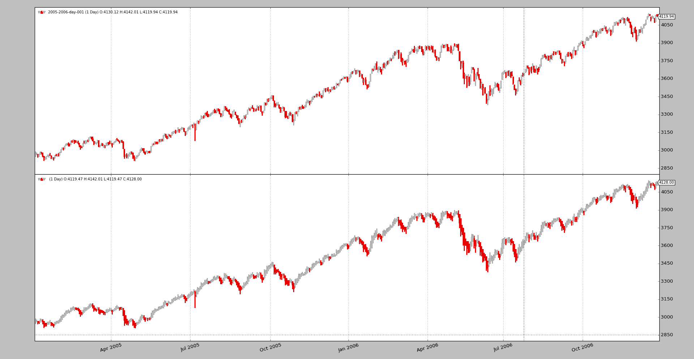
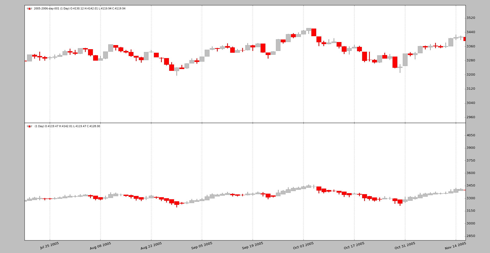
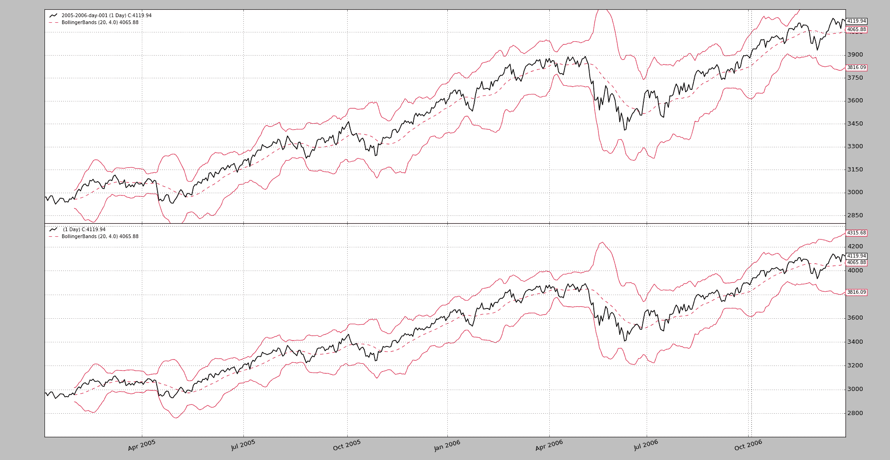

# 第 1.9.51.121 版

> 原文： [https://www.backtrader.com/blog/posts/2017-06-12-release-1.9.51.121/release-1.9.51.121/](https://www.backtrader.com/blog/posts/2017-06-12-release-1.9.51.121/release-1.9.51.121/)

即使是一个小版本，也有一些有趣的事情，可能会让他们有一个专门的博客帖子。

## `linealias`

[拉动请求](https://github.com/mementum/backtrader/pull/320)包括指标`RelativeMomentumIndex`（或`RMI`，根据文献，该指标是`RSI`的演变，其：

*   考虑回望大于`1`的*上升*和*下降*时段

因此，与其让指标重复`RSI`的大部分功能，不如做两件事：

1.  扩展`RSI`（以及`UpDay`和`DownDay`等子指标，以支持大于*1*的回溯期。`RMI`可以实现为一个子类，只是具有一些不同的默认值。

2.  `RMI`指标行的逻辑名称为`rmi`，但`RSI`已经确定名称为`rsi`。这可以通过添加名为`linealias`的新功能来解决

`RMI`实现它看起来像这样：

```py
class RelativeMomentumIndex(RSI):
    alias = ('RMI', )

    linealias = (('rsi', 'rmi',),)  # add an alias for this class rmi -> rsi
    plotlines = dict(rsi=dict(_name='rmi'))  # change line plotting name 
```

添加了基类中的行`rsi`的别名，名称为`rmi`。如果有人想创建一个子类并使用名称`rmi`，现在是可能的。

此外，`rsi`线的绘图名称也更改为`rmi`。另一种可能的实施方式是：

```py
class RelativeMomentumIndex(RSI):
    alias = ('RMI', )

    linesoverrride = True  # allow redefinition of the lines hierarcy
    lines = ('rmi',)  # define the line
    linealias = (('rmi', 'rsi',),)  # add an alias for base class rsi -> rmi 
```

这里不再考虑来自`RSI`的现有层次结构，`lines`用于定义唯一名为`rmi`的行。无需定义打印名称，因为现在只有一条线具有预期的名称。

但是基类将无法填充值，因为它希望有一行名为`rsi`的行。因此，添加了一个反向别名以使其能够找到该行。

## 用于优化的交互式代理

使用与*交互式代理*的实时连接作为优化的数据源是不可预见的。然而，一个用户尝试了它，并开始遇到了违规行为。原因是*交互代理*数据提要将自身标记为`live`提要，允许系统绕过一些事情，例如数据预加载。

在没有预加载的情况下，每个优化实例都会尝试从*交互代理*重新下载相同的历史数据。考虑到这一点，很明显，feed 可以查看用户是否只请求了历史下载，在这种情况下不会将自己报告为`live`，从而允许平台预加载数据并在优化实例之间共享。

请参阅社区线程。[使用 IBStore 优化会导致冗余连接/下载](https://community.backtrader.com/topic/401/optimizing-with-ibstore-causes-redundant-connections-downloads/)

## 海金阿希烛台

另一个社区线程希望开发*Heikin Ashi*烛台作为指示器：[开发 Heikinashi 指示器](https://community.backtrader.com/topic/458/develop-heikinashi-indicators)，在递归定义中面临一些问题，因为需要种子值，这可以在指示器的`prenext`阶段完成。

作为传统烛台的有趣显示替代品，它已作为过滤器实现，允许修改数据源以真正交付*Heikin Ashi*烛台。就这样,

```py
data0 = MyDataFeed(dataname='xxx', timeframe=bt.TimeFrame.Days, compression=1)
data0.addfilter(bt.filters.HeikinAshi)
cerebro.adddata(data0) 
```

使用此代码的任何人都可以快速比较蜡烛：

```py
data0 = MyDataFeed(dataname='xxx', timeframe=bt.TimeFrame.Days, compression=1)
cerebro.adddata(data0)

data1 = data0.clone()
data1.addfilter(bt.filters.HeikinAshi)
cerebro.adddata(data1) 
```

要绘制蜡烛，请记住执行以下操作：

```py
cerebro.plot(style='candle') 
```

使用来源中 2005 年和 2006 年的每日样本数据。

[](../heikinashi-candles.png)

放大一点以更好地理解差异

[](../heikinashi-candles-zoomin.png)

## 允许次级参与者重新缩放 y 轴

axisfor 数据源始终使用主数据源作为缩放所有者，因为数据始终是视图中最重要的部分。如果我们考虑例如 Tyt T0 席，可能是顶部带远离数据的最大值，并且允许该带重新缩放图表，将减少图表中数据所占用的大小，这是不希望的。

现在可以使用`plotylimited`控制该行为，如中所示：

```py
...
data0 = MyDataFeed(dataname='xxx', timeframe=bt.TimeFrame.Days, compression=1)
data0.plotinfo.plotlog = False  # allow other actors to resize the axis
... 
```

在下图中，底部的数据馈送用`plotylimited=False`绘制。*波林根带*不会脱离图表，因为它们有助于缩放，并且所有东西都符合图表。

[](../plotylimited.png)

社区也对此发表了评论。[如何设置最大-最小绘图边界？](https://community.backtrader.com/topic/339/how-max-min-plot-boundaries-are-set/)

## 半对数图（又名对数图）

现在可以使用半对数比例（y 比例）绘制各个轴。例如：

```py
...
data0 = MyDataFeed(dataname='xxx', timeframe=bt.TimeFrame.Days, compression=1)
data0.plotinfo.plotlog = True
data0.plotinfo.plotylimited = True
cerebro.adddata(data0)
... 
```

这意味着由该数据馈送控制的轴将使用对数刻度，而其他轴则不会，因此

*   在数据上绘制的移动平均值也将以该比例绘制

*   随机变量（位于不同轴上且具有不同比例）仍将线性绘制

笔记

请注意，使用了`plotylimited=True`。这是为了让`matplotlib`正确地计算对数图表的极限（因为刻度是 10 的幂），以便将事物放入图表中。

一个简单比较长期*雅虎*数据的样本。

[](../semilog-plotting.png)

## 允许 plotmaster 指向自身

在同一个轴上绘制多个数据馈送是可能的，但是一个小麻烦不允许一个干净的循环来设置`plotinfo.plotmaster`值。在此之前，必须完成以下工作：

```py
mydatas = []
data = MyDataFeed(dataname=mytickers[0], timeframe=..., compression=...)
mydatafeeds.append(data)
for ticker in mytickers[1:]
    data = MyDataFeed(dataname=ticker, timeframe=..., compression=...)
    mydatafeeds.append(data)
    data.plotinfo.plotmaster = mydatas[0] 
```

现在，这种更清洁的循环是可能的：

```py
mydatas = []
for ticker in mytickers:
    data = MyDataFeed(dataname=ticker, timeframe=..., compression=...)
    mydatafeeds.append(data)
    data.plotinfo.plotmaster = mydatas[0] 
```

## 而且`dnames`被记录在案

按名称引用数据源已经可用，但它跳过了文档，因此它是一颗隐藏的宝石。策略中的`dnames`属性支持*点表示法*和*【】*表示法（实际上是`dict`子类）。如果我们首先添加一些数据源：

```py
mytickers = ['YHOO', 'IBM', 'AAPL']
for t in mytickers:
  d = bt.feeds.YahooFinanceData(dataname=t, fromdate=..., name=t.lower()) 
```

在策略的后面部分，可以执行以下操作：

```py
def __init__(self):
  yhoosma = bt.ind.SMA(self.dnames.yhoo, period=20)
  aaplsma = bt.ind.SMA(self.dnames['aapl'], period=30)

  # or even go over the keys/items/values like in a regular dict
  # for example with a dictionary comprehension
  stocs = {name: bt.ind.Stochastic(data) for name, data in self.dnames.items()} 
```

## 结论

一个小版本，有一些小改动，增加了一些漂亮的特性。