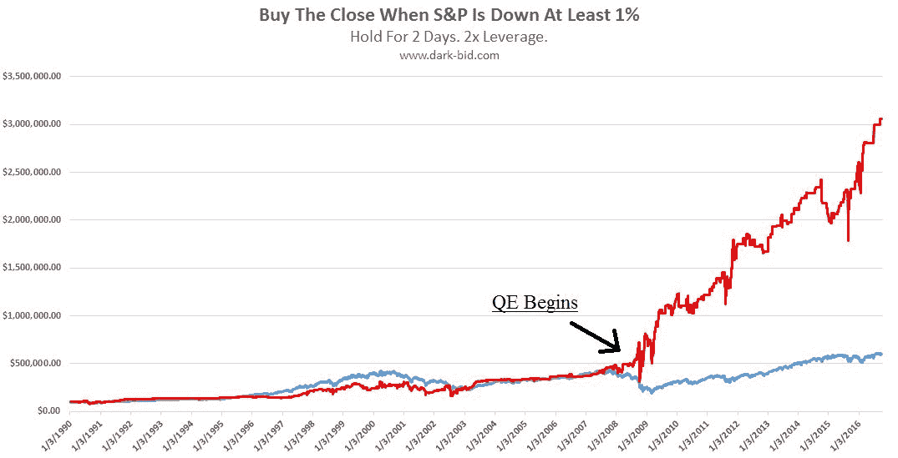
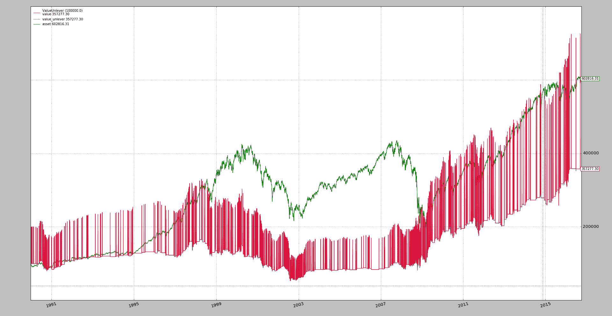
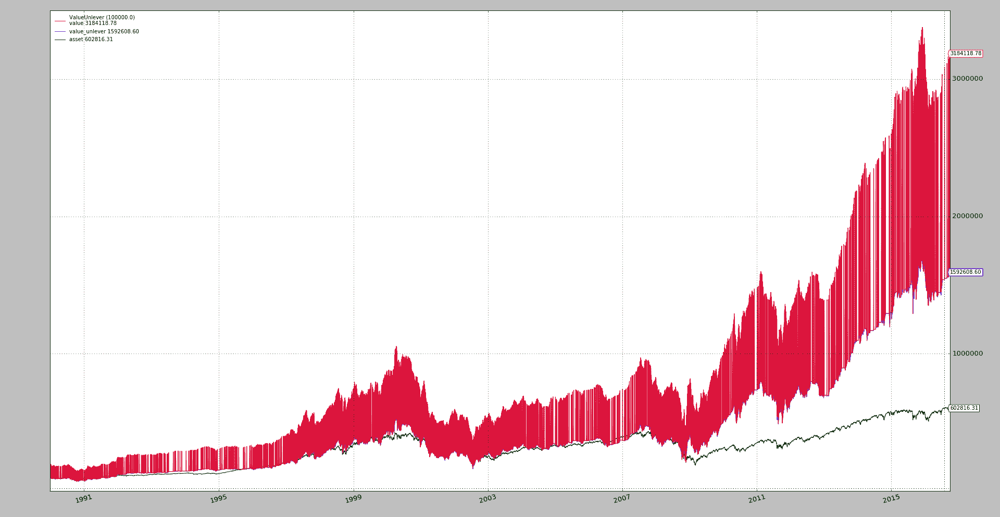

# BTFD（购买 F…Dip）

> 原文： [https://www.backtrader.com/blog/posts/2016-12-26-btfd/btfd/](https://www.backtrader.com/blog/posts/2016-12-26-btfd/btfd/)

笔记

增加了`CloseClose`方法的操作日志（下面也更新了示例）

*Reddit*中的一篇帖子呼吁复制`BTFD`策略，结果证明这是为*backtrader*`leverage`添加另一项功能所需要的小小推动

链接：

*   [Reddit 螺纹](https://www.reddit.com/r/algotrading/comments/5jez2b/can_anyone_replicate_this_strategy/)

*   [暗标 BTFD](http://dark-bid.com/BTFD-only-strategy-that-matters.html)

在*Reddit*线程中，最终没有完全复制*暗标*的结果。但这是可以做到的。尽管我们必须从一开始就指出一些事情：

*   *暗标*没有显示真实的图表，对策略的解释确实缺乏，可能会被大多数人视为*错误*

让我们直接看看这里的图表（记住图表来自*暗标 BTFD*帖子）

[](../BTFD.jpg)

大多数人可能会这样解释：

*   *买入收盘价*：这部分很清楚。在*收盘拍卖*期间购买

*   *当 S&P 下降至少 1%*时：在大多数情况下，这意味着*当前关闭*比之前的*关闭*低`1%`

*   *持有 2 天*：这里的解释是在 2 个交易日后的收盘时卖出

**   *2x 杠杆*：每*买入*操作杠杆为 2x（或*100%*信用）* 

 *其他：

*   数据似乎从`1990-01-01`到`2016-09-30`运行

*   起始现金价值似乎始于`100,000`

笔记

请注意，没有收取*佣金*或*信用利息*。

下面的示例配置了*中奖设置*，但第一次执行将尊重解释的规则。

```py
$ ./btfd.py --plot --strat approach="'closeclose'" 
```

笔记

示例接受一个`--offline`参数，以使用先前从*Yahoo*下载的文件来加速测试。如果不使用，则每次都会从*雅虎*下载上面引用的带有默认日期的数据和默认股票代码`^GSPC`

[](../btfd-closeclose.png)

休斯顿，我们有麻烦了！虽然没有预期的那么大。观察：

*   我们的*资产*已从`100,000`变为`602,816`，这似乎与上面的`BTFD`图表相符

*   另一方面，我们的`100,000`现金仅上升至`357,277`，似乎`10x`低于`3,000,000`（或`3M`以上的预期值

*   在这种情况下`value`和`value_unlever`相等，这意味着该策略*不在市场*中

但最有趣的是：**红色**线中的明显差异显示了随时间变化的值

*   我们的线路有非常快的*上升*和*下降*

    这是由于*杠杆*。当购买策略时，`2x`杠杆允许购买资产的两倍。

    但当战略是现金时，现金的价值不会是其价值的两倍。

*   `BTFD`行没有表现出这种行为，这是因为**总是**杠杆作用

好啊`BTFD`之谜的第一部分……*解开了*！但我们仍然存在一个问题，这与*暗标*所取得的绩效相匹配。不费吹灰之力，运行带有默认获胜设置的示例。

```py
$ ./btfd.py --plot --strat approach="'highlow'" 
```

笔记

如果样本运行时没有策略的*接近*参数，则默认设置为`approach=highlow`

[](../btfd-highlow.png)

在这种情况下：

*   使用`high`和`low`之间的差异。

    当然这不是*下降了`BTFD`图表中显示的至少 1%*，这是不同的，因为`low`可能也发生在`high`之前，很多人会认为*上升*而不是*下降*

笔记

该策略允许以下方法：`closeclose`、`highlow`、`highclose`和`openclose`。

但是：

*   系统的`value`为`3,184,118`。Ant 这是一个*优胜者*，因为`BTFD`图表的目视检查显示最终值超过`3M`

*   系统的*未杠杆化值*（`value_unlever`为：`1,592,608`，不是上述值。这只是告诉我们策略**在市场上**

很明显，在大约 1 或 2 天内，该策略将出售该头寸，实际现金价值将在`1,592,608`左右，而不是接近`3,184,118`。

`1.5M`值是原始*Reddit*海报实现的最佳观察结果。

## 结论

完整的`BTFD`谜团被解开了。关键是：

*   图表中绘制的`value`线不是真实的，因为它总是*杠杆作用*，而不仅仅是在被购买时

*   这种方法不是当资产*下跌*至少 1%时（通常理解为*之前接近当前收盘*，而是当资产*在高位和低位*之间至少有 1%的差异时，才进行购买

*   实际收益大致为`16x`（从`100,000`到`1,592,000`之间），在*情况下*`31x`（从`100,000`到`3.1M`）

## 样本使用

```py
$ ./btfd.py --help
usage: btfd.py [-h] [--offline] [--data TICKER]
               [--fromdate YYYY-MM-DD[THH:MM:SS]]
               [--todate YYYY-MM-DD[THH:MM:SS]] [--cerebro kwargs]
               [--broker kwargs] [--valobserver kwargs] [--strat kwargs]
               [--comminfo kwargs] [--plot [kwargs]]

BTFD - http://dark-bid.com/BTFD-only-strategy-that-matters.html - https://www.
reddit.com/r/algotrading/comments/5jez2b/can_anyone_replicate_this_strategy/

optional arguments:
  -h, --help            show this help message and exit
  --offline             Use offline file with ticker name (default: False)
  --data TICKER         Yahoo ticker to download (default: ^GSPC)
  --fromdate YYYY-MM-DD[THH:MM:SS]
                        Starting date[time] (default: 1990-01-01)
  --todate YYYY-MM-DD[THH:MM:SS]
                        Ending date[time] (default: 2016-10-01)
  --cerebro kwargs      kwargs in key=value format (default: stdstats=False)
  --broker kwargs       kwargs in key=value format (default: cash=100000.0,
                        coc=True)
  --valobserver kwargs  kwargs in key=value format (default:
                        assetstart=100000.0)
  --strat kwargs        kwargs in key=value format (default:
                        approach="highlow")
  --comminfo kwargs     kwargs in key=value format (default: leverage=2.0)
  --plot [kwargs]       kwargs in key=value format (default: ) 
```

## 示例代码

```py
from __future__ import (absolute_import, division, print_function,
                        unicode_literals)

# References:
#  - https://www.reddit.com/r/algotrading/comments/5jez2b/can_anyone_replicate_this_strategy/
#  - http://dark-bid.com/BTFD-only-strategy-that-matters.html

import argparse
import datetime

import backtrader as bt

class ValueUnlever(bt.observers.Value):
    '''Extension of regular Value observer to add leveraged view'''
    lines = ('value_lever', 'asset')
    params = (('assetstart', 100000.0), ('lever', True),)

    def next(self):
        super(ValueUnlever, self).next()
        if self.p.lever:
            self.lines.value_lever[0] = self._owner.broker._valuelever

        if len(self) == 1:
            self.lines.asset[0] = self.p.assetstart
        else:
            change = self.data[0] / self.data[-1]
            self.lines.asset[0] = change * self.lines.asset[-1]

class St(bt.Strategy):
    params = (
        ('fall', -0.01),
        ('hold', 2),
        ('approach', 'highlow'),
        ('target', 1.0),
        ('prorder', False),
        ('prtrade', False),
        ('prdata', False),
    )

    def __init__(self):
        if self.p.approach == 'closeclose':
            self.pctdown = self.data.close / self.data.close(-1) - 1.0
        elif self.p.approach == 'openclose':
            self.pctdown = self.data.close / self.data.open - 1.0
        elif self.p.approach == 'highclose':
            self.pctdown = self.data.close / self.data.high - 1.0
        elif self.p.approach == 'highlow':
            self.pctdown = self.data.low / self.data.high - 1.0

    def next(self):
        if self.position:
            if len(self) == self.barexit:
                self.close()
                if self.p.prdata:
                    print(','.join(str(x) for x in
                                   ['DATA', 'CLOSE',
                                    self.data.datetime.date().isoformat(),
                                    self.data.close[0],
                                    float('NaN')]))
        else:
            if self.pctdown <= self.p.fall:
                self.order_target_percent(target=self.p.target)
                self.barexit = len(self) + self.p.hold

                if self.p.prdata:
                    print(','.join(str(x) for x in
                                   ['DATA', 'OPEN',
                                    self.data.datetime.date().isoformat(),
                                    self.data.close[0],
                                    self.pctdown[0]]))

    def start(self):
        if self.p.prtrade:
            print(','.join(
                ['TRADE', 'Status', 'Date', 'Value', 'PnL', 'Commission']))
        if self.p.prorder:
            print(','.join(
                ['ORDER', 'Type', 'Date', 'Price', 'Size', 'Commission']))
        if self.p.prdata:
            print(','.join(['DATA', 'Action', 'Date', 'Price', 'PctDown']))

    def notify_order(self, order):
        if order.status in [order.Margin, order.Rejected, order.Canceled]:
            print('ORDER FAILED with status:', order.getstatusname())
        elif order.status == order.Completed:
            if self.p.prorder:
                print(','.join(map(str, [
                    'ORDER', 'BUY' * order.isbuy() or 'SELL',
                    self.data.num2date(order.executed.dt).date().isoformat(),
                    order.executed.price,
                    order.executed.size,
                    order.executed.comm,
                ]
                )))

    def notify_trade(self, trade):
        if not self.p.prtrade:
            return

        if trade.isclosed:
            print(','.join(map(str, [
                'TRADE', 'CLOSE',
                self.data.num2date(trade.dtclose).date().isoformat(),
                trade.value,
                trade.pnl,
                trade.commission,
            ]
            )))
        elif trade.justopened:
            print(','.join(map(str, [
                'TRADE', 'OPEN',
                self.data.num2date(trade.dtopen).date().isoformat(),
                trade.value,
                trade.pnl,
                trade.commission,
            ]
            )))

def runstrat(args=None):
    args = parse_args(args)

    cerebro = bt.Cerebro()

    # Data feed kwargs
    kwargs = dict()

    # Parse from/to-date
    dtfmt, tmfmt = '%Y-%m-%d', 'T%H:%M:%S'
    for a, d in ((getattr(args, x), x) for x in ['fromdate', 'todate']):
        kwargs[d] = datetime.datetime.strptime(a, dtfmt + tmfmt * ('T' in a))

    if not args.offline:
        YahooData = bt.feeds.YahooFinanceData
    else:
        YahooData = bt.feeds.YahooFinanceCSVData

    # Data feed - no plot - observer will do the job
    data = YahooData(dataname=args.data, plot=False, **kwargs)
    cerebro.adddata(data)

    # Broker
    cerebro.broker = bt.brokers.BackBroker(**eval('dict(' + args.broker + ')'))

    # Add a commission
    cerebro.broker.setcommission(**eval('dict(' + args.comminfo + ')'))

    # Strategy
    cerebro.addstrategy(St, **eval('dict(' + args.strat + ')'))

    # Add specific observer
    cerebro.addobserver(ValueUnlever, **eval('dict(' + args.valobserver + ')'))

    # Execute
    cerebro.run(**eval('dict(' + args.cerebro + ')'))

    if args.plot:  # Plot if requested to
        cerebro.plot(**eval('dict(' + args.plot + ')'))

def parse_args(pargs=None):
    parser = argparse.ArgumentParser(
        formatter_class=argparse.ArgumentDefaultsHelpFormatter,
        description=(' - '.join([
            'BTFD',
            'http://dark-bid.com/BTFD-only-strategy-that-matters.html',
            ('https://www.reddit.com/r/algotrading/comments/5jez2b/'
             'can_anyone_replicate_this_strategy/')]))
        )

    parser.add_argument('--offline', required=False, action='store_true',
                        help='Use offline file with ticker name')

    parser.add_argument('--data', required=False, default='^GSPC',
                        metavar='TICKER', help='Yahoo ticker to download')

    parser.add_argument('--fromdate', required=False, default='1990-01-01',
                        metavar='YYYY-MM-DD[THH:MM:SS]',
                        help='Starting date[time]')

    parser.add_argument('--todate', required=False, default='2016-10-01',
                        metavar='YYYY-MM-DD[THH:MM:SS]',
                        help='Ending date[time]')

    parser.add_argument('--cerebro', required=False, default='stdstats=False',
                        metavar='kwargs', help='kwargs in key=value format')

    parser.add_argument('--broker', required=False,
                        default='cash=100000.0, coc=True',
                        metavar='kwargs', help='kwargs in key=value format')

    parser.add_argument('--valobserver', required=False,
                        default='assetstart=100000.0',
                        metavar='kwargs', help='kwargs in key=value format')

    parser.add_argument('--strat', required=False,
                        default='approach="highlow"',
                        metavar='kwargs', help='kwargs in key=value format')

    parser.add_argument('--comminfo', required=False, default='leverage=2.0',
                        metavar='kwargs', help='kwargs in key=value format')

    parser.add_argument('--plot', required=False, default='',
                        nargs='?', const='volume=False',
                        metavar='kwargs', help='kwargs in key=value format')

    return parser.parse_args(pargs)

if __name__ == '__main__':
    runstrat() 
```

## 操作日志

### `CloseClose`进近

执行：

```py
$ ./btfd.py --strat approach="'closeclose'",prorder=True,prdata=True 
```

结果:

```py
ORDER,Type,Date,Price,Size,Commission
DATA,Action,Date,Price,PctDown
DATA,OPEN,1990-01-09,349.62,-0.0117866530993
ORDER,BUY,1990-01-09,349.62,572,0.0
DATA,CLOSE,1990-01-11,348.53,nan
ORDER,SELL,1990-01-11,348.53,-572,0.0
DATA,OPEN,1990-01-12,339.93,-0.0246750638396
ORDER,BUY,1990-01-12,339.93,584,0.0
DATA,CLOSE,1990-01-16,340.75,nan
ORDER,SELL,1990-01-16,340.75,-584,0.0
DATA,OPEN,1990-01-22,330.38,-0.0258587645585
ORDER,BUY,1990-01-22,330.38,604,0.0
DATA,CLOSE,1990-01-24,330.26,nan
ORDER,SELL,1990-01-24,330.26,-604,0.0
DATA,OPEN,1990-01-25,326.08,-0.0126566947254
ORDER,BUY,1990-01-25,326.08,612,0.0
DATA,CLOSE,1990-01-29,325.2,nan
ORDER,SELL,1990-01-29,325.2,-612,0.0
DATA,OPEN,1990-02-12,330.08,-0.0106108746478
ORDER,BUY,1990-02-12,330.08,600,0.0
DATA,CLOSE,1990-02-14,332.01,nan
ORDER,SELL,1990-02-14,332.01,-600,0.0
DATA,OPEN,1990-02-20,327.99,-0.0142161577302
ORDER,BUY,1990-02-20,327.99,612,0.0
DATA,CLOSE,1990-02-22,325.7,nan
ORDER,SELL,1990-02-22,325.7,-612,0.0
DATA,OPEN,1990-03-22,335.69,-0.0119208806735
ORDER,BUY,1990-03-22,335.69,588,0.0
DATA,CLOSE,1990-03-26,337.63,nan
ORDER,SELL,1990-03-26,337.63,-588,0.0
DATA,OPEN,1990-04-18,340.72,-0.0114889172566
ORDER,BUY,1990-04-18,340.72,586,0.0
DATA,CLOSE,1990-04-20,335.12,nan
ORDER,SELL,1990-04-20,335.12,-586,0.0
DATA,OPEN,1990-04-23,331.05,-0.0121449033182
ORDER,BUY,1990-04-23,331.05,584,0.0
DATA,CLOSE,1990-04-25,332.03,nan
ORDER,SELL,1990-04-25,332.03,-584,0.0
DATA,OPEN,1990-04-27,329.11,-0.0114441907966
ORDER,BUY,1990-04-27,329.11,592,0.0
DATA,CLOSE,1990-05-01,332.25,nan
ORDER,SELL,1990-05-01,332.25,-592,0.0
DATA,OPEN,1990-05-25,354.58,-0.0106860857677
ORDER,BUY,1990-05-25,354.58,560,0.0
DATA,CLOSE,1990-05-30,360.86,nan
ORDER,SELL,1990-05-30,360.86,-560,0.0
DATA,OPEN,1990-06-08,358.71,-0.0122263527468
ORDER,BUY,1990-06-08,358.71,572,0.0
DATA,CLOSE,1990-06-12,366.25,nan
ORDER,SELL,1990-06-12,366.25,-572,0.0
DATA,OPEN,1990-06-18,356.88,-0.0166156898405
ORDER,BUY,1990-06-18,356.88,600,0.0
DATA,CLOSE,1990-06-20,359.1,nan
ORDER,SELL,1990-06-20,359.1,-600,0.0
DATA,OPEN,1990-06-22,355.43,-0.0139817460538
ORDER,BUY,1990-06-22,355.43,610,0.0
DATA,CLOSE,1990-06-26,352.06,nan
ORDER,SELL,1990-06-26,352.06,-610,0.0
DATA,OPEN,1990-07-05,355.68,-0.0124389160373
ORDER,BUY,1990-07-05,355.68,598,0.0
DATA,CLOSE,1990-07-09,359.52,nan
ORDER,SELL,1990-07-09,359.52,-598,0.0
DATA,OPEN,1990-07-20,361.61,-0.010155480127
ORDER,BUY,1990-07-20,361.61,600,0.0
DATA,CLOSE,1990-07-24,355.79,nan
ORDER,SELL,1990-07-24,355.79,-600,0.0
DATA,OPEN,1990-08-02,351.48,-0.0113636363636
ORDER,BUY,1990-08-02,351.48,598,0.0
DATA,CLOSE,1990-08-06,334.43,nan
ORDER,SELL,1990-08-06,334.43,-598,0.0
DATA,OPEN,1990-08-10,335.52,-0.0130022945226
ORDER,BUY,1990-08-10,335.52,566,0.0
DATA,CLOSE,1990-08-14,339.39,nan
ORDER,SELL,1990-08-14,339.39,-566,0.0
DATA,OPEN,1990-08-16,332.39,-0.022554843263
ORDER,BUY,1990-08-16,332.39,584,0.0
DATA,CLOSE,1990-08-20,328.51,nan
ORDER,SELL,1990-08-20,328.51,-584,0.0
DATA,OPEN,1990-08-21,321.86,-0.0202429149798
ORDER,BUY,1990-08-21,321.86,588,0.0
DATA,CLOSE,1990-08-23,307.06,nan
ORDER,SELL,1990-08-23,307.06,-588,0.0
DATA,OPEN,1990-08-30,318.71,-0.0169036676023
ORDER,BUY,1990-08-30,318.71,540,0.0
DATA,CLOSE,1990-09-04,323.09,nan
ORDER,SELL,1990-09-04,323.09,-540,0.0
DATA,OPEN,1990-09-06,320.46,-0.012115046703
ORDER,BUY,1990-09-06,320.46,552,0.0
DATA,CLOSE,1990-09-10,321.63,nan
ORDER,SELL,1990-09-10,321.63,-552,0.0
DATA,OPEN,1990-09-13,318.65,-0.0120605196255
ORDER,BUY,1990-09-13,318.65,560,0.0
DATA,CLOSE,1990-09-17,317.77,nan
ORDER,SELL,1990-09-17,317.77,-560,0.0
DATA,OPEN,1990-09-20,311.48,-0.0161718256475
ORDER,BUY,1990-09-20,311.48,568,0.0
DATA,CLOSE,1990-09-24,304.59,nan
ORDER,SELL,1990-09-24,304.59,-568,0.0
DATA,OPEN,1990-09-26,305.06,-0.0103808473367
ORDER,BUY,1990-09-26,305.06,556,0.0
DATA,CLOSE,1990-09-28,306.05,nan
ORDER,SELL,1990-09-28,306.05,-556,0.0
DATA,OPEN,1990-10-03,311.4,-0.0120871799753
ORDER,BUY,1990-10-03,311.4,548,0.0
DATA,CLOSE,1990-10-05,311.5,nan
ORDER,SELL,1990-10-05,311.5,-548,0.0
DATA,OPEN,1990-10-09,305.1,-0.0267321679214
ORDER,BUY,1990-10-09,305.1,560,0.0
DATA,CLOSE,1990-10-11,295.46,nan
ORDER,SELL,1990-10-11,295.46,-560,0.0
DATA,OPEN,1990-10-16,298.92,-0.0142136332157
ORDER,BUY,1990-10-16,298.92,534,0.0
DATA,CLOSE,1990-10-18,305.74,nan
ORDER,SELL,1990-10-18,305.74,-534,0.0
DATA,OPEN,1990-10-26,304.71,-0.0176032498307
ORDER,BUY,1990-10-26,304.71,548,0.0
DATA,CLOSE,1990-10-30,304.06,nan
ORDER,SELL,1990-10-30,304.06,-548,0.0
DATA,OPEN,1990-11-07,306.01,-0.0180026955908
ORDER,BUY,1990-11-07,306.01,544,0.0
DATA,CLOSE,1990-11-09,313.74,nan
ORDER,SELL,1990-11-09,313.74,-544,0.0
DATA,OPEN,1990-11-15,317.02,-0.0105493133583
ORDER,BUY,1990-11-15,317.02,552,0.0
DATA,CLOSE,1990-11-19,319.34,nan
ORDER,SELL,1990-11-19,319.34,-552,0.0
DATA,OPEN,1990-11-20,315.31,-0.0126197782927
ORDER,BUY,1990-11-20,315.31,562,0.0
DATA,CLOSE,1990-11-23,315.1,nan
ORDER,SELL,1990-11-23,315.1,-562,0.0
DATA,OPEN,1991-01-02,326.45,-0.0114166313367
ORDER,BUY,1991-01-02,326.45,542,0.0
DATA,CLOSE,1991-01-04,321.0,nan
ORDER,SELL,1991-01-04,321.0,-542,0.0
DATA,OPEN,1991-01-07,315.44,-0.0173208722741
ORDER,BUY,1991-01-07,315.44,542,0.0
DATA,CLOSE,1991-01-09,311.49,nan
ORDER,SELL,1991-01-09,311.49,-542,0.0
DATA,OPEN,1991-02-14,364.22,-0.0130074250718
ORDER,BUY,1991-02-14,364.22,458,0.0
DATA,CLOSE,1991-02-19,369.39,nan
ORDER,SELL,1991-02-19,369.39,-458,0.0
DATA,OPEN,1991-02-20,365.14,-0.0115054549392
ORDER,BUY,1991-02-20,365.14,470,0.0
DATA,CLOSE,1991-02-22,365.65,nan
ORDER,SELL,1991-02-22,365.65,-470,0.0
DATA,OPEN,1991-02-26,362.81,-0.0121167565213
ORDER,BUY,1991-02-26,362.81,474,0.0
DATA,CLOSE,1991-02-28,367.07,nan
ORDER,SELL,1991-02-28,367.07,-474,0.0
DATA,OPEN,1991-03-19,366.59,-0.014834323184
ORDER,BUY,1991-03-19,366.59,480,0.0
DATA,CLOSE,1991-03-21,366.58,nan
ORDER,SELL,1991-03-21,366.58,-480,0.0
DATA,OPEN,1991-04-01,371.3,-0.0104472043068
ORDER,BUY,1991-04-01,371.3,474,0.0
DATA,CLOSE,1991-04-03,378.94,nan
ORDER,SELL,1991-04-03,378.94,-474,0.0
DATA,OPEN,1991-04-05,375.36,-0.0116122916502
ORDER,BUY,1991-04-05,375.36,488,0.0
DATA,CLOSE,1991-04-09,373.56,nan
ORDER,SELL,1991-04-09,373.56,-488,0.0
DATA,OPEN,1991-04-19,384.2,-0.0109663800649
ORDER,BUY,1991-04-19,384.2,472,0.0
DATA,CLOSE,1991-04-23,381.76,nan
ORDER,SELL,1991-04-23,381.76,-472,0.0
DATA,OPEN,1991-04-29,373.66,-0.0141417339454
ORDER,BUY,1991-04-29,373.66,480,0.0
DATA,CLOSE,1991-05-01,380.29,nan
ORDER,SELL,1991-05-01,380.29,-480,0.0
DATA,OPEN,1991-05-10,375.74,-0.0195955642531
ORDER,BUY,1991-05-10,375.74,494,0.0
DATA,CLOSE,1991-05-14,371.62,nan
ORDER,SELL,1991-05-14,371.62,-494,0.0
DATA,OPEN,1991-06-07,379.43,-0.0109480489013
ORDER,BUY,1991-06-07,379.43,478,0.0
DATA,CLOSE,1991-06-11,381.05,nan
ORDER,SELL,1991-06-11,381.05,-478,0.0
DATA,OPEN,1991-06-12,376.65,-0.0115470410707
ORDER,BUY,1991-06-12,376.65,486,0.0
DATA,CLOSE,1991-06-14,382.29,nan
ORDER,SELL,1991-06-14,382.29,-486,0.0
DATA,OPEN,1991-06-24,370.94,-0.0180277961615
ORDER,BUY,1991-06-24,370.94,508,0.0
DATA,CLOSE,1991-06-26,371.59,nan
ORDER,SELL,1991-06-26,371.59,-508,0.0
DATA,OPEN,1991-07-03,373.33,-0.0109677590272
ORDER,BUY,1991-07-03,373.33,506,0.0
DATA,CLOSE,1991-07-08,377.94,nan
ORDER,SELL,1991-07-08,377.94,-506,0.0
DATA,OPEN,1991-08-19,376.47,-0.0236267441257
ORDER,BUY,1991-08-19,376.47,516,0.0
DATA,CLOSE,1991-08-21,390.59,nan
ORDER,SELL,1991-08-21,390.59,-516,0.0
DATA,OPEN,1991-09-10,384.56,-0.010319890882
ORDER,BUY,1991-09-10,384.56,542,0.0
DATA,CLOSE,1991-09-12,387.34,nan
ORDER,SELL,1991-09-12,387.34,-542,0.0
DATA,OPEN,1991-10-09,376.8,-0.0101662857593
ORDER,BUY,1991-10-09,376.8,562,0.0
DATA,CLOSE,1991-10-11,381.45,nan
ORDER,SELL,1991-10-11,381.45,-562,0.0
DATA,OPEN,1991-11-15,382.62,-0.0365856729196
ORDER,BUY,1991-11-15,382.62,566,0.0
DATA,CLOSE,1991-11-19,379.42,nan
ORDER,SELL,1991-11-19,379.42,-566,0.0
DATA,OPEN,1991-11-22,376.14,-0.010314160922
ORDER,BUY,1991-11-22,376.14,566,0.0
DATA,CLOSE,1991-11-26,377.96,nan
ORDER,SELL,1991-11-26,377.96,-566,0.0
DATA,OPEN,1992-01-29,410.34,-0.0111336032389
ORDER,BUY,1992-01-29,410.34,524,0.0
DATA,CLOSE,1992-01-31,408.78,nan
ORDER,SELL,1992-01-31,408.78,-524,0.0
DATA,OPEN,1992-02-18,407.38,-0.0123642358417
ORDER,BUY,1992-02-18,407.38,524,0.0
DATA,CLOSE,1992-02-20,413.9,nan
ORDER,SELL,1992-02-20,413.9,-524,0.0
DATA,OPEN,1992-03-27,403.5,-0.0106899426274
ORDER,BUY,1992-03-27,403.5,546,0.0
DATA,CLOSE,1992-03-31,403.69,nan
ORDER,SELL,1992-03-31,403.69,-546,0.0
DATA,OPEN,1992-04-07,398.06,-0.0185655464878
ORDER,BUY,1992-04-07,398.06,554,0.0
DATA,CLOSE,1992-04-09,400.64,nan
ORDER,SELL,1992-04-09,400.64,-554,0.0
DATA,OPEN,1992-04-20,410.18,-0.0140851841169
ORDER,BUY,1992-04-20,410.18,544,0.0
DATA,CLOSE,1992-04-22,409.81,nan
ORDER,SELL,1992-04-22,409.81,-544,0.0
DATA,OPEN,1992-06-17,402.26,-0.0148413009404
ORDER,BUY,1992-06-17,402.26,554,0.0
DATA,CLOSE,1992-06-19,403.67,nan
ORDER,SELL,1992-06-19,403.67,-554,0.0
DATA,OPEN,1992-07-07,409.16,-0.0113087183453
ORDER,BUY,1992-07-07,409.16,548,0.0
DATA,CLOSE,1992-07-09,414.23,nan
ORDER,SELL,1992-07-09,414.23,-548,0.0
DATA,OPEN,1992-09-15,419.77,-0.012932960237
ORDER,BUY,1992-09-15,419.77,548,0.0
DATA,CLOSE,1992-09-17,419.93,nan
ORDER,SELL,1992-09-17,419.93,-548,0.0
DATA,OPEN,1992-09-22,417.14,-0.0118444118065
ORDER,BUY,1992-09-22,417.14,552,0.0
DATA,CLOSE,1992-09-24,418.47,nan
ORDER,SELL,1992-09-24,418.47,-552,0.0
DATA,OPEN,1992-10-02,410.47,-0.0139806384972
ORDER,BUY,1992-10-02,410.47,564,0.0
DATA,CLOSE,1992-10-06,407.18,nan
ORDER,SELL,1992-10-06,407.18,-564,0.0
DATA,OPEN,1992-10-09,402.66,-0.0124831391784
ORDER,BUY,1992-10-09,402.66,566,0.0
DATA,CLOSE,1992-10-13,409.3,nan
ORDER,SELL,1992-10-13,409.3,-566,0.0
DATA,OPEN,1993-02-16,433.91,-0.0240001799451
ORDER,BUY,1993-02-16,433.91,542,0.0
DATA,CLOSE,1993-02-18,431.9,nan
ORDER,SELL,1993-02-18,431.9,-542,0.0
DATA,OPEN,1993-04-02,441.39,-0.0197868087941
ORDER,BUY,1993-04-02,441.39,528,0.0
DATA,CLOSE,1993-04-06,441.16,nan
ORDER,SELL,1993-04-06,441.16,-528,0.0
DATA,OPEN,1993-05-13,439.23,-0.0125224820144
ORDER,BUY,1993-05-13,439.23,530,0.0
DATA,CLOSE,1993-05-17,440.37,nan
ORDER,SELL,1993-05-17,440.37,-530,0.0
DATA,OPEN,1993-05-21,445.84,-0.0105417341708
ORDER,BUY,1993-05-21,445.84,526,0.0
DATA,CLOSE,1993-05-25,448.85,nan
ORDER,SELL,1993-05-25,448.85,-526,0.0
DATA,OPEN,1993-06-18,443.68,-0.0108351540554
ORDER,BUY,1993-06-18,443.68,536,0.0
DATA,CLOSE,1993-06-22,445.93,nan
ORDER,SELL,1993-06-22,445.93,-536,0.0
DATA,OPEN,1993-11-03,463.02,-0.011570318504
ORDER,BUY,1993-11-03,463.02,518,0.0
DATA,CLOSE,1993-11-05,459.57,nan
ORDER,SELL,1993-11-05,459.57,-518,0.0
DATA,OPEN,1994-02-04,469.81,-0.0226747935346
ORDER,BUY,1994-02-04,469.81,502,0.0
DATA,CLOSE,1994-02-08,471.05,nan
ORDER,SELL,1994-02-08,471.05,-502,0.0
DATA,OPEN,1994-02-24,464.26,-0.0136607958529
ORDER,BUY,1994-02-24,464.26,512,0.0
DATA,CLOSE,1994-02-28,467.14,nan
ORDER,SELL,1994-02-28,467.14,-512,0.0
DATA,OPEN,1994-03-29,452.48,-0.016347826087
ORDER,BUY,1994-03-29,452.48,532,0.0
DATA,CLOSE,1994-03-31,445.77,nan
ORDER,SELL,1994-03-31,445.77,-532,0.0
DATA,OPEN,1994-04-04,438.92,-0.01536666891
ORDER,BUY,1994-04-04,438.92,532,0.0
DATA,CLOSE,1994-04-06,448.05,nan
ORDER,SELL,1994-04-06,448.05,-532,0.0
DATA,OPEN,1994-05-09,442.32,-0.0122817203341
ORDER,BUY,1994-05-09,442.32,550,0.0
DATA,CLOSE,1994-05-11,441.49,nan
ORDER,SELL,1994-05-11,441.49,-550,0.0
DATA,OPEN,1994-06-24,442.8,-0.0151902675533
ORDER,BUY,1994-06-24,442.8,546,0.0
DATA,CLOSE,1994-06-28,446.07,nan
ORDER,SELL,1994-06-28,446.07,-546,0.0
DATA,OPEN,1994-09-09,468.18,-0.0104831550915
ORDER,BUY,1994-09-09,468.18,524,0.0
DATA,CLOSE,1994-09-13,467.51,nan
ORDER,SELL,1994-09-13,467.51,-524,0.0
DATA,OPEN,1994-09-20,463.36,-0.0159074015079
ORDER,BUY,1994-09-20,463.36,528,0.0
DATA,CLOSE,1994-09-22,461.27,nan
ORDER,SELL,1994-09-22,461.27,-528,0.0
DATA,OPEN,1994-10-04,454.59,-0.0154849049248
ORDER,BUY,1994-10-04,454.59,534,0.0
DATA,CLOSE,1994-10-06,452.36,nan
ORDER,SELL,1994-10-06,452.36,-534,0.0
DATA,OPEN,1994-11-04,462.28,-0.01203222842
ORDER,BUY,1994-11-04,462.28,520,0.0
DATA,CLOSE,1994-11-08,465.65,nan
ORDER,SELL,1994-11-08,465.65,-520,0.0
DATA,OPEN,1994-11-22,450.09,-0.0179140301113
ORDER,BUY,1994-11-22,450.09,542,0.0
DATA,CLOSE,1994-11-25,452.29,nan
ORDER,SELL,1994-11-25,452.29,-542,0.0
DATA,OPEN,1994-12-01,448.92,-0.010513786947
ORDER,BUY,1994-12-01,448.92,548,0.0
DATA,CLOSE,1994-12-05,453.32,nan
ORDER,SELL,1994-12-05,453.32,-548,0.0
DATA,OPEN,1994-12-08,445.45,-0.012809431997
ORDER,BUY,1994-12-08,445.45,564,0.0
DATA,CLOSE,1994-12-12,449.47,nan
ORDER,SELL,1994-12-12,449.47,-564,0.0
DATA,OPEN,1995-05-18,519.58,-0.0142106361584
ORDER,BUY,1995-05-18,519.58,492,0.0
DATA,CLOSE,1995-05-22,523.65,nan
ORDER,SELL,1995-05-22,523.65,-492,0.0
DATA,OPEN,1995-06-26,544.13,-0.010150806789
ORDER,BUY,1995-06-26,544.13,478,0.0
DATA,CLOSE,1995-06-28,544.73,nan
ORDER,SELL,1995-06-28,544.73,-478,0.0
DATA,OPEN,1995-07-19,550.98,-0.0133939762919
ORDER,BUY,1995-07-19,550.98,472,0.0
DATA,CLOSE,1995-07-21,553.62,nan
ORDER,SELL,1995-07-21,553.62,-472,0.0
DATA,OPEN,1995-12-18,606.81,-0.0154622448648
ORDER,BUY,1995-12-18,606.81,432,0.0
DATA,CLOSE,1995-12-20,605.94,nan
ORDER,SELL,1995-12-20,605.94,-432,0.0
DATA,OPEN,1996-01-09,609.45,-0.0145684442001
ORDER,BUY,1996-01-09,609.45,430,0.0
DATA,CLOSE,1996-01-11,602.69,nan
ORDER,SELL,1996-01-11,602.69,-430,0.0
DATA,OPEN,1996-02-20,640.65,-0.0113120775333
ORDER,BUY,1996-02-20,640.65,400,0.0
DATA,CLOSE,1996-02-22,658.86,nan
ORDER,SELL,1996-02-22,658.86,-400,0.0
DATA,OPEN,1996-02-26,650.46,-0.013078837167
ORDER,BUY,1996-02-26,650.46,416,0.0
DATA,CLOSE,1996-02-28,644.75,nan
ORDER,SELL,1996-02-28,644.75,-416,0.0
DATA,OPEN,1996-03-08,633.5,-0.0308268951274
ORDER,BUY,1996-03-08,633.5,420,0.0
DATA,CLOSE,1996-03-12,637.09,nan
ORDER,SELL,1996-03-12,637.09,-420,0.0
DATA,OPEN,1996-04-08,644.24,-0.017717195743
ORDER,BUY,1996-04-08,644.24,418,0.0
DATA,CLOSE,1996-04-10,633.5,nan
ORDER,SELL,1996-04-10,633.5,-418,0.0
DATA,OPEN,1996-05-02,643.38,-0.0171102080724
ORDER,BUY,1996-05-02,643.38,404,0.0
DATA,CLOSE,1996-05-06,640.81,nan
ORDER,SELL,1996-05-06,640.81,-404,0.0
DATA,OPEN,1996-07-05,657.44,-0.022248661511
ORDER,BUY,1996-07-05,657.44,392,0.0
DATA,CLOSE,1996-07-09,654.75,nan
ORDER,SELL,1996-07-09,654.75,-392,0.0
DATA,OPEN,1996-07-11,645.67,-0.0158369661311
ORDER,BUY,1996-07-11,645.67,396,0.0
DATA,CLOSE,1996-07-15,629.8,nan
ORDER,SELL,1996-07-15,629.8,-396,0.0
DATA,OPEN,1996-07-23,626.87,-0.0108872303833
ORDER,BUY,1996-07-23,626.87,388,0.0
DATA,CLOSE,1996-07-25,631.17,nan
ORDER,SELL,1996-07-25,631.17,-388,0.0
DATA,OPEN,1996-08-29,657.4,-0.0111460417262
ORDER,BUY,1996-08-29,657.4,374,0.0
DATA,CLOSE,1996-09-03,654.72,nan
ORDER,SELL,1996-09-03,654.72,-374,0.0
DATA,OPEN,1996-12-03,748.28,-0.0109442740827
ORDER,BUY,1996-12-03,748.28,326,0.0
DATA,CLOSE,1996-12-05,744.38,nan
ORDER,SELL,1996-12-05,744.38,-326,0.0
DATA,OPEN,1996-12-12,729.3,-0.0154307237455
ORDER,BUY,1996-12-12,729.3,332,0.0
DATA,CLOSE,1996-12-16,720.98,nan
ORDER,SELL,1996-12-16,720.98,-332,0.0
DATA,OPEN,1996-12-31,740.74,-0.0173907275983
ORDER,BUY,1996-12-31,740.74,318,0.0
DATA,CLOSE,1997-01-03,748.03,nan
ORDER,SELL,1997-01-03,748.03,-318,0.0
DATA,OPEN,1997-01-23,777.56,-0.0110273075309
ORDER,BUY,1997-01-23,777.56,310,0.0
DATA,CLOSE,1997-01-27,765.02,nan
ORDER,SELL,1997-01-27,765.02,-310,0.0
DATA,OPEN,1997-02-05,778.28,-0.0139117654512
ORDER,BUY,1997-02-05,778.28,300,0.0
DATA,CLOSE,1997-02-07,789.56,nan
ORDER,SELL,1997-02-07,789.56,-300,0.0
DATA,OPEN,1997-02-20,802.8,-0.0119263006314
ORDER,BUY,1997-02-20,802.8,298,0.0
DATA,CLOSE,1997-02-24,810.28,nan
ORDER,SELL,1997-02-24,810.28,-298,0.0
DATA,OPEN,1997-02-27,795.07,-0.0131690000993
ORDER,BUY,1997-02-27,795.07,308,0.0
DATA,CLOSE,1997-03-03,795.31,nan
ORDER,SELL,1997-03-03,795.31,-308,0.0
DATA,OPEN,1997-03-13,789.56,-0.0182776713998
ORDER,BUY,1997-03-13,789.56,310,0.0
DATA,CLOSE,1997-03-17,795.71,nan
ORDER,SELL,1997-03-17,795.71,-310,0.0
DATA,OPEN,1997-03-27,773.88,-0.0210246679317
ORDER,BUY,1997-03-27,773.88,320,0.0
DATA,CLOSE,1997-04-01,759.64,nan
ORDER,SELL,1997-04-01,759.64,-320,0.0
DATA,OPEN,1997-04-02,750.11,-0.0125454162498
ORDER,BUY,1997-04-02,750.11,318,0.0
DATA,CLOSE,1997-04-04,757.9,nan
ORDER,SELL,1997-04-04,757.9,-318,0.0
DATA,OPEN,1997-04-11,737.65,-0.0272832766305
ORDER,BUY,1997-04-11,737.65,330,0.0
DATA,CLOSE,1997-04-15,754.72,nan
ORDER,SELL,1997-04-15,754.72,-330,0.0
DATA,OPEN,1997-05-07,815.62,-0.0146660867884
ORDER,BUY,1997-05-07,815.62,314,0.0
DATA,CLOSE,1997-05-09,824.78,nan
ORDER,SELL,1997-05-09,824.78,-314,0.0
DATA,OPEN,1997-05-16,829.75,-0.0144082292013
ORDER,BUY,1997-05-16,829.75,314,0.0
DATA,CLOSE,1997-05-20,841.66,nan
ORDER,SELL,1997-05-20,841.66,-314,0.0
DATA,OPEN,1997-06-23,878.62,-0.0223433848893
ORDER,BUY,1997-06-23,878.62,306,0.0
DATA,CLOSE,1997-06-25,888.99,nan
ORDER,SELL,1997-06-25,888.99,-306,0.0
DATA,OPEN,1997-07-09,907.54,-0.0122013605442
ORDER,BUY,1997-07-09,907.54,302,0.0
DATA,CLOSE,1997-07-11,916.68,nan
ORDER,SELL,1997-07-11,916.68,-302,0.0
DATA,OPEN,1997-07-18,915.3,-0.017507326027
ORDER,BUY,1997-07-18,915.3,306,0.0
DATA,CLOSE,1997-07-22,933.98,nan
ORDER,SELL,1997-07-22,933.98,-306,0.0
DATA,OPEN,1997-08-08,933.54,-0.0185557039077
ORDER,BUY,1997-08-08,933.54,312,0.0
DATA,CLOSE,1997-08-12,926.53,nan
ORDER,SELL,1997-08-12,926.53,-312,0.0
DATA,OPEN,1997-08-15,900.81,-0.0259091449766
ORDER,BUY,1997-08-15,900.81,320,0.0
DATA,CLOSE,1997-08-19,926.01,nan
ORDER,SELL,1997-08-19,926.01,-320,0.0
DATA,OPEN,1997-08-21,925.05,-0.0152232927024
ORDER,BUY,1997-08-21,925.05,328,0.0
DATA,CLOSE,1997-08-25,920.16,nan
ORDER,SELL,1997-08-25,920.16,-328,0.0
DATA,OPEN,1997-08-28,903.67,-0.0109773448616
ORDER,BUY,1997-08-28,903.67,332,0.0
DATA,CLOSE,1997-09-02,927.58,nan
ORDER,SELL,1997-09-02,927.58,-332,0.0
DATA,OPEN,1997-09-10,919.03,-0.0156273430304
ORDER,BUY,1997-09-10,919.03,344,0.0
DATA,CLOSE,1997-09-12,923.91,nan
ORDER,SELL,1997-09-12,923.91,-344,0.0
DATA,OPEN,1997-10-16,955.25,-0.0108416518245
ORDER,BUY,1997-10-16,955.25,334,0.0
DATA,CLOSE,1997-10-20,955.61,nan
ORDER,SELL,1997-10-20,955.61,-334,0.0
DATA,OPEN,1997-10-23,950.69,-0.0183791262687
ORDER,BUY,1997-10-23,950.69,336,0.0
DATA,CLOSE,1997-10-27,876.99,nan
ORDER,SELL,1997-10-27,876.99,-336,0.0
DATA,OPEN,1997-10-30,903.68,-0.0168414639453
ORDER,BUY,1997-10-30,903.68,300,0.0
DATA,CLOSE,1997-11-03,938.99,nan
ORDER,SELL,1997-11-03,938.99,-300,0.0
DATA,OPEN,1997-11-07,927.51,-0.0112149931239
ORDER,BUY,1997-11-07,927.51,314,0.0
DATA,CLOSE,1997-11-11,923.78,nan
ORDER,SELL,1997-11-11,923.78,-314,0.0
DATA,OPEN,1997-11-12,905.96,-0.019290307216
ORDER,BUY,1997-11-12,905.96,320,0.0
DATA,CLOSE,1997-11-14,928.35,nan
ORDER,SELL,1997-11-14,928.35,-320,0.0
DATA,OPEN,1997-11-24,946.67,-0.0170492892668
ORDER,BUY,1997-11-24,946.67,320,0.0
DATA,CLOSE,1997-11-26,951.64,nan
ORDER,SELL,1997-11-26,951.64,-320,0.0
DATA,OPEN,1997-12-11,954.94,-0.0153125934481
ORDER,BUY,1997-12-11,954.94,322,0.0
DATA,CLOSE,1997-12-15,963.39,nan
ORDER,SELL,1997-12-15,963.39,-322,0.0
DATA,OPEN,1997-12-18,955.3,-0.0106054642998
ORDER,BUY,1997-12-18,955.3,326,0.0
DATA,CLOSE,1997-12-22,953.7,nan
ORDER,SELL,1997-12-22,953.7,-326,0.0
DATA,OPEN,1997-12-23,939.13,-0.0152773408829
ORDER,BUY,1997-12-23,939.13,332,0.0
DATA,CLOSE,1997-12-26,936.46,nan
ORDER,SELL,1997-12-26,936.46,-332,0.0
DATA,OPEN,1998-01-06,966.58,-0.0107361806217
ORDER,BUY,1998-01-06,966.58,320,0.0
DATA,CLOSE,1998-01-08,956.05,nan
ORDER,SELL,1998-01-08,956.05,-320,0.0
DATA,OPEN,1998-01-09,927.69,-0.0296637205167
ORDER,BUY,1998-01-09,927.69,326,0.0
DATA,CLOSE,1998-01-13,952.12,nan
ORDER,SELL,1998-01-13,952.12,-326,0.0
DATA,OPEN,1998-03-05,1035.05,-0.0117250532306
ORDER,BUY,1998-03-05,1035.05,308,0.0
DATA,CLOSE,1998-03-09,1052.31,nan
ORDER,SELL,1998-03-09,1052.31,-308,0.0
DATA,OPEN,1998-04-07,1109.55,-0.0105495015071
ORDER,BUY,1998-04-07,1109.55,296,0.0
DATA,CLOSE,1998-04-09,1110.67,nan
ORDER,SELL,1998-04-09,1110.67,-296,0.0
DATA,OPEN,1998-04-24,1107.9,-0.0104324836099
ORDER,BUY,1998-04-24,1107.9,298,0.0
DATA,CLOSE,1998-04-28,1085.11,nan
ORDER,SELL,1998-04-28,1085.11,-298,0.0
DATA,OPEN,1998-05-26,1094.02,-0.0148135474169
ORDER,BUY,1998-05-26,1094.02,288,0.0
DATA,CLOSE,1998-05-28,1097.6,nan
ORDER,SELL,1998-05-28,1097.6,-288,0.0
DATA,OPEN,1998-06-11,1094.58,-0.0159132592513
ORDER,BUY,1998-06-11,1094.58,290,0.0
DATA,CLOSE,1998-06-15,1077.01,nan
ORDER,SELL,1998-06-15,1077.01,-290,0.0
DATA,OPEN,1998-07-21,1165.07,-0.0160712777637
ORDER,BUY,1998-07-21,1165.07,264,0.0
DATA,CLOSE,1998-07-23,1139.75,nan
ORDER,SELL,1998-07-23,1139.75,-264,0.0
DATA,OPEN,1998-07-28,1130.24,-0.0148439338604
ORDER,BUY,1998-07-28,1130.24,260,0.0
DATA,CLOSE,1998-07-30,1142.95,nan
ORDER,SELL,1998-07-30,1142.95,-260,0.0
DATA,OPEN,1998-07-31,1120.67,-0.0194934161599
ORDER,BUY,1998-07-31,1120.67,268,0.0
DATA,CLOSE,1998-08-04,1072.12,nan
ORDER,SELL,1998-08-04,1072.12,-268,0.0
DATA,OPEN,1998-08-11,1068.98,-0.0130731022767
ORDER,BUY,1998-08-11,1068.98,258,0.0
DATA,CLOSE,1998-08-13,1074.91,nan
ORDER,SELL,1998-08-13,1074.91,-258,0.0
DATA,OPEN,1998-08-14,1062.75,-0.0113125750063
ORDER,BUY,1998-08-14,1062.75,262,0.0
DATA,CLOSE,1998-08-18,1101.2,nan
ORDER,SELL,1998-08-18,1101.2,-262,0.0
DATA,OPEN,1998-08-27,1042.59,-0.0383696584547
ORDER,BUY,1998-08-27,1042.59,286,0.0
DATA,CLOSE,1998-08-31,957.28,nan
ORDER,SELL,1998-08-31,957.28,-286,0.0
DATA,OPEN,1998-09-09,1006.2,-0.0168643620659
ORDER,BUY,1998-09-09,1006.2,248,0.0
DATA,CLOSE,1998-09-11,1009.06,nan
ORDER,SELL,1998-09-11,1009.06,-248,0.0
DATA,OPEN,1998-09-17,1018.87,-0.0254524237671
ORDER,BUY,1998-09-17,1018.87,246,0.0
DATA,CLOSE,1998-09-21,1023.89,nan
ORDER,SELL,1998-09-21,1023.89,-246,0.0
DATA,OPEN,1998-09-24,1042.72,-0.0219212261629
ORDER,BUY,1998-09-24,1042.72,244,0.0
DATA,CLOSE,1998-09-28,1048.69,nan
ORDER,SELL,1998-09-28,1048.69,-244,0.0
DATA,OPEN,1998-09-30,1017.01,-0.0305141942003
ORDER,BUY,1998-09-30,1017.01,252,0.0
DATA,CLOSE,1998-10-02,1002.6,nan
ORDER,SELL,1998-10-02,1002.6,-252,0.0
DATA,OPEN,1998-10-05,988.56,-0.0140035906643
ORDER,BUY,1998-10-05,988.56,252,0.0
DATA,CLOSE,1998-10-07,970.68,nan
ORDER,SELL,1998-10-07,970.68,-252,0.0
DATA,OPEN,1998-10-08,959.44,-0.0115795112704
ORDER,BUY,1998-10-08,959.44,250,0.0
DATA,CLOSE,1998-10-12,997.71,nan
ORDER,SELL,1998-10-12,997.71,-250,0.0
DATA,OPEN,1998-11-30,1163.63,-0.0240705173903
ORDER,BUY,1998-11-30,1163.63,222,0.0
DATA,CLOSE,1998-12-02,1171.25,nan
ORDER,SELL,1998-12-02,1171.25,-222,0.0
DATA,OPEN,1998-12-03,1150.14,-0.0180234791889
ORDER,BUY,1998-12-03,1150.14,228,0.0
DATA,CLOSE,1998-12-07,1187.7,nan
ORDER,SELL,1998-12-07,1187.7,-228,0.0
DATA,OPEN,1998-12-10,1165.02,-0.0156063845068
ORDER,BUY,1998-12-10,1165.02,240,0.0
DATA,CLOSE,1998-12-14,1141.2,nan
ORDER,SELL,1998-12-14,1141.2,-240,0.0
DATA,OPEN,1999-01-12,1239.51,-0.0192818938507
ORDER,BUY,1999-01-12,1239.51,216,0.0
DATA,CLOSE,1999-01-14,1212.19,nan
ORDER,SELL,1999-01-14,1212.19,-216,0.0
DATA,OPEN,1999-01-21,1235.16,-0.0170775572568
ORDER,BUY,1999-01-21,1235.16,208,0.0
DATA,CLOSE,1999-01-25,1233.98,nan
ORDER,SELL,1999-01-25,1233.98,-208,0.0
DATA,OPEN,1999-02-04,1248.49,-0.0185367157468
ORDER,BUY,1999-02-04,1248.49,204,0.0
DATA,CLOSE,1999-02-08,1243.77,nan
ORDER,SELL,1999-02-08,1243.77,-204,0.0
DATA,OPEN,1999-02-09,1216.14,-0.0222147181553
ORDER,BUY,1999-02-09,1216.14,208,0.0
DATA,CLOSE,1999-02-11,1254.04,nan
ORDER,SELL,1999-02-11,1254.04,-208,0.0
DATA,OPEN,1999-02-12,1230.13,-0.019066377468
ORDER,BUY,1999-02-12,1230.13,220,0.0
DATA,CLOSE,1999-02-17,1224.03,nan
ORDER,SELL,1999-02-17,1224.03,-220,0.0
DATA,OPEN,1999-02-24,1253.41,-0.0139791374943
ORDER,BUY,1999-02-24,1253.41,212,0.0
DATA,CLOSE,1999-02-26,1238.33,nan
ORDER,SELL,1999-02-26,1238.33,-212,0.0
DATA,OPEN,1999-03-19,1299.29,-0.013110022407
ORDER,BUY,1999-03-19,1299.29,200,0.0
DATA,CLOSE,1999-03-23,1262.14,nan
ORDER,SELL,1999-03-23,1262.14,-200,0.0
DATA,OPEN,1999-03-31,1286.37,-0.0110551604843
ORDER,BUY,1999-03-31,1286.37,190,0.0
DATA,CLOSE,1999-04-05,1321.12,nan
ORDER,SELL,1999-04-05,1321.12,-190,0.0
DATA,OPEN,1999-04-14,1328.44,-0.0158391489236
ORDER,BUY,1999-04-14,1328.44,194,0.0
DATA,CLOSE,1999-04-16,1319.0,nan
ORDER,SELL,1999-04-16,1319.0,-194,0.0
DATA,OPEN,1999-04-19,1289.48,-0.0223805913571
ORDER,BUY,1999-04-19,1289.48,198,0.0
DATA,CLOSE,1999-04-21,1336.12,nan
ORDER,SELL,1999-04-21,1336.12,-198,0.0
DATA,OPEN,1999-05-04,1332.0,-0.0167056687066
ORDER,BUY,1999-05-04,1332.0,206,0.0
DATA,CLOSE,1999-05-06,1332.05,nan
ORDER,SELL,1999-05-06,1332.05,-206,0.0
DATA,OPEN,1999-05-14,1337.8,-0.0217613852409
ORDER,BUY,1999-05-14,1337.8,204,0.0
DATA,CLOSE,1999-05-18,1333.32,nan
ORDER,SELL,1999-05-18,1333.32,-204,0.0
DATA,OPEN,1999-05-24,1306.65,-0.0177705613062
ORDER,BUY,1999-05-24,1306.65,208,0.0
DATA,CLOSE,1999-05-26,1304.76,nan
ORDER,SELL,1999-05-26,1304.76,-208,0.0
DATA,OPEN,1999-05-27,1281.41,-0.017896011527
ORDER,BUY,1999-05-27,1281.41,212,0.0
DATA,CLOSE,1999-06-01,1294.26,nan
ORDER,SELL,1999-06-01,1294.26,-212,0.0
DATA,OPEN,1999-06-08,1317.33,-0.0128810358781
ORDER,BUY,1999-06-08,1317.33,210,0.0
DATA,CLOSE,1999-06-10,1302.82,nan
ORDER,SELL,1999-06-10,1302.82,-210,0.0
DATA,OPEN,1999-06-24,1315.78,-0.0129626573448
ORDER,BUY,1999-06-24,1315.78,206,0.0
DATA,CLOSE,1999-06-28,1331.35,nan
ORDER,SELL,1999-06-28,1331.35,-206,0.0
DATA,OPEN,1999-07-20,1377.1,-0.0217028380634
ORDER,BUY,1999-07-20,1377.1,200,0.0
DATA,CLOSE,1999-07-22,1360.97,nan
ORDER,SELL,1999-07-22,1360.97,-200,0.0
DATA,OPEN,1999-07-29,1341.03,-0.0178482495972
ORDER,BUY,1999-07-29,1341.03,202,0.0
DATA,CLOSE,1999-08-02,1328.05,nan
ORDER,SELL,1999-08-02,1328.05,-202,0.0
DATA,OPEN,1999-08-04,1305.33,-0.0127441044336
ORDER,BUY,1999-08-04,1305.33,204,0.0
DATA,CLOSE,1999-08-06,1300.29,nan
ORDER,SELL,1999-08-06,1300.29,-204,0.0
DATA,OPEN,1999-08-10,1281.43,-0.0126136538758
ORDER,BUY,1999-08-10,1281.43,206,0.0
DATA,CLOSE,1999-08-12,1298.16,nan
ORDER,SELL,1999-08-12,1298.16,-206,0.0
DATA,OPEN,1999-08-26,1362.01,-0.0143147656301
ORDER,BUY,1999-08-26,1362.01,198,0.0
DATA,CLOSE,1999-08-30,1324.02,nan
ORDER,SELL,1999-08-30,1324.02,-198,0.0
DATA,OPEN,1999-09-15,1317.97,-0.0137095989643
ORDER,BUY,1999-09-15,1317.97,194,0.0
DATA,CLOSE,1999-09-17,1335.42,nan
ORDER,SELL,1999-09-17,1335.42,-194,0.0
DATA,OPEN,1999-09-21,1307.58,-0.0209280210853
ORDER,BUY,1999-09-21,1307.58,200,0.0
DATA,CLOSE,1999-09-23,1280.41,nan
ORDER,SELL,1999-09-23,1280.41,-200,0.0
DATA,OPEN,1999-09-29,1268.37,-0.0107861488067
ORDER,BUY,1999-09-29,1268.37,198,0.0
DATA,CLOSE,1999-10-01,1282.81,nan
ORDER,SELL,1999-10-01,1282.81,-198,0.0
DATA,OPEN,1999-10-12,1313.04,-0.0166041296875
ORDER,BUY,1999-10-12,1313.04,196,0.0
DATA,CLOSE,1999-10-14,1283.42,nan
ORDER,SELL,1999-10-14,1283.42,-196,0.0
DATA,OPEN,1999-10-15,1247.41,-0.0280578454442
ORDER,BUY,1999-10-15,1247.41,196,0.0
DATA,CLOSE,1999-10-19,1261.32,nan
ORDER,SELL,1999-10-19,1261.32,-196,0.0
DATA,OPEN,1999-11-23,1404.64,-0.0114712795755
ORDER,BUY,1999-11-23,1404.64,178,0.0
DATA,CLOSE,1999-11-26,1416.62,nan
ORDER,SELL,1999-11-26,1416.62,-178,0.0
DATA,OPEN,1999-11-30,1388.91,-0.0134391226213
ORDER,BUY,1999-11-30,1388.91,184,0.0
DATA,CLOSE,1999-12-02,1409.04,nan
ORDER,SELL,1999-12-02,1409.04,-184,0.0
DATA,OPEN,2000-01-04,1399.42,-0.0383447176372
ORDER,BUY,2000-01-04,1399.42,188,0.0
DATA,CLOSE,2000-01-06,1403.45,nan
ORDER,SELL,2000-01-06,1403.45,-188,0.0
DATA,OPEN,2000-01-11,1438.56,-0.0130625686059
ORDER,BUY,2000-01-11,1438.56,184,0.0
DATA,CLOSE,2000-01-13,1449.68,nan
ORDER,SELL,2000-01-13,1449.68,-184,0.0
DATA,OPEN,2000-01-24,1401.53,-0.0276336237997
ORDER,BUY,2000-01-24,1401.53,190,0.0
DATA,CLOSE,2000-01-26,1404.09,nan
ORDER,SELL,2000-01-26,1404.09,-190,0.0
DATA,OPEN,2000-01-28,1360.16,-0.0274568127217
ORDER,BUY,2000-01-28,1360.16,198,0.0
DATA,CLOSE,2000-02-01,1409.28,nan
ORDER,SELL,2000-02-01,1409.28,-198,0.0
DATA,OPEN,2000-02-09,1411.71,-0.0208154149211
ORDER,BUY,2000-02-09,1411.71,204,0.0
DATA,CLOSE,2000-02-11,1387.12,nan
ORDER,SELL,2000-02-11,1387.12,-204,0.0
DATA,OPEN,2000-02-16,1387.67,-0.0102564102564
ORDER,BUY,2000-02-16,1387.67,200,0.0
DATA,CLOSE,2000-02-18,1346.09,nan
ORDER,SELL,2000-02-18,1346.09,-200,0.0
DATA,OPEN,2000-02-25,1333.36,-0.0148289900475
ORDER,BUY,2000-02-25,1333.36,196,0.0
DATA,CLOSE,2000-02-29,1366.42,nan
ORDER,SELL,2000-02-29,1366.42,-196,0.0
DATA,OPEN,2000-03-06,1391.28,-0.0126954164508
ORDER,BUY,2000-03-06,1391.28,198,0.0
DATA,CLOSE,2000-03-08,1366.7,nan
ORDER,SELL,2000-03-08,1366.7,-198,0.0
DATA,OPEN,2000-03-14,1359.15,-0.0176854916812
ORDER,BUY,2000-03-14,1359.15,194,0.0
DATA,CLOSE,2000-03-16,1458.47,nan
ORDER,SELL,2000-03-16,1458.47,-194,0.0
DATA,OPEN,2000-03-28,1507.73,-0.0105849618731
ORDER,BUY,2000-03-28,1507.73,200,0.0
DATA,CLOSE,2000-03-30,1487.92,nan
ORDER,SELL,2000-03-30,1487.92,-200,0.0
DATA,OPEN,2000-04-12,1467.17,-0.0222712399789
ORDER,BUY,2000-04-12,1467.17,202,0.0
DATA,CLOSE,2000-04-14,1356.56,nan
ORDER,SELL,2000-04-14,1356.56,-202,0.0
DATA,OPEN,2000-04-26,1460.99,-0.01113412389
ORDER,BUY,2000-04-26,1460.99,172,0.0
DATA,CLOSE,2000-04-28,1452.43,nan
ORDER,SELL,2000-04-28,1452.43,-172,0.0
DATA,OPEN,2000-05-02,1446.29,-0.0149565809637
ORDER,BUY,2000-05-02,1446.29,172,0.0
DATA,CLOSE,2000-05-04,1409.57,nan
ORDER,SELL,2000-05-04,1409.57,-172,0.0
DATA,OPEN,2000-05-10,1383.05,-0.0205999405158
ORDER,BUY,2000-05-10,1383.05,170,0.0
DATA,CLOSE,2000-05-12,1420.96,nan
ORDER,SELL,2000-05-12,1420.96,-170,0.0
DATA,OPEN,2000-05-17,1447.8,-0.0124416796267
ORDER,BUY,2000-05-17,1447.8,172,0.0
DATA,CLOSE,2000-05-19,1406.95,nan
ORDER,SELL,2000-05-19,1406.95,-172,0.0
DATA,OPEN,2000-05-23,1373.86,-0.0191758524188
ORDER,BUY,2000-05-23,1373.86,170,0.0
DATA,CLOSE,2000-05-25,1381.52,nan
ORDER,SELL,2000-05-25,1381.52,-170,0.0
DATA,OPEN,2000-06-22,1452.18,-0.0182201699648
ORDER,BUY,2000-06-22,1452.18,162,0.0
DATA,CLOSE,2000-06-26,1455.31,nan
ORDER,SELL,2000-06-26,1455.31,-162,0.0
DATA,OPEN,2000-07-05,1446.23,-0.0158621065095
ORDER,BUY,2000-07-05,1446.23,164,0.0
DATA,CLOSE,2000-07-07,1478.9,nan
ORDER,SELL,2000-07-07,1478.9,-164,0.0
DATA,OPEN,2000-07-18,1493.74,-0.0110891167767
ORDER,BUY,2000-07-18,1493.74,166,0.0
DATA,CLOSE,2000-07-20,1495.57,nan
ORDER,SELL,2000-07-20,1495.57,-166,0.0
DATA,OPEN,2000-07-21,1480.19,-0.0102837045407
ORDER,BUY,2000-07-21,1480.19,168,0.0
DATA,CLOSE,2000-07-25,1474.47,nan
ORDER,SELL,2000-07-25,1474.47,-168,0.0
DATA,OPEN,2000-07-26,1452.42,-0.0149545260331
ORDER,BUY,2000-07-26,1452.42,170,0.0
DATA,CLOSE,2000-07-28,1419.89,nan
ORDER,SELL,2000-07-28,1419.89,-170,0.0
DATA,OPEN,2000-09-15,1465.81,-0.0101696975427
ORDER,BUY,2000-09-15,1465.81,160,0.0
DATA,CLOSE,2000-09-19,1459.9,nan
ORDER,SELL,2000-09-19,1459.9,-160,0.0
DATA,OPEN,2000-09-29,1436.51,-0.0149353009347
ORDER,BUY,2000-09-29,1436.51,162,0.0
DATA,CLOSE,2000-10-03,1426.46,nan
ORDER,SELL,2000-10-03,1426.46,-162,0.0
DATA,OPEN,2000-10-06,1408.99,-0.0190004734453
ORDER,BUY,2000-10-06,1408.99,164,0.0
DATA,CLOSE,2000-10-10,1387.02,nan
ORDER,SELL,2000-10-10,1387.02,-164,0.0
DATA,OPEN,2000-10-11,1364.59,-0.0161713601823
ORDER,BUY,2000-10-11,1364.59,164,0.0
DATA,CLOSE,2000-10-13,1374.17,nan
ORDER,SELL,2000-10-13,1374.17,-164,0.0
DATA,OPEN,2000-10-17,1349.97,-0.0179322285432
ORDER,BUY,2000-10-17,1349.97,168,0.0
DATA,CLOSE,2000-10-19,1388.76,nan
ORDER,SELL,2000-10-19,1388.76,-168,0.0
DATA,OPEN,2000-10-25,1364.9,-0.0237674608227
ORDER,BUY,2000-10-25,1364.9,176,0.0
DATA,CLOSE,2000-10-27,1379.58,nan
ORDER,SELL,2000-10-27,1379.58,-176,0.0
DATA,OPEN,2000-11-08,1409.28,-0.0157765718955
ORDER,BUY,2000-11-08,1409.28,174,0.0
DATA,CLOSE,2000-11-10,1365.98,nan
ORDER,SELL,2000-11-10,1365.98,-174,0.0
DATA,OPEN,2000-11-13,1351.26,-0.0107761460636
ORDER,BUY,2000-11-13,1351.26,170,0.0
DATA,CLOSE,2000-11-15,1389.81,nan
ORDER,SELL,2000-11-15,1389.81,-170,0.0
DATA,OPEN,2000-11-16,1372.32,-0.0125844539901
ORDER,BUY,2000-11-16,1372.32,176,0.0
DATA,CLOSE,2000-11-20,1342.62,nan
ORDER,SELL,2000-11-20,1342.62,-176,0.0
DATA,OPEN,2000-11-22,1322.36,-0.0185475192044
ORDER,BUY,2000-11-22,1322.36,176,0.0
DATA,CLOSE,2000-11-27,1348.97,nan
ORDER,SELL,2000-11-27,1348.97,-176,0.0
DATA,OPEN,2000-11-30,1314.95,-0.0201053706229
ORDER,BUY,2000-11-30,1314.95,184,0.0
DATA,CLOSE,2000-12-04,1324.97,nan
ORDER,SELL,2000-12-04,1324.97,-184,0.0
DATA,OPEN,2000-12-06,1351.46,-0.0182195940547
ORDER,BUY,2000-12-06,1351.46,182,0.0
DATA,CLOSE,2000-12-08,1369.89,nan
ORDER,SELL,2000-12-08,1369.89,-182,0.0
DATA,OPEN,2000-12-14,1340.93,-0.0140148089324
ORDER,BUY,2000-12-14,1340.93,188,0.0
DATA,CLOSE,2000-12-18,1322.74,nan
ORDER,SELL,2000-12-18,1322.74,-188,0.0
DATA,OPEN,2000-12-19,1305.6,-0.0129579509201
ORDER,BUY,2000-12-19,1305.6,188,0.0
DATA,CLOSE,2000-12-21,1274.86,nan
ORDER,SELL,2000-12-21,1274.86,-188,0.0
DATA,OPEN,2000-12-29,1320.28,-0.0104480520454
ORDER,BUY,2000-12-29,1320.28,176,0.0
DATA,CLOSE,2001-01-03,1347.56,nan
ORDER,SELL,2001-01-03,1347.56,-176,0.0
DATA,OPEN,2001-01-04,1333.34,-0.0105524058298
ORDER,BUY,2001-01-04,1333.34,182,0.0
DATA,CLOSE,2001-01-08,1295.86,nan
ORDER,SELL,2001-01-08,1295.86,-182,0.0
DATA,OPEN,2001-02-02,1349.47,-0.0174739892389
ORDER,BUY,2001-02-02,1349.47,170,0.0
DATA,CLOSE,2001-02-06,1352.26,nan
ORDER,SELL,2001-02-06,1352.26,-170,0.0
DATA,OPEN,2001-02-09,1314.76,-0.0133355346596
ORDER,BUY,2001-02-09,1314.76,176,0.0
DATA,CLOSE,2001-02-13,1318.8,nan
ORDER,SELL,2001-02-13,1318.8,-176,0.0
DATA,OPEN,2001-02-16,1301.53,-0.0189053301272
ORDER,BUY,2001-02-16,1301.53,178,0.0
DATA,CLOSE,2001-02-21,1255.27,nan
ORDER,SELL,2001-02-21,1255.27,-178,0.0
DATA,OPEN,2001-02-28,1239.94,-0.0143091085425
ORDER,BUY,2001-02-28,1239.94,174,0.0
DATA,CLOSE,2001-03-02,1234.18,nan
ORDER,SELL,2001-03-02,1234.18,-174,0.0
DATA,OPEN,2001-03-09,1233.42,-0.0247639831112
ORDER,BUY,2001-03-09,1233.42,174,0.0
DATA,CLOSE,2001-03-13,1197.66,nan
ORDER,SELL,2001-03-13,1197.66,-174,0.0
DATA,OPEN,2001-03-14,1166.71,-0.0258420586811
ORDER,BUY,2001-03-14,1166.71,172,0.0
DATA,CLOSE,2001-03-16,1150.53,nan
ORDER,SELL,2001-03-16,1150.53,-172,0.0
DATA,OPEN,2001-03-20,1142.62,-0.0240773481607
ORDER,BUY,2001-03-20,1142.62,172,0.0
DATA,CLOSE,2001-03-22,1117.58,nan
ORDER,SELL,2001-03-22,1117.58,-172,0.0
DATA,OPEN,2001-03-28,1153.29,-0.0244296505579
ORDER,BUY,2001-03-28,1153.29,162,0.0
DATA,CLOSE,2001-03-30,1160.33,nan
ORDER,SELL,2001-03-30,1160.33,-162,0.0
DATA,OPEN,2001-04-02,1145.87,-0.0124619720252
ORDER,BUY,2001-04-02,1145.87,166,0.0
DATA,CLOSE,2001-04-04,1103.25,nan
ORDER,SELL,2001-04-04,1103.25,-166,0.0
DATA,OPEN,2001-04-06,1128.43,-0.0199836726186
ORDER,BUY,2001-04-06,1128.43,156,0.0
DATA,CLOSE,2001-04-10,1168.38,nan
ORDER,SELL,2001-04-10,1168.38,-156,0.0
DATA,OPEN,2001-04-23,1224.36,-0.0149801284011
ORDER,BUY,2001-04-23,1224.36,154,0.0
DATA,CLOSE,2001-04-25,1228.75,nan
ORDER,SELL,2001-04-25,1228.75,-154,0.0
DATA,OPEN,2001-05-03,1248.58,-0.0148726162392
ORDER,BUY,2001-05-03,1248.58,152,0.0
DATA,CLOSE,2001-05-07,1263.51,nan
ORDER,SELL,2001-05-07,1263.51,-152,0.0
DATA,OPEN,2001-05-23,1289.05,-0.0155264323573
ORDER,BUY,2001-05-23,1289.05,150,0.0
DATA,CLOSE,2001-05-25,1277.89,nan
ORDER,SELL,2001-05-25,1277.89,-150,0.0
DATA,OPEN,2001-05-30,1248.08,-0.0156554383917
ORDER,BUY,2001-05-30,1248.08,152,0.0
DATA,CLOSE,2001-06-01,1260.67,nan
ORDER,SELL,2001-06-01,1260.67,-152,0.0
DATA,OPEN,2001-06-06,1270.03,-0.0105487040052
ORDER,BUY,2001-06-06,1270.03,152,0.0
DATA,CLOSE,2001-06-08,1264.96,nan
ORDER,SELL,2001-06-08,1264.96,-152,0.0
DATA,OPEN,2001-06-13,1241.6,-0.0113468965243
ORDER,BUY,2001-06-13,1241.6,154,0.0
DATA,CLOSE,2001-06-15,1214.36,nan
ORDER,SELL,2001-06-15,1214.36,-154,0.0
DATA,OPEN,2001-07-05,1219.24,-0.0123212766819
ORDER,BUY,2001-07-05,1219.24,150,0.0
DATA,CLOSE,2001-07-09,1198.78,nan
ORDER,SELL,2001-07-09,1198.78,-150,0.0
DATA,OPEN,2001-07-10,1181.52,-0.0143979712708
ORDER,BUY,2001-07-10,1181.52,150,0.0
DATA,CLOSE,2001-07-12,1208.14,nan
ORDER,SELL,2001-07-12,1208.14,-150,0.0
DATA,OPEN,2001-07-16,1202.45,-0.0108827981048
ORDER,BUY,2001-07-16,1202.45,154,0.0
DATA,CLOSE,2001-07-18,1207.71,nan
ORDER,SELL,2001-07-18,1207.71,-154,0.0
DATA,OPEN,2001-07-23,1191.03,-0.0163686666391
ORDER,BUY,2001-07-23,1191.03,158,0.0
DATA,CLOSE,2001-07-25,1190.49,nan
ORDER,SELL,2001-07-25,1190.49,-158,0.0
DATA,OPEN,2001-08-06,1200.48,-0.0114217482604
ORDER,BUY,2001-08-06,1200.48,156,0.0
DATA,CLOSE,2001-08-08,1183.53,nan
ORDER,SELL,2001-08-08,1183.53,-156,0.0
DATA,OPEN,2001-08-17,1161.97,-0.0166629995092
ORDER,BUY,2001-08-17,1161.97,156,0.0
DATA,CLOSE,2001-08-21,1157.26,nan
ORDER,SELL,2001-08-21,1157.26,-156,0.0
DATA,OPEN,2001-08-28,1161.51,-0.0150100491007
ORDER,BUY,2001-08-28,1161.51,156,0.0
DATA,CLOSE,2001-08-30,1129.03,nan
ORDER,SELL,2001-08-30,1129.03,-156,0.0
DATA,OPEN,2001-09-06,1106.4,-0.0223903016594
ORDER,BUY,2001-09-06,1106.4,154,0.0
DATA,CLOSE,2001-09-10,1092.54,nan
ORDER,SELL,2001-09-10,1092.54,-154,0.0
DATA,OPEN,2001-09-17,1038.77,-0.0492155893606
ORDER,BUY,2001-09-17,1038.77,160,0.0
DATA,CLOSE,2001-09-19,1016.1,nan
ORDER,SELL,2001-09-19,1016.1,-160,0.0
DATA,OPEN,2001-09-20,984.54,-0.0310599350458
ORDER,BUY,2001-09-20,984.54,162,0.0
DATA,CLOSE,2001-09-24,1003.45,nan
ORDER,SELL,2001-09-24,1003.45,-162,0.0
DATA,OPEN,2001-10-17,1077.09,-0.0186325783115
ORDER,BUY,2001-10-17,1077.09,154,0.0
DATA,CLOSE,2001-10-19,1073.48,nan
ORDER,SELL,2001-10-19,1073.48,-154,0.0
DATA,OPEN,2001-10-29,1078.3,-0.0238183612316
ORDER,BUY,2001-10-29,1078.3,152,0.0
DATA,CLOSE,2001-10-31,1059.78,nan
ORDER,SELL,2001-10-31,1059.78,-152,0.0
DATA,OPEN,2001-11-28,1128.52,-0.0182514136581
ORDER,BUY,2001-11-28,1128.52,140,0.0
DATA,CLOSE,2001-11-30,1139.45,nan
ORDER,SELL,2001-11-30,1139.45,-140,0.0
DATA,OPEN,2001-12-10,1139.93,-0.0158679455413
ORDER,BUY,2001-12-10,1139.93,142,0.0
DATA,CLOSE,2001-12-12,1137.07,nan
ORDER,SELL,2001-12-12,1137.07,-142,0.0
DATA,OPEN,2001-12-13,1119.38,-0.0155575294397
ORDER,BUY,2001-12-13,1119.38,144,0.0
DATA,CLOSE,2001-12-17,1134.36,nan
ORDER,SELL,2001-12-17,1134.36,-144,0.0
DATA,OPEN,2001-12-31,1148.08,-0.0111453721727
ORDER,BUY,2001-12-31,1148.08,144,0.0
DATA,CLOSE,2002-01-03,1165.27,nan
ORDER,SELL,2002-01-03,1165.27,-144,0.0
DATA,OPEN,2002-01-16,1127.57,-0.0162451251538
ORDER,BUY,2002-01-16,1127.57,150,0.0
DATA,CLOSE,2002-01-18,1127.58,nan
ORDER,SELL,2002-01-18,1127.58,-150,0.0
DATA,OPEN,2002-01-29,1100.64,-0.028612783083
ORDER,BUY,2002-01-29,1100.64,154,0.0
DATA,CLOSE,2002-01-31,1130.2,nan
ORDER,SELL,2002-01-31,1130.2,-154,0.0
DATA,OPEN,2002-02-04,1094.44,-0.0247371235074
ORDER,BUY,2002-02-04,1094.44,164,0.0
DATA,CLOSE,2002-02-06,1083.51,nan
ORDER,SELL,2002-02-06,1083.51,-164,0.0
DATA,OPEN,2002-02-15,1104.18,-0.0110167669819
ORDER,BUY,2002-02-15,1104.18,158,0.0
DATA,CLOSE,2002-02-20,1097.98,nan
ORDER,SELL,2002-02-20,1097.98,-158,0.0
DATA,OPEN,2002-02-21,1080.95,-0.0155103007341
ORDER,BUY,2002-02-21,1080.95,160,0.0
DATA,CLOSE,2002-02-25,1109.43,nan
ORDER,SELL,2002-02-25,1109.43,-160,0.0
DATA,OPEN,2002-03-20,1151.85,-0.0157567782345
ORDER,BUY,2002-03-20,1151.85,158,0.0
DATA,CLOSE,2002-03-22,1148.7,nan
ORDER,SELL,2002-03-22,1148.7,-158,0.0
DATA,OPEN,2002-03-25,1131.87,-0.0146513449987
ORDER,BUY,2002-03-25,1131.87,160,0.0
DATA,CLOSE,2002-03-27,1144.58,nan
ORDER,SELL,2002-03-27,1144.58,-160,0.0
DATA,OPEN,2002-04-11,1103.69,-0.0236892619884
ORDER,BUY,2002-04-11,1103.69,168,0.0
DATA,CLOSE,2002-04-15,1102.55,nan
ORDER,SELL,2002-04-15,1102.55,-168,0.0
DATA,OPEN,2002-04-22,1107.83,-0.0154110045593
ORDER,BUY,2002-04-22,1107.83,168,0.0
DATA,CLOSE,2002-04-24,1093.14,nan
ORDER,SELL,2002-04-24,1093.14,-168,0.0
DATA,OPEN,2002-04-26,1076.32,-0.0138893978818
ORDER,BUY,2002-04-26,1076.32,168,0.0
DATA,CLOSE,2002-04-30,1076.92,nan
ORDER,SELL,2002-04-30,1076.92,-168,0.0
DATA,OPEN,2002-05-03,1073.43,-0.0102622261562
ORDER,BUY,2002-05-03,1073.43,168,0.0
DATA,CLOSE,2002-05-07,1049.49,nan
ORDER,SELL,2002-05-07,1049.49,-168,0.0
DATA,OPEN,2002-05-09,1073.01,-0.0145474583276
ORDER,BUY,2002-05-09,1073.01,160,0.0
DATA,CLOSE,2002-05-13,1074.56,nan
ORDER,SELL,2002-05-13,1074.56,-160,0.0
DATA,OPEN,2002-05-20,1091.88,-0.0132930895815
ORDER,BUY,2002-05-20,1091.88,158,0.0
DATA,CLOSE,2002-05-22,1086.02,nan
ORDER,SELL,2002-05-22,1086.02,-158,0.0
DATA,OPEN,2002-05-24,1083.82,-0.0120866299632
ORDER,BUY,2002-05-24,1083.82,158,0.0
DATA,CLOSE,2002-05-29,1067.66,nan
ORDER,SELL,2002-05-29,1067.66,-158,0.0
DATA,OPEN,2002-06-03,1040.68,-0.0247952471091
ORDER,BUY,2002-06-03,1040.68,160,0.0
DATA,CLOSE,2002-06-05,1049.9,nan
ORDER,SELL,2002-06-05,1049.9,-160,0.0
DATA,OPEN,2002-06-06,1029.15,-0.0197637870273
ORDER,BUY,2002-06-06,1029.15,164,0.0
DATA,CLOSE,2002-06-10,1030.74,nan
ORDER,SELL,2002-06-10,1030.74,-164,0.0
DATA,OPEN,2002-06-11,1013.6,-0.0166288297728
ORDER,BUY,2002-06-11,1013.6,168,0.0
DATA,CLOSE,2002-06-13,1009.56,nan
ORDER,SELL,2002-06-13,1009.56,-168,0.0
DATA,OPEN,2002-06-19,1019.99,-0.0165358582255
ORDER,BUY,2002-06-19,1019.99,164,0.0
DATA,CLOSE,2002-06-21,989.14,nan
ORDER,SELL,2002-06-21,989.14,-164,0.0
DATA,OPEN,2002-06-25,976.14,-0.0167015875574
ORDER,BUY,2002-06-25,976.14,162,0.0
DATA,CLOSE,2002-06-27,990.64,nan
ORDER,SELL,2002-06-27,990.64,-162,0.0
DATA,OPEN,2002-07-01,968.65,-0.0213877270615
ORDER,BUY,2002-07-01,968.65,168,0.0
DATA,CLOSE,2002-07-03,953.99,nan
ORDER,SELL,2002-07-03,953.99,-168,0.0
DATA,OPEN,2002-07-08,976.98,-0.012183654692
ORDER,BUY,2002-07-08,976.98,162,0.0
DATA,CLOSE,2002-07-10,920.47,nan
ORDER,SELL,2002-07-10,920.47,-162,0.0
DATA,OPEN,2002-07-16,900.94,-0.0185090366368
ORDER,BUY,2002-07-16,900.94,156,0.0
DATA,CLOSE,2002-07-18,881.56,nan
ORDER,SELL,2002-07-18,881.56,-156,0.0
DATA,OPEN,2002-07-19,847.75,-0.0383524660829
ORDER,BUY,2002-07-19,847.75,158,0.0
DATA,CLOSE,2002-07-23,797.7,nan
ORDER,SELL,2002-07-23,797.7,-158,0.0
DATA,OPEN,2002-08-01,884.66,-0.0295737258946
ORDER,BUY,2002-08-01,884.66,134,0.0
DATA,CLOSE,2002-08-05,834.6,nan
ORDER,SELL,2002-08-05,834.6,-134,0.0
DATA,OPEN,2002-08-13,884.21,-0.0216751493693
ORDER,BUY,2002-08-13,884.21,118,0.0
DATA,CLOSE,2002-08-15,930.25,nan
ORDER,SELL,2002-08-15,930.25,-118,0.0
DATA,OPEN,2002-08-20,937.43,-0.0139581361102
ORDER,BUY,2002-08-20,937.43,122,0.0
DATA,CLOSE,2002-08-22,962.7,nan
ORDER,SELL,2002-08-22,962.7,-122,0.0
DATA,OPEN,2002-08-23,940.86,-0.0226861950763
ORDER,BUY,2002-08-23,940.86,130,0.0
DATA,CLOSE,2002-08-27,934.82,nan
ORDER,SELL,2002-08-27,934.82,-130,0.0
DATA,OPEN,2002-08-28,917.87,-0.0181318328662
ORDER,BUY,2002-08-28,917.87,130,0.0
DATA,CLOSE,2002-08-30,916.07,nan
ORDER,SELL,2002-08-30,916.07,-130,0.0
DATA,OPEN,2002-09-03,878.02,-0.0415361271519
ORDER,BUY,2002-09-03,878.02,136,0.0
DATA,CLOSE,2002-09-05,879.15,nan
ORDER,SELL,2002-09-05,879.15,-136,0.0
DATA,OPEN,2002-09-12,886.91,-0.024784210237
ORDER,BUY,2002-09-12,886.91,136,0.0
DATA,CLOSE,2002-09-16,891.1,nan
ORDER,SELL,2002-09-16,891.1,-136,0.0
DATA,OPEN,2002-09-17,873.52,-0.0197284255415
ORDER,BUY,2002-09-17,873.52,138,0.0
DATA,CLOSE,2002-09-19,843.32,nan
ORDER,SELL,2002-09-19,843.32,-138,0.0
DATA,OPEN,2002-09-23,833.7,-0.0138279374017
ORDER,BUY,2002-09-23,833.7,136,0.0
DATA,CLOSE,2002-09-25,839.66,nan
ORDER,SELL,2002-09-25,839.66,-136,0.0
DATA,OPEN,2002-09-27,827.37,-0.0322591964442
ORDER,BUY,2002-09-27,827.37,138,0.0
DATA,CLOSE,2002-10-01,847.91,nan
ORDER,SELL,2002-10-01,847.91,-138,0.0
DATA,OPEN,2002-10-02,827.91,-0.0235874090411
ORDER,BUY,2002-10-02,827.91,144,0.0
DATA,CLOSE,2002-10-04,800.58,nan
ORDER,SELL,2002-10-04,800.58,-144,0.0
DATA,OPEN,2002-10-07,785.28,-0.0191111444203
ORDER,BUY,2002-10-07,785.28,142,0.0
DATA,CLOSE,2002-10-09,776.76,nan
ORDER,SELL,2002-10-09,776.76,-142,0.0
DATA,OPEN,2002-10-16,860.02,-0.0241129279336
ORDER,BUY,2002-10-16,860.02,128,0.0
DATA,CLOSE,2002-10-18,884.39,nan
ORDER,SELL,2002-10-18,884.39,-128,0.0
DATA,OPEN,2002-10-22,890.16,-0.010625527942
ORDER,BUY,2002-10-22,890.16,130,0.0
DATA,CLOSE,2002-10-24,882.5,nan
ORDER,SELL,2002-10-24,882.5,-130,0.0
DATA,OPEN,2002-11-07,902.65,-0.0228522559972
ORDER,BUY,2002-11-07,902.65,126,0.0
DATA,CLOSE,2002-11-11,876.19,nan
ORDER,SELL,2002-11-11,876.19,-126,0.0
DATA,OPEN,2002-11-18,900.36,-0.0104085378587
ORDER,BUY,2002-11-18,900.36,118,0.0
DATA,CLOSE,2002-11-20,914.15,nan
ORDER,SELL,2002-11-20,914.15,-118,0.0
DATA,OPEN,2002-11-26,913.31,-0.0209675517489
ORDER,BUY,2002-11-26,913.31,120,0.0
DATA,CLOSE,2002-11-29,936.31,nan
ORDER,SELL,2002-11-29,936.31,-120,0.0
DATA,OPEN,2002-12-03,920.75,-0.0147453800306
ORDER,BUY,2002-12-03,920.75,126,0.0
DATA,CLOSE,2002-12-05,906.55,nan
ORDER,SELL,2002-12-05,906.55,-126,0.0
DATA,OPEN,2002-12-09,892.0,-0.0221764248051
ORDER,BUY,2002-12-09,892.0,126,0.0
DATA,CLOSE,2002-12-11,904.96,nan
ORDER,SELL,2002-12-11,904.96,-126,0.0
DATA,OPEN,2002-12-13,889.48,-0.0134208833381
ORDER,BUY,2002-12-13,889.48,130,0.0
DATA,CLOSE,2002-12-17,902.99,nan
ORDER,SELL,2002-12-17,902.99,-130,0.0
DATA,OPEN,2002-12-18,891.12,-0.013145217555
ORDER,BUY,2002-12-18,891.12,134,0.0
DATA,CLOSE,2002-12-20,895.76,nan
ORDER,SELL,2002-12-20,895.76,-134,0.0
DATA,OPEN,2002-12-27,875.4,-0.0160285951937
ORDER,BUY,2002-12-27,875.4,138,0.0
DATA,CLOSE,2002-12-31,879.82,nan
ORDER,SELL,2002-12-31,879.82,-138,0.0
DATA,OPEN,2003-01-08,909.93,-0.0140855752874
ORDER,BUY,2003-01-08,909.93,134,0.0
DATA,CLOSE,2003-01-10,927.57,nan
ORDER,SELL,2003-01-10,927.57,-134,0.0
DATA,OPEN,2003-01-15,918.22,-0.0144258635124
ORDER,BUY,2003-01-15,918.22,138,0.0
DATA,CLOSE,2003-01-17,901.78,nan
ORDER,SELL,2003-01-17,901.78,-138,0.0
DATA,OPEN,2003-01-21,887.62,-0.0157022777174
ORDER,BUY,2003-01-21,887.62,138,0.0
DATA,CLOSE,2003-01-23,887.34,nan
ORDER,SELL,2003-01-23,887.34,-138,0.0
DATA,OPEN,2003-01-24,861.4,-0.0292334392679
ORDER,BUY,2003-01-24,861.4,142,0.0
DATA,CLOSE,2003-01-28,858.54,nan
ORDER,SELL,2003-01-28,858.54,-142,0.0
DATA,OPEN,2003-01-30,844.61,-0.0228492757647
ORDER,BUY,2003-01-30,844.61,144,0.0
DATA,CLOSE,2003-02-03,860.32,nan
ORDER,SELL,2003-02-03,860.32,-144,0.0
DATA,OPEN,2003-02-04,848.2,-0.0140877812907
ORDER,BUY,2003-02-04,848.2,148,0.0
DATA,CLOSE,2003-02-06,838.15,nan
ORDER,SELL,2003-02-06,838.15,-148,0.0
DATA,OPEN,2003-02-07,829.69,-0.010093658653
ORDER,BUY,2003-02-07,829.69,148,0.0
DATA,CLOSE,2003-02-11,829.2,nan
ORDER,SELL,2003-02-11,829.2,-148,0.0
DATA,OPEN,2003-02-12,818.68,-0.0126869271587
ORDER,BUY,2003-02-12,818.68,150,0.0
DATA,CLOSE,2003-02-14,834.89,nan
ORDER,SELL,2003-02-14,834.89,-150,0.0
DATA,OPEN,2003-02-24,832.58,-0.0183807491423
ORDER,BUY,2003-02-24,832.58,152,0.0
DATA,CLOSE,2003-02-26,827.55,nan
ORDER,SELL,2003-02-26,827.55,-152,0.0
DATA,OPEN,2003-03-04,821.99,-0.0153567877721
ORDER,BUY,2003-03-04,821.99,152,0.0
DATA,CLOSE,2003-03-06,822.1,nan
ORDER,SELL,2003-03-06,822.1,-152,0.0
DATA,OPEN,2003-03-10,807.48,-0.0258297240888
ORDER,BUY,2003-03-10,807.48,156,0.0
DATA,CLOSE,2003-03-12,804.19,nan
ORDER,SELL,2003-03-12,804.19,-156,0.0
DATA,OPEN,2003-03-24,864.23,-0.0352314716619
ORDER,BUY,2003-03-24,864.23,144,0.0
DATA,CLOSE,2003-03-26,869.95,nan
ORDER,SELL,2003-03-26,869.95,-144,0.0
DATA,OPEN,2003-03-31,848.18,-0.0177417486972
ORDER,BUY,2003-03-31,848.18,148,0.0
DATA,CLOSE,2003-04-02,880.9,nan
ORDER,SELL,2003-04-02,880.9,-148,0.0
DATA,OPEN,2003-04-09,865.99,-0.0140044859898
ORDER,BUY,2003-04-09,865.99,158,0.0
DATA,CLOSE,2003-04-11,868.3,nan
ORDER,SELL,2003-04-11,868.3,-158,0.0
DATA,OPEN,2003-04-16,879.91,-0.0122360548265
ORDER,BUY,2003-04-16,879.91,156,0.0
DATA,CLOSE,2003-04-21,892.01,nan
ORDER,SELL,2003-04-21,892.01,-156,0.0
DATA,OPEN,2003-04-25,898.81,-0.0138463732815
ORDER,BUY,2003-04-25,898.81,156,0.0
DATA,CLOSE,2003-04-29,917.84,nan
ORDER,SELL,2003-04-29,917.84,-156,0.0
DATA,OPEN,2003-05-08,920.27,-0.0100578731094
ORDER,BUY,2003-05-08,920.27,160,0.0
DATA,CLOSE,2003-05-12,945.11,nan
ORDER,SELL,2003-05-12,945.11,-160,0.0
DATA,OPEN,2003-05-19,920.77,-0.0249179286244
ORDER,BUY,2003-05-19,920.77,168,0.0
DATA,CLOSE,2003-05-21,923.42,nan
ORDER,SELL,2003-05-21,923.42,-168,0.0
DATA,OPEN,2003-06-09,975.93,-0.0119765935045
ORDER,BUY,2003-06-09,975.93,158,0.0
DATA,CLOSE,2003-06-11,997.48,nan
ORDER,SELL,2003-06-11,997.48,-158,0.0
DATA,OPEN,2003-06-19,994.7,-0.0152362660753
ORDER,BUY,2003-06-19,994.7,162,0.0
DATA,CLOSE,2003-06-23,981.64,nan
ORDER,SELL,2003-06-23,981.64,-162,0.0
DATA,OPEN,2003-07-10,988.7,-0.0134802087387
ORDER,BUY,2003-07-10,988.7,160,0.0
DATA,CLOSE,2003-07-14,1003.86,nan
ORDER,SELL,2003-07-14,1003.86,-160,0.0
DATA,OPEN,2003-07-17,981.73,-0.0124334818779
ORDER,BUY,2003-07-17,981.73,166,0.0
DATA,CLOSE,2003-07-21,978.8,nan
ORDER,SELL,2003-07-21,978.8,-166,0.0
DATA,OPEN,2003-08-01,980.15,-0.0102594137189
ORDER,BUY,2003-08-01,980.15,164,0.0
DATA,CLOSE,2003-08-05,965.46,nan
ORDER,SELL,2003-08-05,965.46,-164,0.0
DATA,OPEN,2003-08-22,993.06,-0.0101767221187
ORDER,BUY,2003-08-22,993.06,158,0.0
DATA,CLOSE,2003-08-26,996.73,nan
ORDER,SELL,2003-08-26,996.73,-158,0.0
DATA,OPEN,2003-09-10,1010.92,-0.0119725949744
ORDER,BUY,2003-09-10,1010.92,156,0.0
DATA,CLOSE,2003-09-12,1018.63,nan
ORDER,SELL,2003-09-12,1018.63,-156,0.0
DATA,OPEN,2003-09-22,1022.82,-0.0130078162694
ORDER,BUY,2003-09-22,1022.82,156,0.0
DATA,CLOSE,2003-09-24,1009.38,nan
ORDER,SELL,2003-09-24,1009.38,-156,0.0
DATA,OPEN,2003-09-30,995.97,-0.0105406425719
ORDER,BUY,2003-09-30,995.97,156,0.0
DATA,CLOSE,2003-10-02,1020.24,nan
ORDER,SELL,2003-10-02,1020.24,-156,0.0
DATA,OPEN,2003-10-17,1039.32,-0.0102374127439
ORDER,BUY,2003-10-17,1039.32,158,0.0
DATA,CLOSE,2003-10-21,1046.03,nan
ORDER,SELL,2003-10-21,1046.03,-158,0.0
DATA,OPEN,2003-10-22,1030.36,-0.0149804498915
ORDER,BUY,2003-10-22,1030.36,160,0.0
DATA,CLOSE,2003-10-24,1028.91,nan
ORDER,SELL,2003-10-24,1028.91,-160,0.0
DATA,OPEN,2004-01-28,1128.48,-0.0136095450374
ORDER,BUY,2004-01-28,1128.48,146,0.0
DATA,CLOSE,2004-01-30,1131.13,nan
ORDER,SELL,2004-01-30,1131.13,-146,0.0
DATA,OPEN,2004-03-10,1123.89,-0.0146329060653
ORDER,BUY,2004-03-10,1123.89,148,0.0
DATA,CLOSE,2004-03-12,1120.57,nan
ORDER,SELL,2004-03-12,1120.57,-148,0.0
DATA,OPEN,2004-03-15,1104.49,-0.0143498398137
ORDER,BUY,2004-03-15,1104.49,150,0.0
DATA,CLOSE,2004-03-17,1123.75,nan
ORDER,SELL,2004-03-17,1123.75,-150,0.0
DATA,OPEN,2004-03-19,1109.78,-0.0111732839119
ORDER,BUY,2004-03-19,1109.78,154,0.0
DATA,CLOSE,2004-03-23,1093.95,nan
ORDER,SELL,2004-03-23,1093.95,-154,0.0
DATA,OPEN,2004-04-13,1129.44,-0.0137617883339
ORDER,BUY,2004-04-13,1129.44,146,0.0
DATA,CLOSE,2004-04-15,1128.84,nan
ORDER,SELL,2004-04-15,1128.84,-146,0.0
DATA,OPEN,2004-04-20,1118.15,-0.0155570424891
ORDER,BUY,2004-04-20,1118.15,148,0.0
DATA,CLOSE,2004-04-22,1139.93,nan
ORDER,SELL,2004-04-22,1139.93,-148,0.0
DATA,OPEN,2004-04-28,1122.41,-0.0137948001511
ORDER,BUY,2004-04-28,1122.41,154,0.0
DATA,CLOSE,2004-04-30,1107.3,nan
ORDER,SELL,2004-04-30,1107.3,-154,0.0
DATA,OPEN,2004-05-07,1098.7,-0.0137254373917
ORDER,BUY,2004-05-07,1098.7,152,0.0
DATA,CLOSE,2004-05-11,1095.45,nan
ORDER,SELL,2004-05-11,1095.45,-152,0.0
DATA,OPEN,2004-05-17,1084.1,-0.0105868394634
ORDER,BUY,2004-05-17,1084.1,154,0.0
DATA,CLOSE,2004-05-19,1088.68,nan
ORDER,SELL,2004-05-19,1088.68,-154,0.0
DATA,OPEN,2004-07-01,1128.94,-0.0104309105571
ORDER,BUY,2004-07-01,1128.94,148,0.0
DATA,CLOSE,2004-07-06,1116.21,nan
ORDER,SELL,2004-07-06,1116.21,-148,0.0
DATA,OPEN,2004-07-21,1093.88,-0.0133403086581
ORDER,BUY,2004-07-21,1093.88,150,0.0
DATA,CLOSE,2004-07-23,1086.2,nan
ORDER,SELL,2004-07-23,1086.2,-150,0.0
DATA,OPEN,2004-08-05,1080.7,-0.0163203262245
ORDER,BUY,2004-08-05,1080.7,150,0.0
DATA,CLOSE,2004-08-09,1065.22,nan
ORDER,SELL,2004-08-09,1065.22,-150,0.0
DATA,OPEN,2004-08-12,1063.23,-0.0116751410591
ORDER,BUY,2004-08-12,1063.23,148,0.0
DATA,CLOSE,2004-08-16,1079.34,nan
ORDER,SELL,2004-08-16,1079.34,-148,0.0
DATA,OPEN,2004-09-22,1113.56,-0.0139378375985
ORDER,BUY,2004-09-22,1113.56,146,0.0
DATA,CLOSE,2004-09-24,1110.11,nan
ORDER,SELL,2004-09-24,1110.11,-146,0.0
DATA,OPEN,2004-11-19,1170.34,-0.0111613366567
ORDER,BUY,2004-11-19,1170.34,138,0.0
DATA,CLOSE,2004-11-23,1176.94,nan
ORDER,SELL,2004-11-23,1176.94,-138,0.0
DATA,OPEN,2004-12-07,1177.07,-0.0110733039277
ORDER,BUY,2004-12-07,1177.07,138,0.0
DATA,CLOSE,2004-12-09,1189.24,nan
ORDER,SELL,2004-12-09,1189.24,-138,0.0
DATA,OPEN,2005-01-04,1188.05,-0.0116714361773
ORDER,BUY,2005-01-04,1188.05,140,0.0
DATA,CLOSE,2005-01-06,1187.89,nan
ORDER,SELL,2005-01-06,1187.89,-140,0.0
DATA,OPEN,2005-02-22,1184.16,-0.0145057798417
ORDER,BUY,2005-02-22,1184.16,140,0.0
DATA,CLOSE,2005-02-24,1200.2,nan
ORDER,SELL,2005-02-24,1200.2,-140,0.0
DATA,OPEN,2005-03-09,1207.01,-0.0101850864748
ORDER,BUY,2005-03-09,1207.01,142,0.0
DATA,CLOSE,2005-03-11,1200.08,nan
ORDER,SELL,2005-03-11,1200.08,-142,0.0
DATA,OPEN,2005-03-22,1171.71,-0.0101961513119
ORDER,BUY,2005-03-22,1171.71,144,0.0
DATA,CLOSE,2005-03-24,1171.42,nan
ORDER,SELL,2005-03-24,1171.42,-144,0.0
DATA,OPEN,2005-04-13,1173.79,-0.0117616353472
ORDER,BUY,2005-04-13,1173.79,144,0.0
DATA,CLOSE,2005-04-15,1142.62,nan
ORDER,SELL,2005-04-15,1142.62,-144,0.0
DATA,OPEN,2005-04-20,1137.5,-0.0132549142074
ORDER,BUY,2005-04-20,1137.5,140,0.0
DATA,CLOSE,2005-04-22,1152.12,nan
ORDER,SELL,2005-04-22,1152.12,-140,0.0
DATA,OPEN,2005-04-28,1143.22,-0.0113803421021
ORDER,BUY,2005-04-28,1143.22,144,0.0
DATA,CLOSE,2005-05-02,1162.16,nan
ORDER,SELL,2005-05-02,1162.16,-144,0.0
DATA,OPEN,2005-05-10,1166.22,-0.0107054392454
ORDER,BUY,2005-05-10,1166.22,146,0.0
DATA,CLOSE,2005-05-12,1159.36,nan
ORDER,SELL,2005-05-12,1159.36,-146,0.0
DATA,OPEN,2005-06-23,1200.73,-0.0108330312716
ORDER,BUY,2005-06-23,1200.73,140,0.0
DATA,CLOSE,2005-06-27,1190.69,nan
ORDER,SELL,2005-06-27,1190.69,-140,0.0
DATA,OPEN,2005-08-16,1219.34,-0.0117759569485
ORDER,BUY,2005-08-16,1219.34,134,0.0
DATA,CLOSE,2005-08-18,1219.02,nan
ORDER,SELL,2005-08-18,1219.02,-134,0.0
DATA,OPEN,2005-10-05,1196.39,-0.0148871524204
ORDER,BUY,2005-10-05,1196.39,138,0.0
DATA,CLOSE,2005-10-07,1195.9,nan
ORDER,SELL,2005-10-07,1195.9,-138,0.0
DATA,OPEN,2005-10-18,1178.14,-0.0100495756659
ORDER,BUY,2005-10-18,1178.14,140,0.0
DATA,CLOSE,2005-10-20,1177.8,nan
ORDER,SELL,2005-10-20,1177.8,-140,0.0
DATA,OPEN,2005-10-27,1178.9,-0.0104752471923
ORDER,BUY,2005-10-27,1178.9,140,0.0
DATA,CLOSE,2005-10-31,1207.01,nan
ORDER,SELL,2005-10-31,1207.01,-140,0.0
DATA,OPEN,2006-01-20,1261.49,-0.0183262777812
ORDER,BUY,2006-01-20,1261.49,136,0.0
DATA,CLOSE,2006-01-24,1266.86,nan
ORDER,SELL,2006-01-24,1266.86,-136,0.0
DATA,OPEN,2006-02-28,1280.66,-0.0104008901802
ORDER,BUY,2006-02-28,1280.66,136,0.0
DATA,CLOSE,2006-03-02,1289.14,nan
ORDER,SELL,2006-03-02,1289.14,-136,0.0
DATA,OPEN,2006-04-07,1295.5,-0.0103434578011
ORDER,BUY,2006-04-07,1295.5,136,0.0
DATA,CLOSE,2006-04-11,1286.57,nan
ORDER,SELL,2006-04-11,1286.57,-136,0.0
DATA,OPEN,2006-05-11,1305.92,-0.0127981252599
ORDER,BUY,2006-05-11,1305.92,132,0.0
DATA,CLOSE,2006-05-15,1294.5,nan
ORDER,SELL,2006-05-15,1294.5,-132,0.0
DATA,OPEN,2006-05-17,1270.32,-0.0168410624729
ORDER,BUY,2006-05-17,1270.32,134,0.0
DATA,CLOSE,2006-05-19,1267.03,nan
ORDER,SELL,2006-05-19,1267.03,-134,0.0
DATA,OPEN,2006-05-30,1259.87,-0.0158495813023
ORDER,BUY,2006-05-30,1259.87,134,0.0
DATA,CLOSE,2006-06-01,1285.71,nan
ORDER,SELL,2006-06-01,1285.71,-134,0.0
DATA,OPEN,2006-06-05,1265.29,-0.0177997547003
ORDER,BUY,2006-06-05,1265.29,140,0.0
DATA,CLOSE,2006-06-07,1256.15,nan
ORDER,SELL,2006-06-07,1256.15,-140,0.0
DATA,OPEN,2006-06-12,1237.44,-0.0118661662541
ORDER,BUY,2006-06-12,1237.44,140,0.0
DATA,CLOSE,2006-06-14,1230.04,nan
ORDER,SELL,2006-06-14,1230.04,-140,0.0
DATA,OPEN,2006-07-12,1258.6,-0.0108689672516
ORDER,BUY,2006-07-12,1258.6,136,0.0
DATA,CLOSE,2006-07-14,1236.2,nan
ORDER,SELL,2006-07-14,1236.2,-136,0.0
DATA,OPEN,2006-11-27,1381.96,-0.0135550876191
ORDER,BUY,2006-11-27,1381.96,120,0.0
DATA,CLOSE,2006-11-29,1399.48,nan
ORDER,SELL,2006-11-29,1399.48,-120,0.0
DATA,OPEN,2007-01-25,1423.9,-0.0112698159194
ORDER,BUY,2007-01-25,1423.9,120,0.0
DATA,CLOSE,2007-01-29,1420.62,nan
ORDER,SELL,2007-01-29,1420.62,-120,0.0
DATA,OPEN,2007-02-27,1399.04,-0.0347254324293
ORDER,BUY,2007-02-27,1399.04,120,0.0
DATA,CLOSE,2007-03-01,1403.17,nan
ORDER,SELL,2007-03-01,1403.17,-120,0.0
DATA,OPEN,2007-03-02,1387.17,-0.0114027523393
ORDER,BUY,2007-03-02,1387.17,122,0.0
DATA,CLOSE,2007-03-06,1395.41,nan
ORDER,SELL,2007-03-06,1395.41,-122,0.0
DATA,OPEN,2007-03-13,1377.95,-0.0203682638988
ORDER,BUY,2007-03-13,1377.95,124,0.0
DATA,CLOSE,2007-03-15,1392.28,nan
ORDER,SELL,2007-03-15,1392.28,-124,0.0
DATA,OPEN,2007-05-10,1491.47,-0.0139562866096
ORDER,BUY,2007-05-10,1491.47,118,0.0
DATA,CLOSE,2007-05-14,1503.15,nan
ORDER,SELL,2007-05-14,1503.15,-118,0.0
DATA,OPEN,2007-06-07,1490.72,-0.0175697583993
ORDER,BUY,2007-06-07,1490.72,120,0.0
DATA,CLOSE,2007-06-11,1509.12,nan
ORDER,SELL,2007-06-11,1509.12,-120,0.0
DATA,OPEN,2007-06-12,1493.0,-0.0106817217981
ORDER,BUY,2007-06-12,1493.0,122,0.0
DATA,CLOSE,2007-06-14,1522.97,nan
ORDER,SELL,2007-06-14,1522.97,-122,0.0
DATA,OPEN,2007-06-20,1512.84,-0.0136010953902
ORDER,BUY,2007-06-20,1512.84,126,0.0
DATA,CLOSE,2007-06-22,1502.56,nan
ORDER,SELL,2007-06-22,1502.56,-126,0.0
DATA,OPEN,2007-07-10,1510.12,-0.014185462023
ORDER,BUY,2007-07-10,1510.12,124,0.0
DATA,CLOSE,2007-07-12,1547.7,nan
ORDER,SELL,2007-07-12,1547.7,-124,0.0
DATA,OPEN,2007-07-20,1534.1,-0.0122208772246
ORDER,BUY,2007-07-20,1534.1,128,0.0
DATA,CLOSE,2007-07-24,1511.04,nan
ORDER,SELL,2007-07-24,1511.04,-128,0.0
DATA,OPEN,2007-07-26,1482.66,-0.0233385372409
ORDER,BUY,2007-07-26,1482.66,128,0.0
DATA,CLOSE,2007-07-30,1473.91,nan
ORDER,SELL,2007-07-30,1473.91,-128,0.0
DATA,OPEN,2007-07-31,1455.27,-0.0126466337836
ORDER,BUY,2007-07-31,1455.27,130,0.0
DATA,CLOSE,2007-08-02,1472.2,nan
ORDER,SELL,2007-08-02,1472.2,-130,0.0
DATA,OPEN,2007-08-03,1433.06,-0.0265860616764
ORDER,BUY,2007-08-03,1433.06,134,0.0
DATA,CLOSE,2007-08-07,1476.71,nan
ORDER,SELL,2007-08-07,1476.71,-134,0.0
DATA,OPEN,2007-08-09,1453.09,-0.0296496136869
ORDER,BUY,2007-08-09,1453.09,140,0.0
DATA,CLOSE,2007-08-13,1452.92,nan
ORDER,SELL,2007-08-13,1452.92,-140,0.0
DATA,OPEN,2007-08-14,1426.54,-0.0181565399334
ORDER,BUY,2007-08-14,1426.54,144,0.0
DATA,CLOSE,2007-08-16,1411.27,nan
ORDER,SELL,2007-08-16,1411.27,-144,0.0
DATA,OPEN,2007-08-28,1432.36,-0.0234730261319
ORDER,BUY,2007-08-28,1432.36,140,0.0
DATA,CLOSE,2007-08-30,1457.64,nan
ORDER,SELL,2007-08-30,1457.64,-140,0.0
DATA,OPEN,2007-09-05,1472.29,-0.0115011212418
ORDER,BUY,2007-09-05,1472.29,140,0.0
DATA,CLOSE,2007-09-07,1453.55,nan
ORDER,SELL,2007-09-07,1453.55,-140,0.0
DATA,OPEN,2007-10-19,1500.63,-0.0256155524388
ORDER,BUY,2007-10-19,1500.63,134,0.0
DATA,CLOSE,2007-10-23,1519.59,nan
ORDER,SELL,2007-10-23,1519.59,-134,0.0
DATA,OPEN,2007-11-01,1508.44,-0.0264234726149
ORDER,BUY,2007-11-01,1508.44,138,0.0
DATA,CLOSE,2007-11-05,1502.17,nan
ORDER,SELL,2007-11-05,1502.17,-138,0.0
DATA,OPEN,2007-11-07,1475.62,-0.0293697829991
ORDER,BUY,2007-11-07,1475.62,138,0.0
DATA,CLOSE,2007-11-09,1453.7,nan
ORDER,SELL,2007-11-09,1453.7,-138,0.0
DATA,OPEN,2007-11-15,1451.15,-0.0132124739899
ORDER,BUY,2007-11-15,1451.15,138,0.0
DATA,CLOSE,2007-11-19,1433.27,nan
ORDER,SELL,2007-11-19,1433.27,-138,0.0
DATA,OPEN,2007-11-21,1416.77,-0.0159269292214
ORDER,BUY,2007-11-21,1416.77,138,0.0
DATA,CLOSE,2007-11-26,1407.22,nan
ORDER,SELL,2007-11-26,1407.22,-138,0.0
DATA,OPEN,2007-12-11,1477.65,-0.0252711153329
ORDER,BUY,2007-12-11,1477.65,130,0.0
DATA,CLOSE,2007-12-13,1488.41,nan
ORDER,SELL,2007-12-13,1488.41,-130,0.0
DATA,OPEN,2007-12-14,1467.95,-0.0137462124012
ORDER,BUY,2007-12-14,1467.95,132,0.0
DATA,CLOSE,2007-12-18,1454.98,nan
ORDER,SELL,2007-12-18,1454.98,-132,0.0
DATA,OPEN,2007-12-27,1476.27,-0.0142822803574
ORDER,BUY,2007-12-27,1476.27,130,0.0
DATA,CLOSE,2007-12-31,1468.36,nan
ORDER,SELL,2007-12-31,1468.36,-130,0.0
DATA,OPEN,2008-01-02,1447.16,-0.0144378762701
ORDER,BUY,2008-01-02,1447.16,130,0.0
DATA,CLOSE,2008-01-04,1411.63,nan
ORDER,SELL,2008-01-04,1411.63,-130,0.0
DATA,OPEN,2008-01-08,1390.19,-0.0183521868689
ORDER,BUY,2008-01-08,1390.19,130,0.0
DATA,CLOSE,2008-01-10,1420.33,nan
ORDER,SELL,2008-01-10,1420.33,-130,0.0
DATA,OPEN,2008-01-11,1401.02,-0.0135954320475
ORDER,BUY,2008-01-11,1401.02,134,0.0
DATA,CLOSE,2008-01-15,1380.95,nan
ORDER,SELL,2008-01-15,1380.95,-134,0.0
DATA,OPEN,2008-01-17,1333.25,-0.0290926303525
ORDER,BUY,2008-01-17,1333.25,136,0.0
DATA,CLOSE,2008-01-22,1310.5,nan
ORDER,SELL,2008-01-22,1310.5,-136,0.0
DATA,OPEN,2008-01-25,1330.61,-0.015871959292
ORDER,BUY,2008-01-25,1330.61,132,0.0
DATA,CLOSE,2008-01-29,1362.3,nan
ORDER,SELL,2008-01-29,1362.3,-132,0.0
DATA,OPEN,2008-02-04,1380.82,-0.0104627997305
ORDER,BUY,2008-02-04,1380.82,134,0.0
DATA,CLOSE,2008-02-06,1326.45,nan
ORDER,SELL,2008-02-06,1326.45,-134,0.0
DATA,OPEN,2008-02-14,1348.86,-0.0134214934063
ORDER,BUY,2008-02-14,1348.86,126,0.0
DATA,CLOSE,2008-02-19,1348.78,nan
ORDER,SELL,2008-02-19,1348.78,-126,0.0
DATA,OPEN,2008-02-21,1342.53,-0.0128673632199
ORDER,BUY,2008-02-21,1342.53,126,0.0
DATA,CLOSE,2008-02-25,1371.8,nan
ORDER,SELL,2008-02-25,1371.8,-126,0.0
DATA,OPEN,2008-02-29,1330.63,-0.0270896700983
ORDER,BUY,2008-02-29,1330.63,134,0.0
DATA,CLOSE,2008-03-04,1326.75,nan
ORDER,SELL,2008-03-04,1326.75,-134,0.0
DATA,OPEN,2008-03-06,1304.34,-0.0220139461648
ORDER,BUY,2008-03-06,1304.34,136,0.0
DATA,CLOSE,2008-03-10,1273.37,nan
ORDER,SELL,2008-03-10,1273.37,-136,0.0
DATA,OPEN,2008-03-14,1288.14,-0.0207832882294
ORDER,BUY,2008-03-14,1288.14,130,0.0
DATA,CLOSE,2008-03-18,1330.74,nan
ORDER,SELL,2008-03-18,1330.74,-130,0.0
DATA,OPEN,2008-03-19,1298.42,-0.0242872386792
ORDER,BUY,2008-03-19,1298.42,138,0.0
DATA,CLOSE,2008-03-24,1349.88,nan
ORDER,SELL,2008-03-24,1349.88,-138,0.0
DATA,OPEN,2008-03-27,1325.76,-0.011460484815
ORDER,BUY,2008-03-27,1325.76,146,0.0
DATA,CLOSE,2008-03-31,1322.7,nan
ORDER,SELL,2008-03-31,1322.7,-146,0.0
DATA,OPEN,2008-04-11,1332.83,-0.02037411341
ORDER,BUY,2008-04-11,1332.83,144,0.0
DATA,CLOSE,2008-04-15,1334.43,nan
ORDER,SELL,2008-04-15,1334.43,-144,0.0
DATA,OPEN,2008-05-07,1392.57,-0.0181137450115
ORDER,BUY,2008-05-07,1392.57,138,0.0
DATA,CLOSE,2008-05-09,1388.28,nan
ORDER,SELL,2008-05-09,1388.28,-138,0.0
DATA,OPEN,2008-05-21,1390.71,-0.016053488043
ORDER,BUY,2008-05-21,1390.71,138,0.0
DATA,CLOSE,2008-05-23,1375.93,nan
ORDER,SELL,2008-05-23,1375.93,-138,0.0
DATA,OPEN,2008-06-02,1385.67,-0.0105042916923
ORDER,BUY,2008-06-02,1385.67,136,0.0
DATA,CLOSE,2008-06-04,1377.2,nan
ORDER,SELL,2008-06-04,1377.2,-136,0.0
DATA,OPEN,2008-06-06,1360.68,-0.0308892133471
ORDER,BUY,2008-06-06,1360.68,136,0.0
DATA,CLOSE,2008-06-10,1358.44,nan
ORDER,SELL,2008-06-10,1358.44,-136,0.0
DATA,OPEN,2008-06-11,1335.49,-0.0168943788463
ORDER,BUY,2008-06-11,1335.49,138,0.0
DATA,CLOSE,2008-06-13,1360.03,nan
ORDER,SELL,2008-06-13,1360.03,-138,0.0
DATA,OPEN,2008-06-20,1317.93,-0.0185429279954
ORDER,BUY,2008-06-20,1317.93,146,0.0
DATA,CLOSE,2008-06-24,1314.29,nan
ORDER,SELL,2008-06-24,1314.29,-146,0.0
DATA,OPEN,2008-06-26,1283.15,-0.029365265475
ORDER,BUY,2008-06-26,1283.15,148,0.0
DATA,CLOSE,2008-06-30,1280.0,nan
ORDER,SELL,2008-06-30,1280.0,-148,0.0
DATA,OPEN,2008-07-02,1261.52,-0.0182036095913
ORDER,BUY,2008-07-02,1261.52,150,0.0
DATA,CLOSE,2008-07-07,1252.31,nan
ORDER,SELL,2008-07-07,1252.31,-150,0.0
DATA,OPEN,2008-07-09,1244.69,-0.0227761639319
ORDER,BUY,2008-07-09,1244.69,150,0.0
DATA,CLOSE,2008-07-11,1239.49,nan
ORDER,SELL,2008-07-11,1239.49,-150,0.0
DATA,OPEN,2008-07-15,1214.91,-0.010901245624
ORDER,BUY,2008-07-15,1214.91,152,0.0
DATA,CLOSE,2008-07-17,1260.32,nan
ORDER,SELL,2008-07-17,1260.32,-152,0.0
DATA,OPEN,2008-07-24,1252.54,-0.0231244979293
ORDER,BUY,2008-07-24,1252.54,158,0.0
DATA,CLOSE,2008-07-28,1234.37,nan
ORDER,SELL,2008-07-28,1234.37,-158,0.0
DATA,OPEN,2008-07-31,1267.38,-0.0131437559373
ORDER,BUY,2008-07-31,1267.38,152,0.0
DATA,CLOSE,2008-08-04,1249.01,nan
ORDER,SELL,2008-08-04,1249.01,-152,0.0
DATA,OPEN,2008-08-07,1266.07,-0.0179337413415
ORDER,BUY,2008-08-07,1266.07,148,0.0
DATA,CLOSE,2008-08-11,1305.32,nan
ORDER,SELL,2008-08-11,1305.32,-148,0.0
DATA,OPEN,2008-08-12,1289.59,-0.0120506848895
ORDER,BUY,2008-08-12,1289.59,154,0.0
DATA,CLOSE,2008-08-14,1292.93,nan
ORDER,SELL,2008-08-14,1292.93,-154,0.0
DATA,OPEN,2008-08-18,1278.6,-0.0150978277615
ORDER,BUY,2008-08-18,1278.6,156,0.0
DATA,CLOSE,2008-08-20,1274.54,nan
ORDER,SELL,2008-08-20,1274.54,-156,0.0
DATA,OPEN,2008-08-25,1266.84,-0.0196254449776
ORDER,BUY,2008-08-25,1266.84,156,0.0
DATA,CLOSE,2008-08-27,1281.66,nan
ORDER,SELL,2008-08-27,1281.66,-156,0.0
DATA,OPEN,2008-08-29,1282.83,-0.0137235907372
ORDER,BUY,2008-08-29,1282.83,158,0.0
DATA,CLOSE,2008-09-03,1274.98,nan
ORDER,SELL,2008-09-03,1274.98,-158,0.0
DATA,OPEN,2008-09-04,1236.83,-0.0299220379928
ORDER,BUY,2008-09-04,1236.83,162,0.0
DATA,CLOSE,2008-09-08,1267.79,nan
ORDER,SELL,2008-09-08,1267.79,-162,0.0
DATA,OPEN,2008-09-09,1224.51,-0.0341381459074
ORDER,BUY,2008-09-09,1224.51,172,0.0
DATA,CLOSE,2008-09-11,1249.05,nan
ORDER,SELL,2008-09-11,1249.05,-172,0.0
DATA,OPEN,2008-09-15,1192.7,-0.0471358951826
ORDER,BUY,2008-09-15,1192.7,184,0.0
DATA,CLOSE,2008-09-17,1156.39,nan
ORDER,SELL,2008-09-17,1156.39,-184,0.0
DATA,OPEN,2008-09-22,1207.09,-0.0382366064315
ORDER,BUY,2008-09-22,1207.09,170,0.0
DATA,CLOSE,2008-09-24,1185.87,nan
ORDER,SELL,2008-09-24,1185.87,-170,0.0
DATA,OPEN,2008-09-29,1106.42,-0.0880677837579
ORDER,BUY,2008-09-29,1106.42,180,0.0
DATA,CLOSE,2008-10-01,1161.06,nan
ORDER,SELL,2008-10-01,1161.06,-180,0.0
DATA,OPEN,2008-10-02,1114.28,-0.0402907687803
ORDER,BUY,2008-10-02,1114.28,196,0.0
DATA,CLOSE,2008-10-06,1056.89,nan
ORDER,SELL,2008-10-06,1056.89,-196,0.0
DATA,OPEN,2008-10-07,996.23,-0.057394809299
ORDER,BUY,2008-10-07,996.23,196,0.0
DATA,CLOSE,2008-10-09,909.92,nan
ORDER,SELL,2008-10-09,909.92,-196,0.0
DATA,OPEN,2008-10-10,899.22,-0.0117592755407
ORDER,BUY,2008-10-10,899.22,180,0.0
DATA,CLOSE,2008-10-14,998.01,nan
ORDER,SELL,2008-10-14,998.01,-180,0.0
DATA,OPEN,2008-10-15,907.84,-0.0903497960942
ORDER,BUY,2008-10-15,907.84,218,0.0
DATA,CLOSE,2008-10-17,940.55,nan
ORDER,SELL,2008-10-17,940.55,-218,0.0
DATA,OPEN,2008-10-21,955.05,-0.0307996752588
ORDER,BUY,2008-10-21,955.05,222,0.0
DATA,CLOSE,2008-10-23,908.11,nan
ORDER,SELL,2008-10-23,908.11,-222,0.0
DATA,OPEN,2008-10-24,876.77,-0.0345112376254
ORDER,BUY,2008-10-24,876.77,218,0.0
DATA,CLOSE,2008-10-28,940.51,nan
ORDER,SELL,2008-10-28,940.51,-218,0.0
DATA,OPEN,2008-10-29,930.09,-0.0110790953844
ORDER,BUY,2008-10-29,930.09,236,0.0
DATA,CLOSE,2008-10-31,968.75,nan
ORDER,SELL,2008-10-31,968.75,-236,0.0
DATA,OPEN,2008-11-05,952.77,-0.0526771066368
ORDER,BUY,2008-11-05,952.77,250,0.0
DATA,CLOSE,2008-11-07,930.99,nan
ORDER,SELL,2008-11-07,930.99,-250,0.0
DATA,OPEN,2008-11-10,919.21,-0.0126531971342
ORDER,BUY,2008-11-10,919.21,246,0.0
DATA,CLOSE,2008-11-12,852.3,nan
ORDER,SELL,2008-11-12,852.3,-246,0.0
DATA,OPEN,2008-11-14,873.29,-0.041699129805
ORDER,BUY,2008-11-14,873.29,222,0.0
DATA,CLOSE,2008-11-18,859.12,nan
ORDER,SELL,2008-11-18,859.12,-222,0.0
DATA,OPEN,2008-11-19,806.58,-0.0611556010802
ORDER,BUY,2008-11-19,806.58,232,0.0
DATA,CLOSE,2008-11-21,800.03,nan
ORDER,SELL,2008-11-21,800.03,-232,0.0
DATA,OPEN,2008-12-01,816.21,-0.0892952780505
ORDER,BUY,2008-12-01,816.21,226,0.0
DATA,CLOSE,2008-12-03,870.74,nan
ORDER,SELL,2008-12-03,870.74,-226,0.0
DATA,OPEN,2008-12-04,845.22,-0.0293084043457
ORDER,BUY,2008-12-04,845.22,248,0.0
DATA,CLOSE,2008-12-08,909.7,nan
ORDER,SELL,2008-12-08,909.7,-248,0.0
DATA,OPEN,2008-12-09,888.67,-0.0231175112675
ORDER,BUY,2008-12-09,888.67,272,0.0
DATA,CLOSE,2008-12-11,873.59,nan
ORDER,SELL,2008-12-11,873.59,-272,0.0
DATA,OPEN,2008-12-15,868.57,-0.0126857103884
ORDER,BUY,2008-12-15,868.57,268,0.0
DATA,CLOSE,2008-12-17,904.42,nan
ORDER,SELL,2008-12-17,904.42,-268,0.0
DATA,OPEN,2008-12-18,885.28,-0.0211627341279
ORDER,BUY,2008-12-18,885.28,284,0.0
DATA,CLOSE,2008-12-22,871.63,nan
ORDER,SELL,2008-12-22,871.63,-284,0.0
DATA,OPEN,2009-01-07,906.65,-0.0300096287579
ORDER,BUY,2009-01-07,906.65,270,0.0
DATA,CLOSE,2009-01-09,890.35,nan
ORDER,SELL,2009-01-09,890.35,-270,0.0
DATA,OPEN,2009-01-12,870.26,-0.0225641601617
ORDER,BUY,2009-01-12,870.26,270,0.0
DATA,CLOSE,2009-01-14,842.62,nan
ORDER,SELL,2009-01-14,842.62,-270,0.0
DATA,OPEN,2009-01-20,805.22,-0.052816073025
ORDER,BUY,2009-01-20,805.22,274,0.0
DATA,CLOSE,2009-01-22,827.5,nan
ORDER,SELL,2009-01-22,827.5,-274,0.0
DATA,OPEN,2009-01-29,845.14,-0.0331201592513
ORDER,BUY,2009-01-29,845.14,276,0.0
DATA,CLOSE,2009-02-02,825.44,nan
ORDER,SELL,2009-02-02,825.44,-276,0.0
DATA,OPEN,2009-02-10,827.16,-0.0491211532493
ORDER,BUY,2009-02-10,827.16,268,0.0
DATA,CLOSE,2009-02-12,835.19,nan
ORDER,SELL,2009-02-12,835.19,-268,0.0
DATA,OPEN,2009-02-17,789.17,-0.0455589956945
ORDER,BUY,2009-02-17,789.17,286,0.0
DATA,CLOSE,2009-02-19,778.94,nan
ORDER,SELL,2009-02-19,778.94,-286,0.0
DATA,OPEN,2009-02-20,770.05,-0.0114129457981
ORDER,BUY,2009-02-20,770.05,286,0.0
DATA,CLOSE,2009-02-24,773.14,nan
ORDER,SELL,2009-02-24,773.14,-286,0.0
DATA,OPEN,2009-02-25,764.9,-0.010657836873
ORDER,BUY,2009-02-25,764.9,290,0.0
DATA,CLOSE,2009-02-27,735.09,nan
ORDER,SELL,2009-02-27,735.09,-290,0.0
DATA,OPEN,2009-03-02,700.82,-0.0466201417514
ORDER,BUY,2009-03-02,700.82,292,0.0
DATA,CLOSE,2009-03-04,712.87,nan
ORDER,SELL,2009-03-04,712.87,-292,0.0
DATA,OPEN,2009-03-05,682.55,-0.0425322990167
ORDER,BUY,2009-03-05,682.55,310,0.0
DATA,CLOSE,2009-03-09,676.53,nan
ORDER,SELL,2009-03-09,676.53,-310,0.0
DATA,OPEN,2009-03-19,784.04,-0.0129791653553
ORDER,BUY,2009-03-19,784.04,266,0.0
DATA,CLOSE,2009-03-23,822.92,nan
ORDER,SELL,2009-03-23,822.92,-266,0.0
DATA,OPEN,2009-03-24,806.12,-0.0204151071793
ORDER,BUY,2009-03-24,806.12,284,0.0
DATA,CLOSE,2009-03-26,832.86,nan
ORDER,SELL,2009-03-26,832.86,-284,0.0
DATA,OPEN,2009-03-27,815.94,-0.0203155392263
ORDER,BUY,2009-03-27,815.94,300,0.0
DATA,CLOSE,2009-03-31,797.87,nan
ORDER,SELL,2009-03-31,797.87,-300,0.0
DATA,OPEN,2009-04-07,815.55,-0.0238545506775
ORDER,BUY,2009-04-07,815.55,286,0.0
DATA,CLOSE,2009-04-09,856.56,nan
ORDER,SELL,2009-04-09,856.56,-286,0.0
DATA,OPEN,2009-04-14,841.5,-0.0200645138751
ORDER,BUY,2009-04-14,841.5,304,0.0
DATA,CLOSE,2009-04-16,865.3,nan
ORDER,SELL,2009-04-16,865.3,-304,0.0
DATA,OPEN,2009-04-20,832.39,-0.0427897884085
ORDER,BUY,2009-04-20,832.39,326,0.0
DATA,CLOSE,2009-04-22,843.55,nan
ORDER,SELL,2009-04-22,843.55,-326,0.0
DATA,OPEN,2009-04-27,857.51,-0.0100666104845
ORDER,BUY,2009-04-27,857.51,324,0.0
DATA,CLOSE,2009-04-29,873.64,nan
ORDER,SELL,2009-04-29,873.64,-324,0.0
DATA,OPEN,2009-05-07,907.39,-0.0132023968767
ORDER,BUY,2009-05-07,907.39,318,0.0
DATA,CLOSE,2009-05-11,909.24,nan
ORDER,SELL,2009-05-11,909.24,-318,0.0
DATA,OPEN,2009-05-13,883.92,-0.0268949193593
ORDER,BUY,2009-05-13,883.92,328,0.0
DATA,CLOSE,2009-05-15,882.88,nan
ORDER,SELL,2009-05-15,882.88,-328,0.0
DATA,OPEN,2009-05-21,888.33,-0.016757612317
ORDER,BUY,2009-05-21,888.33,326,0.0
DATA,CLOSE,2009-05-26,910.33,nan
ORDER,SELL,2009-05-26,910.33,-326,0.0
DATA,OPEN,2009-05-27,893.06,-0.018971142333
ORDER,BUY,2009-05-27,893.06,340,0.0
DATA,CLOSE,2009-05-29,919.14,nan
ORDER,SELL,2009-05-29,919.14,-340,0.0
DATA,OPEN,2009-06-03,931.76,-0.013739229841
ORDER,BUY,2009-06-03,931.76,344,0.0
DATA,CLOSE,2009-06-05,940.09,nan
ORDER,SELL,2009-06-05,940.09,-344,0.0
DATA,OPEN,2009-06-15,923.72,-0.0237685080479
ORDER,BUY,2009-06-15,923.72,354,0.0
DATA,CLOSE,2009-06-17,910.71,nan
ORDER,SELL,2009-06-17,910.71,-354,0.0
DATA,OPEN,2009-06-22,893.04,-0.0306003929529
ORDER,BUY,2009-06-22,893.04,356,0.0
DATA,CLOSE,2009-06-24,900.94,nan
ORDER,SELL,2009-06-24,900.94,-356,0.0
DATA,OPEN,2009-07-02,896.42,-0.029144509547
ORDER,BUY,2009-07-02,896.42,360,0.0
DATA,CLOSE,2009-07-07,881.03,nan
ORDER,SELL,2009-07-07,881.03,-360,0.0
DATA,OPEN,2009-08-11,994.35,-0.0126601131963
ORDER,BUY,2009-08-11,994.35,314,0.0
DATA,CLOSE,2009-08-13,1012.73,nan
ORDER,SELL,2009-08-13,1012.73,-314,0.0
DATA,OPEN,2009-08-17,979.73,-0.0242607734366
ORDER,BUY,2009-08-17,979.73,330,0.0
DATA,CLOSE,2009-08-19,996.46,nan
ORDER,SELL,2009-08-19,996.46,-330,0.0
DATA,OPEN,2009-09-01,998.04,-0.0221238070976
ORDER,BUY,2009-09-01,998.04,336,0.0
DATA,CLOSE,2009-09-03,1003.24,nan
ORDER,SELL,2009-09-03,1003.24,-336,0.0
DATA,OPEN,2009-09-23,1060.87,-0.0100684918724
ORDER,BUY,2009-09-23,1060.87,318,0.0
DATA,CLOSE,2009-09-25,1044.38,nan
ORDER,SELL,2009-09-25,1044.38,-318,0.0
DATA,OPEN,2009-10-01,1029.85,-0.0257596397624
ORDER,BUY,2009-10-01,1029.85,318,0.0
DATA,CLOSE,2009-10-05,1040.46,nan
ORDER,SELL,2009-10-05,1040.46,-318,0.0
DATA,OPEN,2009-10-23,1079.6,-0.012178495942
ORDER,BUY,2009-10-23,1079.6,310,0.0
DATA,CLOSE,2009-10-27,1063.41,nan
ORDER,SELL,2009-10-27,1063.41,-310,0.0
DATA,OPEN,2009-10-28,1042.63,-0.0195409108434
ORDER,BUY,2009-10-28,1042.63,312,0.0
DATA,CLOSE,2009-10-30,1036.19,nan
ORDER,SELL,2009-10-30,1036.19,-312,0.0
DATA,OPEN,2009-11-12,1087.24,-0.0102593513031
ORDER,BUY,2009-11-12,1087.24,294,0.0
DATA,CLOSE,2009-11-16,1109.3,nan
ORDER,SELL,2009-11-16,1109.3,-294,0.0
DATA,OPEN,2009-11-19,1094.9,-0.0134258424941
ORDER,BUY,2009-11-19,1094.9,304,0.0
DATA,CLOSE,2009-11-23,1106.24,nan
ORDER,SELL,2009-11-23,1106.24,-304,0.0
DATA,OPEN,2009-11-27,1091.49,-0.0172334620891
ORDER,BUY,2009-11-27,1091.49,312,0.0
DATA,CLOSE,2009-12-01,1108.86,nan
ORDER,SELL,2009-12-01,1108.86,-312,0.0
DATA,OPEN,2009-12-08,1091.94,-0.0102515295717
ORDER,BUY,2009-12-08,1091.94,322,0.0
DATA,CLOSE,2009-12-10,1102.35,nan
ORDER,SELL,2009-12-10,1102.35,-322,0.0
DATA,OPEN,2009-12-17,1096.08,-0.0118105266954
ORDER,BUY,2009-12-17,1096.08,326,0.0
DATA,CLOSE,2009-12-21,1114.05,nan
ORDER,SELL,2009-12-21,1114.05,-326,0.0
DATA,OPEN,2009-12-31,1115.1,-0.0100495374727
ORDER,BUY,2009-12-31,1115.1,332,0.0
DATA,CLOSE,2010-01-05,1136.52,nan
ORDER,SELL,2010-01-05,1136.52,-332,0.0
DATA,OPEN,2010-01-15,1136.03,-0.0108231893144
ORDER,BUY,2010-01-15,1136.03,338,0.0
DATA,CLOSE,2010-01-20,1138.04,nan
ORDER,SELL,2010-01-20,1138.04,-338,0.0
DATA,OPEN,2010-01-21,1116.48,-0.0189448525535
ORDER,BUY,2010-01-21,1116.48,344,0.0
DATA,CLOSE,2010-01-25,1096.78,nan
ORDER,SELL,2010-01-25,1096.78,-344,0.0
DATA,OPEN,2010-01-28,1084.53,-0.0118177676538
ORDER,BUY,2010-01-28,1084.53,342,0.0
DATA,CLOSE,2010-02-01,1089.19,nan
ORDER,SELL,2010-02-01,1089.19,-342,0.0
DATA,OPEN,2010-02-04,1063.11,-0.0311406386702
ORDER,BUY,2010-02-04,1063.11,352,0.0
DATA,CLOSE,2010-02-08,1056.74,nan
ORDER,SELL,2010-02-08,1056.74,-352,0.0
DATA,OPEN,2010-02-23,1094.6,-0.0121027788558
ORDER,BUY,2010-02-23,1094.6,338,0.0
DATA,CLOSE,2010-02-25,1102.94,nan
ORDER,SELL,2010-02-25,1102.94,-338,0.0
DATA,OPEN,2010-04-16,1192.13,-0.0161265030908
ORDER,BUY,2010-04-16,1192.13,316,0.0
DATA,CLOSE,2010-04-20,1207.17,nan
ORDER,SELL,2010-04-20,1207.17,-316,0.0
DATA,OPEN,2010-04-27,1183.71,-0.0233818736851
ORDER,BUY,2010-04-27,1183.71,326,0.0
DATA,CLOSE,2010-04-29,1206.78,nan
ORDER,SELL,2010-04-29,1206.78,-326,0.0
DATA,OPEN,2010-04-30,1186.69,-0.0166476076833
ORDER,BUY,2010-04-30,1186.69,338,0.0
DATA,CLOSE,2010-05-04,1173.6,nan
ORDER,SELL,2010-05-04,1173.6,-338,0.0
DATA,OPEN,2010-05-06,1128.15,-0.0323535214046
ORDER,BUY,2010-05-06,1128.15,348,0.0
DATA,CLOSE,2010-05-10,1159.73,nan
ORDER,SELL,2010-05-10,1159.73,-348,0.0
DATA,OPEN,2010-05-13,1157.44,-0.0121450579088
ORDER,BUY,2010-05-13,1157.44,358,0.0
DATA,CLOSE,2010-05-17,1136.94,nan
ORDER,SELL,2010-05-17,1136.94,-358,0.0
DATA,OPEN,2010-05-18,1120.8,-0.0141959997889
ORDER,BUY,2010-05-18,1120.8,356,0.0
DATA,CLOSE,2010-05-20,1071.59,nan
ORDER,SELL,2010-05-20,1071.59,-356,0.0
DATA,OPEN,2010-05-24,1073.65,-0.0129080896211
ORDER,BUY,2010-05-24,1073.65,338,0.0
DATA,CLOSE,2010-05-26,1067.95,nan
ORDER,SELL,2010-05-26,1067.95,-338,0.0
DATA,OPEN,2010-05-28,1089.41,-0.0123746668359
ORDER,BUY,2010-05-28,1089.41,330,0.0
DATA,CLOSE,2010-06-02,1098.38,nan
ORDER,SELL,2010-06-02,1098.38,-330,0.0
DATA,OPEN,2010-06-04,1064.88,-0.034411468676
ORDER,BUY,2010-06-04,1064.88,344,0.0
DATA,CLOSE,2010-06-08,1062.0,nan
ORDER,SELL,2010-06-08,1062.0,-344,0.0
DATA,OPEN,2010-06-22,1095.31,-0.0160707869206
ORDER,BUY,2010-06-22,1095.31,332,0.0
DATA,CLOSE,2010-06-24,1073.69,nan
ORDER,SELL,2010-06-24,1073.69,-332,0.0
DATA,OPEN,2010-06-29,1041.24,-0.031017057986
ORDER,BUY,2010-06-29,1041.24,336,0.0
DATA,CLOSE,2010-07-01,1027.37,nan
ORDER,SELL,2010-07-01,1027.37,-336,0.0
DATA,OPEN,2010-07-16,1064.88,-0.0288194951116
ORDER,BUY,2010-07-16,1064.88,320,0.0
DATA,CLOSE,2010-07-20,1083.48,nan
ORDER,SELL,2010-07-20,1083.48,-320,0.0
DATA,OPEN,2010-07-21,1069.59,-0.0128198028575
ORDER,BUY,2010-07-21,1069.59,330,0.0
DATA,CLOSE,2010-07-23,1102.66,nan
ORDER,SELL,2010-07-23,1102.66,-330,0.0
DATA,OPEN,2010-08-11,1089.47,-0.0281786880274
ORDER,BUY,2010-08-11,1089.47,344,0.0
DATA,CLOSE,2010-08-13,1079.25,nan
ORDER,SELL,2010-08-13,1079.25,-344,0.0
DATA,OPEN,2010-08-19,1075.63,-0.0169353659428
ORDER,BUY,2010-08-19,1075.63,342,0.0
DATA,CLOSE,2010-08-23,1067.36,nan
ORDER,SELL,2010-08-23,1067.36,-342,0.0
DATA,OPEN,2010-08-24,1051.87,-0.0145124419128
ORDER,BUY,2010-08-24,1051.87,344,0.0
DATA,CLOSE,2010-08-26,1047.22,nan
ORDER,SELL,2010-08-26,1047.22,-344,0.0
DATA,OPEN,2010-08-30,1048.92,-0.0147192816014
ORDER,BUY,2010-08-30,1048.92,342,0.0
DATA,CLOSE,2010-09-01,1080.29,nan
ORDER,SELL,2010-09-01,1080.29,-342,0.0
DATA,OPEN,2010-09-07,1091.84,-0.0114711501028
ORDER,BUY,2010-09-07,1091.84,348,0.0
DATA,CLOSE,2010-09-09,1104.18,nan
ORDER,SELL,2010-09-09,1104.18,-348,0.0
DATA,OPEN,2010-10-19,1165.9,-0.0158773033063
ORDER,BUY,2010-10-19,1165.9,332,0.0
DATA,CLOSE,2010-10-21,1180.26,nan
ORDER,SELL,2010-10-21,1180.26,-332,0.0
DATA,OPEN,2010-11-12,1199.21,-0.0118084282348
ORDER,BUY,2010-11-12,1199.21,332,0.0
DATA,CLOSE,2010-11-16,1178.34,nan
ORDER,SELL,2010-11-16,1178.34,-332,0.0
DATA,OPEN,2010-11-23,1180.73,-0.0142840446136
ORDER,BUY,2010-11-23,1180.73,326,0.0
DATA,CLOSE,2010-11-26,1189.4,nan
ORDER,SELL,2010-11-26,1189.4,-326,0.0
DATA,OPEN,2011-01-19,1281.92,-0.0101156738892
ORDER,BUY,2011-01-19,1281.92,304,0.0
DATA,CLOSE,2011-01-21,1283.35,nan
ORDER,SELL,2011-01-21,1283.35,-304,0.0
DATA,OPEN,2011-01-28,1276.34,-0.0178524708743
ORDER,BUY,2011-01-28,1276.34,306,0.0
DATA,CLOSE,2011-02-01,1307.59,nan
ORDER,SELL,2011-02-01,1307.59,-306,0.0
DATA,OPEN,2011-02-22,1315.44,-0.0205285143074
ORDER,BUY,2011-02-22,1315.44,312,0.0
DATA,CLOSE,2011-02-24,1306.1,nan
ORDER,SELL,2011-02-24,1306.1,-312,0.0
DATA,OPEN,2011-03-01,1306.33,-0.0157396663703
ORDER,BUY,2011-03-01,1306.33,308,0.0
DATA,CLOSE,2011-03-03,1330.97,nan
ORDER,SELL,2011-03-03,1330.97,-308,0.0
DATA,OPEN,2011-03-10,1295.11,-0.0188709261981
ORDER,BUY,2011-03-10,1295.11,324,0.0
DATA,CLOSE,2011-03-14,1296.39,nan
ORDER,SELL,2011-03-14,1296.39,-324,0.0
DATA,OPEN,2011-03-15,1281.87,-0.0112003332331
ORDER,BUY,2011-03-15,1281.87,328,0.0
DATA,CLOSE,2011-03-17,1273.72,nan
ORDER,SELL,2011-03-17,1273.72,-328,0.0
DATA,OPEN,2011-04-18,1305.14,-0.0110178225024
ORDER,BUY,2011-04-18,1305.14,318,0.0
DATA,CLOSE,2011-04-20,1330.36,nan
ORDER,SELL,2011-04-20,1330.36,-318,0.0
DATA,OPEN,2011-05-11,1342.08,-0.0111114385924
ORDER,BUY,2011-05-11,1342.08,320,0.0
DATA,CLOSE,2011-05-13,1337.77,nan
ORDER,SELL,2011-05-13,1337.77,-320,0.0
DATA,OPEN,2011-05-23,1317.37,-0.0119255664644
ORDER,BUY,2011-05-23,1317.37,324,0.0
DATA,CLOSE,2011-05-25,1320.47,nan
ORDER,SELL,2011-05-25,1320.47,-324,0.0
DATA,OPEN,2011-06-01,1314.55,-0.0227847160274
ORDER,BUY,2011-06-01,1314.55,326,0.0
DATA,CLOSE,2011-06-03,1300.16,nan
ORDER,SELL,2011-06-03,1300.16,-326,0.0
DATA,OPEN,2011-06-06,1286.17,-0.0107602141275
ORDER,BUY,2011-06-06,1286.17,326,0.0
DATA,CLOSE,2011-06-08,1279.56,nan
ORDER,SELL,2011-06-08,1279.56,-326,0.0
DATA,OPEN,2011-06-10,1270.98,-0.0139798293251
ORDER,BUY,2011-06-10,1270.98,328,0.0
DATA,CLOSE,2011-06-14,1287.87,nan
ORDER,SELL,2011-06-14,1287.87,-328,0.0
DATA,OPEN,2011-06-15,1265.42,-0.0174318836529
ORDER,BUY,2011-06-15,1265.42,338,0.0
DATA,CLOSE,2011-06-17,1271.5,nan
ORDER,SELL,2011-06-17,1271.5,-338,0.0
DATA,OPEN,2011-06-24,1268.45,-0.0117257499026
ORDER,BUY,2011-06-24,1268.45,340,0.0
DATA,CLOSE,2011-06-28,1296.67,nan
ORDER,SELL,2011-06-28,1296.67,-340,0.0
DATA,OPEN,2011-07-11,1319.49,-0.0180904896562
ORDER,BUY,2011-07-11,1319.49,342,0.0
DATA,CLOSE,2011-07-13,1317.72,nan
ORDER,SELL,2011-07-13,1317.72,-342,0.0
DATA,OPEN,2011-07-27,1304.89,-0.0203087226151
ORDER,BUY,2011-07-27,1304.89,344,0.0
DATA,CLOSE,2011-07-29,1292.28,nan
ORDER,SELL,2011-07-29,1292.28,-344,0.0
DATA,OPEN,2011-08-02,1254.05,-0.0255567470123
ORDER,BUY,2011-08-02,1254.05,352,0.0
DATA,CLOSE,2011-08-04,1200.07,nan
ORDER,SELL,2011-08-04,1200.07,-352,0.0
DATA,OPEN,2011-08-08,1119.46,-0.0666344277877
ORDER,BUY,2011-08-08,1119.46,360,0.0
DATA,CLOSE,2011-08-10,1120.76,nan
ORDER,SELL,2011-08-10,1120.76,-360,0.0
DATA,OPEN,2011-08-18,1140.65,-0.0445937230398
ORDER,BUY,2011-08-18,1140.65,354,0.0
DATA,CLOSE,2011-08-22,1123.82,nan
ORDER,SELL,2011-08-22,1123.82,-354,0.0
DATA,OPEN,2011-08-25,1159.27,-0.0155655570652
ORDER,BUY,2011-08-25,1159.27,338,0.0
DATA,CLOSE,2011-08-29,1210.08,nan
ORDER,SELL,2011-08-29,1210.08,-338,0.0
DATA,OPEN,2011-09-01,1204.42,-0.0118714568173
ORDER,BUY,2011-09-01,1204.42,354,0.0
DATA,CLOSE,2011-09-06,1165.24,nan
ORDER,SELL,2011-09-06,1165.24,-354,0.0
DATA,OPEN,2011-09-08,1185.9,-0.0106122040346
ORDER,BUY,2011-09-08,1185.9,336,0.0
DATA,CLOSE,2011-09-12,1162.27,nan
ORDER,SELL,2011-09-12,1162.27,-336,0.0
DATA,OPEN,2011-09-21,1166.76,-0.0293904782504
ORDER,BUY,2011-09-21,1166.76,328,0.0
DATA,CLOSE,2011-09-23,1136.43,nan
ORDER,SELL,2011-09-23,1136.43,-328,0.0
DATA,OPEN,2011-09-28,1151.06,-0.0206911807245
ORDER,BUY,2011-09-28,1151.06,314,0.0
DATA,CLOSE,2011-09-30,1131.42,nan
ORDER,SELL,2011-09-30,1131.42,-314,0.0
DATA,OPEN,2011-10-03,1099.23,-0.0284509731134
ORDER,BUY,2011-10-03,1099.23,318,0.0
DATA,CLOSE,2011-10-05,1144.03,nan
ORDER,SELL,2011-10-05,1144.03,-318,0.0
DATA,OPEN,2011-10-17,1200.86,-0.0193699064169
ORDER,BUY,2011-10-17,1200.86,316,0.0
DATA,CLOSE,2011-10-19,1209.88,nan
ORDER,SELL,2011-10-19,1209.88,-316,0.0
DATA,OPEN,2011-10-25,1229.05,-0.0200448097976
ORDER,BUY,2011-10-25,1229.05,312,0.0
DATA,CLOSE,2011-10-27,1284.59,nan
ORDER,SELL,2011-10-27,1284.59,-312,0.0
DATA,OPEN,2011-10-31,1253.3,-0.0247375670187
ORDER,BUY,2011-10-31,1253.3,334,0.0
DATA,CLOSE,2011-11-02,1237.9,nan
ORDER,SELL,2011-11-02,1237.9,-334,0.0
DATA,OPEN,2011-11-09,1229.1,-0.0366950906013
ORDER,BUY,2011-11-09,1229.1,332,0.0
DATA,CLOSE,2011-11-11,1263.85,nan
ORDER,SELL,2011-11-11,1263.85,-332,0.0
DATA,OPEN,2011-11-16,1236.91,-0.0166161820943
ORDER,BUY,2011-11-16,1236.91,348,0.0
DATA,CLOSE,2011-11-18,1215.65,nan
ORDER,SELL,2011-11-18,1215.65,-348,0.0
DATA,OPEN,2011-11-21,1192.98,-0.0186484596718
ORDER,BUY,2011-11-21,1192.98,350,0.0
DATA,CLOSE,2011-11-23,1161.79,nan
ORDER,SELL,2011-11-23,1161.79,-350,0.0
DATA,OPEN,2011-12-08,1234.35,-0.0211417831738
ORDER,BUY,2011-12-08,1234.35,320,0.0
DATA,CLOSE,2011-12-12,1236.47,nan
ORDER,SELL,2011-12-12,1236.47,-320,0.0
DATA,OPEN,2011-12-14,1211.82,-0.011348339357
ORDER,BUY,2011-12-14,1211.82,326,0.0
DATA,CLOSE,2011-12-16,1219.66,nan
ORDER,SELL,2011-12-16,1219.66,-326,0.0
DATA,OPEN,2011-12-19,1205.35,-0.0117327779873
ORDER,BUY,2011-12-19,1205.35,332,0.0
DATA,CLOSE,2011-12-21,1243.72,nan
ORDER,SELL,2011-12-21,1243.72,-332,0.0
DATA,OPEN,2011-12-28,1249.64,-0.0124779719147
ORDER,BUY,2011-12-28,1249.64,342,0.0
DATA,CLOSE,2011-12-30,1257.6,nan
ORDER,SELL,2011-12-30,1257.6,-342,0.0
DATA,OPEN,2012-03-06,1343.36,-0.0153701817009
ORDER,BUY,2012-03-06,1343.36,322,0.0
DATA,CLOSE,2012-03-08,1365.91,nan
ORDER,SELL,2012-03-08,1365.91,-322,0.0
DATA,OPEN,2012-04-04,1398.96,-0.0102024933139
ORDER,BUY,2012-04-04,1398.96,320,0.0
DATA,CLOSE,2012-04-09,1382.2,nan
ORDER,SELL,2012-04-09,1382.2,-320,0.0
DATA,OPEN,2012-04-10,1358.59,-0.0170814643322
ORDER,BUY,2012-04-10,1358.59,320,0.0
DATA,CLOSE,2012-04-12,1387.57,nan
ORDER,SELL,2012-04-12,1387.57,-320,0.0
DATA,OPEN,2012-04-13,1370.26,-0.012475046304
ORDER,BUY,2012-04-13,1370.26,332,0.0
DATA,CLOSE,2012-04-17,1390.78,nan
ORDER,SELL,2012-04-17,1390.78,-332,0.0
DATA,OPEN,2012-05-04,1369.1,-0.0161472293884
ORDER,BUY,2012-05-04,1369.1,342,0.0
DATA,CLOSE,2012-05-08,1363.72,nan
ORDER,SELL,2012-05-08,1363.72,-342,0.0
DATA,OPEN,2012-05-14,1338.35,-0.0111128351769
ORDER,BUY,2012-05-14,1338.35,348,0.0
DATA,CLOSE,2012-05-16,1324.8,nan
ORDER,SELL,2012-05-16,1324.8,-348,0.0
DATA,OPEN,2012-05-17,1304.86,-0.0150513285024
ORDER,BUY,2012-05-17,1304.86,348,0.0
DATA,CLOSE,2012-05-21,1315.99,nan
ORDER,SELL,2012-05-21,1315.99,-348,0.0
DATA,OPEN,2012-05-30,1313.32,-0.0143348193513
ORDER,BUY,2012-05-30,1313.32,352,0.0
DATA,CLOSE,2012-06-01,1278.04,nan
ORDER,SELL,2012-06-01,1278.04,-352,0.0
DATA,OPEN,2012-06-11,1308.93,-0.0126201288415
ORDER,BUY,2012-06-11,1308.93,334,0.0
DATA,CLOSE,2012-06-13,1314.88,nan
ORDER,SELL,2012-06-13,1314.88,-334,0.0
DATA,OPEN,2012-06-21,1325.51,-0.0222617265009
ORDER,BUY,2012-06-21,1325.51,334,0.0
DATA,CLOSE,2012-06-25,1313.72,nan
ORDER,SELL,2012-06-25,1313.72,-334,0.0
DATA,OPEN,2012-07-20,1362.66,-0.0100616777212
ORDER,BUY,2012-07-20,1362.66,318,0.0
DATA,CLOSE,2012-07-24,1338.31,nan
ORDER,SELL,2012-07-24,1338.31,-318,0.0
DATA,OPEN,2012-09-25,1441.59,-0.0105018223751
ORDER,BUY,2012-09-25,1441.59,290,0.0
DATA,CLOSE,2012-09-27,1447.15,nan
ORDER,SELL,2012-09-27,1447.15,-290,0.0
DATA,OPEN,2012-10-19,1433.19,-0.0165712874141
ORDER,BUY,2012-10-19,1433.19,294,0.0
DATA,CLOSE,2012-10-23,1413.11,nan
ORDER,SELL,2012-10-23,1413.11,-294,0.0
DATA,OPEN,2012-11-07,1394.53,-0.0237050105363
ORDER,BUY,2012-11-07,1394.53,294,0.0
DATA,CLOSE,2012-11-09,1379.85,nan
ORDER,SELL,2012-11-09,1379.85,-294,0.0
DATA,OPEN,2012-11-14,1355.49,-0.0138520075953
ORDER,BUY,2012-11-14,1355.49,296,0.0
DATA,CLOSE,2012-11-16,1359.88,nan
ORDER,SELL,2012-11-16,1359.88,-296,0.0
DATA,OPEN,2012-12-28,1402.43,-0.0110499964742
ORDER,BUY,2012-12-28,1402.43,288,0.0
DATA,CLOSE,2013-01-02,1462.42,nan
ORDER,SELL,2013-01-02,1462.42,-288,0.0
DATA,OPEN,2013-02-04,1495.71,-0.0115386902992
ORDER,BUY,2013-02-04,1495.71,294,0.0
DATA,CLOSE,2013-02-06,1512.12,nan
ORDER,SELL,2013-02-06,1512.12,-294,0.0
DATA,OPEN,2013-02-20,1511.95,-0.0124041438593
ORDER,BUY,2013-02-20,1511.95,296,0.0
DATA,CLOSE,2013-02-22,1515.6,nan
ORDER,SELL,2013-02-22,1515.6,-296,0.0
DATA,OPEN,2013-02-25,1487.85,-0.0183095803642
ORDER,BUY,2013-02-25,1487.85,302,0.0
DATA,CLOSE,2013-02-27,1515.99,nan
ORDER,SELL,2013-02-27,1515.99,-302,0.0
DATA,OPEN,2013-04-03,1553.69,-0.0105460913867
ORDER,BUY,2013-04-03,1553.69,300,0.0
DATA,CLOSE,2013-04-05,1553.28,nan
ORDER,SELL,2013-04-05,1553.28,-300,0.0
DATA,OPEN,2013-04-15,1552.36,-0.0229662963779
ORDER,BUY,2013-04-15,1552.36,300,0.0
DATA,CLOSE,2013-04-17,1552.01,nan
ORDER,SELL,2013-04-17,1552.01,-300,0.0
DATA,OPEN,2013-05-31,1630.74,-0.014307215261
ORDER,BUY,2013-05-31,1630.74,286,0.0
DATA,CLOSE,2013-06-04,1631.38,nan
ORDER,SELL,2013-06-04,1631.38,-286,0.0
DATA,OPEN,2013-06-05,1608.9,-0.013779744756
ORDER,BUY,2013-06-05,1608.9,290,0.0
DATA,CLOSE,2013-06-07,1643.38,nan
ORDER,SELL,2013-06-07,1643.38,-290,0.0
DATA,OPEN,2013-06-11,1626.13,-0.0101533348348
ORDER,BUY,2013-06-11,1626.13,300,0.0
DATA,CLOSE,2013-06-13,1636.36,nan
ORDER,SELL,2013-06-13,1636.36,-300,0.0
DATA,OPEN,2013-06-19,1628.93,-0.0138514720216
ORDER,BUY,2013-06-19,1628.93,302,0.0
DATA,CLOSE,2013-06-21,1592.43,nan
ORDER,SELL,2013-06-21,1592.43,-302,0.0
DATA,OPEN,2013-06-24,1573.09,-0.012144960846
ORDER,BUY,2013-06-24,1573.09,300,0.0
DATA,CLOSE,2013-06-26,1603.26,nan
ORDER,SELL,2013-06-26,1603.26,-300,0.0
DATA,OPEN,2013-08-15,1661.32,-0.0142815609444
ORDER,BUY,2013-08-15,1661.32,294,0.0
DATA,CLOSE,2013-08-19,1646.06,nan
ORDER,SELL,2013-08-19,1646.06,-294,0.0
DATA,OPEN,2013-08-27,1630.48,-0.01587416555
ORDER,BUY,2013-08-27,1630.48,294,0.0
DATA,CLOSE,2013-08-29,1638.17,nan
ORDER,SELL,2013-08-29,1638.17,-294,0.0
DATA,OPEN,2013-10-08,1655.45,-0.0123320525977
ORDER,BUY,2013-10-08,1655.45,292,0.0
DATA,CLOSE,2013-10-10,1692.56,nan
ORDER,SELL,2013-10-10,1692.56,-292,0.0
DATA,OPEN,2013-11-07,1747.15,-0.0131827912047
ORDER,BUY,2013-11-07,1747.15,290,0.0
DATA,CLOSE,2013-11-11,1771.89,nan
ORDER,SELL,2013-11-11,1771.89,-290,0.0
DATA,OPEN,2013-12-11,1782.22,-0.0113168610134
ORDER,BUY,2013-12-11,1782.22,292,0.0
DATA,CLOSE,2013-12-13,1775.32,nan
ORDER,SELL,2013-12-13,1775.32,-292,0.0
DATA,OPEN,2014-01-13,1819.2,-0.0125761926215
ORDER,BUY,2014-01-13,1819.2,284,0.0
DATA,CLOSE,2014-01-15,1848.38,nan
ORDER,SELL,2014-01-15,1848.38,-284,0.0
DATA,OPEN,2014-01-24,1790.29,-0.0208754908502
ORDER,BUY,2014-01-24,1790.29,298,0.0
DATA,CLOSE,2014-01-28,1792.5,nan
ORDER,SELL,2014-01-28,1792.5,-298,0.0
DATA,OPEN,2014-01-29,1774.2,-0.0102092050209
ORDER,BUY,2014-01-29,1774.2,302,0.0
DATA,CLOSE,2014-01-31,1782.59,nan
ORDER,SELL,2014-01-31,1782.59,-302,0.0
DATA,OPEN,2014-02-03,1741.89,-0.0228319467741
ORDER,BUY,2014-02-03,1741.89,310,0.0
DATA,CLOSE,2014-02-05,1751.64,nan
ORDER,SELL,2014-02-05,1751.64,-310,0.0
DATA,OPEN,2014-03-13,1846.34,-0.0117011026657
ORDER,BUY,2014-03-13,1846.34,296,0.0
DATA,CLOSE,2014-03-17,1858.83,nan
ORDER,SELL,2014-03-17,1858.83,-296,0.0
DATA,OPEN,2014-04-04,1865.09,-0.0125372596981
ORDER,BUY,2014-04-04,1865.09,296,0.0
DATA,CLOSE,2014-04-08,1851.96,nan
ORDER,SELL,2014-04-08,1851.96,-296,0.0
DATA,OPEN,2014-04-10,1833.08,-0.0208847439883
ORDER,BUY,2014-04-10,1833.08,298,0.0
DATA,CLOSE,2014-04-14,1830.61,nan
ORDER,SELL,2014-04-14,1830.61,-298,0.0
DATA,OPEN,2014-07-17,1958.12,-0.0118340507779
ORDER,BUY,2014-07-17,1958.12,278,0.0
DATA,CLOSE,2014-07-21,1973.63,nan
ORDER,SELL,2014-07-21,1973.63,-278,0.0
DATA,OPEN,2014-07-31,1930.67,-0.0199992893654
ORDER,BUY,2014-07-31,1930.67,286,0.0
DATA,CLOSE,2014-08-04,1938.99,nan
ORDER,SELL,2014-08-04,1938.99,-286,0.0
DATA,OPEN,2014-09-25,1965.99,-0.0161687434319
ORDER,BUY,2014-09-25,1965.99,284,0.0
DATA,CLOSE,2014-09-29,1977.8,nan
ORDER,SELL,2014-09-29,1977.8,-284,0.0
DATA,OPEN,2014-10-01,1946.16,-0.0132485587819
ORDER,BUY,2014-10-01,1946.16,290,0.0
DATA,CLOSE,2014-10-03,1967.9,nan
ORDER,SELL,2014-10-03,1967.9,-290,0.0
DATA,OPEN,2014-10-07,1935.1,-0.0151260675278
ORDER,BUY,2014-10-07,1935.1,298,0.0
DATA,CLOSE,2014-10-09,1928.21,nan
ORDER,SELL,2014-10-09,1928.21,-298,0.0
DATA,OPEN,2014-10-10,1906.13,-0.0114510348977
ORDER,BUY,2014-10-10,1906.13,300,0.0
DATA,CLOSE,2014-10-14,1877.7,nan
ORDER,SELL,2014-10-14,1877.7,-300,0.0
DATA,OPEN,2014-12-10,2026.14,-0.0163509432863
ORDER,BUY,2014-12-10,2026.14,274,0.0
DATA,CLOSE,2014-12-12,2002.33,nan
ORDER,SELL,2014-12-12,2002.33,-274,0.0
DATA,OPEN,2014-12-31,2058.9,-0.0103107650155
ORDER,BUY,2014-12-31,2058.9,264,0.0
DATA,CLOSE,2015-01-05,2020.58,nan
ORDER,SELL,2015-01-05,2020.58,-264,0.0
DATA,OPEN,2015-01-27,2029.55,-0.0133878439932
ORDER,BUY,2015-01-27,2029.55,258,0.0
DATA,CLOSE,2015-01-29,2021.25,nan
ORDER,SELL,2015-01-29,2021.25,-258,0.0
DATA,OPEN,2015-01-30,1994.99,-0.0129919604205
ORDER,BUY,2015-01-30,1994.99,260,0.0
DATA,CLOSE,2015-02-03,2050.03,nan
ORDER,SELL,2015-02-03,2050.03,-260,0.0
DATA,OPEN,2015-03-06,2071.26,-0.0141739329094
ORDER,BUY,2015-03-06,2071.26,264,0.0
DATA,CLOSE,2015-03-10,2044.16,nan
ORDER,SELL,2015-03-10,2044.16,-264,0.0
DATA,OPEN,2015-03-25,2061.05,-0.0145589289983
ORDER,BUY,2015-03-25,2061.05,258,0.0
DATA,CLOSE,2015-03-27,2061.02,nan
ORDER,SELL,2015-03-27,2061.02,-258,0.0
DATA,OPEN,2015-04-17,2081.18,-0.0113112176305
ORDER,BUY,2015-04-17,2081.18,256,0.0
DATA,CLOSE,2015-04-21,2097.29,nan
ORDER,SELL,2015-04-21,2097.29,-256,0.0
DATA,OPEN,2015-04-30,2085.51,-0.0101288653677
ORDER,BUY,2015-04-30,2085.51,258,0.0
DATA,CLOSE,2015-05-04,2114.49,nan
ORDER,SELL,2015-05-04,2114.49,-258,0.0
DATA,OPEN,2015-05-05,2089.46,-0.0118373697677
ORDER,BUY,2015-05-05,2089.46,266,0.0
DATA,CLOSE,2015-05-07,2088.0,nan
ORDER,SELL,2015-05-07,2088.0,-266,0.0
DATA,OPEN,2015-05-26,2104.2,-0.0102819299549
ORDER,BUY,2015-05-26,2104.2,264,0.0
DATA,CLOSE,2015-05-28,2120.79,nan
ORDER,SELL,2015-05-28,2120.79,-264,0.0
DATA,OPEN,2015-06-29,2057.64,-0.0208661473526
ORDER,BUY,2015-06-29,2057.64,274,0.0
DATA,CLOSE,2015-07-01,2077.42,nan
ORDER,SELL,2015-07-01,2077.42,-274,0.0
DATA,OPEN,2015-07-08,2046.68,-0.0166527333353
ORDER,BUY,2015-07-08,2046.68,280,0.0
DATA,CLOSE,2015-07-10,2076.62,nan
ORDER,SELL,2015-07-10,2076.62,-280,0.0
DATA,OPEN,2015-07-24,2079.65,-0.0107033275456
ORDER,BUY,2015-07-24,2079.65,284,0.0
DATA,CLOSE,2015-07-28,2093.25,nan
ORDER,SELL,2015-07-28,2093.25,-284,0.0
DATA,OPEN,2015-08-20,2035.73,-0.0211001101168
ORDER,BUY,2015-08-20,2035.73,294,0.0
DATA,CLOSE,2015-08-24,1893.21,nan
ORDER,SELL,2015-08-24,1893.21,-294,0.0
DATA,OPEN,2015-08-25,1867.61,-0.0135220075956
ORDER,BUY,2015-08-25,1867.61,276,0.0
DATA,CLOSE,2015-08-27,1987.66,nan
ORDER,SELL,2015-08-27,1987.66,-276,0.0
DATA,OPEN,2015-09-01,1913.85,-0.029576407833
ORDER,BUY,2015-09-01,1913.85,304,0.0
DATA,CLOSE,2015-09-03,1951.13,nan
ORDER,SELL,2015-09-03,1951.13,-304,0.0
DATA,OPEN,2015-09-04,1921.22,-0.0153295782444
ORDER,BUY,2015-09-04,1921.22,314,0.0
DATA,CLOSE,2015-09-09,1942.04,nan
ORDER,SELL,2015-09-09,1942.04,-314,0.0
DATA,OPEN,2015-09-18,1958.03,-0.0161642046026
ORDER,BUY,2015-09-18,1958.03,314,0.0
DATA,CLOSE,2015-09-22,1942.74,nan
ORDER,SELL,2015-09-22,1942.74,-314,0.0
DATA,OPEN,2015-09-28,1881.77,-0.0256661178249
ORDER,BUY,2015-09-28,1881.77,322,0.0
DATA,CLOSE,2015-09-30,1920.03,nan
ORDER,SELL,2015-09-30,1920.03,-322,0.0
DATA,OPEN,2015-11-12,2045.97,-0.0139903614458
ORDER,BUY,2015-11-12,2045.97,308,0.0
DATA,CLOSE,2015-11-16,2053.19,nan
ORDER,SELL,2015-11-16,2053.19,-308,0.0
DATA,OPEN,2015-12-02,2079.51,-0.010995752938
ORDER,BUY,2015-12-02,2079.51,306,0.0
DATA,CLOSE,2015-12-04,2091.69,nan
ORDER,SELL,2015-12-04,2091.69,-306,0.0
DATA,OPEN,2015-12-11,2012.37,-0.0194227742504
ORDER,BUY,2015-12-11,2012.37,320,0.0
DATA,CLOSE,2015-12-15,2043.41,nan
ORDER,SELL,2015-12-15,2043.41,-320,0.0
DATA,OPEN,2015-12-17,2041.89,-0.015040495497
ORDER,BUY,2015-12-17,2041.89,324,0.0
DATA,CLOSE,2015-12-21,2021.15,nan
ORDER,SELL,2015-12-21,2021.15,-324,0.0
DATA,OPEN,2016-01-04,2012.66,-0.0153037760404
ORDER,BUY,2016-01-04,2012.66,322,0.0
DATA,CLOSE,2016-01-06,1990.26,nan
ORDER,SELL,2016-01-06,1990.26,-322,0.0
DATA,OPEN,2016-01-07,1943.09,-0.0237004210505
ORDER,BUY,2016-01-07,1943.09,328,0.0
DATA,CLOSE,2016-01-11,1923.67,nan
ORDER,SELL,2016-01-11,1923.67,-328,0.0
DATA,OPEN,2016-01-13,1890.28,-0.0249654404027
ORDER,BUY,2016-01-13,1890.28,330,0.0
DATA,CLOSE,2016-01-15,1880.33,nan
ORDER,SELL,2016-01-15,1880.33,-330,0.0
DATA,OPEN,2016-01-20,1859.33,-0.0116938548793
ORDER,BUY,2016-01-20,1859.33,332,0.0
DATA,CLOSE,2016-01-22,1906.9,nan
ORDER,SELL,2016-01-22,1906.9,-332,0.0
DATA,OPEN,2016-01-25,1877.08,-0.0156379464052
ORDER,BUY,2016-01-25,1877.08,346,0.0
DATA,CLOSE,2016-01-27,1882.95,nan
ORDER,SELL,2016-01-27,1882.95,-346,0.0
DATA,OPEN,2016-02-02,1903.03,-0.0187431034661
ORDER,BUY,2016-02-02,1903.03,342,0.0
DATA,CLOSE,2016-02-04,1915.45,nan
ORDER,SELL,2016-02-04,1915.45,-342,0.0
DATA,OPEN,2016-02-05,1880.05,-0.0184812968232
ORDER,BUY,2016-02-05,1880.05,352,0.0
DATA,CLOSE,2016-02-09,1852.21,nan
ORDER,SELL,2016-02-09,1852.21,-352,0.0
DATA,OPEN,2016-02-11,1829.08,-0.012301145875
ORDER,BUY,2016-02-11,1829.08,350,0.0
DATA,CLOSE,2016-02-16,1895.58,nan
ORDER,SELL,2016-02-16,1895.58,-350,0.0
DATA,OPEN,2016-02-23,1921.27,-0.012454381907
ORDER,BUY,2016-02-23,1921.27,358,0.0
DATA,CLOSE,2016-02-25,1951.7,nan
ORDER,SELL,2016-02-25,1951.7,-358,0.0
DATA,OPEN,2016-03-08,1979.26,-0.0112401087043
ORDER,BUY,2016-03-08,1979.26,358,0.0
DATA,CLOSE,2016-03-10,1989.57,nan
ORDER,SELL,2016-03-10,1989.57,-358,0.0
DATA,OPEN,2016-04-05,2045.17,-0.0101445697996
ORDER,BUY,2016-04-05,2045.17,350,0.0
DATA,CLOSE,2016-04-07,2041.91,nan
ORDER,SELL,2016-04-07,2041.91,-350,0.0
DATA,OPEN,2016-06-24,2037.41,-0.0359197849829
ORDER,BUY,2016-06-24,2037.41,350,0.0
DATA,CLOSE,2016-06-28,2036.09,nan
ORDER,SELL,2016-06-28,2036.09,-350,0.0
DATA,OPEN,2016-09-09,2127.81,-0.0245220739926
ORDER,BUY,2016-09-09,2127.81,336,0.0
DATA,CLOSE,2016-09-13,2127.02,nan
ORDER,SELL,2016-09-13,2127.02,-336,0.0 
```*