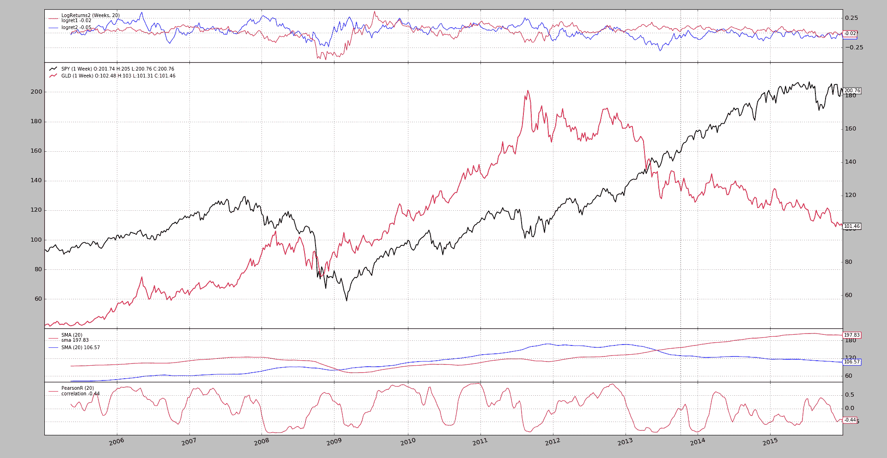

# 黄金 vs SP500

> 原文： [https://www.backtrader.com/blog/posts/2016-12-13-gold-vs-sp500/gold-vs-sp500/](https://www.backtrader.com/blog/posts/2016-12-13-gold-vs-sp500/gold-vs-sp500/)

有时，获得有关*backtrader*在哪里使用的提示有助于了解人们可能在寻找和使用该平台的目的。

参考资料：

*   [https://estrategiastrading.com/oro-bolsa-estadistica-con-python/](https://estrategiastrading.com/oro-bolsa-estadistica-con-python/)

这是一篇（西班牙语）分析两个 ETF 的文章：`GLD`vs`SPY`（实际上是*黄金*vs*S&P500*）

在不进行翻译的情况下，让我们集中讨论*反向交易者*的要点：

*   增加一个*相关性*指标。为了它，选择了`PearsonR`。

    为了实现创建它的壮举，而不是从头开始编写代码，我们制作了一个如何从`scipy`函数中实现它的示例。代码

    ```py
    class PearsonR(bt.ind.PeriodN):
        _mindatas = 2  # hint to the platform

        lines = ('correlation',)
        params = (('period', 20),)

        def next(self):
            c, p, = scipy.stats.pearsonr(self.data0.get(size=self.p.period),
                                         self.data1.get(size=self.p.period))

            self.lines.correlation[0] = c 
    ```

*   加上滚动对数回报

    该平台已经有一个对数返回的分析器，但没有*滚动*。

    增加了分析仪`LogReturnsRolling`，采用`timeframe`参数（和`compression`参数）使用与数据不同的时间段（如果需要）

    与之一起并用于可视化（内部使用*分析仪*一个`LogReturns`观察者

*   允许数据打印上的数据（轻松）。就这样

    ```py
     # Data feeds
        data0 = YahooData(dataname=args.data0, **kwargs)
        # cerebro.adddata(data0)
        cerebro.resampledata(data0, timeframe=bt.TimeFrame.Weeks)

        data1 = YahooData(dataname=args.data1, **kwargs)
        # cerebro.adddata(data1)
        cerebro.resampledata(data1, timeframe=bt.TimeFrame.Weeks)
        data1.plotinfo.plotmaster = data0 
    ```

    仅使用`plotmaster=data0`将在`data0`上绘制`data1`

从平台一开始就支持在其自身轴上和彼此上绘制移动平均线。

平台中还添加了*分析仪*和*观察者*，以及一个与博文中相同默认值的样本。

运行示例：

```py
$ ./gold-vs-sp500.py --cerebro stdstats=False --plot volume=False 
```

笔记

`stdstats=False`和`volume=False`通过移除一些常见的东西，如`CashValue`观察者和*音量*子地块，来减少图表中的混乱。

生成模拟文章大部分输出的图表。

[](../gold-vs-sp500.png)

不包括：

*   创建收益分布的图表。

    它们不适合有基于*日期时间*的 x 轴的图表。

但有了这些分配可能会到来。

## 样本使用

```py
$ ./gold-vs-sp500.py --help
usage: gold-vs-sp500.py [-h] [--data0 TICKER] [--data1 TICKER] [--offline]
                        [--fromdate FROMDATE] [--todate TODATE]
                        [--cerebro kwargs] [--broker kwargs] [--sizer kwargs]
                        [--strat kwargs] [--plot [kwargs]] [--myobserver]

Gold vs SP500 from https://estrategiastrading.com/oro-bolsa-estadistica-con-
python/

optional arguments:
  -h, --help           show this help message and exit
  --data0 TICKER       Yahoo ticker to download (default: SPY)
  --data1 TICKER       Yahoo ticker to download (default: GLD)
  --offline            Use the offline files (default: False)
  --fromdate FROMDATE  Date[time] in YYYY-MM-DD[THH:MM:SS] format (default:
                       2005-01-01)
  --todate TODATE      Date[time] in YYYY-MM-DD[THH:MM:SS] format (default:
                       2016-01-01)
  --cerebro kwargs     kwargs in key=value format (default: )
  --broker kwargs      kwargs in key=value format (default: )
  --sizer kwargs       kwargs in key=value format (default: )
  --strat kwargs       kwargs in key=value format (default: )
  --plot [kwargs]      kwargs in key=value format (default: ) 
```

## 示例代码

```py
from __future__ import (absolute_import, division, print_function,
                        unicode_literals)

# Reference
# https://estrategiastrading.com/oro-bolsa-estadistica-con-python/

import argparse
import datetime

import scipy.stats

import backtrader as bt

class PearsonR(bt.ind.PeriodN):
    _mindatas = 2  # hint to the platform

    lines = ('correlation',)
    params = (('period', 20),)

    def next(self):
        c, p, = scipy.stats.pearsonr(self.data0.get(size=self.p.period),
                                     self.data1.get(size=self.p.period))

        self.lines.correlation[0] = c

class MACrossOver(bt.Strategy):
    params = (
        ('ma', bt.ind.MovAv.SMA),
        ('pd1', 20),
        ('pd2', 20),
    )

    def __init__(self):
        ma1 = self.p.ma(self.data0, period=self.p.pd1, subplot=True)
        self.p.ma(self.data1, period=self.p.pd2, plotmaster=ma1)
        PearsonR(self.data0, self.data1)

def runstrat(args=None):
    args = parse_args(args)

    cerebro = bt.Cerebro()

    # Data feed kwargs
    kwargs = dict()

    # Parse from/to-date
    dtfmt, tmfmt = '%Y-%m-%d', 'T%H:%M:%S'
    for a, d in ((getattr(args, x), x) for x in ['fromdate', 'todate']):
        if a:
            strpfmt = dtfmt + tmfmt * ('T' in a)
            kwargs[d] = datetime.datetime.strptime(a, strpfmt)

    if not args.offline:
        YahooData = bt.feeds.YahooFinanceData
    else:
        YahooData = bt.feeds.YahooFinanceCSVData

    # Data feeds
    data0 = YahooData(dataname=args.data0, **kwargs)
    # cerebro.adddata(data0)
    cerebro.resampledata(data0, timeframe=bt.TimeFrame.Weeks)

    data1 = YahooData(dataname=args.data1, **kwargs)
    # cerebro.adddata(data1)
    cerebro.resampledata(data1, timeframe=bt.TimeFrame.Weeks)
    data1.plotinfo.plotmaster = data0

    # Broker
    kwargs = eval('dict(' + args.broker + ')')
    cerebro.broker = bt.brokers.BackBroker(**kwargs)

    # Sizer
    kwargs = eval('dict(' + args.sizer + ')')
    cerebro.addsizer(bt.sizers.FixedSize, **kwargs)

    # Strategy
    if True:
        kwargs = eval('dict(' + args.strat + ')')
        cerebro.addstrategy(MACrossOver, **kwargs)

    cerebro.addobserver(bt.observers.LogReturns2,
                        timeframe=bt.TimeFrame.Weeks,
                        compression=20)

    # Execute
    cerebro.run(**(eval('dict(' + args.cerebro + ')')))

    if args.plot:  # Plot if requested to
        cerebro.plot(**(eval('dict(' + args.plot + ')')))

def parse_args(pargs=None):

    parser = argparse.ArgumentParser(
        formatter_class=argparse.ArgumentDefaultsHelpFormatter,
        description=(
            'Gold vs SP500 from '
            'https://estrategiastrading.com/oro-bolsa-estadistica-con-python/')
    )

    parser.add_argument('--data0', required=False, default='SPY',
                        metavar='TICKER', help='Yahoo ticker to download')

    parser.add_argument('--data1', required=False, default='GLD',
                        metavar='TICKER', help='Yahoo ticker to download')

    parser.add_argument('--offline', required=False, action='store_true',
                        help='Use the offline files')

    # Defaults for dates
    parser.add_argument('--fromdate', required=False, default='2005-01-01',
                        help='Date[time] in YYYY-MM-DD[THH:MM:SS] format')

    parser.add_argument('--todate', required=False, default='2016-01-01',
                        help='Date[time] in YYYY-MM-DD[THH:MM:SS] format')

    parser.add_argument('--cerebro', required=False, default='',
                        metavar='kwargs', help='kwargs in key=value format')

    parser.add_argument('--broker', required=False, default='',
                        metavar='kwargs', help='kwargs in key=value format')

    parser.add_argument('--sizer', required=False, default='',
                        metavar='kwargs', help='kwargs in key=value format')

    parser.add_argument('--strat', required=False, default='',
                        metavar='kwargs', help='kwargs in key=value format')

    parser.add_argument('--plot', required=False, default='',
                        nargs='?', const='{}',
                        metavar='kwargs', help='kwargs in key=value format')

    return parser.parse_args(pargs)

if __name__ == '__main__':
    runstrat() 
```