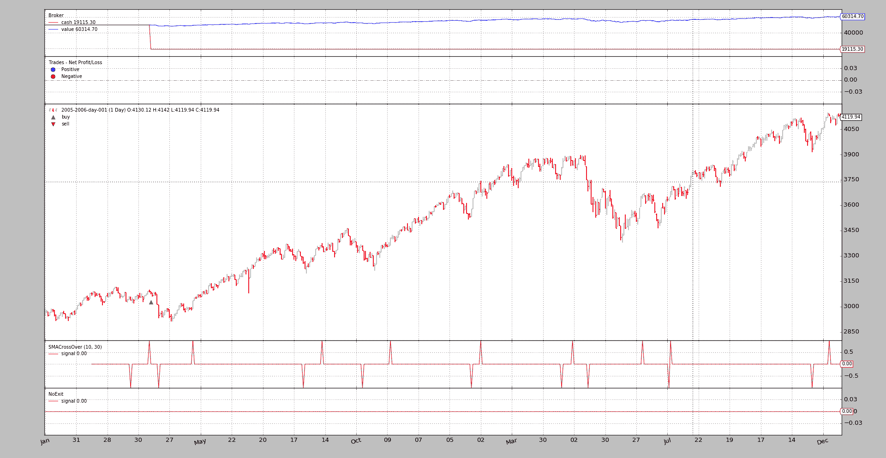
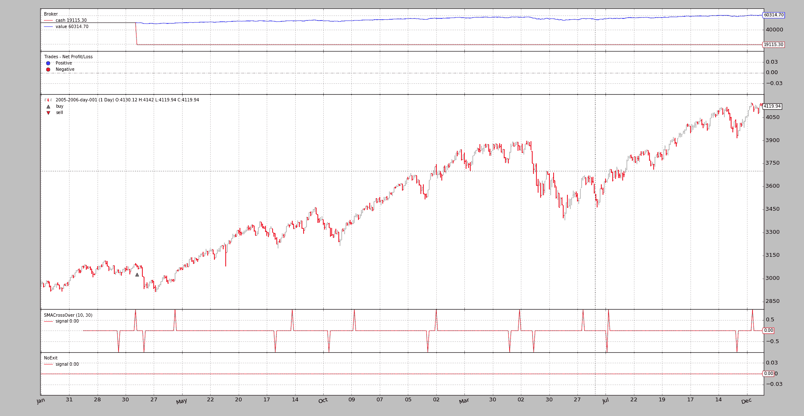
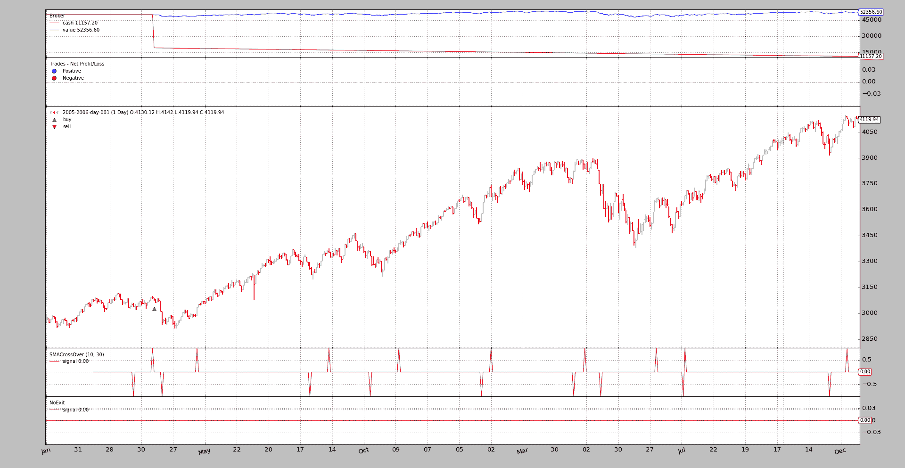
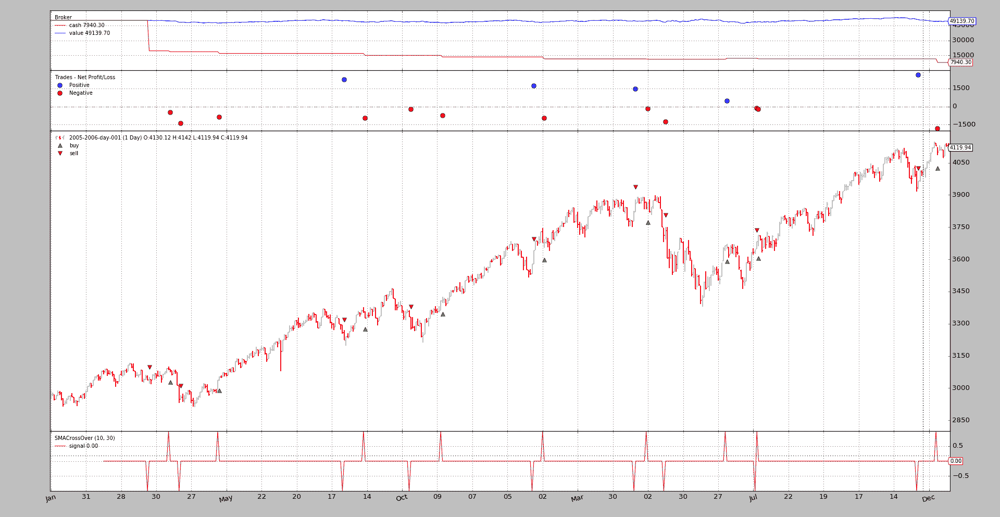
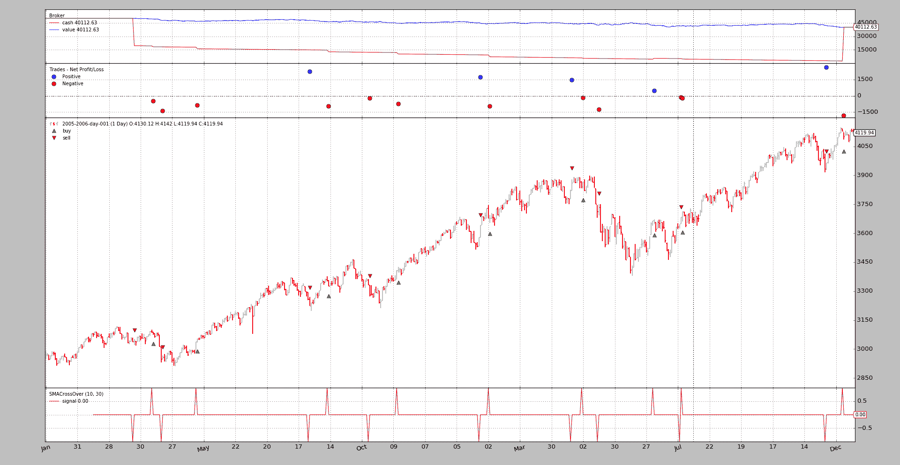
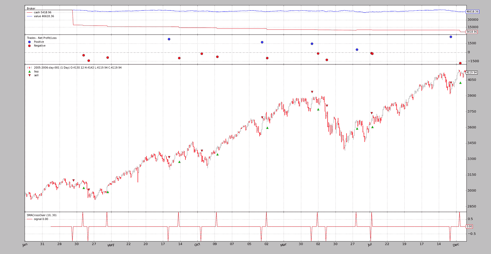

# 信用利息

> 原文： [https://www.backtrader.com/blog/posts/2016-08-22-credit-interest/credit-interest/](https://www.backtrader.com/blog/posts/2016-08-22-credit-interest/credit-interest/)

在某些情况下，房地产经纪人的现金金额可能会减少，因为资产操作包括利率。示例：

*   卖空股票

*   做多和做空 ETF

这意味着，不仅交易构成了一个系统的盈利能力，因为信贷的利息对账户有影响。

为了涵盖这种情况，*反向交易者*包括（从发布`1.8.8.96`开始）考虑这一点的功能。

## 延长佣金

即使与任何*订单/交易*无关，账户中的现金折扣也可以建模为经纪人收取的佣金。因此，鉴于*反向交易者*已经提供了一个灵活且可扩展的佣金系统，该系统已略微扩展，以支持*信用利息*。

`CommissionInfo`现在可以用两个新参数实例化：

*   `interest`（定义：`0.0`）

    如果这不是零，这是持有卖空头寸所收取的年利息。这主要是针对股票卖空

    公式：`days \* price \* abs(size) \* (interest / 365)`

    必须以绝对值表示：0.05->5%

    笔记

    可以通过重写方法来更改行为：`_get_credit_interest`

*   `interest_long`（定义：`False`）

    一些产品，如 ETF，因空头和多头头寸而收取利息。如果 ths 为`True`且`interest`为非零，则利息将在两个方向上收取

也可以通过*代理*使用以下方法设置参数：

```py
def setcommission(self,
                  commission=0.0, margin=None, mult=1.0,
                  commtype=None, percabs=True, stocklike=False,
                  interest=0.0, interest_long=False,
                  name=None) 
```

其中`interest`和`interest_long`显然与上述含义相同。

## 申请佣金

对于佣金百分比的股票，*信用利息*的典型使用场景如下

```py
import backtrader as bt

cerebro = bt.Cerebro()
comminfo = bt.CommissionInfo(commtype=bt.CommissionInfo.COMM_PERC,  # % commission
                             commission=0.005,  # 0.5%
                             percabs=True,  # perc expressed in abs terms
                             stocklike=True,
                             interest=0.05,  # 5% anual credit interest rate
                            )

cerebro.broker.addcommissioninfo(comminfo)
... 
```

如果终端用户有自己的佣金方案，这是非常有用的。

`setcommission`的一个更简单的例子：

```py
import backtrader as bt

cerebro = bt.Cerebro()
cerebro.broker.setcommission(commtype=bt.CommissionInfo.COMM_PERC,  # % commission
                             commission=0.005,  # 0.5%
                             percabs=True,  # perc expressed in abs terms
                             stocklike=True,
                             interest=0.05,  # 5% anual credit interest rate
                            )

... 
```

其余的就像其他常见的*反向交易者*脚本一样。

## 一些示例场景

### 只长，没有出口，没有兴趣

为了建立一个最低限度的底线，让我们从没有兴趣开始，让脚本只进入市场很长时间，避免退出。

```py
$ ./credit-interest.py --plot --stocklike --long --no-exit
01 2005-04-11 23:59:59 BUY  Size: +10 / Price: 3088.47 
```

[](../long-no-exit-no-interest.png)

这个想法现在应该很清楚了。在投资组合总价值之外有一个固定的现金线，并且没有扣除。

### 只长，没有出口和利息

让我们试着增加兴趣，看看会发生什么（我们将增加一个巨大的`15%`兴趣，试图注意到这些运动）

```py
$ ./credit-interest.py --plot --stocklike --long --no-exit --interest 0.15
01 2005-04-11 23:59:59 BUY  Size: +10 / Price: 3088.47 
```

[](../long-no-exit-interest-015.png)

什么都没有改变！这是意料之中的。在大多数情况下，利息仅适用于`short`头寸（使用信用证进行），这是一个仅多头头寸。

让我们告诉脚本也为`long`位置执行此操作

```py
$ ./credit-interest.py --plot --stocklike --long --no-exit --interest 0.15 --interest_long
01 2005-04-11 23:59:59 BUY  Size: +10 / Price: 3088.47 
```

[](../long-no-exit-interest-015-ilong.png)

变化就在那里。这一数字有所下降，而且数额巨大（考虑到人们的巨大兴趣）

### 长短不一

这将建立一个类似于`ETF`的模型，它有一个年利息，可以是常规利息，也可以是反向利息。首先，让我们建立基线。

```py
$ ./credit-interest.py --plot --stocklike
01 2005-03-22 23:59:59 SELL Size: -10 / Price: 3040.55
02 2005-04-11 23:59:59 BUY  Size: +10 / Price: 3088.47
...
...
34 2006-12-19 23:59:59 BUY  Size: +10 / Price: 4121.01
35 2006-12-19 23:59:59 BUY  Size: +10 / Price: 4121.01 
```

更多的操作和系统总是*在市场*中。

[](../long-short-no-interest.png)

由于`ETF`将对多头和短头操作收取利息，因此现在将为这两种操作增加利息：

```py
$ ./credit-interest.py --plot --stocklike --interest 0.15 --interest_long
01 2005-03-22 23:59:59 SELL Size: -10 / Price: 3040.55
02 2005-04-11 23:59:59 BUY  Size: +10 / Price: 3088.47
...
...
34 2006-12-19 23:59:59 BUY  Size: +10 / Price: 4121.01 
```

[](../long-short-interest-margin.png)

*ACHTUNG*：`34`操作代替`35`。似乎有些东西坏了，但…不…

收取的*利息*占用了一部分现金储备，最后一笔订单无法完成，因为*没有足够的现金*

取消*长*操作的利息费用（即使*ETF*的利息费用不真实），系统也将结束：

```py
$ ./credit-interest.py --plot --stocklike --interest 0.15
01 2005-03-22 23:59:59 SELL Size: -10 / Price: 3040.55
02 2005-04-11 23:59:59 BUY  Size: +10 / Price: 3088.47
...
...
34 2006-12-19 23:59:59 BUY  Size: +10 / Price: 4121.01
35 2006-12-19 23:59:59 BUY  Size: +10 / Price: 4121.01 
```

恢复营业直至`35th`运营。

[](../long-short-interest-only-short.png)

与原始现金的快速比较表明，最终现金已从`7490`（无利息）变为`5418`（仅对短期操作适用利息）

## 结论

这一新功能允许模拟更逼真的回溯测试场景，以尝试实现梦想：一个有利可图的系统

## 样本使用

```py
$ ./credit-interest.py --help
usage: credit-interest.py [-h] [--data DATA] [--fromdate FROMDATE]
                          [--todate TODATE] [--cash CASH] [--period1 PERIOD1]
                          [--period2 PERIOD2] [--interest INTEREST]
                          [--interest_long] [--long | --short] [--no-exit]
                          [--stocklike] [--margin MARGIN] [--mult MULT]
                          [--stake STAKE] [--plot [kwargs]]

Sample for Slippage

optional arguments:
  -h, --help            show this help message and exit
  --data DATA           Specific data to be read in (default:
                        ../../datas/2005-2006-day-001.txt)
  --fromdate FROMDATE   Starting date in YYYY-MM-DD format (default: None)
  --todate TODATE       Ending date in YYYY-MM-DD format (default: None)
  --cash CASH           Cash to start with (default: 50000)
  --period1 PERIOD1     Fast moving average period (default: 10)
  --period2 PERIOD2     Slow moving average period (default: 30)
  --interest INTEREST   Activate credit interest rate (default: 0.0)
  --interest_long       Credit interest rate for long positions (default:
                        False)
  --long                Do a long only strategy (default: False)
  --short               Do a long only strategy (default: False)
  --no-exit             The 1st taken position will not be exited (default:
                        False)
  --stocklike           Consider the asset to be stocklike (default: False)
  --margin MARGIN       Margin for future like instruments (default: 0.0)
  --mult MULT           Multiplier for future like instruments (default: 1.0)
  --stake STAKE         Stake to apply (default: 10)
  --plot [kwargs], -p [kwargs]
                        Plot the read data applying any kwargs passed For
                        example: --plot style="candle" (to plot candles)
                        (default: None) 
```

## 示例代码

```py
from __future__ import (absolute_import, division, print_function,
                        unicode_literals)

import argparse
import collections
import datetime
import itertools

import backtrader as bt

class SMACrossOver(bt.Signal):
    params = (('p1', 10), ('p2', 30),)

    def __init__(self):
        sma1 = bt.indicators.SMA(period=self.p.p1)
        sma2 = bt.indicators.SMA(period=self.p.p2)
        self.lines.signal = bt.indicators.CrossOver(sma1, sma2)

class NoExit(bt.Signal):
    def next(self):
        self.lines.signal[0] = 0.0

class St(bt.SignalStrategy):
    opcounter = itertools.count(1)

    def notify_order(self, order):
        if order.status == bt.Order.Completed:
            t = ''
            t += '{:02d}'.format(next(self.opcounter))
            t += ' {}'.format(order.data.datetime.datetime())
            t += ' BUY ' * order.isbuy() or ' SELL'
            t += ' Size: {:+d} / Price: {:.2f}'
            print(t.format(order.executed.size, order.executed.price))

def runstrat(args=None):
    args = parse_args(args)

    cerebro = bt.Cerebro()
    cerebro.broker.set_cash(args.cash)

    dkwargs = dict()
    if args.fromdate is not None:
        fromdate = datetime.datetime.strptime(args.fromdate, '%Y-%m-%d')
        dkwargs['fromdate'] = fromdate

    if args.todate is not None:
        todate = datetime.datetime.strptime(args.todate, '%Y-%m-%d')
        dkwargs['todate'] = todate

    # if dataset is None, args.data has been given
    data = bt.feeds.BacktraderCSVData(dataname=args.data, **dkwargs)
    cerebro.adddata(data)

    cerebro.signal_strategy(St)
    cerebro.addsizer(bt.sizers.FixedSize, stake=args.stake)

    sigtype = bt.signal.SIGNAL_LONGSHORT
    if args.long:
        sigtype = bt.signal.SIGNAL_LONG
    elif args.short:
        sigtype = bt.signal.SIGNAL_SHORT

    cerebro.add_signal(sigtype,
                       SMACrossOver, p1=args.period1, p2=args.period2)

    if args.no_exit:
        if args.long:
            cerebro.add_signal(bt.signal.SIGNAL_LONGEXIT, NoExit)
        elif args.short:
            cerebro.add_signal(bt.signal.SIGNAL_SHORTEXIT, NoExit)

    comminfo = bt.CommissionInfo(
        mult=args.mult,
        margin=args.margin,
        stocklike=args.stocklike,
        interest=args.interest,
        interest_long=args.interest_long)

    if True:
        cerebro.broker.addcommissioninfo(comminfo)

    cerebro.run()
    if args.plot:
        pkwargs = dict(style='bar')
        if args.plot is not True:  # evals to True but is not True
            npkwargs = eval('dict(' + args.plot + ')')  # args were passed
            pkwargs.update(npkwargs)

        cerebro.plot(**pkwargs)

def parse_args(pargs=None):

    parser = argparse.ArgumentParser(
        formatter_class=argparse.ArgumentDefaultsHelpFormatter,
        description='Sample for Slippage')

    parser.add_argument('--data', required=False,
                        default='../../datas/2005-2006-day-001.txt',
                        help='Specific data to be read in')

    parser.add_argument('--fromdate', required=False, default=None,
                        help='Starting date in YYYY-MM-DD format')

    parser.add_argument('--todate', required=False, default=None,
                        help='Ending date in YYYY-MM-DD format')

    parser.add_argument('--cash', required=False, action='store',
                        type=float, default=50000,
                        help=('Cash to start with'))

    parser.add_argument('--period1', required=False, action='store',
                        type=int, default=10,
                        help=('Fast moving average period'))

    parser.add_argument('--period2', required=False, action='store',
                        type=int, default=30,
                        help=('Slow moving average period'))

    parser.add_argument('--interest', required=False, action='store',
                        default=0.0, type=float,
                        help=('Activate credit interest rate'))

    parser.add_argument('--interest_long', required=False, action='store_true',
                        help=('Credit interest rate for long positions'))

    pgroup = parser.add_mutually_exclusive_group()
    pgroup.add_argument('--long', required=False, action='store_true',
                        help=('Do a long only strategy'))

    pgroup.add_argument('--short', required=False, action='store_true',
                        help=('Do a long only strategy'))

    parser.add_argument('--no-exit', required=False, action='store_true',
                        help=('The 1st taken position will not be exited'))

    parser.add_argument('--stocklike', required=False, action='store_true',
                        help=('Consider the asset to be stocklike'))

    parser.add_argument('--margin', required=False, action='store',
                        default=0.0, type=float,
                        help=('Margin for future like instruments'))

    parser.add_argument('--mult', required=False, action='store',
                        default=1.0, type=float,
                        help=('Multiplier for future like instruments'))

    parser.add_argument('--stake', required=False, action='store',
                        default=10, type=int,
                        help=('Stake to apply'))

    # Plot options
    parser.add_argument('--plot', '-p', nargs='?', required=False,
                        metavar='kwargs', const=True,
                        help=('Plot the read data applying any kwargs passed\n'
                              '\n'
                              'For example:\n'
                              '\n'
                              '  --plot style="candle" (to plot candles)\n'))

    if pargs is not None:
        return parser.parse_args(pargs)

    return parser.parse_args()

if __name__ == '__main__':
    runstrat() 
```