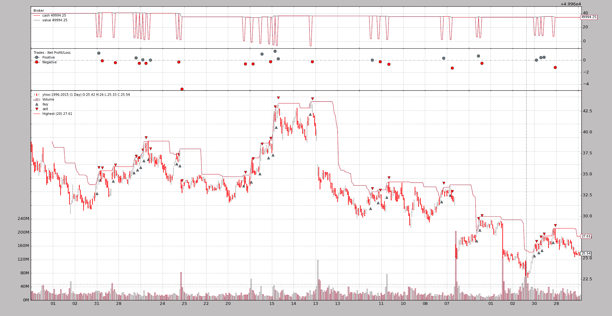

# 粉红鱼挑战赛

> 原文： [https://www.backtrader.com/blog/posts/2016-07-29-pinkfish-challenge/pinkfish-challenge/](https://www.backtrader.com/blog/posts/2016-07-29-pinkfish-challenge/pinkfish-challenge/)

（样本和更改添加到 1.7.1.93 版）

一路上，*反向交易者*已经变得成熟，有了新的功能，当然还有复杂性。许多新功能是在用户提出请求、评论和问题后引入的。小挑战已经证明，大多数设计决策至少没有那么错误，即使有些事情本可以用许多其他方式完成，有时可能用更好的方式。

因此，这些小挑战似乎是为了测试平台对新的未计划和未预期情况的灵活性和适应性，而*小鱼*挑战是另一个挑战。*pinkfish*是另一个 Python 回溯测试框架（列在`README`中），可在[pinkfish](http://fja05680.github.io/pinkfish/)下找到。该网站包含需要解决的难题：

*   *“收盘买入”当天不允许“创下 20 天新高”*

其中一个*功能*给出了平台如何操作的提示：

*   *使用每日数据（vs 分钟或滴答数据）进行日内交易*

此外，由于当时现有的回溯测试库的复杂性，作者被*推迟了*。对于*反向交易者*（当时还处于婴儿期）来说，这是否成立，是*小粉鱼*作者自己要回答的问题。

## 无 mod 解决方案

*backtrader*支持数据馈送过滤器和允许

```py
breaking a *daily bar* in 2 parts to let people buy after having seen only the
opening price. The 2nd part of the day (high, low, close) is evaluated in a
2nd tick. This effectively achieves the *uses daily data (vs minute or tick
data) for intraday trading*. 
```

此筛选器尝试在不涉及内置重放层的情况下执行完整的*重放*操作。

该过滤器的一个明显演变是，首先将每日酒吧分成 2 个酒吧（开放、高、低），然后是 2 个<sup>和</sup>完整酒吧（开放、高、低、关闭）。

*收盘买入*是通过发出以`backtrader.Order.Close`为执行类型的订单来实现的。

这在`-no-replay`提供的样本中。执行：

```py
$ ./pinkfish-challenge.py --no-replay 
```

部分输出：

```py
...
0955,0478,0478,2006-11-22T00:00:00,27.51,28.56,27.29,28.49,16027900.00,0.00
High 28.56 > Highest 28.56
LAST 19 highs: array('d', [25.33, 25.6, 26.4, 26.7, 26.62, 26.6, 26.7, 26.7, 27.15, 27.25, 27.65, 27.5, 27.62,   27.5, 27.5, 27.33, 27.05, 27.04, 27.34])
-- BUY on date: 2006-11-22
-- BUY Completed on: 2006-11-22
-- BUY Price: 28.49
0956,0478,0478,2006-11-22T23:59:59.999989,27.51,28.56,27.29,28.49,32055800.00,0.00
... 
```

它是有效的…

*   看完当天的 1<sup>st</sup>部分后（行：`0955`

*   如果一个新的 20 天高点到位，将发出`Close`指令

*   并且订单以当天第 2<sup>部分</sup>的*收盘价*执行（行：`0956`

    收盘价为`28.49`，这是策略中`notify_order`中的*买入价*

输出包含相当详细的部分，仅用于识别最后的`20`高点。样品销售也很快，让行为测试几次。但保持期可以用`--sellafter N`来更改，其中`N`是取消前要保持的条数（见末尾*用法*）

### `no mod`解决方案的问题

这实际上不是一个**回放**解决方案，如果订单的*执行类型*从`Close`更改为`Market`就可以看出这一点。新的执行：

```py
$ ./pinkfish-challenge.py --no-replay --market 
```

现在，与上述同期的产量为：

```py
...
0955,0478,0478,2006-11-22T00:00:00,27.51,28.56,27.29,28.49,16027900.00,0.00
High 28.56 > Highest 28.56
LAST 19 highs: array('d', [25.33, 25.6, 26.4, 26.7, 26.62, 26.6, 26.7, 26.7, 27.15, 27.25, 27.65, 27.5, 27.62, 27.5, 27.5, 27.33, 27.05, 27.04, 27.34])
-- BUY on date: 2006-11-22
-- BUY Completed on: 2006-11-22
-- BUY Price: 27.51
0956,0478,0478,2006-11-22T23:59:59.999989,27.51,28.56,27.29,28.49,32055800.00,0.00
... 
```

而且问题很容易识别

*   由于*市场*指令采用的是第二<sup>和</sup>栏中的第 1<sup>个</sup>价格，即`27.51`，不幸的是*开盘*，因此该指令的执行价格不是*收盘*价格，而是*开盘*价格当日价格，不再提供*。*

     *这是因为过滤器不是真正的*重放*，而是将棒分成两部分，并进行软*重放** 

 *## 正确的“mod”解决方案

还获得了选择*收盘价*的`Market`订单。

这包括：

*   一种过滤器，它将条分成两部分

*   与*backtrader*中提供的标准*回放*功能兼容

    在这种情况下，第 2<sup>和</sup>条将仅由`close`价格组成，即使显示屏显示完整的条，内部机器也只会将订单与*勾号*匹配

在*backtrader*中链接过滤器已经是可能的，但未考虑此用例：

*   从单个数据“心跳”中生成 2 个数据“心跳”

    在这次挑战之前，它是关于让酒吧*合并成更大的酒吧*。

在考虑新的数据*心跳*之前，核心机构加载条中的一个小延伸允许过滤器将条的 2<sup>第</sup>部分添加到内部存储中，以便重新处理。因为它是一个*扩展*而不是*修改*，所以它没有影响。

这项挑战还使我们有机会：

*   再看看在*反向交易者*开头为`Close`订单编写的早期代码。

    这里对几行和`if`条件进行了修改，使匹配的`Close`订单更具逻辑性，如果可能的话，可以立即将其交付给系统（在交付匹配之前，大多数情况下会延迟 1 个小节，即使匹配到正确的小节）

这些变化之后有一件好事：

*   过滤器中的逻辑要简单得多，因为没有微妙的*重播*尝试。回放由*回放*过滤器完成。

断条 1<sup>st</sup>部分过滤器解剖：

1.  复制传入的数据栏

2.  复制为*OHL*条（无关闭）

3.  将时间更改为*日期*+*会话开始*时间

4.  移除部分音量（与过滤器参数*closevol*指定）

5.  取消`OpenInterest`（当天结束时提供）

6.  删除`close`价格，替换为*OHL*的平均值

7.  将条添加到内部*堆栈*中，以便下一个过滤器或策略立即处理（由*重播*过滤器接管）

断棒的 2<sup>nd</sup>部分解剖：

1.  复制传入的数据栏

2.  将 OHL 价格替换为`Close`价格

3.  将时间更改为*日期*+*会期和*时间

4.  移除体积的另一部分（与过滤器参数*closevol*指定）

5.  设置`OpenInterest`

6.  将该条添加到内部*隐藏*中，作为下一个数据心跳进行延迟处理，而不是从数据中获取价格

守则：

```py
 # Make a copy of current data for ohlbar
        ohlbar = [data.lines[i][0] for i in range(data.size())]
        closebar = ohlbar[:]  # Make a copy for the close

        # replace close price with o-h-l average
        ohlprice = ohlbar[data.Open] + ohlbar[data.High] + ohlbar[data.Low]
        ohlbar[data.Close] = ohlprice / 3.0

        vol = ohlbar[data.Volume]  # adjust volume
        ohlbar[data.Volume] = vohl = int(vol * (1.0 - self.p.closevol))

        oi = ohlbar[data.OpenInterest]  # adjust open interst
        ohlbar[data.OpenInterest] = 0

        # Adjust times
        dt = datetime.datetime.combine(datadt, data.p.sessionstart)
        ohlbar[data.DateTime] = data.date2num(dt)

        # Adjust closebar to generate a single tick -> close price
        closebar[data.Open] = cprice = closebar[data.Close]
        closebar[data.High] = cprice
        closebar[data.Low] = cprice
        closebar[data.Volume] = vol - vohl
        ohlbar[data.OpenInterest] = oi

        # Adjust times
        dt = datetime.datetime.combine(datadt, data.p.sessionend)
        closebar[data.DateTime] = data.date2num(dt)

        # Update stream
        data.backwards(force=True)  # remove the copied bar from stream
        data._add2stack(ohlbar)  # add ohlbar to stack
        # Add 2nd part to stash to delay processing to next round
        data._add2stack(closebar, stash=True)

        return False  # the length of the stream was not changed 
```

在不禁用*回放*和`Close`的情况下执行（让我们添加绘图）：

```py
$ ./pinkfish-challenge.py --plot 
```

同期产量：

```py
...
0955,0478,0478,2006-11-22T00:00:00,27.51,28.56,27.29,27.79,16027900.00,0.00
High 28.56 > Highest 28.56
LAST 19 highs: array('d', [25.33, 25.6, 26.4, 26.7, 26.62, 26.6, 26.7, 26.7, 27.15, 27.25, 27.65, 27.5, 27.62, 27.5, 27.5, 27.33, 27.05, 27.04, 27.34])
-- BUY on date: 2006-11-22
-- BUY Completed on: 2006-11-22
-- BUY Price: 28.49
0956,0478,0478,2006-11-22T23:59:59.999989,27.51,28.56,27.29,28.49,32055800.00,0.00
... 
```

一切正常，`28.49`的*收盘价*已经取下。

还有图表。

[](../pinkfish-challenge.png)

最后但并非最不重要的是检查修改是否合理：

```py
$ ./pinkfish-challenge.py --market 
```

同期产量：

```py
...
0955,0478,0478,2006-11-22T00:00:00,27.51,28.56,27.29,27.79,16027900.00,0.00
High 28.56 > Highest 28.56
LAST 19 highs: array('d', [25.33, 25.6, 26.4, 26.7, 26.62, 26.6, 26.7, 26.7, 27.15, 27.25, 27.65, 27.5, 27.62, 27.5, 27.5, 27.33, 27.05, 27.04, 27.34])
-- BUY on date: 2006-11-22
-- BUY Completed on: 2006-11-22
-- BUY Price: 28.49
0956,0478,0478,2006-11-22T23:59:59.999989,27.51,28.56,27.29,28.49,32055800.00,0.00
.. 
```

现在`Market`订单选择的`28.49`价格与`Close`订单的价格相同，在这个特定的用例中，这是预期的，因为*重放*正在发生，而破损的日线的第 2<sup>和</sup>部分有一个*滴答*`28.49`，这就是*收盘*价格

## 样本的使用

```py
$ ./pinkfish-challenge.py --help
usage: pinkfish-challenge.py [-h] [--data DATA] [--fromdate FROMDATE]
                             [--todate TODATE] [--cash CASH]
                             [--sellafter SELLAFTER] [--highperiod HIGHPERIOD]
                             [--no-replay] [--market] [--oldbuysell]
                             [--plot [kwargs]]

Sample for pinkfish challenge

optional arguments:
  -h, --help            show this help message and exit
  --data DATA           Data to be read in (default:
                        ../../datas/yhoo-1996-2015.txt)
  --fromdate FROMDATE   Starting date in YYYY-MM-DD format (default:
                        2005-01-01)
  --todate TODATE       Ending date in YYYY-MM-DD format (default: 2006-12-31)
  --cash CASH           Cash to start with (default: 50000)
  --sellafter SELLAFTER
                        Sell after so many bars in market (default: 2)
  --highperiod HIGHPERIOD
                        Period to look for the highest (default: 20)
  --no-replay           Use Replay + replay filter (default: False)
  --market              Use Market exec instead of Close (default: False)
  --oldbuysell          Old buysell plot behavior - ON THE PRICE (default:
                        False)
  --plot [kwargs], -p [kwargs]
                        Plot the read data applying any kwargs passed For
                        example (escape the quotes if needed): --plot
                        style="candle" (to plot candles) (default: None) 
```

## 还有代码本身

```py
from __future__ import (absolute_import, division, print_function,
                        unicode_literals)

import argparse
import datetime

import backtrader as bt
import backtrader.indicators as btind

class DayStepsCloseFilter(bt.with_metaclass(bt.MetaParams, object)):
    '''
    Replays a bar in 2 steps:

      - In the 1st step the "Open-High-Low" could be evaluated to decide if to
        act on the close (the close is still there ... should not be evaluated)

      - If a "Close" order has been executed

        In this 1st fragment the "Close" is replaced through the "open" althoug
        other alternatives would be possible like high - low average, or an
        algorithm based on where the "close" ac

      and

      - Open-High-Low-Close
    '''
    params = (
        ('cvol', 0.5),  # 0 -> 1 amount of volume to keep for close
    )

    def __init__(self, data):
        self.pendingbar = None

    def __call__(self, data):
        # Make a copy of the new bar and remove it from stream
        closebar = [data.lines[i][0] for i in range(data.size())]
        datadt = data.datetime.date()  # keep the date

        ohlbar = closebar[:]  # Make an open-high-low bar

        # Adjust volume
        ohlbar[data.Volume] = int(closebar[data.Volume] * (1.0 - self.p.cvol))

        dt = datetime.datetime.combine(datadt, data.p.sessionstart)
        ohlbar[data.DateTime] = data.date2num(dt)

        dt = datetime.datetime.combine(datadt, data.p.sessionend)
        closebar[data.DateTime] = data.date2num(dt)

        # Update stream
        data.backwards()  # remove the copied bar from stream
        # Overwrite the new data bar with our pending data - except start point
        if self.pendingbar is not None:
            data._updatebar(self.pendingbar)

        self.pendingbar = closebar  # update the pending bar to the new bar
        data._add2stack(ohlbar)  # Add the openbar to the stack for processing

        return False  # the length of the stream was not changed

    def last(self, data):
        '''Called when the data is no longer producing bars
        Can be called multiple times. It has the chance to (for example)
        produce extra bars'''
        if self.pendingbar is not None:
            data.backwards()  # remove delivered open bar
            data._add2stack(self.pendingbar)  # add remaining
            self.pendingbar = None  # No further action
            return True  # something delivered

        return False  # nothing delivered here

class DayStepsReplayFilter(bt.with_metaclass(bt.MetaParams, object)):
    '''
    Replays a bar in 2 steps:

      - In the 1st step the "Open-High-Low" could be evaluated to decide if to
        act on the close (the close is still there ... should not be evaluated)

      - If a "Close" order has been executed

        In this 1st fragment the "Close" is replaced through the "open" althoug
        other alternatives would be possible like high - low average, or an
        algorithm based on where the "close" ac

      and

      - Open-High-Low-Close
    '''
    params = (
        ('closevol', 0.5),  # 0 -> 1 amount of volume to keep for close
    )

    # replaying = True

    def __init__(self, data):
        self.lastdt = None
        pass

    def __call__(self, data):
        # Make a copy of the new bar and remove it from stream
        datadt = data.datetime.date()  # keep the date

        if self.lastdt == datadt:
            return False  # skip bars that come again in the filter

        self.lastdt = datadt  # keep ref to last seen bar

        # Make a copy of current data for ohlbar
        ohlbar = [data.lines[i][0] for i in range(data.size())]
        closebar = ohlbar[:]  # Make a copy for the close

        # replace close price with o-h-l average
        ohlprice = ohlbar[data.Open] + ohlbar[data.High] + ohlbar[data.Low]
        ohlbar[data.Close] = ohlprice / 3.0

        vol = ohlbar[data.Volume]  # adjust volume
        ohlbar[data.Volume] = vohl = int(vol * (1.0 - self.p.closevol))

        oi = ohlbar[data.OpenInterest]  # adjust open interst
        ohlbar[data.OpenInterest] = 0

        # Adjust times
        dt = datetime.datetime.combine(datadt, data.p.sessionstart)
        ohlbar[data.DateTime] = data.date2num(dt)

        # Adjust closebar to generate a single tick -> close price
        closebar[data.Open] = cprice = closebar[data.Close]
        closebar[data.High] = cprice
        closebar[data.Low] = cprice
        closebar[data.Volume] = vol - vohl
        ohlbar[data.OpenInterest] = oi

        # Adjust times
        dt = datetime.datetime.combine(datadt, data.p.sessionend)
        closebar[data.DateTime] = data.date2num(dt)

        # Update stream
        data.backwards(force=True)  # remove the copied bar from stream
        data._add2stack(ohlbar)  # add ohlbar to stack
        # Add 2nd part to stash to delay processing to next round
        data._add2stack(closebar, stash=True)

        return False  # the length of the stream was not changed

class St(bt.Strategy):
    params = (
        ('highperiod', 20),
        ('sellafter', 2),
        ('market', False),
    )

    def __init__(self):
        pass

    def start(self):
        self.callcounter = 0
        txtfields = list()
        txtfields.append('Calls')
        txtfields.append('Len Strat')
        txtfields.append('Len Data')
        txtfields.append('Datetime')
        txtfields.append('Open')
        txtfields.append('High')
        txtfields.append('Low')
        txtfields.append('Close')
        txtfields.append('Volume')
        txtfields.append('OpenInterest')
        print(','.join(txtfields))

        self.lcontrol = 0  # control if 1st or 2nd call
        self.inmarket = 0

        # Get the highest but delayed 1 ... to avoid "today"
        self.highest = btind.Highest(self.data.high,
                                     period=self.p.highperiod,
                                     subplot=False)

    def notify_order(self, order):
        if order.isbuy() and order.status == order.Completed:
            print('-- BUY Completed on:',
                  self.data.num2date(order.executed.dt).strftime('%Y-%m-%d'))
            print('-- BUY Price:', order.executed.price)

    def next(self):
        self.callcounter += 1

        txtfields = list()
        txtfields.append('%04d' % self.callcounter)
        txtfields.append('%04d' % len(self))
        txtfields.append('%04d' % len(self.data0))
        txtfields.append(self.data.datetime.datetime(0).isoformat())
        txtfields.append('%.2f' % self.data0.open[0])
        txtfields.append('%.2f' % self.data0.high[0])
        txtfields.append('%.2f' % self.data0.low[0])
        txtfields.append('%.2f' % self.data0.close[0])
        txtfields.append('%.2f' % self.data0.volume[0])
        txtfields.append('%.2f' % self.data0.openinterest[0])
        print(','.join(txtfields))

        if not self.position:
            if len(self.data) > self.lcontrol:
                if self.data.high == self.highest:  # today is highest!!!
                    print('High %.2f > Highest %.2f' %
                          (self.data.high[0], self.highest[0]))
                    print('LAST 19 highs:',
                          self.data.high.get(size=19, ago=-1))
                    print('-- BUY on date:',
                          self.data.datetime.date().strftime('%Y-%m-%d'))
                    ex = bt.Order.Market if self.p.market else bt.Order.Close
                    self.buy(exectype=ex)
                    self.inmarket = len(self)  # reset period in market

        else:  # in the market
            if (len(self) - self.inmarket) >= self.p.sellafter:
                self.sell()

        self.lcontrol = len(self.data)

def runstrat():
    args = parse_args()

    cerebro = bt.Cerebro()
    cerebro.broker.set_cash(args.cash)
    cerebro.broker.set_eosbar(True)

    dkwargs = dict()
    if args.fromdate:
        fromdate = datetime.datetime.strptime(args.fromdate, '%Y-%m-%d')
        dkwargs['fromdate'] = fromdate

    if args.todate:
        todate = datetime.datetime.strptime(args.todate, '%Y-%m-%d')
        dkwargs['todate'] = todate

    if args.no_replay:
        data = bt.feeds.YahooFinanceCSVData(dataname=args.data,
                                            timeframe=bt.TimeFrame.Days,
                                            compression=1,
                                            **dkwargs)
        data.addfilter(DayStepsCloseFilter)
        cerebro.adddata(data)
    else:
        data = bt.feeds.YahooFinanceCSVData(dataname=args.data,
                                            timeframe=bt.TimeFrame.Minutes,
                                            compression=1,
                                            **dkwargs)
        data.addfilter(DayStepsReplayFilter)
        cerebro.replaydata(data, timeframe=bt.TimeFrame.Days, compression=1)

    cerebro.addstrategy(St,
                        sellafter=args.sellafter,
                        highperiod=args.highperiod,
                        market=args.market)

    cerebro.run(runonce=False, preload=False, oldbuysell=args.oldbuysell)
    if args.plot:
        pkwargs = dict(style='bar')
        if args.plot is not True:  # evals to True but is not True
            npkwargs = eval('dict(' + args.plot + ')')  # args were passed
            pkwargs.update(npkwargs)

        cerebro.plot(**pkwargs)

def parse_args(pargs=None):

    parser = argparse.ArgumentParser(
        formatter_class=argparse.ArgumentDefaultsHelpFormatter,
        description='Sample for pinkfish challenge')

    parser.add_argument('--data', required=False,
                        default='../../datas/yhoo-1996-2015.txt',
                        help='Data to be read in')

    parser.add_argument('--fromdate', required=False,
                        default='2005-01-01',
                        help='Starting date in YYYY-MM-DD format')

    parser.add_argument('--todate', required=False,
                        default='2006-12-31',
                        help='Ending date in YYYY-MM-DD format')

    parser.add_argument('--cash', required=False, action='store',
                        type=float, default=50000,
                        help=('Cash to start with'))

    parser.add_argument('--sellafter', required=False, action='store',
                        type=int, default=2,
                        help=('Sell after so many bars in market'))

    parser.add_argument('--highperiod', required=False, action='store',
                        type=int, default=20,
                        help=('Period to look for the highest'))

    parser.add_argument('--no-replay', required=False, action='store_true',
                        help=('Use Replay + replay filter'))

    parser.add_argument('--market', required=False, action='store_true',
                        help=('Use Market exec instead of Close'))

    parser.add_argument('--oldbuysell', required=False, action='store_true',
                        help=('Old buysell plot behavior - ON THE PRICE'))

    # Plot options
    parser.add_argument('--plot', '-p', nargs='?', required=False,
                        metavar='kwargs', const=True,
                        help=('Plot the read data applying any kwargs passed\n'
                              '\n'
                              'For example (escape the quotes if needed):\n'
                              '\n'
                              '  --plot style="candle" (to plot candles)\n'))

    if pargs is not None:
        return parser.parse_args(pargs)

    return parser.parse_args()

if __name__ == '__main__':
    runstrat() 
```*