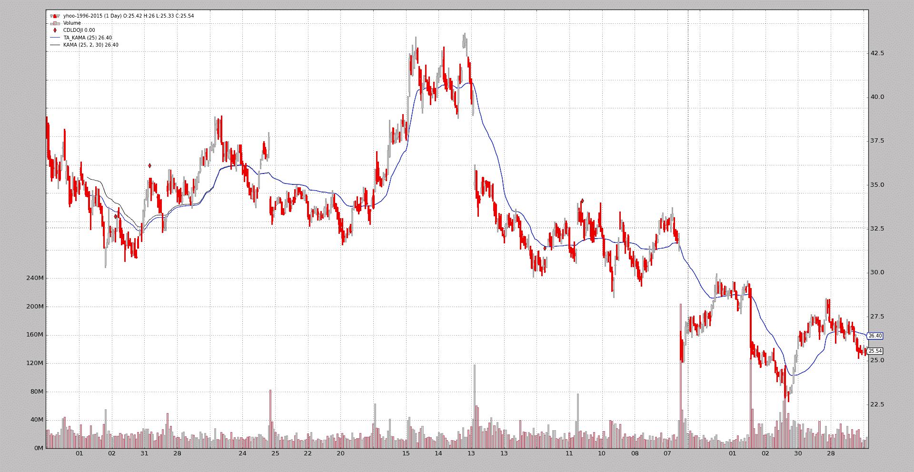
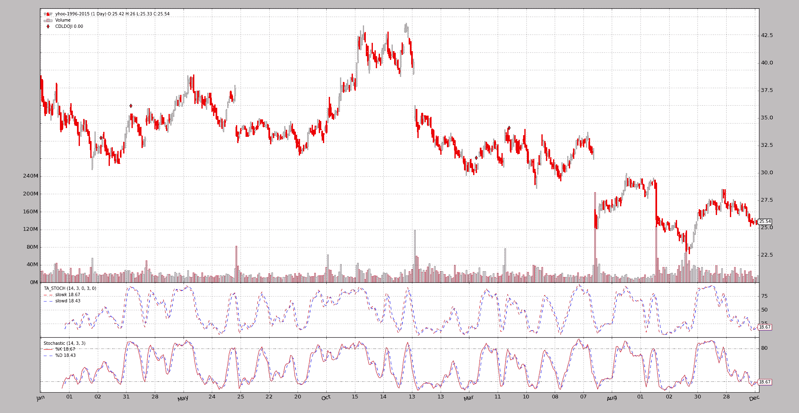
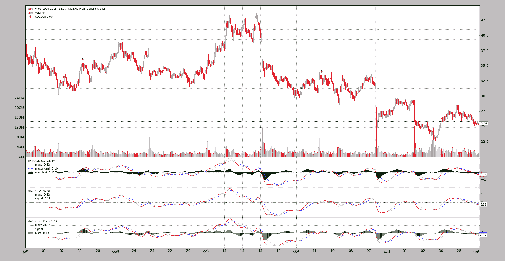
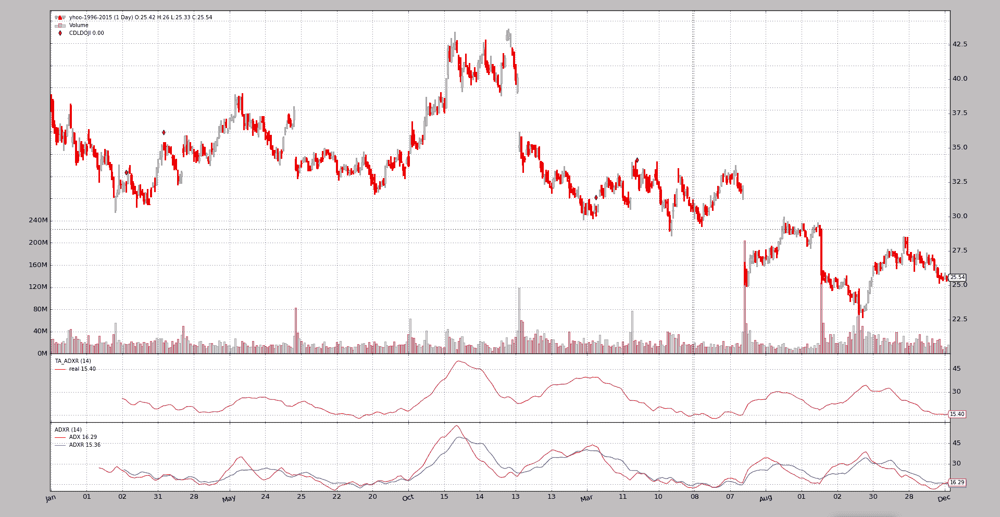
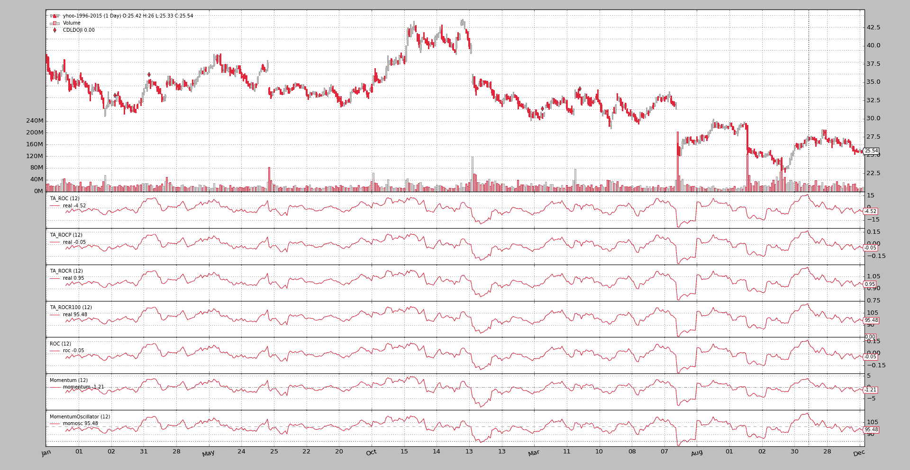

# 自由党

> 原文： [https://www.backtrader.com/blog/posts/2016-07-26-talib-integration/talib-integration/](https://www.backtrader.com/blog/posts/2016-07-26-talib-integration/talib-integration/)

即使*backtrader*提供的内置指标数量已经很高，而开发一个指标主要是定义输入、输出并以自然的方式编写公式，也有人希望使用*TA-LIB*。其中一些原因：

*   指标*X*在库中，不在*backtrader*中（作者乐意接受请求）

*   *TA-LIB*行为众所周知，人们相信好的老东西

为了满足每一种口味，提供了*TA-LIB*集成。

## 要求

*   [TA 库的 Python 包装器](https://github.com/mrjbq7/ta-lib)

*   它需要的任何依赖项（例如*numpy*）

安装详情见*GitHub*存储库

## 使用*ta 库*

就像使用*反向交易者*中内置的任何指标一样简单。*简单移动平均线*的示例。首先是反向交易者*1：

```py
import backtrader as bt

class MyStrategy(bt.Strategy):
    params = (('period', 20),)

    def __init__(self):
        self.sma = bt.indicators.SMA(self.data, period=self.p.period)
        ...

... 
```

现在来看*ta lib*示例：

```py
import backtrader as bt

class MyStrategy(bt.Strategy):
    params = (('period', 20),)

    def __init__(self):
        self.sma = bt.talib.SMA(self.data, timeperiod=self.p.period)
        ...

... 
```

瞧！当然，*ta lib*指标的*参数*是由库本身定义的，而不是由*backtrader*定义的。在这种情况下，*ta lib*中的*SMA*采用一个名为`timeperiod`的参数来定义操作窗口的大小。

对于需要多个输入的指标，例如*随机*：

```py
import backtrader as bt

class MyStrategy(bt.Strategy):
    params = (('period', 20),)

    def __init__(self):
        self.stoc = bt.talib.STOCH(self.data.high, self.data.low, self.data.close,
                                   fastk_period=14, slowk_period=3, slowd_period=3)

        ...

... 
```

注意`high`、`low`和`close`是如何分别传递的。人们总是可以通过`open`而不是`low`（或任何其他数据系列）和实验。

*ta lib*指标文档自动解析并添加到*backtrader*文档中。您也可以查看*ta 库*源代码/文档。或者偶尔做：

```py
print(bt.talib.SMA.__doc__) 
```

在这种情况下，输出：

```py
SMA([input_arrays], [timeperiod=30])

Simple Moving Average (Overlap Studies)

Inputs:
    price: (any ndarray)
Parameters:
    timeperiod: 30
Outputs:
    real 
```

其中提供了一些信息：

*   哪个*输入*是预期的（*忽略``ndarray``注释*，因为 backtrader 在后台管理转换）

*   哪些*参数*和哪些默认值

*   哪个 outpu*行*提供指示器

### 移动平均线和马乌类型

为`bt.talib.STOCH`等指标选择具体的*移动平均线*，标准*ta lib*`MA_Type`与`bactrader.talib.MA_Type`一致。例如：

```py
import backtrader as bt
print('SMA:', bt.talib.MA_Type.SMA)
print('T3:', bt.talib.MA_Type.T3) 
```

## 绘制 ta lib 指示器

与常规使用一样，绘制*ta lib*指示器也没有什么特别的事情要做。

笔记

输出*蜡烛*的指示器（所有寻找烛台图案的指示器）提供二进制输出：0 或 100。为了避免在图表中添加`subplot`，有一个自动绘图转换，在识别模式的时间点，在*数据*上绘制它们。

## 实例和比较

以下是一些*ta lib*指标与*backtrader*中等效内置指标的输出对比图。考虑：

*   *ta lib*指示器在绘图上有一个`TA_`前缀。这是由示例专门完成的，以帮助用户确定

*   *移动平均线*（如果两者的结果相同）将*绘制在另一个现有*移动平均线*的*顶部。这两个指标不能单独看到，如果是这样的话，测试是通过的。

*   所有样品包括一个`CDLDOJI`指示剂作为参考

### 卡马（考夫曼移动平均线）

这是 1<sup>st</sup>示例，因为它是唯一（从样本直接比较的所有指标中）有差异的：

*   样本的初始值不同

*   在某个时间点，值会收敛，并且两个*KAMA*实现具有相同的行为。

分析了*ta 库*源代码后：

*   *ta lib*中的实现为*KAMA*的 1<sup>st</sup>值做出了非行业标准的选择。

    从源代码引用的源代码中可以看到选择）：*这里使用的是昨天的价格，与之前的 KAMA 一样。*

*反向交易者*进行与*股票图表*相同的常规选择：

*   [卡马股票图表](http://stockcharts.com/school/doku.php?id=chart_school:technical_indicators:kaufman_s_adaptive_moving_average)

    *由于我们需要一个初始值来开始计算，第一个 KAMA 只是一个简单的移动平均值*

因此不同。此外：

*   *ta lib*`KAMA`实现不允许指定*考夫曼*定义的*可伸缩常数*调整的`fast`和`slow`周期。

示例执行：

```py
$ ./talibtest.py --plot --ind kama 
```

输出

[](../ta-lib-kama.png)

### SMA

```py
$ ./talibtest.py --plot --ind sma 
```

输出

[](../ta-lib-sma.png)

### 美国发动机制造商协会

```py
$ ./talibtest.py --plot --ind ema 
```

输出

[](../ta-lib-ema.png)

### 随机的

```py
$ ./talibtest.py --plot --ind stoc 
```

输出

[](../ta-lib-stoc.png)

### RSI

```py
$ ./talibtest.py --plot --ind rsi 
```

输出

[](../ta-lib-rsi.png)

### MACD

```py
$ ./talibtest.py --plot --ind macd 
```

输出

[](../ta-lib-macd.png)

### 布林线

```py
$ ./talibtest.py --plot --ind bollinger 
```

输出

[](../ta-lib-bollinger.png)

### 阿隆

请注意，*ta lib*选择先将*放下*行，与*backtrader*内置指示器相比，颜色颠倒。

```py
$ ./talibtest.py --plot --ind aroon 
```

输出

[](../ta-lib-aroon.png)

### 终极振荡器

```py
$ ./talibtest.py --plot --ind ultimate 
```

输出

[](../ta-lib-ultimate.png)

### 特里克斯

```py
$ ./talibtest.py --plot --ind trix 
```

输出

[](../ta-lib-trix.png)

### ADXR

这里*反向交易者*提供`ADX`和`ADXR`两条线。

```py
$ ./talibtest.py --plot --ind adxr 
```

输出

[](../ta-lib-adxr.png)

### 德马

```py
$ ./talibtest.py --plot --ind dema 
```

输出

[](../ta-lib-dema.png)

### 特马

```py
$ ./talibtest.py --plot --ind tema 
```

输出

[](../ta-lib-tema.png)

### PPO

这里的*反向交易者*不仅提供了`ppo`线，还提供了一种更传统的`macd`方法。

```py
$ ./talibtest.py --plot --ind ppo 
```

输出

[](../ta-lib-ppo.png)

### 威廉斯

```py
$ ./talibtest.py --plot --ind williamsr 
```

输出

[](../ta-lib-williamsr.png)

### 世界车王争霸赛

所有指标显示的形状完全相同，但如何跟踪*动量*或*变化率*有几种定义

```py
$ ./talibtest.py --plot --ind roc 
```

输出

[](../ta-lib-roc.png)

## 样本使用

```py
$ ./talibtest.py --help
usage: talibtest.py [-h] [--data0 DATA0] [--fromdate FROMDATE]
                    [--todate TODATE]
                    [--ind {sma,ema,stoc,rsi,macd,bollinger,aroon,ultimate,trix,kama,adxr,dema,tema,ppo,williamsr,roc}]
                    [--no-doji] [--use-next] [--plot [kwargs]]

Sample for sizer

optional arguments:
  -h, --help            show this help message and exit
  --data0 DATA0         Data to be read in (default:
                        ../../datas/yhoo-1996-2015.txt)
  --fromdate FROMDATE   Starting date in YYYY-MM-DD format (default:
                        2005-01-01)
  --todate TODATE       Ending date in YYYY-MM-DD format (default: 2006-12-31)
  --ind {sma,ema,stoc,rsi,macd,bollinger,aroon,ultimate,trix,kama,adxr,dema,tema,ppo,williamsr,roc}
                        Which indicator pair to show together (default: sma)
  --no-doji             Remove Doji CandleStick pattern checker (default:
                        False)
  --use-next            Use next (step by step) instead of once (batch)
                        (default: False)
  --plot [kwargs], -p [kwargs]
                        Plot the read data applying any kwargs passed For
                        example (escape the quotes if needed): --plot
                        style="candle" (to plot candles) (default: None) 
```

## 示例代码

```py
from __future__ import (absolute_import, division, print_function,
                        unicode_literals)

import argparse
import datetime

import backtrader as bt

class TALibStrategy(bt.Strategy):
    params = (('ind', 'sma'), ('doji', True),)

    INDS = ['sma', 'ema', 'stoc', 'rsi', 'macd', 'bollinger', 'aroon',
            'ultimate', 'trix', 'kama', 'adxr', 'dema', 'ppo', 'tema',
            'roc', 'williamsr']

    def __init__(self):
        if self.p.doji:
            bt.talib.CDLDOJI(self.data.open, self.data.high,
                             self.data.low, self.data.close)

        if self.p.ind == 'sma':
            bt.talib.SMA(self.data.close, timeperiod=25, plotname='TA_SMA')
            bt.indicators.SMA(self.data, period=25)
        elif self.p.ind == 'ema':
            bt.talib.EMA(timeperiod=25, plotname='TA_SMA')
            bt.indicators.EMA(period=25)
        elif self.p.ind == 'stoc':
            bt.talib.STOCH(self.data.high, self.data.low, self.data.close,
                           fastk_period=14, slowk_period=3, slowd_period=3,
                           plotname='TA_STOCH')

            bt.indicators.Stochastic(self.data)

        elif self.p.ind == 'macd':
            bt.talib.MACD(self.data, plotname='TA_MACD')
            bt.indicators.MACD(self.data)
            bt.indicators.MACDHisto(self.data)
        elif self.p.ind == 'bollinger':
            bt.talib.BBANDS(self.data, timeperiod=25,
                            plotname='TA_BBANDS')
            bt.indicators.BollingerBands(self.data, period=25)

        elif self.p.ind == 'rsi':
            bt.talib.RSI(self.data, plotname='TA_RSI')
            bt.indicators.RSI(self.data)

        elif self.p.ind == 'aroon':
            bt.talib.AROON(self.data.high, self.data.low, plotname='TA_AROON')
            bt.indicators.AroonIndicator(self.data)

        elif self.p.ind == 'ultimate':
            bt.talib.ULTOSC(self.data.high, self.data.low, self.data.close,
                            plotname='TA_ULTOSC')
            bt.indicators.UltimateOscillator(self.data)

        elif self.p.ind == 'trix':
            bt.talib.TRIX(self.data, timeperiod=25,  plotname='TA_TRIX')
            bt.indicators.Trix(self.data, period=25)

        elif self.p.ind == 'adxr':
            bt.talib.ADXR(self.data.high, self.data.low, self.data.close,
                          plotname='TA_ADXR')
            bt.indicators.ADXR(self.data)

        elif self.p.ind == 'kama':
            bt.talib.KAMA(self.data, timeperiod=25, plotname='TA_KAMA')
            bt.indicators.KAMA(self.data, period=25)

        elif self.p.ind == 'dema':
            bt.talib.DEMA(self.data, timeperiod=25, plotname='TA_DEMA')
            bt.indicators.DEMA(self.data, period=25)

        elif self.p.ind == 'ppo':
            bt.talib.PPO(self.data, plotname='TA_PPO')
            bt.indicators.PPO(self.data, _movav=bt.indicators.SMA)

        elif self.p.ind == 'tema':
            bt.talib.TEMA(self.data, timeperiod=25, plotname='TA_TEMA')
            bt.indicators.TEMA(self.data, period=25)

        elif self.p.ind == 'roc':
            bt.talib.ROC(self.data, timeperiod=12, plotname='TA_ROC')
            bt.talib.ROCP(self.data, timeperiod=12, plotname='TA_ROCP')
            bt.talib.ROCR(self.data, timeperiod=12, plotname='TA_ROCR')
            bt.talib.ROCR100(self.data, timeperiod=12, plotname='TA_ROCR100')
            bt.indicators.ROC(self.data, period=12)
            bt.indicators.Momentum(self.data, period=12)
            bt.indicators.MomentumOscillator(self.data, period=12)

        elif self.p.ind == 'williamsr':
            bt.talib.WILLR(self.data.high, self.data.low, self.data.close,
                           plotname='TA_WILLR')
            bt.indicators.WilliamsR(self.data)

def runstrat(args=None):
    args = parse_args(args)

    cerebro = bt.Cerebro()

    dkwargs = dict()
    if args.fromdate:
        fromdate = datetime.datetime.strptime(args.fromdate, '%Y-%m-%d')
        dkwargs['fromdate'] = fromdate

    if args.todate:
        todate = datetime.datetime.strptime(args.todate, '%Y-%m-%d')
        dkwargs['todate'] = todate

    data0 = bt.feeds.YahooFinanceCSVData(dataname=args.data0, **dkwargs)
    cerebro.adddata(data0)

    cerebro.addstrategy(TALibStrategy, ind=args.ind, doji=not args.no_doji)

    cerebro.run(runcone=not args.use_next, stdstats=False)
    if args.plot:
        pkwargs = dict(style='candle')
        if args.plot is not True:  # evals to True but is not True
            npkwargs = eval('dict(' + args.plot + ')')  # args were passed
            pkwargs.update(npkwargs)

        cerebro.plot(**pkwargs)

def parse_args(pargs=None):

    parser = argparse.ArgumentParser(
        formatter_class=argparse.ArgumentDefaultsHelpFormatter,
        description='Sample for sizer')

    parser.add_argument('--data0', required=False,
                        default='../../datas/yhoo-1996-2015.txt',
                        help='Data to be read in')

    parser.add_argument('--fromdate', required=False,
                        default='2005-01-01',
                        help='Starting date in YYYY-MM-DD format')

    parser.add_argument('--todate', required=False,
                        default='2006-12-31',
                        help='Ending date in YYYY-MM-DD format')

    parser.add_argument('--ind', required=False, action='store',
                        default=TALibStrategy.INDS[0],
                        choices=TALibStrategy.INDS,
                        help=('Which indicator pair to show together'))

    parser.add_argument('--no-doji', required=False, action='store_true',
                        help=('Remove Doji CandleStick pattern checker'))

    parser.add_argument('--use-next', required=False, action='store_true',
                        help=('Use next (step by step) '
                              'instead of once (batch)'))

    # Plot options
    parser.add_argument('--plot', '-p', nargs='?', required=False,
                        metavar='kwargs', const=True,
                        help=('Plot the read data applying any kwargs passed\n'
                              '\n'
                              'For example (escape the quotes if needed):\n'
                              '\n'
                              '  --plot style="candle" (to plot candles)\n'))

    if pargs is not None:
        return parser.parse_args(pargs)

    return parser.parse_args()

if __name__ == '__main__':
    runstrat() 
```