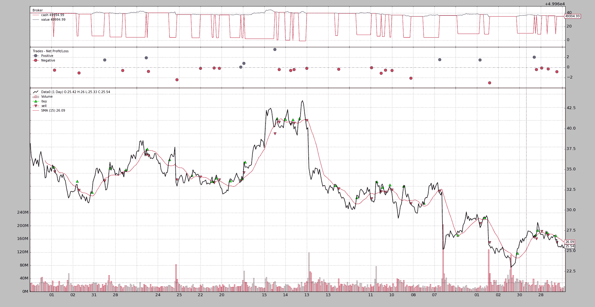

# 施胶机智能定位

> 原文： [https://www.backtrader.com/blog/posts/2016-07-23-sizers-smart-staking/sizers-smart-staking/](https://www.backtrader.com/blog/posts/2016-07-23-sizers-smart-staking/sizers-smart-staking/)

1.6.4.93 版标志着*backtrader*的一个重要里程碑，即使版本编号的变化很小。

Po.T0.职位大小是一个事实上为这个项目奠定了基础的阅读后，T2。交易你的方式金融自由。

这本书并不是*Van K.Tharp*详细介绍了他*职位调整*的方法，而是在书中介绍和讨论了这个主题。与此相关的一个示例具有此设置

*   如果不在市场上，掷硬币决定是否进入

*   如果已经在市场上，用 2 倍 ATR 的止损点控制仓位，如果价格有利地移动到所采取的仓位，止损点会更新

关于这一点的重要部分：

*   进入市场是随机的

*   该方法通过不同的*分级*方案进行了测试，加上具有动态停止功能，使系统盈利

遵循建立自己的“系统”的原则（无论是手动/自动/计算机化、技术/基础，…）*反向交易者*诞生的一天就是为了测试这个场景。

这本可以在任何现有平台上进行测试，但在这一过程中都没有乐趣，许多挑战都得到了解决，甚至在启动*backtrader*时都没有考虑到这些挑战

*规模商*从一开始就在这个平台上，但由于*实时交易*等许多其他因素开始阻碍，所以被隐藏起来。但现在一切都结束了，*Van K.Tharp*场景将接受测试。宁早勿晚。

同时，两台*测浆机*进行样本测试。

## *施胶机*控制定位

该示例显示了一个潜在的用例，*施胶者*通过控制*施胶*来改变策略的行为。查看*backtrader.readthedocs.io*上的单据，了解*分级界面*。

这两种尺寸：

*   `LongOnly`：如果当前仓位为 0，则返回固定大小仓位；如果已经在市场上，则返回相同的固定大小仓位以关闭该仓位。

    ```py
    class LongOnly(bt.Sizer):
        params = (('stake', 1),)

        def _getsizing(self, comminfo, cash, data, isbuy):
            if isbuy:
                return self.p.stake

            # Sell situation
            position = self.strategy.getposition(data)
            if not position.size:
                return 0  # do not sell if nothing is open

            return self.p.stake 
    ```

*   `FixedReverser`：如果不在市场上，将返还固定规模的股份；如果已经在市场上，将返还双倍的固定规模股份，以允许反转

    ```py
    class FixedReverser(bt.Sizer):
        params = (('stake', 1),)

        def _getsizing(self, comminfo, cash, data, isbuy):
            position = self.broker.getposition(data)
            size = self.p.stake * (1 + (position.size != 0))
            return size 
    ```

这两个*规模*将与一个非常简单的策略相结合。

```py
class CloseSMA(bt.Strategy):
    params = (('period', 15),)

    def __init__(self):
        sma = bt.indicators.SMA(self.data, period=self.p.period)
        self.crossover = bt.indicators.CrossOver(self.data, sma)

    def next(self):
        if self.crossover > 0:
            self.buy()

        elif self.crossover < 0:
            self.sell() 
```

注意该策略如何使用*关闭 SMA*交叉信号发出*买入*和*卖出*命令，需要考虑一个重要事项：

*   *策略*中未进行定位检查

在下面的执行中可以看到相同的策略，通过简单地在样本中使用此代码更改*测码器*（通过开关`--longonly`控制），将行为从*长仅*更改为*长短*

```py
 if args.longonly:
        cerebro.addsizer(LongOnly, stake=args.stake)
    else:
        cerebro.addsizer(FixedReverser, stake=args.stake) 
```

## 长时间执行

使用以下命令完成：

```py
$ ./sizertest.py --longonly --plot 
```

这个输出。

[](../sizer-long-only.png)

## 长短执行

使用以下命令完成：

```py
$ ./sizertest.py --plot 
```

这个输出。

[](../sizer-fixedreverser.png)

这表明：

*   交易数量翻了一番

*   现金（开始时除外）永远不会等于*价值*，因为策略总是在市场中

## 样本使用

```py
$ ./sizertest.py --help
usage: sizertest.py [-h] [--data0 DATA0] [--fromdate FROMDATE]
                    [--todate TODATE] [--cash CASH] [--longonly]
                    [--stake STAKE] [--period PERIOD] [--plot [kwargs]]

Sample for sizer

optional arguments:
  -h, --help            show this help message and exit
  --data0 DATA0         Data to be read in (default:
                        ../../datas/yhoo-1996-2015.txt)
  --fromdate FROMDATE   Starting date in YYYY-MM-DD format (default:
                        2005-01-01)
  --todate TODATE       Ending date in YYYY-MM-DD format (default: 2006-12-31)
  --cash CASH           Cash to start with (default: 50000)
  --longonly            Use the LongOnly sizer (default: False)
  --stake STAKE         Stake to pass to the sizers (default: 1)
  --period PERIOD       Period for the Simple Moving Average (default: 15)
  --plot [kwargs], -p [kwargs]
                        Plot the read data applying any kwargs passed For
                        example: --plot style="candle" (to plot candles)
                        (default: None) 
```

### 完整代码

```py
from __future__ import (absolute_import, division, print_function,
                        unicode_literals)

import argparse
import datetime
import random

import backtrader as bt

class CloseSMA(bt.Strategy):
    params = (('period', 15),)

    def __init__(self):
        sma = bt.indicators.SMA(self.data, period=self.p.period)
        self.crossover = bt.indicators.CrossOver(self.data, sma)

    def next(self):
        if self.crossover > 0:
            self.buy()

        elif self.crossover < 0:
            self.sell()

class LongOnly(bt.Sizer):
    params = (('stake', 1),)

    def _getsizing(self, comminfo, cash, data, isbuy):
        if isbuy:
            return self.p.stake

        # Sell situation
        position = self.strategy.getposition(data)
        if not position.size:
            return 0  # do not sell if nothing is open

        return self.p.stake

class FixedReverser(bt.Sizer):
    params = (('stake', 1),)

    def _getsizing(self, comminfo, cash, data, isbuy):
        position = self.broker.getposition(data)
        size = self.p.stake * (1 + (position.size != 0))
        return size

def runstrat(args=None):
    args = parse_args(args)

    cerebro = bt.Cerebro()
    cerebro.broker.set_cash(args.cash)

    dkwargs = dict()
    if args.fromdate:
        fromdate = datetime.datetime.strptime(args.fromdate, '%Y-%m-%d')
        dkwargs['fromdate'] = fromdate

    if args.todate:
        todate = datetime.datetime.strptime(args.todate, '%Y-%m-%d')
        dkwargs['todate'] = todate

    data0 = bt.feeds.YahooFinanceCSVData(dataname=args.data0, **dkwargs)
    cerebro.adddata(data0, name='Data0')

    cerebro.addstrategy(CloseSMA, period=args.period)

    if args.longonly:
        cerebro.addsizer(LongOnly, stake=args.stake)
    else:
        cerebro.addsizer(FixedReverser, stake=args.stake)

    cerebro.run()
    if args.plot:
        pkwargs = dict()
        if args.plot is not True:  # evals to True but is not True
            pkwargs = eval('dict(' + args.plot + ')')  # args were passed

        cerebro.plot(**pkwargs)

def parse_args(pargs=None):

    parser = argparse.ArgumentParser(
        formatter_class=argparse.ArgumentDefaultsHelpFormatter,
        description='Sample for sizer')

    parser.add_argument('--data0', required=False,
                        default='../../datas/yhoo-1996-2015.txt',
                        help='Data to be read in')

    parser.add_argument('--fromdate', required=False,
                        default='2005-01-01',
                        help='Starting date in YYYY-MM-DD format')

    parser.add_argument('--todate', required=False,
                        default='2006-12-31',
                        help='Ending date in YYYY-MM-DD format')

    parser.add_argument('--cash', required=False, action='store',
                        type=float, default=50000,
                        help=('Cash to start with'))

    parser.add_argument('--longonly', required=False, action='store_true',
                        help=('Use the LongOnly sizer'))

    parser.add_argument('--stake', required=False, action='store',
                        type=int, default=1,
                        help=('Stake to pass to the sizers'))

    parser.add_argument('--period', required=False, action='store',
                        type=int, default=15,
                        help=('Period for the Simple Moving Average'))

    # Plot options
    parser.add_argument('--plot', '-p', nargs='?', required=False,
                        metavar='kwargs', const=True,
                        help=('Plot the read data applying any kwargs passed\n'
                              '\n'
                              'For example:\n'
                              '\n'
                              '  --plot style="candle" (to plot candles)\n'))

    if pargs is not None:
        return parser.parse_args(pargs)

    return parser.parse_args()

if __name__ == '__main__':
    runstrat() 
```