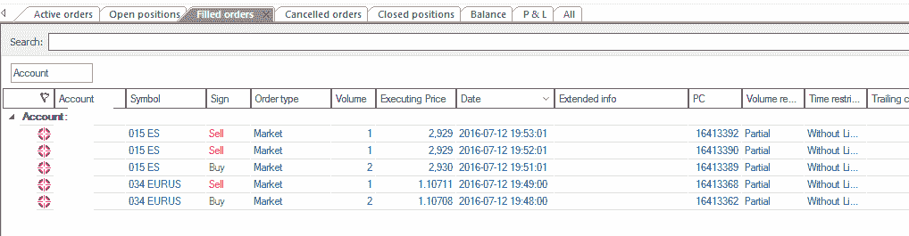

# 直观图表实时数据/交易

> 原文： [https://www.backtrader.com/blog/posts/2016-07-12-visualchart-feed/visualchart-feed/](https://www.backtrader.com/blog/posts/2016-07-12-visualchart-feed/visualchart-feed/)

从发行版*1.5.1.93*开始，backtrader 支持可视化图表实时提要和实时交易。

需要的东西：

*   *视觉图表 6*（此图表在 Windows 上运行）

*   `comtypes`，特别是这个叉子：[https://github.com/mementum/comtypes](https://github.com/mementum/comtypes)

    安装时使用：`pip install https://github.com/mementum/comtypes/archive/master.zip`

    *可视化图表*API 基于*COM*，当前`comtypes`主分支不支持`VT_RECORD`的`VT_ARRAYS`解包。这是*视觉图表*使用的

    [拉取请求](https://github.com/enthought/comtypes/pull/104)已提交但尚未集成。一旦集成，就可以使用主分支。

*   `pytz`（可选，但强烈推荐）

    在许多情况下，数据馈送提供的内部`SymbolInfo.TimeOffset`足以在市场时间返回数据馈送（即使默认配置为*视觉图表*中的`LocalTime`）

如果您不知道什么是*视觉图表*和/或其当前的关联经纪人*Esfera Capital*，请访问以下网站：

*   [视觉图表](https://www.visualchart.com)

*   [埃斯费拉资本](https://www.esferacapital.es)

初始声明：

*   和往常一样，在冒险之前，**测试**、**测试**、**测试**和**再测试**一千次。

    从本软件中的*错误*到您自己的软件中的错误以及意外情况的管理：**任何事情都可能出错**

关于这一点，请注意：

*   数据馈送相当好，支持内置重采样。很好，因为不需要重新采样。

*   数据馈送不支持*秒*分辨率。不好，但可通过*backtrader*的内置重采样解决

*   回填是内置的

*   `International Indices`（交换`096`）市场上的一些产品具有奇数时区和市场补偿。

    一些工作已经进入这一阶段，例如在预期的`US/Eastern`时区交付`096.DJI`

*   数据提要提供了*连续期货*，这对于拥有大量历史非常方便。

    因此，可以将第二个参数传递给数据，以指示哪一个是实际交易资产。

*   *有效截止日期*订单的日期时间只能指定为*日期*。忽略*时间*分量。

*   没有直接的方法可以找到从本地设备到数据服务器的偏移量，需要一种启发式方法来从会话开始时的*实时信号*中找到这一点。

*   传递带有*时间*组件的*日期时间*（而不是默认的*00:00:00*）似乎在*COM*API 中创建了一个*时间过滤器*。例如，如果你说你想要*分钟*数据，从 3 天前*14:30*开始，你可以：

    ```py
    dt = datetime.now() - timedelta(days=3)
    dt.replace(hour=14, minute=30)

    vcstore.getdata(dataname='001ES', fromdate=dt) 
    ```

    然后，数据被跳过，直到*14:30*，不仅在*之前，而且在*之后的每一天

    因此，请仅传递*完整日期*，因为默认*时间*组件未被触及。

*   *经纪人*支持*头寸*的概念，但仅当它们*未平仓*时。关于*位置*（即**大小为 0**的位置）的最后一个事件未发送。

    因此，*头寸*的核算完全由*反向交易者*完成

*   *经纪人*不报告佣金。

    解决方法是在实例化代理时提供您自己的`CommissionInfo`派生类。请参阅*backtader*文档以创建您自己的类。这相当容易。

*   `Cancelled`vs`Expired`订单。这种区别是不存在的，需要一种启发式方法来消除这种区别。

    因此，仅报告`Cancelled`

一些补充说明：

*   *实时*滴答声大多不使用。他们产生大量不必要的信息用于*反向交易者*目的。在被*反向交易者*完全断开之前，它们有两个主要用途

    1.  查找符号是否存在。

    2.  计算到数据服务器的偏移量

    当然，这些信息是实时收集的价格信息，但来自于同时提供历史数据的*数据源*对象。

已尽可能多地记录在案，并可通过通常的文档链接获得：

*   [阅读文件](http://backtrader.readthedocs.io/en/latest/)

从样本`vctest.pye`到*视觉图表*和*演示代理*的几次运行

第一个：`015ES`（*EuroStoxx50*连续），重采样至 1 分钟，具有断开和重新连接功能：

```py
$ ./vctest.py --data0 015ES --timeframe Minutes --compression 1 --fromdate 2016-07-12 
```

输出：

```py
--------------------------------------------------
Strategy Created
--------------------------------------------------
Datetime, Open, High, Low, Close, Volume, OpenInterest, SMA
***** DATA NOTIF: CONNECTED
***** DATA NOTIF: DELAYED
0001, 2016-07-12T08:01:00.000000, 2871.0, 2872.0, 2869.0, 2872.0, 1915.0, 0.0, nan
0002, 2016-07-12T08:02:00.000000, 2872.0, 2872.0, 2870.0, 2871.0, 479.0, 0.0, nan
0003, 2016-07-12T08:03:00.000000, 2871.0, 2871.0, 2869.0, 2870.0, 518.0, 0.0, nan
0004, 2016-07-12T08:04:00.000000, 2870.0, 2871.0, 2870.0, 2871.0, 248.0, 0.0, nan
0005, 2016-07-12T08:05:00.000000, 2870.0, 2871.0, 2870.0, 2871.0, 234.0, 0.0, 2871.0
...
...
0639, 2016-07-12T18:39:00.000000, 2932.0, 2933.0, 2932.0, 2932.0, 1108.0, 0.0, 2932.8
0640, 2016-07-12T18:40:00.000000, 2931.0, 2932.0, 2931.0, 2931.0, 65.0, 0.0, 2932.6
***** DATA NOTIF: LIVE
0641, 2016-07-12T18:41:00.000000, 2932.0, 2932.0, 2930.0, 2930.0, 2093.0, 0.0, 2931.8
***** STORE NOTIF: (u'VisualChart is Disconnected', -65520)
***** DATA NOTIF: CONNBROKEN
***** STORE NOTIF: (u'VisualChart is Connected', -65521)
***** DATA NOTIF: CONNECTED
***** DATA NOTIF: DELAYED
0642, 2016-07-12T18:42:00.000000, 2931.0, 2931.0, 2931.0, 2931.0, 137.0, 0.0, 2931.2
0643, 2016-07-12T18:43:00.000000, 2931.0, 2931.0, 2931.0, 2931.0, 432.0, 0.0, 2931.0
...
0658, 2016-07-12T18:58:00.000000, 2929.0, 2929.0, 2929.0, 2929.0, 4.0, 0.0, 2930.0
0659, 2016-07-12T18:59:00.000000, 2929.0, 2930.0, 2929.0, 2930.0, 353.0, 0.0, 2930.0
***** DATA NOTIF: LIVE
0660, 2016-07-12T19:00:00.000000, 2930.0, 2930.0, 2930.0, 2930.0, 376.0, 0.0, 2930.0
0661, 2016-07-12T19:01:00.000000, 2929.0, 2930.0, 2929.0, 2930.0, 35.0, 0.0, 2929.8 
```

笔记

已安装执行环境`pytz`

笔记

请注意缺少`--resample`：对于`Minutes`而言，重采样是内置的*视觉图表*

最后是一些交易，用单个`Market`订单购买`015ES`的*2*合同，然后分别以*1*合同的两个订单出售。

执行：

```py
$ ./vctest.py --data0 015ES --timeframe Minutes --compression 1 --fromdate 2016-07-12 2>&1 --broker --account accname --trade --stake 2 
```

输出相当详细，显示了订单执行的所有部分。总结一下：

```py
--------------------------------------------------
Strategy Created
--------------------------------------------------
Datetime, Open, High, Low, Close, Volume, OpenInterest, SMA
***** DATA NOTIF: CONNECTED
***** DATA NOTIF: DELAYED
0001, 2016-07-12T08:01:00.000000, 2871.0, 2872.0, 2869.0, 2872.0, 1915.0, 0.0, nan
...
0709, 2016-07-12T19:50:00.000000, 2929.0, 2930.0, 2929.0, 2930.0, 11.0, 0.0, 2930.4
***** DATA NOTIF: LIVE
0710, 2016-07-12T19:51:00.000000, 2930.0, 2930.0, 2929.0, 2929.0, 134.0, 0.0, 2930.0
-------------------------------------------------- ORDER BEGIN 2016-07-12 19:52:01.629000
Ref: 1
OrdType: 0
OrdType: Buy
Status: 1
Status: Submitted
Size: 2
Price: None
Price Limit: None
ExecType: 0
ExecType: Market
CommInfo: <backtrader.brokers.vcbroker.VCCommInfo object at 0x000000001100CE10>
End of Session: 736157.916655
Info: AutoOrderedDict()
Broker: <backtrader.brokers.vcbroker.VCBroker object at 0x000000000475D400>
Alive: True
-------------------------------------------------- ORDER END
-------------------------------------------------- ORDER BEGIN 2016-07-12 19:52:01.629000
Ref: 1
OrdType: 0
OrdType: Buy
Status: 2
Status: Accepted
Size: 2
Price: None
Price Limit: None
ExecType: 0
ExecType: Market
CommInfo: <backtrader.brokers.vcbroker.VCCommInfo object at 0x000000001100CE10>
End of Session: 736157.916655
Info: AutoOrderedDict()
Broker: None
Alive: True
-------------------------------------------------- ORDER END
-------------------------------------------------- ORDER BEGIN 2016-07-12 19:52:01.629000
Ref: 1
OrdType: 0
OrdType: Buy
Status: 4
Status: Completed
Size: 2
Price: None
Price Limit: None
ExecType: 0
ExecType: Market
CommInfo: <backtrader.brokers.vcbroker.VCCommInfo object at 0x000000001100CE10>
End of Session: 736157.916655
Info: AutoOrderedDict()
Broker: None
Alive: False
-------------------------------------------------- ORDER END
-------------------------------------------------- TRADE BEGIN 2016-07-12 19:52:01.629000
ref:1
data:<backtrader.feeds.vcdata.VCData object at 0x000000000475D9E8>
tradeid:0
size:2.0
price:2930.0
value:5860.0
commission:0.0
pnl:0.0
pnlcomm:0.0
justopened:True
isopen:True
isclosed:0
baropen:710
dtopen:736157.74375
barclose:0
dtclose:0.0
barlen:0
historyon:False
history:[]
status:1
-------------------------------------------------- TRADE END
... 
```

发生以下情况：

*   数据正常接收

*   针对执行类型为`Market`的`2`发出`BUY`

    *   收到`Submitted`和`Accepted`通知（以上仅显示`Submitted`）

    *   连续执行`Partial`次（仅显示 1 次），直到收到`Completed`。

    未显示实际执行情况，但在`order.executed`下接收的`order`实例中可用

*   虽然未显示，但会发出 2 个`Market``SELL`命令来撤消该操作

    屏幕截图显示了在`015ES`（*EuroStoxx 50*）和`034EURUS`（*欧元兑美元外汇对*两次不同的运行后*视觉图表*中的日志

[](../visualchart-filled-orders.png)

该样品可以做更多的工作，旨在对设施进行彻底测试，如果可能的话，可以发现任何粗糙的边缘。

用法：

```py
$ ./vctest.py --help
usage: vctest.py [-h] [--exactbars EXACTBARS] [--plot] [--stopafter STOPAFTER]
                 [--nostore] [--qcheck QCHECK] [--no-timeoffset] --data0 DATA0
                 [--tradename TRADENAME] [--data1 DATA1] [--timezone TIMEZONE]
                 [--no-backfill_start] [--latethrough] [--historical]
                 [--fromdate FROMDATE] [--todate TODATE]
                 [--smaperiod SMAPERIOD] [--replay | --resample]
                 [--timeframe {Ticks,MicroSeconds,Seconds,Minutes,Days,Weeks,Months,Years}]
                 [--compression COMPRESSION] [--no-bar2edge] [--no-adjbartime]
                 [--no-rightedge] [--broker] [--account ACCOUNT] [--trade]
                 [--donotsell]
                 [--exectype {Market,Close,Limit,Stop,StopLimit}]
                 [--price PRICE] [--pstoplimit PSTOPLIMIT] [--stake STAKE]
                 [--valid VALID] [--cancel CANCEL]

Test Visual Chart 6 integration

optional arguments:
  -h, --help            show this help message and exit
  --exactbars EXACTBARS
                        exactbars level, use 0/-1/-2 to enable plotting
                        (default: 1)
  --plot                Plot if possible (default: False)
  --stopafter STOPAFTER
                        Stop after x lines of LIVE data (default: 0)
  --nostore             Do not Use the store pattern (default: False)
  --qcheck QCHECK       Timeout for periodic notification/resampling/replaying
                        check (default: 0.5)
  --no-timeoffset       Do not Use TWS/System time offset for non timestamped
                        prices and to align resampling (default: False)
  --data0 DATA0         data 0 into the system (default: None)
  --tradename TRADENAME
                        Actual Trading Name of the asset (default: None)
  --data1 DATA1         data 1 into the system (default: None)
  --timezone TIMEZONE   timezone to get time output into (pytz names)
                        (default: None)
  --historical          do only historical download (default: False)
  --fromdate FROMDATE   Starting date for historical download with format:
                        YYYY-MM-DD[THH:MM:SS] (default: None)
  --todate TODATE       End date for historical download with format: YYYY-MM-
                        DD[THH:MM:SS] (default: None)
  --smaperiod SMAPERIOD
                        Period to apply to the Simple Moving Average (default:
                        5)
  --replay              replay to chosen timeframe (default: False)
  --resample            resample to chosen timeframe (default: False)
  --timeframe {Ticks,MicroSeconds,Seconds,Minutes,Days,Weeks,Months,Years}
                        TimeFrame for Resample/Replay (default: Ticks)
  --compression COMPRESSION
                        Compression for Resample/Replay (default: 1)
  --no-bar2edge         no bar2edge for resample/replay (default: False)
  --no-adjbartime       no adjbartime for resample/replay (default: False)
  --no-rightedge        no rightedge for resample/replay (default: False)
  --broker              Use VisualChart as broker (default: False)
  --account ACCOUNT     Choose broker account (else first) (default: None)
  --trade               Do Sample Buy/Sell operations (default: False)
  --donotsell           Do not sell after a buy (default: False)
  --exectype {Market,Close,Limit,Stop,StopLimit}
                        Execution to Use when opening position (default:
                        Market)
  --price PRICE         Price in Limit orders or Stop Trigger Price (default:
                        None)
  --pstoplimit PSTOPLIMIT
                        Price for the limit in StopLimit (default: None)
  --stake STAKE         Stake to use in buy operations (default: 10)
  --valid VALID         Seconds or YYYY-MM-DD (default: None)
  --cancel CANCEL       Cancel a buy order after n bars in operation, to be
                        combined with orders like Limit (default: 0) 
```

守则：

```py
from __future__ import (absolute_import, division, print_function,
                        unicode_literals)

import argparse
import datetime

# The above could be sent to an independent module
import backtrader as bt
from backtrader.utils import flushfile  # win32 quick stdout flushing
from backtrader.utils.py3 import string_types

class TestStrategy(bt.Strategy):
    params = dict(
        smaperiod=5,
        trade=False,
        stake=10,
        exectype=bt.Order.Market,
        stopafter=0,
        valid=None,
        cancel=0,
        donotsell=False,
        price=None,
        pstoplimit=None,
    )

    def __init__(self):
        # To control operation entries
        self.orderid = list()
        self.order = None

        self.counttostop = 0
        self.datastatus = 0

        # Create SMA on 2nd data
        self.sma = bt.indicators.MovAv.SMA(self.data, period=self.p.smaperiod)

        print('--------------------------------------------------')
        print('Strategy Created')
        print('--------------------------------------------------')

    def notify_data(self, data, status, *args, **kwargs):
        print('*' * 5, 'DATA NOTIF:', data._getstatusname(status), *args)
        if status == data.LIVE:
            self.counttostop = self.p.stopafter
            self.datastatus = 1

    def notify_store(self, msg, *args, **kwargs):
        print('*' * 5, 'STORE NOTIF:', msg)

    def notify_order(self, order):
        if order.status in [order.Completed, order.Cancelled, order.Rejected]:
            self.order = None

        print('-' * 50, 'ORDER BEGIN', datetime.datetime.now())
        print(order)
        print('-' * 50, 'ORDER END')

    def notify_trade(self, trade):
        print('-' * 50, 'TRADE BEGIN', datetime.datetime.now())
        print(trade)
        print('-' * 50, 'TRADE END')

    def prenext(self):
        self.next(frompre=True)

    def next(self, frompre=False):
        txt = list()
        txt.append('%04d' % len(self))
        dtfmt = '%Y-%m-%dT%H:%M:%S.%f'
        txt.append('%s' % self.data.datetime.datetime(0).strftime(dtfmt))
        txt.append('{}'.format(self.data.open[0]))
        txt.append('{}'.format(self.data.high[0]))
        txt.append('{}'.format(self.data.low[0]))
        txt.append('{}'.format(self.data.close[0]))
        txt.append('{}'.format(self.data.volume[0]))
        txt.append('{}'.format(self.data.openinterest[0]))
        txt.append('{}'.format(self.sma[0]))
        print(', '.join(txt))

        if len(self.datas) > 1:
            txt = list()
            txt.append('%04d' % len(self))
            dtfmt = '%Y-%m-%dT%H:%M:%S.%f'
            txt.append('%s' % self.data1.datetime.datetime(0).strftime(dtfmt))
            txt.append('{}'.format(self.data1.open[0]))
            txt.append('{}'.format(self.data1.high[0]))
            txt.append('{}'.format(self.data1.low[0]))
            txt.append('{}'.format(self.data1.close[0]))
            txt.append('{}'.format(self.data1.volume[0]))
            txt.append('{}'.format(self.data1.openinterest[0]))
            txt.append('{}'.format(float('NaN')))
            print(', '.join(txt))

        if self.counttostop:  # stop after x live lines
            self.counttostop -= 1
            if not self.counttostop:
                self.env.runstop()
                return

        if not self.p.trade:
            return

        # if True and len(self.orderid) < 1:
        if self.datastatus and not self.position and len(self.orderid) < 1:
            self.order = self.buy(size=self.p.stake,
                                  exectype=self.p.exectype,
                                  price=self.p.price,
                                  plimit=self.p.pstoplimit,
                                  valid=self.p.valid)

            self.orderid.append(self.order)
        elif self.position.size > 0 and not self.p.donotsell:
            if self.order is None:
                size = self.p.stake // 2
                if not size:
                    size = self.position.size  # use the remaining
                self.order = self.sell(size=size, exectype=bt.Order.Market)

        elif self.order is not None and self.p.cancel:
            if self.datastatus > self.p.cancel:
                self.cancel(self.order)

        if self.datastatus:
            self.datastatus += 1

    def start(self):
        header = ['Datetime', 'Open', 'High', 'Low', 'Close', 'Volume',
                  'OpenInterest', 'SMA']
        print(', '.join(header))

        self.done = False

def runstrategy():
    args = parse_args()

    # Create a cerebro
    cerebro = bt.Cerebro()

    storekwargs = dict()

    if not args.nostore:
        vcstore = bt.stores.VCStore(**storekwargs)

    if args.broker:
        brokerargs = dict(account=args.account, **storekwargs)
        if not args.nostore:
            broker = vcstore.getbroker(**brokerargs)
        else:
            broker = bt.brokers.VCBroker(**brokerargs)

        cerebro.setbroker(broker)

    timeframe = bt.TimeFrame.TFrame(args.timeframe)
    if args.resample or args.replay:
        datatf = bt.TimeFrame.Ticks
        datacomp = 1
    else:
        datatf = timeframe
        datacomp = args.compression

    fromdate = None
    if args.fromdate:
        dtformat = '%Y-%m-%d' + ('T%H:%M:%S' * ('T' in args.fromdate))
        fromdate = datetime.datetime.strptime(args.fromdate, dtformat)

    todate = None
    if args.todate:
        dtformat = '%Y-%m-%d' + ('T%H:%M:%S' * ('T' in args.todate))
        todate = datetime.datetime.strptime(args.todate, dtformat)

    VCDataFactory = vcstore.getdata if not args.nostore else bt.feeds.VCData

    datakwargs = dict(
        timeframe=datatf, compression=datacomp,
        fromdate=fromdate, todate=todate,
        historical=args.historical,
        qcheck=args.qcheck,
        tz=args.timezone
    )

    if args.nostore and not args.broker:   # neither store nor broker
        datakwargs.update(storekwargs)  # pass the store args over the data

    data0 = VCDataFactory(dataname=args.data0, tradename=args.tradename,
                          **datakwargs)

    data1 = None
    if args.data1 is not None:
        data1 = VCDataFactory(dataname=args.data1, **datakwargs)

    rekwargs = dict(
        timeframe=timeframe, compression=args.compression,
        bar2edge=not args.no_bar2edge,
        adjbartime=not args.no_adjbartime,
        rightedge=not args.no_rightedge,
    )

    if args.replay:
        cerebro.replaydata(dataname=data0, **rekwargs)

        if data1 is not None:
            cerebro.replaydata(dataname=data1, **rekwargs)

    elif args.resample:
        cerebro.resampledata(dataname=data0, **rekwargs)

        if data1 is not None:
            cerebro.resampledata(dataname=data1, **rekwargs)

    else:
        cerebro.adddata(data0)
        if data1 is not None:
            cerebro.adddata(data1)

    if args.valid is None:
        valid = None
    else:
        try:
            valid = float(args.valid)
        except:
            dtformat = '%Y-%m-%d' + ('T%H:%M:%S' * ('T' in args.valid))
            valid = datetime.datetime.strptime(args.valid, dtformat)
        else:
            valid = datetime.timedelta(seconds=args.valid)

    # Add the strategy
    cerebro.addstrategy(TestStrategy,
                        smaperiod=args.smaperiod,
                        trade=args.trade,
                        exectype=bt.Order.ExecType(args.exectype),
                        stake=args.stake,
                        stopafter=args.stopafter,
                        valid=valid,
                        cancel=args.cancel,
                        donotsell=args.donotsell,
                        price=args.price,
                        pstoplimit=args.pstoplimit)

    # Live data ... avoid long data accumulation by switching to "exactbars"
    cerebro.run(exactbars=args.exactbars)

    if args.plot and args.exactbars < 1:  # plot if possible
        cerebro.plot()

def parse_args():
    parser = argparse.ArgumentParser(
        formatter_class=argparse.ArgumentDefaultsHelpFormatter,
        description='Test Visual Chart 6 integration')

    parser.add_argument('--exactbars', default=1, type=int,
                        required=False, action='store',
                        help='exactbars level, use 0/-1/-2 to enable plotting')

    parser.add_argument('--plot',
                        required=False, action='store_true',
                        help='Plot if possible')

    parser.add_argument('--stopafter', default=0, type=int,
                        required=False, action='store',
                        help='Stop after x lines of LIVE data')

    parser.add_argument('--nostore',
                        required=False, action='store_true',
                        help='Do not Use the store pattern')

    parser.add_argument('--qcheck', default=0.5, type=float,
                        required=False, action='store',
                        help=('Timeout for periodic '
                              'notification/resampling/replaying check'))

    parser.add_argument('--no-timeoffset',
                        required=False, action='store_true',
                        help=('Do not Use TWS/System time offset for non '
                              'timestamped prices and to align resampling'))

    parser.add_argument('--data0', default=None,
                        required=True, action='store',
                        help='data 0 into the system')

    parser.add_argument('--tradename', default=None,
                        required=False, action='store',
                        help='Actual Trading Name of the asset')

    parser.add_argument('--data1', default=None,
                        required=False, action='store',
                        help='data 1 into the system')

    parser.add_argument('--timezone', default=None,
                        required=False, action='store',
                        help='timezone to get time output into (pytz names)')

    parser.add_argument('--historical',
                        required=False, action='store_true',
                        help='do only historical download')

    parser.add_argument('--fromdate',
                        required=False, action='store',
                        help=('Starting date for historical download '
                              'with format: YYYY-MM-DD[THH:MM:SS]'))

    parser.add_argument('--todate',
                        required=False, action='store',
                        help=('End date for historical download '
                              'with format: YYYY-MM-DD[THH:MM:SS]'))

    parser.add_argument('--smaperiod', default=5, type=int,
                        required=False, action='store',
                        help='Period to apply to the Simple Moving Average')

    pgroup = parser.add_mutually_exclusive_group(required=False)

    pgroup.add_argument('--replay',
                        required=False, action='store_true',
                        help='replay to chosen timeframe')

    pgroup.add_argument('--resample',
                        required=False, action='store_true',
                        help='resample to chosen timeframe')

    parser.add_argument('--timeframe', default=bt.TimeFrame.Names[0],
                        choices=bt.TimeFrame.Names,
                        required=False, action='store',
                        help='TimeFrame for Resample/Replay')

    parser.add_argument('--compression', default=1, type=int,
                        required=False, action='store',
                        help='Compression for Resample/Replay')

    parser.add_argument('--no-bar2edge',
                        required=False, action='store_true',
                        help='no bar2edge for resample/replay')

    parser.add_argument('--no-adjbartime',
                        required=False, action='store_true',
                        help='no adjbartime for resample/replay')

    parser.add_argument('--no-rightedge',
                        required=False, action='store_true',
                        help='no rightedge for resample/replay')

    parser.add_argument('--broker',
                        required=False, action='store_true',
                        help='Use VisualChart as broker')

    parser.add_argument('--account', default=None,
                        required=False, action='store',
                        help='Choose broker account (else first)')

    parser.add_argument('--trade',
                        required=False, action='store_true',
                        help='Do Sample Buy/Sell operations')

    parser.add_argument('--donotsell',
                        required=False, action='store_true',
                        help='Do not sell after a buy')

    parser.add_argument('--exectype', default=bt.Order.ExecTypes[0],
                        choices=bt.Order.ExecTypes,
                        required=False, action='store',
                        help='Execution to Use when opening position')

    parser.add_argument('--price', default=None, type=float,
                        required=False, action='store',
                        help='Price in Limit orders or Stop Trigger Price')

    parser.add_argument('--pstoplimit', default=None, type=float,
                        required=False, action='store',
                        help='Price for the limit in StopLimit')

    parser.add_argument('--stake', default=10, type=int,
                        required=False, action='store',
                        help='Stake to use in buy operations')

    parser.add_argument('--valid', default=None,
                        required=False, action='store',
                        help='Seconds or YYYY-MM-DD')

    parser.add_argument('--cancel', default=0, type=int,
                        required=False, action='store',
                        help=('Cancel a buy order after n bars in operation,'
                              ' to be combined with orders like Limit'))

    return parser.parse_args()

if __name__ == '__main__':
    runstrategy() 
```