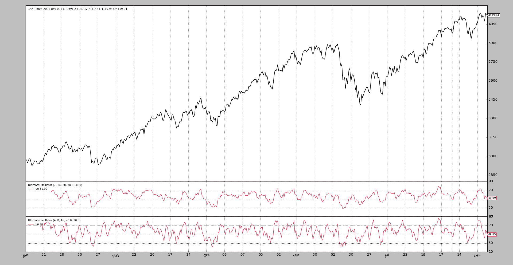

# 终极振荡器

> 原文： [https://www.backtrader.com/blog/posts/2016-06-22-ultimate-oscillator/ultimate-oscillator/](https://www.backtrader.com/blog/posts/2016-06-22-ultimate-oscillator/ultimate-oscillator/)

*反向交易者*开发启动时的目标之一是使开发新的*指标*变得非常容易（至少对作者本人而言），以从数学和视觉上测试想法。

[票据](https://github.com/mementum/backtrader/issues/102)是关于将**终极振荡器**添加到*反向交易者*的军火库中

笔记

它将被添加到下一个版本中，同时可以使用下面的代码使用它。

票证中所示的参考：

*   [http://stockcharts.com/school/doku.php?id=chart_school:technical_indicators:ultimate_oscillator](http://stockcharts.com/school/doku.php?id=chart_school:technical_indicators:ultimate_oscillator)

以及：

*   [https://en.wikipedia.org/wiki/Ultimate_oscillator](https://en.wikipedia.org/wiki/Ultimate_oscillator)

不需要在这里重复。

引用参考文献：

```py
BP = Close - Minimum(Low or Prior Close)

TR = Maximum(High or Prior Close)  -  Minimum(Low or Prior Close)

Average7 = (7-period BP Sum) / (7-period TR Sum)
Average14 = (14-period BP Sum) / (14-period TR Sum)
Average28 = (28-period BP Sum) / (28-period TR Sum)

UO = 100 x [(4 x Average7)+(2 x Average14)+Average28]/(4+2+1) 
```

总结：

*   `bt.Indicator`中的第一个子类，确保整个机械工作：

    ```py
    class UltimateOscillator(bt.Indicator): 
    ```

*   它有一个输出行：我们将其命名为`uo`：

    ```py
    lines = ('uo',) 
    ```

*   它有 3 个参数，用默认值`7`、`14`和`28`定义 3 个时段。命名为`p1`、`p2`和`p3`：

    ```py
    params = (('p1', 7),
              ('p2', 14),
              ('p3', 28),
    ) 
    ```

*   计算使用了一些已经内置的*backtrader*工具

    *   `Minimum(Low or Prior Close)`：这是*Welles Wilder*为`RSI`指示器定义的`TrueLow`。因此，可以计算出`BP`或*购买压力*：

    ```py
    bp = self.data.close - TrueLow(self.data) 
    ```

    *   `Maximum(Low or Prior Close) - Minimum(Low or Prior Close)`：这是*Welles Wilder*为`RSI`指标定义的`TrueRange`（可以表示为`TrueHigh - TrueLow`，因此下一步的计算非常简单：

    ```py
    tr = TrueRange(self.data) 
    ```

    *   其余为纯数学运算，使用`SumN`将`bp`和`tr`的最新`p1`、`p2`、`p3`期间加上加权计算：

    ```py
    av7 = SumN(bp, period=self.p.p1) / SumN(tr, period=self.p.p1)
    av14 = SumN(bp, period=self.p.p2) / SumN(tr, period=self.p.p2)
    av28 = SumN(bp, period=self.p.p3) / SumN(tr, period=self.p.p3)

    uo = 100.0 * (4.0 * av7 + 2.0 * av14 + av28) / (4.0 + 2.0 + 1.0) 
    ```

    *   最后，将计算分配到定义的`uo`行：

    ```py
    self.lines.uo = uo 
    ```

它看起来比底部的实际长度长（完整代码，包括导入）。

由于我们不仅需要数值，还需要一个漂亮的曲线图，如*股票图表*提供的曲线图，我们将添加两个额外的点：

*   2 个参数，用于确定在何处放置划定*超买*和*超卖*区域的水平线（ala`RSI`或`Stochastic`：

    ```py
    ('upperband', 70.0),
    ('lowerband', 30.0), 
    ```

*   并绘制初始化代码以使用参数。将添加*股票图表*图中`10`、`50`和`90`等处的刻度：

    ```py
    def _plotinit(self):
        baseticks = [10.0, 50.0, 90.0]
        hlines = [self.p.upperband, self.p.lowerband]

        self.plotinfo.plotyhlines = hlines
        self.plotinfo.plotyticks = baseticks + hlines 
    ```

为了测试和进一步使用*backtrader*提供的现有设施，将使用与*backtrader*一起安装的`btrun`可执行文件。

*   该指示器存储在名为`ultimateoscillator.py`的文件中

*   所使用的数据是*反向交易者*来源中可用的数据样本之一

*   该指标将使用默认参数和短期参数添加两次

执行：

```py
btrun \
  --nostdstats \
  --data 2005-2006-day-001.txt \
  --indicator ultimateoscillator:UltimateOscillator \
  --indicator ultimateoscillator:UltimateOscillator:p1=4,p2=8,p3=16 \
  --plot 
```

笔记

使用–noststats 从图表中删除一些观察者。在这种情况下，无需跟踪现金和价值

输出只是一个图表，显示了`UltimateOscillator`的演变。

[](../ultimate-oscillator.png)

`UltimateOscillator`代码：

```py
from __future__ import (absolute_import, division, print_function,
                        unicode_literals)

import backtrader as bt
from backtrader.indicators import SumN, TrueLow, TrueRange

class UltimateOscillator(bt.Indicator):
    '''
    Formula:
      # Buying Pressure = Close - TrueLow
      BP = Close - Minimum(Low or Prior Close)

      # TrueRange = TrueHigh - TrueLow
      TR = Maximum(High or Prior Close)  -  Minimum(Low or Prior Close)

      Average7 = (7-period BP Sum) / (7-period TR Sum)
      Average14 = (14-period BP Sum) / (14-period TR Sum)
      Average28 = (28-period BP Sum) / (28-period TR Sum)

      UO = 100 x [(4 x Average7)+(2 x Average14)+Average28]/(4+2+1)

    See:

      - https://en.wikipedia.org/wiki/Ultimate_oscillator
      - http://stockcharts.com/school/doku.php?id=chart_school:technical_indicators:ultimate_oscillator
    '''
    lines = ('uo',)

    params = (('p1', 7),
              ('p2', 14),
              ('p3', 28),
              ('upperband', 70.0),
              ('lowerband', 30.0),
    )

    def _plotinit(self):
        baseticks = [10.0, 50.0, 90.0]
        hlines = [self.p.upperband, self.p.lowerband]

        self.plotinfo.plotyhlines = hlines
        self.plotinfo.plotyticks = baseticks + hlines

    def __init__(self):
        bp = self.data.close - TrueLow(self.data)
        tr = TrueRange(self.data)

        av7 = SumN(bp, period=self.p.p1) / SumN(tr, period=self.p.p1)
        av14 = SumN(bp, period=self.p.p2) / SumN(tr, period=self.p.p2)
        av28 = SumN(bp, period=self.p.p3) / SumN(tr, period=self.p.p3)

        uo = 100.0 * (4.0 * av7 + 2.0 * av14 + av28) / (4.0 + 2.0 + 1.0)
        self.lines.uo = uo 
```