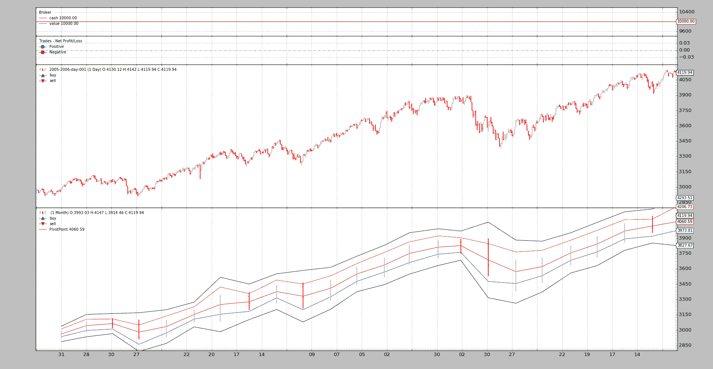

# 轴心点与交会图

> 原文： [https://www.backtrader.com/blog/posts/2016-04-28-pivot-point-cross-plotting/pivotpoint-crossplotting/](https://www.backtrader.com/blog/posts/2016-04-28-pivot-point-cross-plotting/pivotpoint-crossplotting/)

笔记

保留这一职位是出于历史原因。指示器和样本已经在源代码中更新，`PivotPoint`现在可以自动耦合，删除用户代码的样板文件。

一篇新的文章将引用这篇文章。同时，请查看来源中的更新样本。

遇到了一个有趣的请求：

*   支点

这很有趣，因为指标是如何定义的。文献可在股票图表的[支点处找到。数据透视点使用过去时间段的`close`、`high`和`low`价格。例如，对于每日时间框架：](http://stockcharts.com/school/doku.php?id=chart_school:technical_indicators:pivot_points)

*   *日线图的轴心点使用上月数据*

这似乎很麻烦，因为对于每个时间段，都需要定义必须使用的其他时间段。查看这些公式会发现另一个问题：

```py
Pivot Point (P) = (High + Low + Close)/3
Support 1 (S1) = (P x 2) - High
Support 2 (S2) = P  -  (High  -  Low)
Resistance 1 (R1) = (P x 2) - Low
Resistance 2 (R2) = P + (High  -  Low) 
```

即使文本中充满了对*前期*和*过去*的引用，公式似乎也引用了当前时间点。让我们按照*文本*的建议，在第一次尝试使用*之前的*作为支点。但首先，让我们通过这样做来解决不同时间段的问题：

*   该指标无法解决这一问题

尽管这似乎令人困惑，但我们必须考虑到*指标*必须尽可能愚蠢，并由实际公式组成。问题将按以下方式解决：

```py
data = btfeeds.ADataFeed(..., timeframe=bt.TimeFrame.Days)
cerebro.adddata(data)
cerebro.resampledata(data, timeframe=bt.TimeFrame.Months) 
```

后来在*策略*中：

```py
class MyStrategy(bt.Strategy):
    def __init__(self):
        self.pp = PivotPoint(self.data1)  # the resampled data 
```

现在清楚了。该系统将有数据，加上额外的输入重新采样到所需的时间范围。而`PivotPoint`指标将与重新采样的数据一起工作，该数据已经在原始数据时间段*日*所需的*月*时间段内。

可以开发该指标。让我们从文本指示开始，而不是公式，然后回顾一段时间。

```py
class PivotPoint1(bt.Indicator):
    lines = ('p', 's1', 's2', 'r1', 'r2',)

    def __init__(self):
        h = self.data.high(-1)  # previous high
        l = self.data.low(-1)  # previous low
        c = self.data.close(-1)  # previous close

        self.lines.p = p = (h + l + c) / 3.0

        p2 = p * 2.0
        self.lines.s1 = p2 - h  # (p x 2) - high
        self.lines.r1 = p2 - l  # (p x 2) - low

        hilo = h - l
        self.lines.s2 = p - hilo  # p - (high - low)
        self.lines.r2 = p + hilo  # p + (high - low) 
```

策略将查看参数`usepp1`以使用此`PivotPoint1`

```py
 def __init__(self):
        if self.p.usepp1:
            self.pp = PivotPoint1(self.data1)
        else:
            self.pp = PivotPoint(self.data1) 
```

输出由一个简单的`next`方法控制

```py
 def next(self):
        txt = ','.join(
            ['%04d' % len(self),
             '%04d' % len(self.data0),
             '%04d' % len(self.data1),
             self.data.datetime.date(0).isoformat(),
             '%.2f' % self.pp[0]])

        print(txt) 
```

让我们执行：

```py
./ppsample --usepp1 
```

以及输出：

```py
0041,0041,0002,2005-02-28,2962.79
0042,0042,0002,2005-03-01,2962.79
... 
```

立刻有一件事很清楚：*指数 41 已经属于第 2<sup>个</sup>月*。这意味着我们跳过了 1 个月的指标计算。现在很清楚为什么*股票图表*中的文字总是提到计算发生在前*月*，但公式似乎引用了当前时刻。

*   开发人员可能面临相同的设计决策，使用多个时间段的多个数据。

    在当前*日*点，只有上一*月*的*关闭*条可以发货。

这就是为什么`next`方法要查看索引`[0]`。所有这些都有一个非常简单的解决方案，那就是编写公式，就像*股票图表*记录它们一样。

```py
class PivotPoint(bt.Indicator):
    lines = ('p', 's1', 's2', 'r1', 'r2',)
    plotinfo = dict(subplot=False)

    def __init__(self):
        h = self.data.high  # current high
        l = self.data.low  # current high
        c = self.data.close  # current high

        self.lines.p = p = (h + l + c) / 3.0

        p2 = p * 2.0
        self.lines.s1 = p2 - h  # (p x 2) - high
        self.lines.r1 = p2 - l  # (p x 2) - low

        hilo = h - l
        self.lines.s2 = p - hilo  # p - (high - low)
        self.lines.r2 = p + hilo  # p + (high - low) 
```

没有`usepp1`的执行：

```py
./ppsample 
```

新的输出是：

```py
0021,0021,0001,2005-01-31,2962.79
0022,0022,0001,2005-02-01,2962.79
... 
```

瞧！第 1<sup>st</sup>个月有`20`个交易日，完成后指标已计算出数值并可交付。唯一打印的行是`p`，如果两行中的值相同，是因为该值在整个下个月内保持不变。引用*股票图表*：

```py
Once Pivot Points are set, they do not change and remain in play throughout ... 
```

指示器已经可以使用了。让我们开始策划吧。已设置打印参数

```py
 plotinfo = dict(subplot=False) 
```

计算值与数据刻度一致，就像*移动平均值*一样，可以沿着数据绘制（因此`subplot=False`）

与`--plot`一起执行：

```py
./ppsample --plot 
```

[](../pivotpoint-on-monthly-data.png)

起泡的藤壶又开始攻击了。该指标已绘制在月度数据（其来源）上，在日线图上没有给出直观的指示，这将非常有用。

但`backtrader`支持从一个数据到另一个数据的交叉绘制。虽然需要在`1.2.8.88`中添加一个小的内容，以支持对不同时间段的数据进行交叉绘制。

这是通过将`plotmaster`添加到指示器的`plotinfo`属性中，让`plotmaster`说出绘图目标是什么来实现的：

```py
./ppsample --plot --plot-on-daily 
```

[](../pivotpoint-on-daily-data.png)

视觉反馈现在有助于理解`PivotPoint`提供了什么。

## 脚本代码和用法

可在`backtrader`来源中作为样本获得：

```py
$ ./ppsample.py --help
usage: ppsample.py [-h] [--data DATA] [--usepp1] [--plot] [--plot-on-daily]

Sample for pivot point and cross plotting

optional arguments:
  -h, --help       show this help message and exit
  --data DATA      Data to be read in (default:
                   ../../datas/2005-2006-day-001.txt)
  --usepp1         Have PivotPoint look 1 period backwards (default: False)
  --plot           Plot the result (default: False)
  --plot-on-daily  Plot the indicator on the daily data (default: False) 
```

`PivotPoint`的代码

```py
from __future__ import (absolute_import, division, print_function,)
#                        unicode_literals)

import backtrader as bt

class PivotPoint1(bt.Indicator):
    lines = ('p', 's1', 's2', 'r1', 'r2',)

    def __init__(self):
        h = self.data.high(-1)  # previous high
        l = self.data.low(-1)  # previous low
        c = self.data.close(-1)  # previous close

        self.lines.p = p = (h + l + c) / 3.0

        p2 = p * 2.0
        self.lines.s1 = p2 - h  # (p x 2) - high
        self.lines.r1 = p2 - l  # (p x 2) - low

        hilo = h - l
        self.lines.s2 = p - hilo  # p - (high - low)
        self.lines.r2 = p + hilo  # p + (high - low)

class PivotPoint(bt.Indicator):
    lines = ('p', 's1', 's2', 'r1', 'r2',)
    plotinfo = dict(subplot=False)

    def __init__(self):
        h = self.data.high  # current high
        l = self.data.low  # current high
        c = self.data.close  # current high

        self.lines.p = p = (h + l + c) / 3.0

        p2 = p * 2.0
        self.lines.s1 = p2 - h  # (p x 2) - high
        self.lines.r1 = p2 - l  # (p x 2) - low

        hilo = h - l
        self.lines.s2 = p - hilo  # p - (high - low)
        self.lines.r2 = p + hilo  # p + (high - low) 
```

脚本的代码。

```py
from __future__ import (absolute_import, division, print_function,
                        unicode_literals)

import argparse

import backtrader as bt
import backtrader.feeds as btfeeds
import backtrader.utils.flushfile

from pivotpoint import PivotPoint, PivotPoint1

class St(bt.Strategy):
    params = (('usepp1', False),
              ('plot_on_daily', False))

    def __init__(self):
        if self.p.usepp1:
            self.pp = PivotPoint1(self.data1)
        else:
            self.pp = PivotPoint(self.data1)

        if self.p.plot_on_daily:
            self.pp.plotinfo.plotmaster = self.data0

    def next(self):
        txt = ','.join(
            ['%04d' % len(self),
             '%04d' % len(self.data0),
             '%04d' % len(self.data1),
             self.data.datetime.date(0).isoformat(),
             '%.2f' % self.pp[0]])

        print(txt)

def runstrat():
    args = parse_args()

    cerebro = bt.Cerebro()
    data = btfeeds.BacktraderCSVData(dataname=args.data)
    cerebro.adddata(data)
    cerebro.resampledata(data, timeframe=bt.TimeFrame.Months)

    cerebro.addstrategy(St,
                        usepp1=args.usepp1,
                        plot_on_daily=args.plot_on_daily)
    cerebro.run()
    if args.plot:
        cerebro.plot(style='bar')

def parse_args():
    parser = argparse.ArgumentParser(
        formatter_class=argparse.ArgumentDefaultsHelpFormatter,
        description='Sample for pivot point and cross plotting')

    parser.add_argument('--data', required=False,
                        default='../../datas/2005-2006-day-001.txt',
                        help='Data to be read in')

    parser.add_argument('--usepp1', required=False, action='store_true',
                        help='Have PivotPoint look 1 period backwards')

    parser.add_argument('--plot', required=False, action='store_true',
                        help=('Plot the result'))

    parser.add_argument('--plot-on-daily', required=False, action='store_true',
                        help=('Plot the indicator on the daily data'))

    return parser.parse_args()

if __name__ == '__main__':
    runstrat() 
```