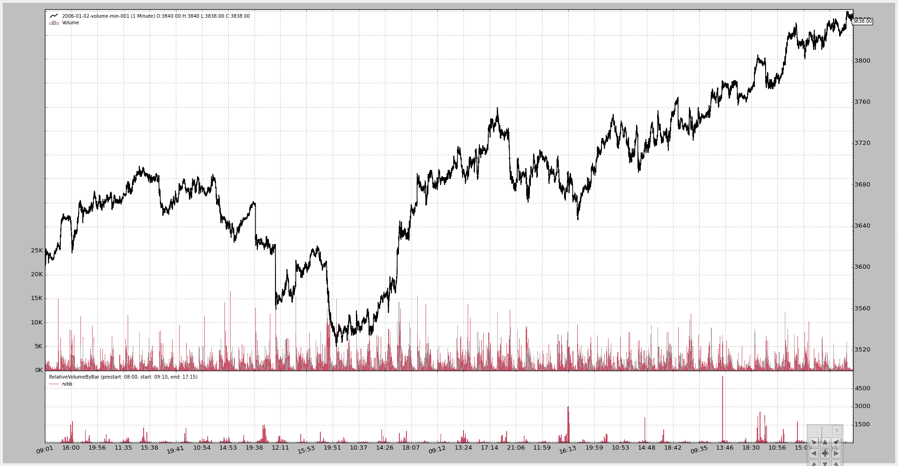

# 条同步

> 原文： [https://www.backtrader.com/blog/posts/2015-10-04-bar-synchronization/bar-synchronization/](https://www.backtrader.com/blog/posts/2015-10-04-bar-synchronization/bar-synchronization/)

文献和/或行业中缺乏标准公式不是问题，因为问题实际上可以概括为：

*   条同步

[票证](https://github.com/mementum/backtrader/issues/23)提出了`backtrader`是否可以考虑计算**相对值**指标的问题。

请求者需要将给定时刻的交易量与前一交易日相同时刻的交易量进行比较。包括:

*   一些长度未知的上市前数据

有了这样的要求，大多数指标所依据的基本原则就失效了：

*   有一个固定的时间段用来回顾过去

此外，鉴于当天进行了比较，还必须考虑其他因素：

*   某些“日内”瞬间可能丢失（分或秒）

    数据源不太可能缺少一个每日条形图，但缺少一分钟或第二个条形图并不少见。

    主要原因是可能根本没有任何谈判。或者，他们可能是谈判交流中的一个问题，这实际上阻止了酒吧被记录下来。

考虑到上述所有要点，为制定指标得出了一些结论：

*   在这种情况下，**周期**不是一个周期，而是一个缓冲区，用于确保有足够的钢筋，以便指示器尽快启动

*   有些酒吧可能不见了

*   主要问题是同步

幸运的是，有一把钥匙可以帮助进行同步：

*   比较的条形图是“日内”的，因此计算给定时间内已经看到的天数和看到的“条形图”的数量可以实现同步

前一天的值保存在字典中，因为前面解释的“回望”期是未知的。

其他一些早期的想法可以被放弃，例如实现`DataFilter`数据源，因为这实际上会通过删除售前数据使数据源与系统的其他部分不同步。同步问题也会出现。

一个需要探索的想法是创建一个`DataFiller`，通过使用最后收盘价并将交易量设置为 0 来填补缺失的分/秒。

实践证明，在`backtrader`中发现一些额外的需求也是很好的，比如**time2num**函数（date2num 和 num2date 系列的一个补充）以及**行**的额外方法：

*   从日的浮点表示中提取日部分的“日”和“分数”（时间）

    称为“dt”和“tm”

同时，`RelativeVolumeByBar`指示器的代码如下所示。在指标内进行“期间”/“缓冲区”计算不是首选模式，但在这种情况下，它起到了作用。

```py
from __future__ import (absolute_import, division, print_function,
                        unicode_literals)

import collections
import datetime
import math

import backtrader as bt

def time2num(tm):
    """
    Convert :mod:`time` to the to the preserving hours, minutes, seconds
    and microseconds.  Return value is a :func:`float`.
    """
    HOURS_PER_DAY = 24.0
    MINUTES_PER_HOUR = 60.0
    SECONDS_PER_MINUTE = 60.0
    MUSECONDS_PER_SECOND = 1e6
    MINUTES_PER_DAY = MINUTES_PER_HOUR * HOURS_PER_DAY
    SECONDS_PER_DAY = SECONDS_PER_MINUTE * MINUTES_PER_DAY
    MUSECONDS_PER_DAY = MUSECONDS_PER_SECOND * SECONDS_PER_DAY

    tm_num = (tm.hour / HOURS_PER_DAY +
              tm.minute / MINUTES_PER_DAY +
              tm.second / SECONDS_PER_DAY +
              tm.microsecond / MUSECONDS_PER_DAY)

    return tm_num

def dtime_dt(dt):
    return math.trunc(dt)

def dtime_tm(dt):
    return math.modf(dt)[0]

class RelativeVolumeByBar(bt.Indicator):
    alias = ('RVBB',)
    lines = ('rvbb',)

    params = (
        ('prestart', datetime.time(8, 00)),
        ('start', datetime.time(9, 10)),
        ('end', datetime.time(17, 15)),
    )

    def _plotlabel(self):
        plabels = []
        for name, value in self.params._getitems():
            plabels.append('%s: %s' % (name, value.strftime('%H:%M')))

        return plabels

    def __init__(self):
        # Inform the platform about the minimum period needs
        minbuffer = self._calcbuffer()
        self.addminperiod(minbuffer)

        # Structures/variable to keep synchronization
        self.pvol = dict()
        self.vcount = collections.defaultdict(int)

        self.days = 0
        self.dtlast = 0

        # Keep the start/end times in numeric format for comparison
        self.start = time2num(self.p.start)
        self.end = time2num(self.p.end)

        # Done after calc to ensure coop inheritance and composition work
        super(RelativeVolumeByBar, self).__init__()

    def _barisvalid(self, tm):
        return self.start <= tm <= self.end

    def _daycount(self):
        dt = dtime_dt(self.data.datetime[0])
        if dt > self.dtlast:
            self.days += 1
            self.dtlast = dt

    def prenext(self):
        self._daycount()

        tm = dtime_tm(self.data.datetime[0])
        if self._barisvalid(tm):
            self.pvol[tm] = self.data.volume[0]
            self.vcount[tm] += 1

    def next(self):
        self._daycount()

        tm = dtime_tm(self.data.datetime[0])
        if not self._barisvalid(tm):
            return

        # Record the "minute/second" of this day has been seen
        self.vcount[tm] += 1

        # Get the bar's volume
        vol = self.data.volume[0]

        # If number of days is right, we saw the same "minute/second" last day
        if self.vcount[tm] == self.days:
            self.lines.rvbb[0] = vol / self.pvol[tm]

        # Synchronize the days and volume count for next cycle
        self.vcount[tm] = self.days

        # Record the volume for this bar for next cycle
        self.pvol[tm] = vol

    def _calcbuffer(self):
        # Period calculation
        minend = self.p.end.hour * 60 + self.p.end.minute
        # minstart = session_start.hour * 60 + session_start.minute
        # use prestart to account for market_data
        minstart = self.p.prestart.hour * 60 + self.p.prestart.minute

        minbuffer = minend - minstart

        tframe = self.data._timeframe
        tcomp = self.data._compression

        if tframe == bt.TimeFrame.Seconds:
            minbuffer = (minperiod * 60)

        minbuffer = (minbuffer // tcomp) + tcomp

        return minbuffer 
```

通过脚本调用，可按如下方式使用：

```py
$ ./relative-volume.py --help
usage: relative-volume.py [-h] [--data DATA] [--prestart PRESTART]
                          [--start START] [--end END] [--fromdate FROMDATE]
                          [--todate TODATE] [--writer] [--wrcsv] [--plot]
                          [--numfigs NUMFIGS]

MultiData Strategy

optional arguments:
  -h, --help            show this help message and exit
  --data DATA, -d DATA  data to add to the system
  --prestart PRESTART   Start time for the Session Filter
  --start START         Start time for the Session Filter
  --end END, -te END    End time for the Session Filter
  --fromdate FROMDATE, -f FROMDATE
                        Starting date in YYYY-MM-DD format
  --todate TODATE, -t TODATE
                        Starting date in YYYY-MM-DD format
  --writer, -w          Add a writer to cerebro
  --wrcsv, -wc          Enable CSV Output in the writer
  --plot, -p            Plot the read data
  --numfigs NUMFIGS, -n NUMFIGS
                        Plot using numfigs figures 
```

测试调用：

```py
$ ./relative-volume.py --plot 
```

生成此图表：

[](../bar-synchronization.png)

脚本的代码。

```py
from __future__ import (absolute_import, division, print_function,
                        unicode_literals)

import argparse
import datetime

# The above could be sent to an independent module
import backtrader as bt
import backtrader.feeds as btfeeds

from relvolbybar import RelativeVolumeByBar

def runstrategy():
    args = parse_args()

    # Create a cerebro
    cerebro = bt.Cerebro()

    # Get the dates from the args
    fromdate = datetime.datetime.strptime(args.fromdate, '%Y-%m-%d')
    todate = datetime.datetime.strptime(args.todate, '%Y-%m-%d')

    # Create the 1st data
    data = btfeeds.VChartCSVData(
        dataname=args.data,
        fromdate=fromdate,
        todate=todate,
        )

    # Add the 1st data to cerebro
    cerebro.adddata(data)

    # Add an empty strategy
    cerebro.addstrategy(bt.Strategy)

    # Get the session times to pass them to the indicator
    prestart = datetime.datetime.strptime(args.prestart, '%H:%M')
    start = datetime.datetime.strptime(args.start, '%H:%M')
    end = datetime.datetime.strptime(args.end, '%H:%M')

    # Add the Relative volume indicator
    cerebro.addindicator(RelativeVolumeByBar,
                         prestart=prestart, start=start, end=end)

    # Add a writer with CSV
    if args.writer:
        cerebro.addwriter(bt.WriterFile, csv=args.wrcsv)

    # And run it
    cerebro.run(stdstats=False)

    # Plot if requested
    if args.plot:
        cerebro.plot(numfigs=args.numfigs, volume=True)

def parse_args():
    parser = argparse.ArgumentParser(description='MultiData Strategy')

    parser.add_argument('--data', '-d',
                        default='../../datas/2006-01-02-volume-min-001.txt',
                        help='data to add to the system')

    parser.add_argument('--prestart',
                        default='08:00',
                        help='Start time for the Session Filter')

    parser.add_argument('--start',
                        default='09:15',
                        help='Start time for the Session Filter')

    parser.add_argument('--end', '-te',
                        default='17:15',
                        help='End time for the Session Filter')

    parser.add_argument('--fromdate', '-f',
                        default='2006-01-01',
                        help='Starting date in YYYY-MM-DD format')

    parser.add_argument('--todate', '-t',
                        default='2006-12-31',
                        help='Starting date in YYYY-MM-DD format')

    parser.add_argument('--writer', '-w', action='store_true',
                        help='Add a writer to cerebro')

    parser.add_argument('--wrcsv', '-wc', action='store_true',
                        help='Enable CSV Output in the writer')

    parser.add_argument('--plot', '-p', action='store_true',
                        help='Plot the read data')

    parser.add_argument('--numfigs', '-n', default=1,
                        help='Plot using numfigs figures')

    return parser.parse_args()

if __name__ == '__main__':
    runstrategy() 
```