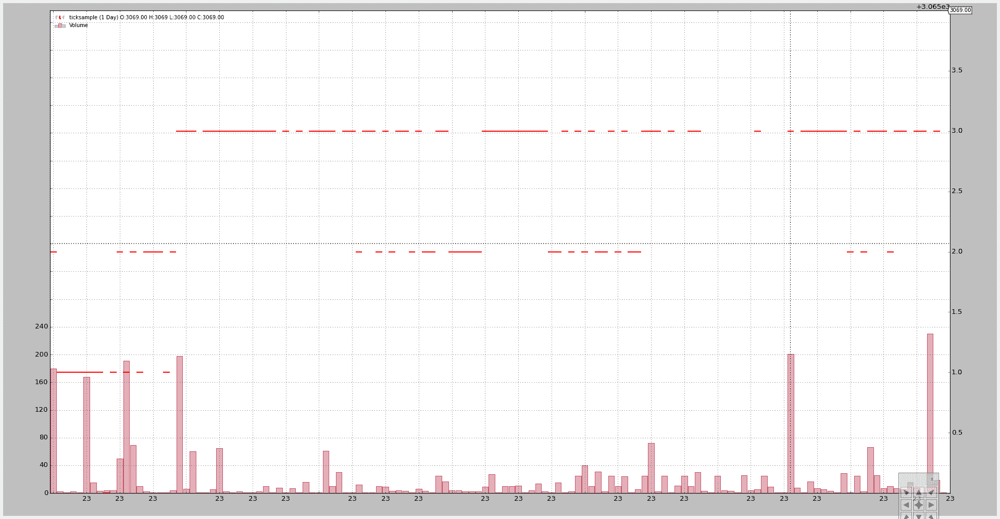
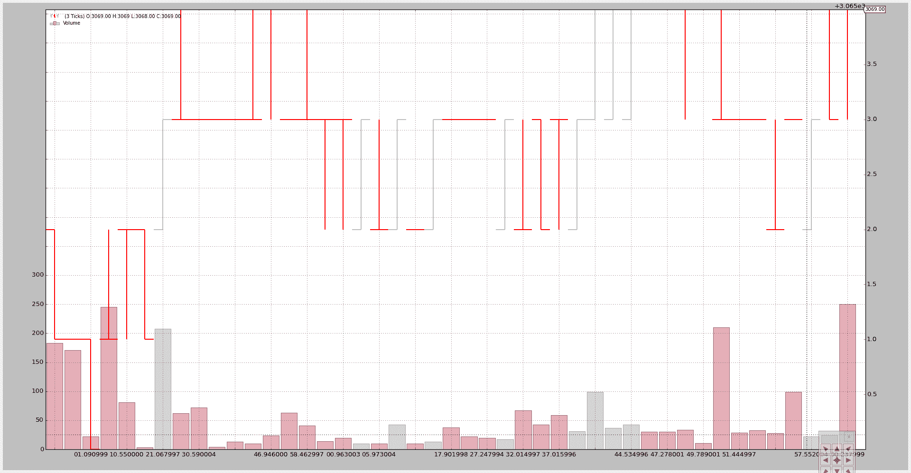
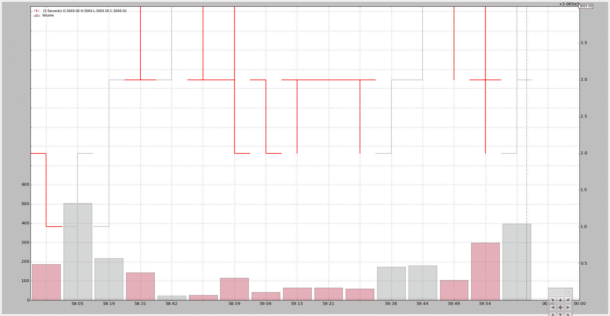
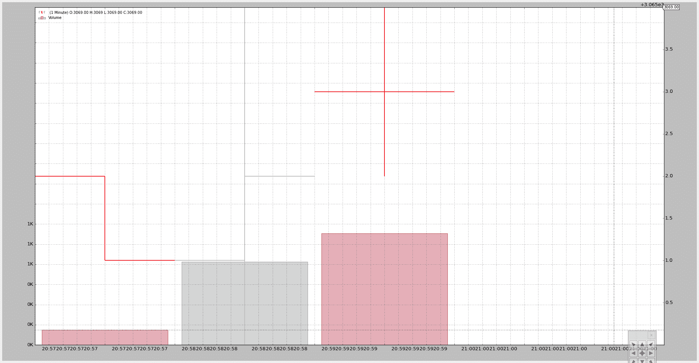

# 勾选数据和重采样

> 原文： [https://www.backtrader.com/blog/posts/2015-09-25-tickdata-resample/resample-tickdata/](https://www.backtrader.com/blog/posts/2015-09-25-tickdata-resample/resample-tickdata/)

backtrader 已经可以从分钟数据重新采样了。接受勾号数据不是问题，只需将 4 个常用字段（打开、高、低、关闭）设置为勾号值即可。

但传递要重新采样的滴答数据会再次产生相同的数据。与 1.1.11.88 版相同，情况不再如此。现在

*   TimeFrame（backtrader.TimeFrame）已扩展为包含“滴答声”、“微秒”和“秒”的常量和名称

*   重采样可以管理上述 3 个时间段并对其进行采样。

笔记

因为滴答数据是最低可能的时间范围，所以它实际上可以被“压缩”（n 条到 1 条），但不能从最小的时间范围进行采样。

新版本包含一个小样本`tickdata.csv`添加到源数据中，并添加一个新的样本脚本`resample-tickdata.py`来使用它。

笔记

更新脚本以使用新的`Cerebro.resampledata`方法，避免了手动实例化`backtrader.DataResampler`的需要

默认执行不涉及数据：

```py
$ ./resample-tickdata.py 
```

制作此图表：

[](../tickdata-default.png)

将 3 个刻度压缩为 1：

```py
$ ./resample-tickdata.py --timeframe ticks --compression 3 
```

制作此图表：

[](../tickdata-tickdata-compression-3.png)

压缩后，我们不再有单一的“滴答声”，而是“条”。

现在压缩到秒和 5 巴压缩：

```py
$ ./resample-tickdata.py --timeframe seconds --compression 5 
```

使用新图表：

[](../tickdata-seconds-compression-5.png)

最后是几分钟。样本数据包含 4 个不同分钟的刻度数据（文件中的最后一个刻度是第 4<sup>次</sup>分钟的唯一刻度）：

```py
$ ./resample-tickdata.py --timeframe minutes 
```

4 条（在顶部可以看到最终价格为 3069）。第 4<sup>条</sup>条是本分钟给出的一个点，文件中有一个勾号。

[](../tickdata-minutes.png)

脚本用法：

```py
$ ./resample-tickdata.py --help
usage: resample-tickdata.py [-h] [--dataname DATANAME]
                            [--timeframe {ticks,microseconds,seconds,minutes,daily,weekly,monthly}]
                            [--compression COMPRESSION]

Resampling script down to tick data

optional arguments:
  -h, --help            show this help message and exit
  --dataname DATANAME   File Data to Load
  --timeframe {ticks,microseconds,seconds,minutes,daily,weekly,monthly}
                        Timeframe to resample to
  --compression COMPRESSION
                        Compress n bars into 1 
```

还有密码。

```py
from __future__ import (absolute_import, division, print_function,
                        unicode_literals)

import argparse

import backtrader as bt
import backtrader.feeds as btfeeds

def runstrat():
    args = parse_args()

    # Create a cerebro entity
    cerebro = bt.Cerebro(stdstats=False)

    # Add a strategy
    cerebro.addstrategy(bt.Strategy)

    # Load the Data
    datapath = args.dataname or '../../datas/ticksample.csv'

    data = btfeeds.GenericCSVData(
        dataname=datapath,
        dtformat='%Y-%m-%dT%H:%M:%S.%f',
        timeframe=bt.TimeFrame.Ticks,
    )

    # Handy dictionary for the argument timeframe conversion
    tframes = dict(
        ticks=bt.TimeFrame.Ticks,
        microseconds=bt.TimeFrame.MicroSeconds,
        seconds=bt.TimeFrame.Seconds,
        minutes=bt.TimeFrame.Minutes,
        daily=bt.TimeFrame.Days,
        weekly=bt.TimeFrame.Weeks,
        monthly=bt.TimeFrame.Months)

    # Resample the data
    data = cerebro.resampledata(data,
                                timeframe=tframes[args.timeframe],
                                compression=args.compression)

    # add a writer
    cerebro.addwriter(bt.WriterFile, csv=True)

    # Run over everything
    cerebro.run()

    # Plot the result
    cerebro.plot(style='bar')

def parse_args():
    parser = argparse.ArgumentParser(
        description='Resampling script down to tick data')

    parser.add_argument('--dataname', default='', required=False,
                        help='File Data to Load')

    parser.add_argument('--timeframe', default='ticks', required=False,
                        choices=['ticks', 'microseconds', 'seconds',
                                 'minutes', 'daily', 'weekly', 'monthly'],
                        help='Timeframe to resample to')

    parser.add_argument('--compression', default=1, required=False, type=int,
                        help=('Compress n bars into 1'))

    return parser.parse_args()

if __name__ == '__main__':
    runstrat() 
```