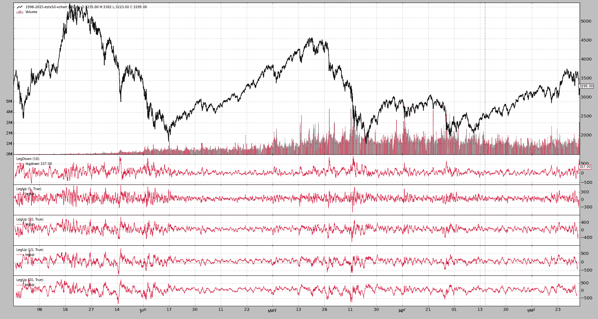

# 实际使用

> 原文： [https://www.backtrader.com/blog/posts/2015-08-27-real-world-usage/real-world-usage/](https://www.backtrader.com/blog/posts/2015-08-27-real-world-usage/real-world-usage/)

最后，它似乎得到了回报，已经着手发展 backtrader。

在过去几周观察欧洲市场时，我的一位朋友问我是否可以看看我们图表包中的数据，看看下跌幅度与之前类似事件相比如何。

当然可以，但我说我可以做的不仅仅是查看图表，因为我可以很快：

*   创建一个快速`LegDown`指示器，测量坠落范围。它也可能被命名为`HighLowRange`或`HiLoRange`。幸运的是，如果认为需要，可以通过`alias`解决

*   创建一个`LegDownAnalyzer`来收集结果并对其进行排序

这导致了一个额外的请求：

*   在接下来的 5、10、15、20 天（交易日…）下跌后恢复

    通过`LegUp`指示器解决，该指示器将值写回，以便与相应的“LegDown”对齐``

工作很快就完成了（在我空闲时间的允许范围内），结果与请求者共享。但是…这是我看到的唯一潜在问题：

*   自动化方面的改进`bt-run.py`

    *   具有分离 KWARG 的多策略/观察者/分析器

    *   将指标直接注入战略，每个指标使用 KWARG

    *   单点绘图参数也接受 kwargs

*   对`Analyzer`API 进行改进，使其具有自动**打印**结果的功能（作为类似`dict`的实例返回），并具有直接`data`访问别名

尽管：

*   由于我编写的实现组合通过混合声明和额外使用`next`来对齐`LegDown`和`LegUp`值，出现了一个模糊的 bug

    引入该缺陷是为了简化单个数据与多个`Lines`的传递，因此`Indicators`可以作为单独的数据在每一行上进行操作

后者迫使我：

*   添加一个与`LineDelay`相对的背景对象来“展望”未来

    这实际上意味着实际值被写入过去的数组位置

一旦上述所有内容都落实到位，就应该重新测试上述请求所带来的（小的？）挑战是否能够更容易、更快地（在实施时间内）得到解决。

最后，从 1998 年到今天，Eurostoxx 50 未来的执行情况和结果：

```py
bt-run.py \
    --csvformat vchartcsv \
    --data ../datas/sample/1998-2015-estx50-vchart.txt \
    --analyzer legdownup \
    --pranalyzer \
    --nostdstats \
    --plot

====================
== Analyzers
====================
##########
legdownupanalyzer
##########
Date,LegDown,LegUp_5,LegUp_10,LegUp_15,LegUp_20
2008-10-10,901.0,331.0,69.0,336.0,335.0
2001-09-11,889.0,145.0,111.0,239.0,376.0
2008-01-22,844.0,328.0,360.0,302.0,344.0
2001-09-21,813.0,572.0,696.0,816.0,731.0
2002-07-24,799.0,515.0,384.0,373.0,572.0
2008-01-23,789.0,345.0,256.0,319.0,290.0
2001-09-17,769.0,116.0,339.0,405.0,522.0
2008-10-09,768.0,102.0,0.0,120.0,208.0
2001-09-12,764.0,137.0,126.0,169.0,400.0
2002-07-23,759.0,331.0,183.0,285.0,421.0
2008-10-16,758.0,102.0,222.0,310.0,201.0
2008-10-17,740.0,-48.0,219.0,218.0,116.0
2015-08-24,731.0,nan,nan,nan,nan
2002-07-22,729.0,292.0,62.0,262.0,368.0
...
...
...
2001-10-05,-364.0,228.0,143.0,286.0,230.0
1999-01-04,-370.0,219.0,99.0,-7.0,191.0
2000-03-06,-382.0,-60.0,-127.0,-39.0,-161.0
2000-02-14,-393.0,-92.0,90.0,340.0,230.0
2000-02-09,-400.0,-22.0,-46.0,96.0,270.0
1999-01-05,-438.0,3.0,5.0,-107.0,5.0
1999-01-07,-446.0,-196.0,-6.0,-82.0,-50.0
1999-01-06,-536.0,-231.0,-42.0,-174.0,-129.0 
```

2015 年 8 月的降程出现在第 13 位<sup>th</sup>。很明显，发生了一种非常见的疾病，尽管更严重。

对于静态学家和聪明的数学头脑来说，从指向上的后续腿中做什么比我更重要。

`LegUpDownAnalyzer`的实现细节（见末尾的整个模块代码）：

*   与其他对象一样，它在`__init__`中创建指示器：`Strategies`，`Indicators`通常是常见的可疑对象

    这些指示器将自动注册到分析仪所连接的策略

*   就像策略一样，`Analyzer`有`self.datas`（一个数据数组）和别名：`self.data`、`self.data0`、`self.data1`…

*   同样类似于策略：`nexstart`和`stop`挂钩（这些在指标中不存在）

    在这种情况下，用于：

    *   `nextstart`：记录策略的初始起点

    *   `stop`：做最后的计算，因为事情已经完成了

*   注：本例不需要`start`、`prenext`、`next`等其他方式

*   `LegDownUpAnalyzer`方法`print`已被重写，不再调用`pprint`方法，而是创建计算的 CSV 打印输出

经过多次讨论，由于我们将`--plot`添加到组合中……图表。

[](../real-wold-legupdown.png)

最后是`bt-run`加载的`legupdown`模块。

```py
from __future__ import (absolute_import, division, print_function,
                        unicode_literals)

import itertools
import operator

import six
from six.moves import map, xrange, zip

import backtrader as bt
import backtrader.indicators as btind
from backtrader.utils import OrderedDict

class LegDown(bt.Indicator):
    '''
    Calculates what the current legdown has been using:
      - Current low
      - High from ``period`` bars ago
    '''
    lines = ('legdown',)
    params = (('period', 10),)

    def __init__(self):
        self.lines.legdown = self.data.high(-self.p.period) - self.data.low

class LegUp(bt.Indicator):
    '''
    Calculates what the current legup has been using:
      - Current high
      - Low from ``period`` bars ago

    If param ``writeback`` is True the value will be written
    backwards ``period`` bars ago
    '''
    lines = ('legup',)
    params = (('period', 10), ('writeback', True),)

    def __init__(self):
        self.lu = self.data.high - self.data.low(-self.p.period)
        self.lines.legup = self.lu(self.p.period * self.p.writeback)

class LegDownUpAnalyzer(bt.Analyzer):
    params = (
        # If created indicators have to be plotteda along the data
        ('plotind', True),
        # period to consider for a legdown
        ('ldown', 10),
        # periods for the following legups after a legdown
        ('lups', [5, 10, 15, 20]),
        # How to sort: date-asc, date-desc, legdown-asc, legdown-desc
        ('sort', 'legdown-desc'),
    )

    sort_options = ['date-asc', 'date-des', 'legdown-desc', 'legdown-asc']

    def __init__(self):
        # Create the legdown indicator
        self.ldown = LegDown(self.data, period=self.p.ldown)
        self.ldown.plotinfo.plot = self.p.plotind

        # Create the legup indicators indicator - writeback is not touched
        # so the values will be written back the selected period and therefore
        # be aligned with the end of the legdown
        self.lups = list()
        for lup in self.p.lups:
            legup = LegUp(self.data, period=lup)
            legup.plotinfo.plot = self.p.plotind
            self.lups.append(legup)

    def nextstart(self):
        self.start = len(self.data) - 1

    def stop(self):
        # Calculate start and ending points with values
        start = self.start
        end = len(self.data)
        size = end - start

        # Prepare dates (key in the returned dictionary)
        dtnumslice = self.strategy.data.datetime.getzero(start, size)
        dtslice = map(lambda x: bt.num2date(x).date(), dtnumslice)
        keys = dtslice

        # Prepare the values, a list for each key item
        # leg down
        ldown = self.ldown.legdown.getzero(start, size)
        # as many legs up as requested
        lups = [up.legup.getzero(start, size) for up in self.lups]

        # put legs down/up together and interleave (zip)
        vals = [ldown] + lups
        zvals = zip(*vals)

        # Prepare sorting options
        if self.p.sort == 'date-asc':
            reverse, item = False, 0
        elif self.p.sort == 'date-desc':
            reverse, item = True, 0
        elif self.p.sort == 'legdown-asc':
            reverse, item = False, 1
        elif self.p.sort == 'legdown-desc':
            reverse, item = True, 1
        else:
            # Default ordering - date-asc
            reverse, item = False, 0

        # Prepare a sorted array of 2-tuples
        keyvals_sorted = sorted(zip(keys, zvals),
                                reverse=reverse,
                                key=operator.itemgetter(item))

        # Use it to build an ordereddict
        self.ret = OrderedDict(keyvals_sorted)

    def get_analysis(self):
        return self.ret

    def print(self, *args, **kwargs):
        # Overriden to change default behavior (call pprint)
        # provides a CSV printout of the legs down/up
        header_items = ['Date', 'LegDown']
        header_items.extend(['LegUp_%d' % x for x in self.p.lups])
        header_txt = ','.join(header_items)
        print(header_txt)

        for key, vals in six.iteritems(self.ret):
            keytxt = key.strftime('%Y-%m-%d')
            txt = ','.join(itertools.chain([keytxt], map(str, vals)))
            print(txt) 
```