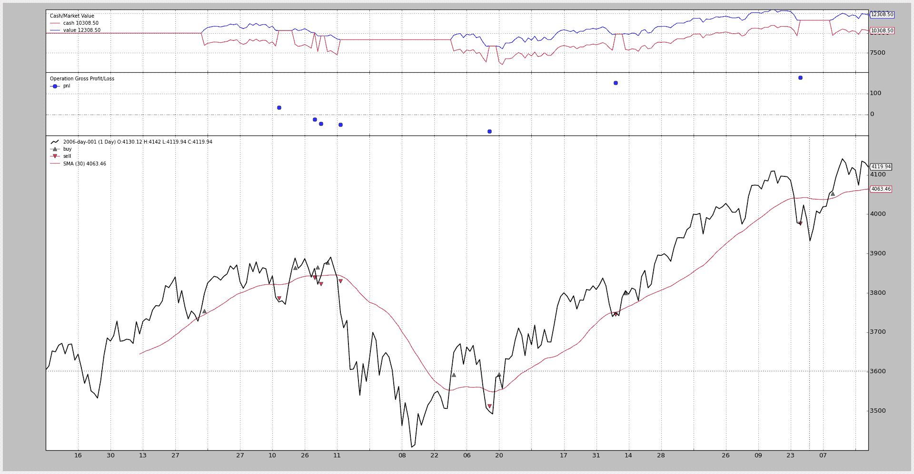

# 佣金：股票与期货

> 原文： [https://www.backtrader.com/blog/posts/2015-07-26-commission-schemes/commission-schemes/](https://www.backtrader.com/blog/posts/2015-07-26-commission-schemes/commission-schemes/)

反向交易者是出于需要而诞生的。我自己的…有一种感觉，我可以控制我自己的回溯测试平台，可以尝试新的想法。但在这样做的过程中，从一开始就完全开放外包，很明显，它必须有一种方式来满足其他人的需求和愿望。

作为一名未来的交易员，我本可以选择对基于点数的计算和每轮佣金的固定价格进行编码，但这将是一个错误。

笔记

2015 年 7 月 31 日

使用新添加的操作/交易通知跟进帖子，修复交易损益图的绘制，避免手动计算，如以下示例所示

提高佣金：股票与期货

相反，`backtrader`提供了使用常规的基于%规模/价格的方案和固定价格/积分方案的可能性。选择权在你。

## 不可知性

在继续之前，让我们记住`backtrader`试图对数据所代表的内容保持不可知。不同的佣金方案可应用于同一数据集。

让我们看看怎么做。

## 使用代理快捷方式

这使得最终用户远离`CommissionInfo`对象，因为可以通过单个函数调用创建/设置佣金方案。在常规的`cerebro`创建/设置过程中，只需通过`broker`成员变量添加对`setcomission`的调用。在与*互动式电子交易商*合作时，以下通话为**Eurostoxx50**期货设定了通常的佣金方案：

```py
cerebro.broker.setcommission(commission=2.0, margin=2000.0, mult=10.0) 
```

由于大多数用户通常只测试一台仪器，这就是问题的症结所在。如果您对数据馈送给出了一个`name`，因为在一张图表上同时考虑了多个仪器，那么这个调用可以稍微扩展，如下所示：

```py
cerebro.broker.setcommission(commission=2.0, margin=2000.0, mult=10.0,
name='Eurostoxxx50') 
```

在这种情况下，此即时佣金方案仅适用于名称与`Eurostoxx50`匹配的仪器。

## setcommission 参数的含义

*   `commission`（默认值：0.0）

    每项**行动**成本的绝对或百分比货币单位。

    在上述示例中，`buy`的每份合同为 2.0 欧元，`sell`的每份合同为 2.0 欧元。

    这里的重要问题是何时使用绝对值或百分比值。

    *   如果`margin`的计算结果为`False`（例如为假，0 或无），则认为`commission`表示`price`乘以`size`运算值的百分比

    *   如果`margin`是其他内容，则认为操作发生在类似`futures`的仪器上，`commission`是每个`size`合同的固定价格

*   `margin`（默认为无）

    使用类似于`futures`的工具进行操作时所需的保证金。如上所述

    *   如果设置了**否**`margin`，则`commission`将被理解为以百分比表示，并应用于`buy`或`sell`操作的`price \* size`组件

    *   如果设置了`margin`，则`commission`将被理解为一个固定值，乘以`buy`或`sell`操作的`size`分量

*   `mult`（默认值：1.0）

    对于`future`类工具，这决定了应用于损益计算的乘数。

    这就是为什么期货同时具有吸引力和风险。

*   `name`（默认为无）

    将佣金方案的应用限制在与`name`匹配的仪器上

    这可以在创建数据提要期间设置。

    如果未设置，该方案将应用于系统中存在的任何数据。

## 现在有两个例子：股票与期货

上面的例子：

```py
cerebro.broker.setcommission(commission=2.0, margin=2000.0, mult=10.0) 
```

股票的一个例子是：

```py
cerebro.broker.setcommission(commission=0.005)  # 0.5% of the operation value 
```

## 设立永久佣金计划

通过直接与`CommissionInfo`类合作，可以创建更持久的佣金方案。用户可以选择在某个地方使用此定义：

```py
from bt import CommissionInfo

commEurostoxx50 = CommissionInfo(commission=2.0, margin=2000.0, mult=10.0) 
```

稍后使用`addcommissioninfo`将其应用到另一个 Python 模块中：

```py
from mycomm import commEurostoxx50

...

cerebro.broker.addcomissioninfo(commEuroStoxx50, name='Eurostoxxx50') 
```

`CommissionInfo`是一个使用`params`声明的对象，就像`backtrader`环境中的其他对象一样。因此，上述内容也可以表示为：

```py
from bt import CommissionInfo

class CommEurostoxx50(CommissionInfo):
    params = dict(commission=2.0, margin=2000.0, mult=10.0) 
```

后来：

```py
from mycomm import CommEurostoxx50

...

cerebro.broker.addcomissioninfoCommEuroStoxx50(), name='Eurostoxxx50') 
```

## 现在是与 SMA 交叉的“真实”比较

使用 SimpleMovingAverage 交叉作为入口/出口信号，相同的数据集将使用类似于`futures`的佣金方案进行测试，然后使用类似于`stocks`的佣金方案进行测试。

笔记

期货头寸不仅可以被赋予进入/退出行为，还可以在每次交易中被赋予反转行为。但这个例子是关于比较佣金方案的。

代码（完整策略见底部）相同，在定义策略之前可以选择方案。

```py
futures_like = True

if futures_like:
    commission, margin, mult = 2.0, 2000.0, 10.0
else:
    commission, margin, mult = 0.005, None, 1 
```

只需将`futures_like`设置为 false，即可使用类似于`stocks`的方案运行。

添加了一些日志代码，以评估不同佣金方案的影响。让我们只关注前两个操作。

期货：

```py
2006-03-09, BUY CREATE, 3757.59
2006-03-10, BUY EXECUTED, Price: 3754.13, Cost: 2000.00, Comm 2.00
2006-04-11, SELL CREATE, 3788.81
2006-04-12, SELL EXECUTED, Price: 3786.93, Cost: 2000.00, Comm 2.00
2006-04-12, OPERATION PROFIT, GROSS 328.00, NET 324.00
2006-04-20, BUY CREATE, 3860.00
2006-04-21, BUY EXECUTED, Price: 3863.57, Cost: 2000.00, Comm 2.00
2006-04-28, SELL CREATE, 3839.90
2006-05-02, SELL EXECUTED, Price: 3839.24, Cost: 2000.00, Comm 2.00
2006-05-02, OPERATION PROFIT, GROSS -243.30, NET -247.30 
```

股票：

```py
2006-03-09, BUY CREATE, 3757.59
2006-03-10, BUY EXECUTED, Price: 3754.13, Cost: 3754.13, Comm 18.77
2006-04-11, SELL CREATE, 3788.81
2006-04-12, SELL EXECUTED, Price: 3786.93, Cost: 3786.93, Comm 18.93
2006-04-12, OPERATION PROFIT, GROSS 32.80, NET -4.91
2006-04-20, BUY CREATE, 3860.00
2006-04-21, BUY EXECUTED, Price: 3863.57, Cost: 3863.57, Comm 19.32
2006-04-28, SELL CREATE, 3839.90
2006-05-02, SELL EXECUTED, Price: 3839.24, Cost: 3839.24, Comm 19.20
2006-05-02, OPERATION PROFIT, GROSS -24.33, NET -62.84 
```

1<sup>st</sup>作业的价格如下：

*   买入（执行）->3754.13/卖出（执行）->3786.93

    *   期货损益（含佣金）：324.0

    *   股票损益（含佣金）：-4.91

    嘿佣金已经完全吞噬了`stocks`业务的所有利润，但这只意味着`futures`业务的一小部分利润。

2<sup>nd</sup>操作：

*   买入（执行）->3863.57/卖出（执行）->3389.24

    *   期货损益（含佣金）：-247.30

    *   股票损益（含佣金）：-62.84

    `futures`的负面操作导致咬合明显增大

但是：

*   期货累计净损益：324.00+（-247.30）=76.70

*   股票累计净损益：（-4.91）+（-62.84）=-67.75

累积效应可以在下面的图表上看到，也可以看到，在全年结束时，期货产生了更大的利润，但也遭受了更大的下降（在更深的水下）

但重要的是：无论是`futures`还是`stocks`**都可以进行回溯测试。**

## 期货佣金

[](../commission-futures.png)

## 股票佣金

[](../commission-stocks.png)

## 代码

```py
from __future__ import (absolute_import, division, print_function,
                        unicode_literals)

import backtrader as bt
import backtrader.feeds as btfeeds
import backtrader.indicators as btind

futures_like = True

if futures_like:
    commission, margin, mult = 2.0, 2000.0, 10.0
else:
    commission, margin, mult = 0.005, None, 1

class SMACrossOver(bt.Strategy):
    def log(self, txt, dt=None):
        ''' Logging function fot this strategy'''
        dt = dt or self.datas[0].datetime.date(0)
        print('%s, %s' % (dt.isoformat(), txt))

    def notify(self, order):
        if order.status in [order.Submitted, order.Accepted]:
            # Buy/Sell order submitted/accepted to/by broker - Nothing to do
            return

        # Check if an order has been completed
        # Attention: broker could reject order if not enougth cash
        if order.status in [order.Completed, order.Canceled, order.Margin]:
            if order.isbuy():
                self.log(
                    'BUY EXECUTED, Price: %.2f, Cost: %.2f, Comm %.2f' %
                    (order.executed.price,
                     order.executed.value,
                     order.executed.comm))

                self.buyprice = order.executed.price
                self.buycomm = order.executed.comm
                self.opsize = order.executed.size
            else:  # Sell
                self.log('SELL EXECUTED, Price: %.2f, Cost: %.2f, Comm %.2f' %
                         (order.executed.price,
                          order.executed.value,
                          order.executed.comm))

                gross_pnl = (order.executed.price - self.buyprice) * \
                    self.opsize

                if margin:
                    gross_pnl *= mult

                net_pnl = gross_pnl - self.buycomm - order.executed.comm
                self.log('OPERATION PROFIT, GROSS %.2f, NET %.2f' %
                         (gross_pnl, net_pnl))

    def __init__(self):
        sma = btind.SMA(self.data)
        # > 0 crossing up / < 0 crossing down
        self.buysell_sig = btind.CrossOver(self.data, sma)

    def next(self):
        if self.buysell_sig > 0:
            self.log('BUY CREATE, %.2f' % self.data.close[0])
            self.buy()  # keep order ref to avoid 2nd orders

        elif self.position and self.buysell_sig < 0:
            self.log('SELL CREATE, %.2f' % self.data.close[0])
            self.sell()

if __name__ == '__main__':
    # Create a cerebro entity
    cerebro = bt.Cerebro()

    # Add a strategy
    cerebro.addstrategy(SMACrossOver)

    # Create a Data Feed
    datapath = ('../datas/2006-day-001.txt')
    data = bt.feeds.BacktraderCSVData(dataname=datapath)

    # Add the Data Feed to Cerebro
    cerebro.adddata(data)

    # set commission scheme -- CHANGE HERE TO PLAY
    cerebro.broker.setcommission(
        commission=commission, margin=margin, mult=mult)

    # Run over everything
    cerebro.run()

    # Plot the result
    cerebro.plot() 
```