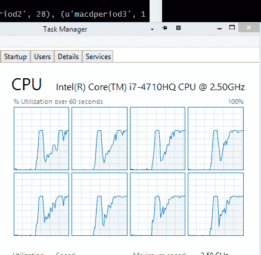

# 多核优化

> 原文： [https://www.backtrader.com/blog/posts/2015-07-23-multicore-optimization/multicore-optimization/](https://www.backtrader.com/blog/posts/2015-07-23-multicore-optimization/multicore-optimization/)

利用所有可用的内核是我对 backtrader 的想法，但从未实现过。支持自然操作、删除数组符号、包含新指标和 bla、bla、bla。

事实上，我并不热衷于**优化**，因此也不热衷于利用所有内核进行优化。imho，一个好主意值得一百万次优化。

笔记

最初的多核支持已经存在，并且已经为*众所周知的*测试用例集发挥了作用。鉴于`pickle`所展示的行为，预计会进行一些其他调整，以确保在进行多核优化时，所有指标和功能可以在进程之间来回传递。

笔记

在 1.0.10.88 版中对多核进行了一些额外的修正，以使更多“不可拾取”的东西变得可拾取。到目前为止，指标测试显示没有问题。

但是 BigMikeTrading 论坛中有人问，与其他平台相比，这个平台提供了什么，我提到了一些功能，包括[PyAlgoTrade](http://gbeced.github.io/pyalgotrade/)，例如，已经有了（甚至多机）

完成这项工作所需要的小小但正确的推动就在那里。根据过去的经验，因为互联网上有很多参考文献，我已经知道：**多线程**即使最简单的（不管 GIL 律师怎么说）是 Python 中的禁忌，不管版本如何。多线程在 Python 中是假的，因为您有多个线程，但没有并行执行代码。使用 IO 绑定的线程创建抽象和单独的代码路径执行可能很好，但它确实是一个杀手。

剩下的只有一个选择：模块`multiprocessing`或类似的模块。

展望光明的未来，我决定接受现代版本：`concurrent.futures`（后来证明这是一个错误的选择），即使这意味着为 Python 2.6/2.7 支持添加外部依赖。

历史：

*   Python 的一些动态特性在进程之间来回发送数据时表现不佳

*   当**酸洗**（序列化）诸如模块级未定义的类、lambda、对实例方法的引用以及没有唯一名称的动态类（即使这些类本身是唯一的）时，涉及的模块（`pickle`会阻塞

我把这些东西分散在代码中。然后我找到了[dill](https://pypi.python.org/pypi/dill)和来自 pathos 多进程[的兄弟姐妹 https://pypi.python.org/pypi/multiprocess](https://pypi.python.org/pypi/multiprocess) 。显然，它们可以解决序列化问题，但会添加更多的外部依赖项……不，不。

回到绘图板，看看即使`pickle`模块产生错误，不可拾取的项是否可以被拾取，这会让一些老 GCC 开发人员非常高兴。

完成了…还是没有？

*   将不可拾取的项目重新加工为可拾取的项目

*   使用 Python2.7.9 运行测试，并轻松运行…使用我的机器的 8 个内核，运行平稳且令人耳目一新

*   使用 Python3.4.3 运行测试，8 个内核开始运行，但经过一些优化后，每个子序列策略的执行将花费越来越长的时间…直到无法忍受为止。

    迅速地**酸洗**将结果（一个完整的执行策略）返回到主进程，该进程达到了与内存分配相关的限制（并且我的机器有足够的可用 RAM…足以进行几个小时的并行优化）

一些额外的阅读让我考虑了我的情节的简化：

*   使用`concurrent.futures`似乎是未来的证明

*   但标准的`multiprocessing`模块已经具备`backtrader`所需的功能

闻到使用过度杀戮的味道，一些生产线很快被返工，并：

*   使用 Python2.7 测试运行良好（甚至比以前更快）

*   使用 Python3.4 测试运行速度同样快

清理的时间到了，运行满电池的测试，执行推送并释放 1.0.9.88。没有新的指标…只是简单的老的**多核优化**

读了所有这些之后，是时候有一个关于如何控制优化以使用多核的刷新脚本了

*   好消息…不需要做任何事情…它是在没有用户干预的情况下完成的

当用户希望优化`strategy`时，`Strategy`子类被添加到`Cerebro`实例中，如下所示：

```py
cerebro.optstrategy(StrategyClass, *args, **kwargs) 
```

与将策略传递给`Cerebro`的常规方式不同：

```py
cerebro.addstrategy(StrategyClass, *args, **kwargs) 
```

这种情况一直如此，没有改变。背景是：

*   `Cerebro`需要了解是否要优化策略，以正确处理策略的参数，而对于常规策略而言，该参数可能已经`iterables`

现在，**策略**通过`optstrategy`传递给`cerebro`获得使用机器所有可用内核的额外好处。

当然，如果最终用户希望对所使用的内核进行细粒度控制……这是可能的。创建`Cerebro`的标准方式：

Cerbero=bt.Cerbero（）#runonce 为 True，preload 为 True，“new”MaxCPU 为 None

`maxcpus`（此版本的新参数）是控制键：

*   MaxCPU=None->使用所有可用的 CPU

*   MAXCPU=1->不运行多核

*   maxcpues=2…->使用指定数量的磁芯

这是一种选择退出策略，因为多核已经在使用。

在运行 Windows 8.1 和 Python 64 位 2.7.9 的 4 核（每个核 2 个线程-总共 8 个逻辑处理器）机器上进行比较，该机器具有 16 GB 的 RAM

*   单核执行：326 秒

*   8 核执行：127 秒

不同的测试运行表明，平均比率约为 2.75:1。

不幸的是，进程的创建/破坏和对象的来回酸洗带来了潜在的好处，但加速仍然很显著。

图中显示了正在使用的 8 个磁芯。

[](../eight-cores-in-use.png)

代码如下。只需更改`maxcpus`参数`1`即可将测试限制为 1 芯。

```py
from __future__ import (absolute_import, division, print_function,
                        unicode_literals)

import time

from six.moves import xrange

import backtrader as bt
import backtrader.indicators as btind
import backtrader.feeds as btfeeds

class OptimizeStrategy(bt.Strategy):
    params = (('smaperiod', 15),
              ('macdperiod1', 12),
              ('macdperiod2', 26),
              ('macdperiod3', 9),
              )

    def __init__(self):
        # Add indicators to add load

        btind.SMA(period=self.p.smaperiod)
        btind.MACD(period_me1=self.p.macdperiod1,
                   period_me2=self.p.macdperiod2,
                   period_signal=self.p.macdperiod3)

if __name__ == '__main__':
    # Create a cerebro entity
    cerebro = bt.Cerebro(maxcpus=None)

    # Add a strategy
    cerebro.optstrategy(
        OptimizeStrategy,
        smaperiod=xrange(5, 40),
        macdperiod1=xrange(12, 20),
        macdperiod2=xrange(26, 30),
        macdperiod3=xrange(9, 15),
    )

    # Create a Data Feed
    datapath = ('../datas/2006-day-001.txt')
    data = bt.feeds.BacktraderCSVData(dataname=datapath)

    # Add the Data Feed to Cerebro
    cerebro.adddata(data)

    # clock the start of the process
    tstart = time.clock()

    # Run over everything
    stratruns = cerebro.run()

    # clock the end of the process
    tend = time.clock()

    print('==================================================')
    for stratrun in stratruns:
        print('**************************************************')
        for strat in stratrun:
            print('--------------------------------------------------')
            print(strat.p._getkwargs())
    print('==================================================')

    # print out the result
    print('Time used:', str(tend - tstart)) 
```