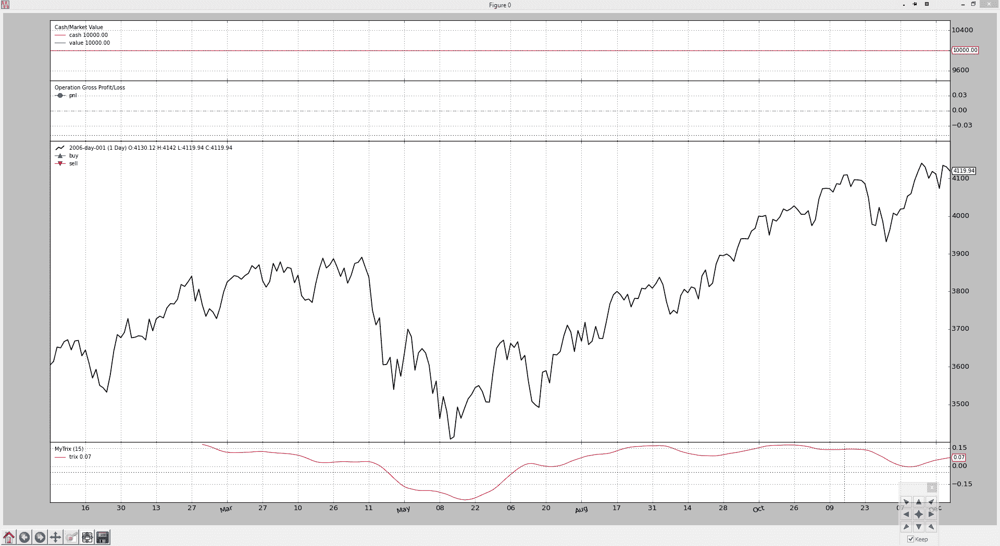

# 制定指标

> 原文： [https://www.backtrader.com/blog/posts/2015-07-18-developing-an-indicator/developing-an-indicator/](https://www.backtrader.com/blog/posts/2015-07-18-developing-an-indicator/developing-an-indicator/)

在微调 backtrader（假设它已经运行了一段时间）的过程中，我费了很大的劲，决定不仅通过 GitHub 分享它，还告诉全世界它在那里，并在“Reddit”中发布它的存在。

在评论了为什么会出现交易/算法交易平台以及关于该平台支持许多 simultenaous 股票实时交易的私人问题后，我得出结论，我自己的孩子应该拥有自己的博客。

我们到了。但让我们把重点放在业务上。

`backtrader`是为了让我快速尝试想法，并检查我的眼睛可能告诉我这可能是一个机会。

`backtrader`（现在）都是关于回溯测试的，没有连接到任何实时交易平台，甚至可能没有（尽管我相信技术实现会允许）

当我使用“尝试想法”这个表达时，我的意思是两件事：

1.  能够快速起草指标，并能够直观地评估其行为

2.  在这种情况下，围绕该指标或与其他指标的组合，参与制定潜在战略

我的个人交易是 100%判断性的，因为自动化系统不会做出任何决定。但我看一下指标必须说明什么。不管这些“迹象”是否真的是一个信号，都要由我有缺陷的人类思维来决定。

但让我们做个实验。在 Reddit 发布第 1<sup>st</sup>时间之后，我添加了一个众所周知的指标：

*   特里克斯

Stockcharts 在[ChartSchool-Trix](http://stockcharts.com/school/doku.php?id=chart_school:technical_indicators:trix)上对 Trix 进行了很好的讨论

让我们用尽可能少的行来试验如何做到这一点：

```py
from __future__ import (absolute_import, division, print_function,
                        unicode_literals)

import backtrader as bt
import backtrader.indicators as btind

class MyTrix(bt.Indicator):

    lines = ('trix',)
    params = (('period', 15),)

    def __init__(self):
        ema1 = btind.EMA(self.data, period=self.p.period)
        ema2 = btind.EMA(ema1, period=self.p.period)
        ema3 = btind.EMA(ema2, period=self.p.period)

        self.lines.trix = 100.0 * (ema3 - ema3(-1)) / ema3(-1) 
```

Trix 指示器已启动并运行。看到这一点，作为这个平台的作者，我真的相信我的目标已经实现了，即能够快速、易用地尝试新想法。

有关发展的分项数字：

*   **行=（'trix'，）**

    这个元组定义了指示器的输出行（在本例中只有一行）。类声明开头的这条语句在类创建和对象实例化期间生成大量后台操作。

    只需说对象有一个属性“lines”，该属性包含“trix”。

    作为奖励，如果指示器本身中没有使用名称“trix”，也可以使用“self.trix”到达“line”。但为了清楚起见，我更喜欢“self.lines.trix”

    其他访问方法：

    *   自我 l.特里克斯

    *   self.lines[0]…作为索引是与元组中的位置相对应的索引

*   **参数=（（‘期间’，15），）**

    这个元组的元组（也可以是 dict 或 orderedict）定义了指示符接受的参数并声明了默认值。

    解析 kwargs 的负担从用户的肩上卸下。

    可以使用“self.params.xxxxx”符号或缩写“self.p.xxxxx”访问参数

*   **计算（其中 EMA 代表指数移动平均值）**

    *   **ema1=btind.EMA（self.data，period=self.p.period）**

        将显示一个新的奖金…“self.data”。这似乎是突然出现的，但这又是在指示器的后台进行的预处理。

        任何传递到指示器进行计算的“数据”都会被截取并放置在一个`self.datas`数组中，通常的`self.datas[0]`可以用于到达第一个数据。

        缩写确实存在并且看起来像：数组中第一个数据的 self.data 和 self.data0。从那时起，self.data1、self.data2。

        Trix 只需要一个数据

    *   **ema2=btind.EMA（ema1，period=self.p.period）**

        没什么好说的。EMA 使用 ema1 作为输入数据

    *   **ema3=btind.EMA（ema2，period=self.p.period）**

        更不用说

    *   **self.lines.trix=100.0*（ema3-ema3（-1））/ema3（-1）**

        首先，完成一个简单的 1 期百分比差异计算。

        神奇的 ema3（-1）是一种表示法，表示：ema 的前一个值。

        并将计算结果指定给在类创建期间定义的输出“行”“trix”。

简单的豌豆。但如果我没有得到 Trix 正在做什么的视觉反馈（即使 Stockcharts 有一篇很好的文章），就不会进行“实验”。

笔记

实际的 Trix 实现有一些额外的铃铛和口哨，主要是为了美化情节，这与本文无关。

我们假设我们已将`MyTrix`指示符放入 mytrix.py 文件中。

```py
from __future__ import (absolute_import, division, print_function,
                        unicode_literals)

import backtrader as bt
import backtrader.feeds as btfeeds

from mytrix import MyTrix

class NoStrategy(bt.Strategy):
    params = (('trixperiod', 15),)

    def __init__(self):
        MyTrix(self.data, period=self.p.trixperiod)

if __name__ == '__main__':
    # Create a cerebro entity
    cerebro = bt.Cerebro()

    # Add a strategy
    cerebro.addstrategy(NoStrategy, trixperiod=15)

    # Create a Data Feed
    datapath = ('../datas/2006-day-001.txt')
    data = bt.feeds.BacktraderCSVData(dataname=datapath)

    # Add the Data Feed to Cerebro
    cerebro.adddata(data)

    # Run over everything
    cerebro.run()

    # Plot the result
    cerebro.plot() 
```

下面是视觉输出（在新窗口/选项卡中打开图表，查看全尺寸图像），希望能显示如何快速轻松地创建指标，并使用`backtrader`进行视觉评估

[](../trix.png)