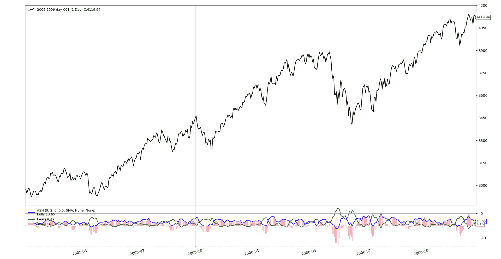

# 绝对强度直方图

> 原文： [https://www.backtrader.com/recipes/indicators/ash/ash/](https://www.backtrader.com/recipes/indicators/ash/ash/)

这是一个似乎起源于外汇市场的指标，可能在*[http://fxcodebase.com](http://fxcodebase.com)* ，但似乎很难追踪实际来源。

可能首先在*LUA*中实现：

*   [http://fxcodebase.com/code/viewtopic.php?f=17 &t=3836](http://fxcodebase.com/code/viewtopic.php?f=17&t=3836)

还表示更新和修订的*LUA*版本可在以下网址获得：

*   [http://fxcodebase.com/code/viewtopic.php?f=17 &t=2987&p=6869&hilit=绝对+强度#p6869](http://fxcodebase.com/code/viewtopic.php?f=17&t=2987&p=6869&hilit=Absolute+Strength#p6869)

同一站点在`MQL4`中托管一个版本：

*   [http://fxcodebase.com/code/viewtopic.php?f=38 &t=61541](http://fxcodebase.com/code/viewtopic.php?f=38&t=61541)

`MQL5`的另一个版本可在以下网址找到：

*   [https://www.mql5.com/en/code/21429](https://www.mql5.com/en/code/21429)

由于语言和平台实现的原因，所有版本似乎都很复杂，`MQL5`版本中有 227 行（当然包括一些注释），并且略有差异，因此需要解决一个合理的定义。查看不同版本后，伪代码中的定义：

```py
 # p0 is the current price and p1 is the previous price
  if mode is RSI:
    bulls = 0.5 * abs(p0 - p1) + p0 - p1
    bears = 0.5 * abs(p0 - p1) - p0 + p1
  elif mode is STOCH:
    bulls = p0 - lowest(period)
    bears = highest(period - p1

  avgbulls = moving_average(bulls, period)
  avgbears = moving_average(bears, period)

  smoothedbulls = moving_average(bulls, smoothing_period) / pointsize
  smoothedbears = moving_average(bears, smoothing_period) / pointsize

  ash = smoothedbulls - smoothedbears 
```

`RSI`/`STOCH`命名由原实施者选择，`pointsize`也称为`pipsize`，反映其*外汇*来源。尚不清楚*平滑平均值*是否必须与之前的移动平均值相同，一些版本似乎使用的是已经平均的价格，而不是标准价格。使用*整数*选择移动平均线。

一些决定

*   该指示器将与数据馈送中传递给它的原始价格一起工作。如果用户希望以平均价格运行指标，它可以传递它，而不是传递原始价格。

*   `RSI`模式下的 0.5 倍增器将是一个参数

*   移动平均线不会选择任何类型的*整数*。在*反向交易者*中，可以通过实际期望的移动平均线作为参数。

*   除非指定为参数，否则平滑移动平均值将与指示器中已使用的移动平均值相同

*   除非用户为`pointsize`指定一个值作为参数，否则不会使用它。

这里是实现

```py
class ASH(bt.Indicator):
    alias = ('AbsoluteStrengthOscilator',)

    lines = ('ash', 'bulls', 'bears',)  # output lines

    # customize the plotting of the *ash* line
    plotlines = dict(ash=dict(_method='bar', alpha=0.33, width=0.66))

    RSI, STOCH = range(0, 2)  # enum values for the parameter mode

    params = dict(
        period=9,
        smoothing=2,
        mode=RSI,
        rsifactor=0.5,
        movav=bt.ind.WMA,  # WeightedMovingAverage
        smoothav=None,  # use movav if not specified
        pointsize=None,  # use only if specified
    )

    def __init__(self):
        # Start calcs according to selected mode
        if self.p.mode == self.RSI:
            p0p1 = self.data - self.data(-1)  # used twice below
            half_abs_p0p1 = self.p.rsifactor * abs(p0p1)  # used twice below

            bulls = half_abs_p0p1 + p0p1
            bears = half_abs_p0p1 - p0p1
        else:
            bulls = self.data - bt.ind.Lowest(self.data, period=self.p.period)
            bears = bt.ind.Highest(self.data, period=self.p.period) - self.data

        avbulls = self.p.movav(bulls, period=self.p.period)
        avbears = self.p.movav(bears, period=self.p.period)

        # choose smoothing average and smooth the already averaged values
        smoothav = self.p.smoothav or self.p.movav  # choose smoothav
        smoothbulls = smoothav(avbulls, period=self.p.smoothing)
        smoothbears = smoothav(avbears, period=self.p.smoothing)

        if self.p.pointsize:  # apply only if it makes sense
            smoothbulls /= self.p.pointsize
            smoothbears /= self.p.pointsize

        # Assign the final values to the output lines
        self.l.bulls = smoothbulls
        self.l.bears = smoothbears
        self.l.ash = smoothbulls - smoothbears 
```

这里是指示器工作原理的视图

[](../ash.png)