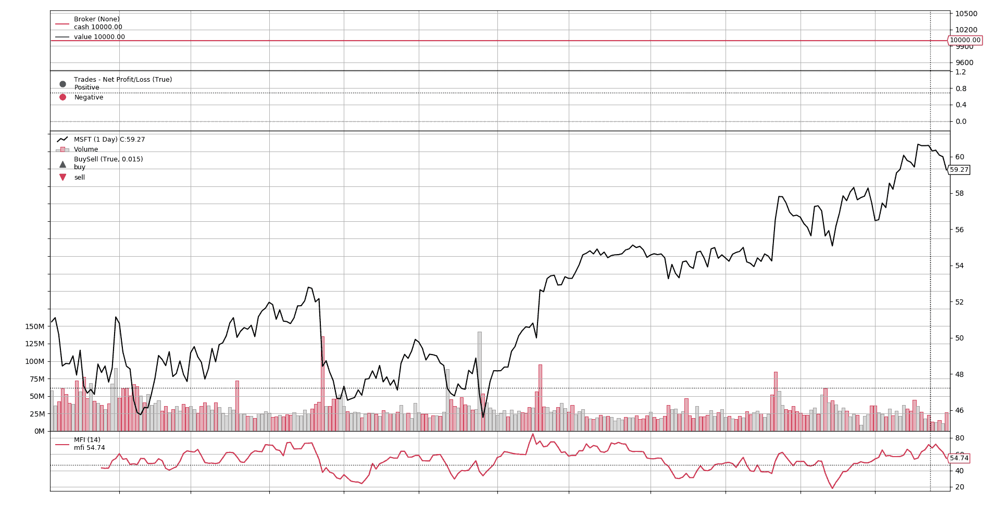

# 货币流量指示器

> 原文： [https://www.backtrader.com/recipes/indicators/mfi/mfi/](https://www.backtrader.com/recipes/indicators/mfi/mfi/)

参考

*   [https://school.stockcharts.com/doku.php?id=technical_indicators:money_flow_index_mfi](https://school.stockcharts.com/doku.php?id=technical_indicators:money_flow_index_mfi)

```py
class MFI(bt.Indicator):
    lines = ('mfi',)
    params = dict(period=14)

    alias = ('MoneyFlowIndicator',)

    def __init__(self):
        tprice = (self.data.close + self.data.low + self.data.high) / 3.0
        mfraw = tprice * self.data.volume

        flowpos = bt.ind.SumN(mfraw * (tprice > tprice(-1)), period=self.p.period)
        flowneg = bt.ind.SumN(mfraw * (tprice < tprice(-1)), period=self.p.period)

        mfiratio = bt.ind.DivByZero(flowpos, flowneg, zero=100.0)
        self.l.mfi = 100.0 - 100.0 / (1.0 + mfiratio) 
```

这里是指示器工作原理的视图

[](../mfi.png)