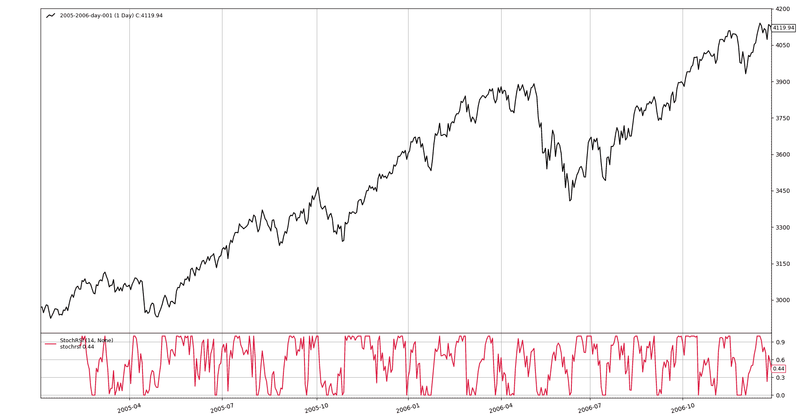

# 绝对强度直方图

> 原文： [https://www.backtrader.com/recipes/indicators/stochrsi/stochrsi/](https://www.backtrader.com/recipes/indicators/stochrsi/stochrsi/)

*股票图表*和*投资领域*有关于该指标的文献。

*   [股票图表-StochRSI（图表学校）](https://stockcharts.com/school/doku.php?id=chart_school:technical_indicators:stochrsi)

*   [投资领域-随机 RSI-StochRSI 定义](https://www.investopedia.com/terms/s/stochrsi.asp)

公式为：

*   `StochRSI = (RSI - min(RSI, period)) / (max(RSI, period) - min(RSI, period))`

理论上，计算`RSI`的周期与稍后用于计算`RSI`最小值和最大值的周期相同。这意味着，如果所选期间为`RSI`的`14`（事实标准），则该指标的总回顾期将为`28`

笔记

实际回溯期会稍长一些，因为 14 期`RSI`的有效回溯期`15`较长，因为需要比较 1<sup>st</sup>两期的收盘价来启动计算

在任何情况下，*backtrader*都会自动计算所有需要的回顾和热身周期。

考虑到以下是*反向交易者*中的内置指标：

*   `RSI`
*   `Lowest`（又名`MaxN`）
*   `Highest`（又名`MinN`）

根据上述公式开发`StochRSI`非常简单。

```py
class StochRSI(bt.Indicator):
    lines = ('stochrsi',)
    params = dict(
        period=14,  # to apply to RSI
        pperiod=None,  # if passed apply to HighestN/LowestN, else "period"
    )

    def __init__(self):
        rsi = bt.ind.RSI(self.data, period=self.p.period)

        pperiod = self.p.pperiod or self.p.period
        maxrsi = bt.ind.Highest(rsi, period=pperiod)
        minrsi = bt.ind.Lowest(rsi, period=pperiod)

        self.l.stochrsi = (rsi - minrsi) / (maxrsi - minrsi) 
```

这里是指示器工作原理的视图

[](../stochrsi.png)